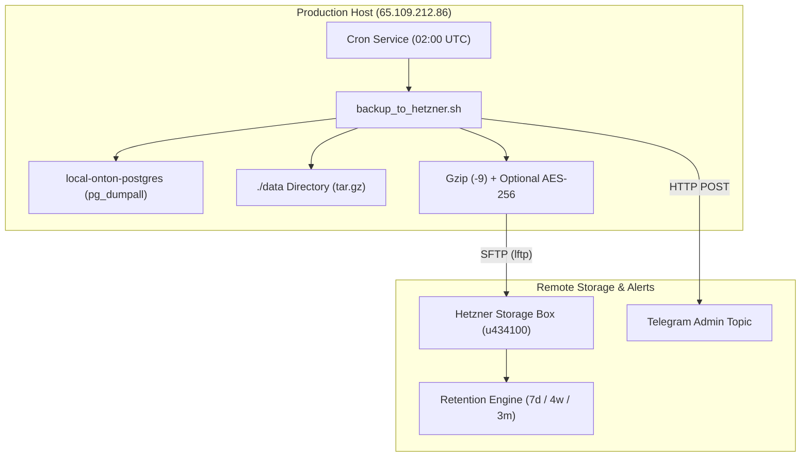

# ONTON 2.0 Disaster Recovery Runbook

**Last Verified:** 2026-10-10  
**Target Environment:** Production Host (`65.109.212.86`)  
**Scope:** PostgreSQL Database, Application State Volumes, and Hetzner Storage Box Off-Site Snapshots

---

## 1. Architecture & Backup Topology



### Storage Box Specifications
- **Remote Host:** `u434100.your-storagebox.de` (Port: 22/23)
- **Base Directory:** `/backups/ontonbot/`
- **Database Snapshots:** `/backups/ontonbot/database/db_dump_YYYY-MM-DD_HH-MM-SS.sql.gz`
- **Files Archives:** `/backups/ontonbot/files/files_dump_YYYY-MM-DD_HH-MM-SS.tar.gz`
- **Retention Schedule:**
  - **Daily (Days 0–7):** Retain all snapshots.
  - **Weekly (Days 8–35):** Retain 1 snapshot per calendar week (4 weekly snapshots).
  - **Monthly (Days 36–90):** Retain 1 snapshot per calendar month (3 monthly snapshots).
  - **Expired (> 90 days):** Automatically pruned.

---

## 2. Pre-Migration Snapshot Protocol (MANDATORY GATE)

Before executing any pending Drizzle migrations (such as migrations `0122` through `0136`) on production, a manual snapshot MUST be taken and verified:

```bash
# SSH into production host
ssh root@65.109.212.86

# Trigger immediate pre-migration snapshot
cd /root/ontonbot/devops/backup_scripts
./backup_to_hetzner.sh db-only
```

### Verification Checklist:
1. Script output prints `✅ Backup successfully completed`.
2. Telegram alert received in the admin logs topic with snapshot name and size.
3. Verify remote snapshot presence:
   ```bash
   lftp -u "$HETZNER_STORAGE_USER","$HETZNER_STORAGE_PASS" "sftp://$HETZNER_STORAGE_HOST" -e "cls -1 --sort=date -n 3 /backups/ontonbot/database; bye"
   ```

---

## 3. Restoration Scenarios

### Scenario A: Rollback After Failed Migration or Data Corruption

If a migration fails or data corruption occurs, restore the immediate pre-migration snapshot:

```bash
cd /root/ontonbot/devops/backup_scripts

# Run non-interactive restore of the latest snapshot
./restore_from_hetzner.sh --latest
```

The script will automatically:
1. Alert the Telegram topic that database restoration has commenced.
2. Download the target snapshot from Hetzner Storage Box.
3. Gracefully pause client-facing services (`mini-app`, `telegram-bot`, `website`) while keeping PostgreSQL active.
4. Stream and restore the database using `psql -U $POSTGRES_USER postgres`.
5. Restart application services and verify container health.
6. Post a success confirmation alert to Telegram.

---

### Scenario B: Point-in-Time Historical Restoration (Interactive)

To restore from a specific date (e.g. 5 days ago):

```bash
cd /root/ontonbot/devops/backup_scripts
./restore_from_hetzner.sh
```

1. The interactive wizard retrieves all available snapshots from Hetzner Storage Box.
2. Select the desired snapshot number.
3. Confirm whether to restore `./data` files or database only.
4. Type `RESTORE` to confirm execution.

---

### Scenario C: Total Server Failure / Bare-Metal Rebuild

In the event of hardware destruction or catastrophic loss of `65.109.212.86`:

1. **Provision New Host:**
   - Install Docker & Docker Compose plugin:
     ```bash
     apt update && apt install -y docker.io docker-compose-plugin lftp gzip curl git
     ```
2. **Clone Codebase & Populate Secrets:**
   ```bash
   git clone https://github.com/ExecutESG/onton.git /root/ontonbot
   cd /root/ontonbot
   # Populate .env with production secrets from 1Password / secure vault
   ```
3. **Start PostgreSQL Infrastructure:**
   ```bash
   docker compose --profile minimal up -d postgres redis
   ```
4. **Execute Remote Restore:**
   ```bash
   cd /root/ontonbot/devops/backup_scripts
   ./restore_from_hetzner.sh --latest --include-files
   ```
5. **Start Full Application Stack:**
   ```bash
   cd /root/ontonbot
   docker compose --profile full up -d
   ```
6. **Update Cloudflare DNS:**
   Update `prod.onton.live` and `app.onton.live` to point to the new server IP.

---

## 4. Telemetry & Monitoring

- **Log File:** `/var/log/onton_backup.log`
- **Crontab Inspection:**
  ```bash
  crontab -l | grep -A 2 ONTON
  ```
- **Logrotate Configuration:** `/etc/logrotate.d/onton-backup` (14 days rotation)
- **Telegram Notification Format:**
  - **Success:** `✅ ONTON Database Backup Succeeded` (includes duration, container, file size, retention count).
  - **Failure:** `🚨 ONTON Database Backup FAILED` (includes step, line number, exit code).
