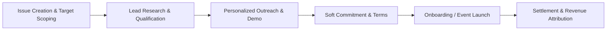

# 💼 ONTON Business Development & Commercialization Issues Roadmap

> **Synthesized From:**
> - `marketing/` Git Repository (`processes/issue_first_doctrine.md`, `strategy/EVENT_ORGANIZER_OUTREACH_PLAYBOOK.md`, `strategy/DIRECTORY_SUBMISSIONS_PLAYBOOK.md`)
> - `ONTON-Business/` Archive (`ONTON revenue initiative plan.csv`, `BD Document.txt`, `ONTON Packages.txt`, `ONton OKR.txt`, Inbound Organizer CSVs)
> - `ontonbot/docs/GTM_MARKETING_PLAYBOOK.md`

---

## 🏛️ Framework: The Issue-First BD Doctrine

In alignment with the **Issue-First Doctrine**, every business development initiative, partner outreach sprint, and revenue experiment must be tracked via a prioritized GitHub Issue with measurable KPIs, predefined outreach copy, clear funnel stages, and verifiable acceptance criteria.



### Issue Taxonomy & Labeling
* `track:organizer-outreach` — Direct sales to side event hosts, hackathons, and conference organizers.
* `track:monetization` — Launching and testing paid tiers, ticketing fees, and promotional boosts.
* `track:ecosystem-partners` — Co-marketing and institutional deals with TON Foundation, STON.fi, VCs, and DAOs.
* `track:lead-reactivation` — Mining past inbound organizer applications and dormant communities.
* `track:distribution-seo` — Submissions to directories, Telegram Apps Center, and ecosystem hubs.

---

## 📋 Formalized Business Development Issues Backlog

### Track 1: Direct Organizer Acquisition & Event Sales

#### `[BD-OUT-01]` Launch 60-Day Side-Event Outreach for Major 2026 Conferences
* **Labels:** `track:organizer-outreach`, `priority:high`, `status:ready`
* **Target Milestones:** Token2049 Dubai/Singapore, Devcon Bangkok, ETHDenver, TON Gateway.
* **Objective:** Onboard 20+ flagship conference side events (50–300 attendees each) within 60 days.
* **Commercial Goal:** $150k+ in ticket GMV processed via Telegram Stars & TON; establish ONTON as the event standard.
* **Deliverables & Tasks:**
  1. Build a target lead list of 100+ side event hosts using Luma, Twitter/X, and event aggregation groups.
  2. Deploy **Outreach Script Template A** (from `EVENT_ORGANIZER_OUTREACH_PLAYBOOK.md`).
  3. Offer zero-fee VIP badge minting + featured spot on `https://onton.live/events` as the initial hook.
  4. Track conversion from Initial DM ➔ Demo ➔ Event Link Created ➔ Door Scanner Utilized.
* **Acceptance Criteria:** Minimum 20 verified events created and held on ONTON; average attendee show-up rate >75%.

---

#### `[BD-OUT-02]` Hackathon & Hacker House DevRel Sponsorship Package
* **Labels:** `track:organizer-outreach`, `priority:medium`, `status:ready`
* **Target Audience:** Ecosystem DevRel leads (TON, Ethereum, Solana, Arbitrum, Sui, Monad).
* **Objective:** Replace manual Google Forms and spreadsheets for hackathon participant verification and prize distribution.
* **Commercial Goal:** Position ONTON as the official hackathon credentialing tool; $2,500 – $5,000 co-sponsorship package per hackathon.
* **Deliverables & Tasks:**
  1. Pitch DevRel managers using **Outreach Script Template B** (`EVENT_ORGANIZER_OUTREACH_PLAYBOOK.md`).
  2. Implement instant door QR check-in paired with automatic Hacker SBT diplomas.
  3. Set up automated Telegram chat gating for hacker teams and mentors.
* **Acceptance Criteria:** At least 2 regional hackathons or hacker houses successfully managed end-to-end via ONTON.

---

### Track 2: Monetization & Revenue Packaging

#### `[BD-REV-01]` Roll Out "Organizer Pro" Tier ($99–$499/month or Stars Equivalent)
* **Labels:** `track:monetization`, `priority:high`, `status:ready`
* **Reference Source:** `ONTON revenue initiative plan.csv` (Initiative #1) & `BD Document.txt`.
* **Objective:** Monetize recurring power organizers through a tiered subscription model.
* **Value Offering:**
  * **Free Tier:** Standard 1-tap RSVP, QR door check-in, community chat gating.
  * **Pro Tier ($99/mo or 2,500 Stars):** Advanced sales/attendance analytics, CSV export, custom bot branding, custom SBT design.
  * **Enterprise / DAO Tier ($499/mo):** Dedicated account manager, multi-organizer role permissions, API access for custom SBT minting.
* **Deliverables & Tasks:**
  1. Finalize feature gating matrix with the engineering team.
  2. Integrate Telegram Stars recurring subscription or monthly invoice payment flow.
  3. Execute direct sales pitch to top 15 existing active organizers.
* **Acceptance Criteria:** First 5 paying Pro organizers signed within 30 days of launch.

---

#### `[BD-REV-02]` Implement 2.5%–5% Platform Fee on Paid Stars & Crypto Ticketing
* **Labels:** `track:monetization`, `priority:high`, `status:in-progress`
* **Reference Source:** `ONTON revenue initiative plan.csv` (Initiative #3).
* **Objective:** Establish sustainable passive platform revenue scaling directly with ticket volume.
* **Deliverables & Tasks:**
  1. Verify the smart contract and payment worker fee-splitting logic for Telegram Stars and TON/USDT payments.
  2. Maintain 0% platform fee for Genesis ONION NFT holders (as guaranteed in the OG Covenant manifesto).
  3. Display transparent fee breakdown on the checkout modal (highlighting 70%+ fee savings vs Luma's 7.9% and Eventbrite's 8%+).
* **Acceptance Criteria:** Automatic 2.5%–5% deduction routed to the ONTON Platform Treasury wallet on all non-exempt ticket sales.

---

#### `[BD-REV-03]` Productize "Event Boost" In-App Sponsored Placements
* **Labels:** `track:monetization`, `priority:medium`, `status:ready`
* **Reference Source:** `BD Document.txt` (Positions U1/U2/D1/D2) & `ONTON Packages.txt`.
* **Objective:** Monetize event discovery inside the Mini App (`@theontonbot`) and `onton.live/events`.
* **Packages & Pricing:**
  * **Gold Banner (Position U1):** Top carousel banner + Spotlight push = $500 / 100 TON per week.
  * **Silver Listing (Position D1):** Featured badge on discovery feed = $250 / 50 TON per week.
* **Deliverables & Tasks:**
  1. Build a simple "Boost My Event" self-service portal in the Organizer Client Panel.
  2. Support instant payment via Telegram Stars or TON.
  3. Set up automated placement expiration and rotation.
* **Acceptance Criteria:** Minimum 4 paid event promotions sold in the first month.

---

### Track 3: Ecosystem Partnerships & Institutional Co-Hosting

#### `[BD-PART-01]` TON Ventures & Ecosystem Fund Partnership Application
* **Labels:** `track:ecosystem-partners`, `priority:high`, `status:ready`
* **Target:** TON Ventures (Ian Wittkopp, Inal Kardan), TON Accelerator (`ton:acc`).
* **Objective:** Secure institutional backing or incubation for ONTON’s Telegram Event OS.
* **Pitch Narrative:** Position ONTON as the premier real-utility TMA bridging Telegram Stars commerce with on-chain event identity.
* **Deliverables & Tasks:**
  1. Finalize the investor one-pager and updated pitch deck incorporating real metrics (MAU, ticket GMV, Telegram Stars adoption).
  2. Submit formal application to the upcoming `ton:acc` cohort.
  3. Secure warm introductory meetings via STON.fi or existing ecosystem connections.
* **Acceptance Criteria:** Pitch deck delivered and introductory call held with TON Ventures investment team.

---

#### `[BD-PART-02]` STON.fi Strategic Liquidity & Ticketing Integration
* **Labels:** `track:ecosystem-partners`, `priority:medium`, `status:ready`
* **Context:** $ONIT is live on STON.fi (`EQCYFlnasDS18rfSF_CLRT0W5DJOYNbZKWJzaCK4gwVzlZPc`).
* **Objective:** Activate ecosystem co-marketing, apply for STON.fi ecosystem integration grants, and introduce in-app ticket discounts for $ONIT holders.
* **Deliverables & Tasks:**
  1. Reach out to STON.fi BD / Partnership leads.
  2. Implement STON.fi Swap SDK / widget inside the ONTON web panel for seamless token onboarding.
  3. Offer a joint campaign: 15% ticket discount for users paying or staking via STON.fi pools.
* **Acceptance Criteria:** Joint announcement with STON.fi and integration of STON.fi liquidity pool links on the event checkout.

---

### Track 4: Lead Reactivation & Inbound Funnel Mining

#### `[BD-ACT-01]` Reactivate 50+ Inbound Organizer Leads from Historical Database
* **Labels:** `track:lead-reactivation`, `priority:high`, `status:ready`
* **Reference Source:** `ONTON-Business/source_materials/02-Business/ONTON Marketing /ONTON Event Organizer Application (Responses).csv` & `ONTON Organizer whitelisting Form (Responses).csv`.
* **Objective:** Contact and re-engage the 50+ organizers who previously submitted detailed applications to host events on ONTON.
* **Deliverables & Tasks:**
  1. Clean and deduplicate the historical CSV contacts (extract Telegram handles, emails, community names, and event types).
  2. Segment leads into:
     - *Crypto/Web3 Communities* (e.g., trading groups, DAO meetups)
     - *Gaming Guilds & Tournaments*
     - *University & Regional Tech Hubs*
  3. Send personalized VIP "Welcome to ONTON 2.0" direct messages offering free Organizer Pro access and a complimentary custom SBT badge design.
  4. Schedule 10+ 1-on-1 walkthrough calls.
* **Acceptance Criteria:** Minimum 15 past applicants convert to active event creators on ONTON 2.0 within 3 weeks.

---

### Track 5: Directory Submissions & Channel Distribution

#### `[BD-DIST-01]` Execute Complete Ecosystem Directory & App Store Submissions
* **Labels:** `track:distribution-seo`, `priority:high`, `status:ready`
* **Reference Source:** `marketing/strategy/DIRECTORY_SUBMISSIONS_PLAYBOOK.md` & `docs/GTM_MARKETING_PLAYBOOK.md`.
* **Objective:** Secure verified listings across all major Web3 directories and Telegram App stores to capture inbound organizer traffic.
* **Target Portals:**
  1. **Telegram Apps Center (`@tapps_bot` / `ton.app`):** Update listing with "The Luma of Telegram" metadata and Stars support.
  2. **DappRadar & Web3 Portals:** Submit ONTON under Utilities & Social.
  3. **Product Hunt & BetaList:** Schedule formal launch day campaign.
  4. **Crypto Event Aggregators:** CoinMarketCap Events, CoinGecko, CryptoEvents.global.
* **Deliverables & Tasks:**
  1. Prepare standardized visual asset kit (icons, banners, demo GIFs).
  2. Submit formal verification requests following `DIRECTORY_SUBMISSIONS_PLAYBOOK.md`.
  3. Track referral UTM links (`utm_source=tapps`, `utm_source=dappradar`).
* **Acceptance Criteria:** Verified listings live on at least 4 major directories.

### Track 6: TON Ecosystem Programs & Technical Decoupling

#### `[TON-ECO-01]` Prepare & Qualify ONTON for The Open League (TOL) App Competition
* **Labels:** `track:ton-ecosystem`, `priority:high`, `status:ready`
* **Objective:** Qualify ONTON for The Open League (TOL) App League / Battle track to compete for non-dilutive ecosystem rewards and user growth incentives.
* **Deliverables & Tasks:**
  1. Review the current season eligibility requirements on [ton.org/open-league](https://ton.org/open-league).
  2. Set up on-chain telemetry and contract verification for ONTON ticket transactions and SBT mints.
  3. Submit the formal application to The Open League committee.
  4. Launch a community event incentive campaign to boost qualifying metrics during the competition window.
* **Acceptance Criteria:** Application submitted, ONTON metrics indexed on the official TOL dashboard, competition active.

---

#### `[TON-ECO-02]` Prepare & Submit Application for TON Accelerator (ton:acc) Cohort
* **Labels:** `track:ton-ecosystem`, `priority:high`, `status:ready`
* **Objective:** Secure incubation, technical mentorship, and funding up to $250,000 from the TON Accelerator (`ton:acc`) program.
* **Deliverables & Tasks:**
  1. Prepare a 10-slide investor pitch deck highlighting ONTON 2.0 (The Luma of Telegram, Telegram Stars integration, 300k+ past users, $ONIT token utility).
  2. Record a 2-minute product demo video showing the 1-tap RSVP and door check-in scanner.
  3. Submit application on `ton.foundation/accelerator`.
* **Acceptance Criteria:** Pitch deck and demo video finalized; application formally submitted to `ton:acc`.

---

#### `[TON-TECH-01]` Decouple Event Creation from TON Society API & Deploy Native Sovereign SBTs on TON
* **Labels:** `track:ton-ecosystem`, `priority:high`, `status:ready`
* **Objective:** Eliminate the single point of failure and rate-limiting bottleneck by replacing external TON Society API dependencies (`society.ton.org`) with ONTON's own sovereign Soulbound Token (SBT) smart contracts on TON.
* **Deliverables & Tasks:**
  1. Remove mandatory `registerActivity` external API calls during event creation in `mini-app`.
  2. Deploy ONTON's native SBT / Compressed NFT collection contract on TON (Tact / FunC).
  3. Implement automated minting worker triggered upon organizer QR door check-in.
  4. Ensure full backward compatibility for users displaying existing past SBTs.
* **Acceptance Criteria:** Event creation functions 100% reliably without pinging `society.ton.org`; attendee check-in successfully mints native ONTON SBTs directly on-chain.

---

#### `[TON-ECO-03]` Strategic Outreach to Regional TON Society Hubs for Event Adoption
* **Labels:** `track:ton-ecosystem`, `priority:medium`, `status:ready`
* **Objective:** Partner with regional TON Society event hubs (Asia, UAE, Europe, Hong Kong, CIS) and onboard them as power organizers using ONTON for their local meetups and hacker houses.
* **Deliverables & Tasks:**
  1. Map regional hub leads across major TON Society chapters.
  2. Reach out via Telegram DM offering free VIP Organizer status, custom-branded badges, and dedicated support.
  3. Onboard at least 3 regional chapters to run their next community meetup through `@theontonbot`.
* **Acceptance Criteria:** At least 3 regional TON Society hubs host their events using ONTON.

---

## 📊 Business Development Pipeline & Weekly Follow-Up Workflow

### Weekly BD Cadence
* **Monday 11:00 UTC:** Pipeline Review & Lead Assignment (Sync with Marketing/Dev).
* **Wednesday 14:00 UTC:** Outreach Follow-up & Demo Check-in.
* **Friday 16:00 UTC:** Weekly Metric Logging (New Events Created, Ticket GMV, Pro Upgrades).

### Pipeline Stages in GitHub Project Board
```
[ 1. Lead Sourced ] ➔ [ 2. Contacted / Pitch Sent ] ➔ [ 3. Demo Scheduled ] ➔ [ 4. Event Drafted ] ➔ [ 5. Event Live & Checked In ] ➔ [ 6. Upsell / Retained ]
```
