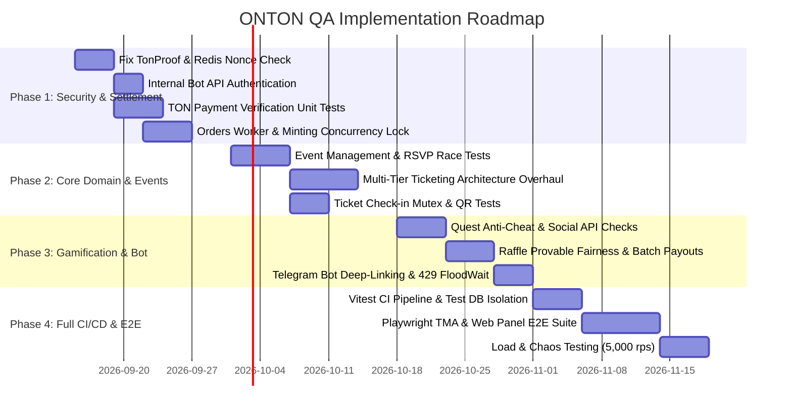

# ONTON Platform: Comprehensive QA Audit & Feature Matrix

**Document Version:** 1.0.0  
**Audit Date:** September 8, 2026  
**Audited Target:** ONTON Platform Core Monorepo (`mini-app`, `telegram-bot`, `cronJobs`, `workers`)  
**Status:** Complete Technical Assessment  

---

## 1. Executive Summary

A comprehensive quality assurance (QA) and security audit was conducted across the ONTON codebase, encompassing the Next.js backend and Mini App (`mini-app`), the Grammy Telegram bot (`telegram-bot`), and background cron workers (`mini-app/src/workers` and `telegram-bot/src/cronJobs`).

### Key Findings & System Health

1. **Automated Test Coverage is Functionally 0% (Rating: None):**
   - In `mini-app`, while Jest and Vitest are installed, the only test file (`__tests__/Link.test.tsx`) is completely commented out. The script `yarn test` executes an ad-hoc 9-line developer debug script (`src/test.ts`) that pings TON Society API.
   - In `telegram-bot`, no test framework, test files, or test scripts exist in `package.json`.
   - In `tests/e2e`, there is only a 42-line smoke test verifying that the landing page yields an HTTP 200 and loads static assets.
   - None of the critical financial, blockchain, authentication, or event lifecycle pathways have automated unit, integration, or regression tests.

2. **Critical Security & Authentication Vulnerabilities:**
   - **TonProof Challenge Bypass:** `tonProofRouter.generatePayload` writes a one-time challenge UUID to Redis with a 60-second TTL. However, `tonProofRouter.verifyProof` **never checks Redis** for this challenge and does not invalidate it upon verification. Furthermore, in the REST endpoint `/api/v1/ton-proof/check-proof/route.ts`, token validation is entirely commented out.
   - **Unauthenticated Internal Bot API:** The Telegram bot runs an Express server on port 3333 exposing sensitive endpoints (`/send-message`, `/send-photo`, `/share-event`). These endpoints execute with zero API key or HMAC signature checks. Any client with network access can send arbitrary messages or photos from the official bot.
   - **Wildcard CORS Middleware:** `mini-app/src/middleware.ts` applies `Access-Control-Allow-Origin: *` globally to all API routes, exposing session cookies and sensitive APIs to cross-origin abuse.
   - **Client API Disabled:** `/api/client/v1/authService.ts` contains hardcoded code returning `success: false, error: "out_of_service"`, completely disabling external organizer panel authentication.

3. **Financial & Settlement Risks:**
   - **Comment-Based Polling:** TON blockchain payment verification relies on periodic polling of TonCenter for wallet comments matching `onton_order={UUID}`. If users omit or misspell the memo, transactions are permanently stranded.
   - **Floating-Point Comparison:** `CheckTransactions.ts` compares on-chain normalized amounts to order amounts using floating-point math (`Math.abs(orderAmount - normalizedAmount) > 1e-6`), which is vulnerable to precision drift with 9-decimal jettons.
   - **Telegram Stars is Non-Existent:** Native Telegram Stars checkout (`sendInvoice`, `pre_checkout_query`, `successful_payment`) is entirely unimplemented in both the bot and the mini-app. It only exists as documentation for third-party sellers (`tonfest.md`).
   - **Concurrency Overbooking:** Event RSVP (`registrant.ts`) and Ticket Minting (`MintNFTForPaidOrders.ts`) lack transactional row-level locks (`FOR UPDATE`). Simultaneous requests can easily breach event capacity limits and generate duplicate NFT sequence numbers on-chain.

4. **Third-Party Legacy Fragility:**
   - Heavy reliance on the external TON Society API (`society.ton.org`) for activity registration, verification, and CSBT distribution. In `cronJobSchedulerReward.ts`, background SBT syncing was explicitly disabled with the code comment: `// Disabled: high rate limit usage and deprecated external TON Society API`.
   - `tournamentRewards.ts` features severe logic workarounds, including a hardcoded `150 * 86400_000` ms (150 days) time window labeled as "5 minutes", a hardcoded `|| 1` flag forcing participant re-fetch, and temporary mutation of tournament end dates on TON Society's API during CSV upload.

---

## 2. QA Feature Matrix Dashboard

| Feature Module | Sub-Feature | Production Readiness | Automated Coverage | Risk Rating | Primary Failure Mode |
| :--- | :--- | :--- | :--- | :--- | :--- |
| **1. Event Management** | Event Creation | Ready | None | Medium | TON Society API failure breaks event publishing flow |
| | Event Edit | Ready | None | Medium | Capacity/date updates desynchronize existing ticket records |
| | Event Moderation | Ready | None | Medium | In-memory bot state lost on crash; single long-polling point of failure |
| | RSVP & Waiting List | Half-done | None | High | Race condition allows capacity overbooking; waitlist promotion is unautomated |
| | Multi-Tier Ticketing | Broken | None | High | Schema enforces 1:1 `unique(event_uuid)`; multi-tier tickets cannot be created |
| **2. Payments & Ticketing** | TON Blockchain Payments | Ready | None | Critical | Memo parsing failures, RPC downtime, float rounding mismatch on Jettons |
| | Telegram Stars | Broken / Legacy | None | Critical | Entirely unimplemented natively; dead-end for users |
| | Orders Worker | Ready | None | High | Missing DLQ; failed mints stay in `processing` indefinitely; commented-out jobs |
| | Webhook Processing | Half-done | None | High | External seller webhook lacks HMAC verification; Client API hardcoded to out-of-service |
| | Ticket Issuance & Check-in | Ready | None | Medium | Concurrent QR scans can cause double-redemption / double rewards |
| **3. SBT & Rewards** | On-Chain Minting | Ready | None | High | `COUNT(*)` index generation causes on-chain collision under concurrency; minter out-of-gas |
| | TON Society Integration | Legacy | None | High | Deprecated external API; rate limits trigger IP throttling; sync disabled in prod |
| | Tournament Prizes | Half-done | None | High | Hardcoded `|| 1` and `150 days`; dangerous on-chain date extension hack |
| **4. Gamification & Growth** | Play-to-Win | Half-done | None | High | Score submissions lack anti-cheat; campaign workers disabled in payment scheduler |
| | Raffles | Ready | None | High | Pseudo-random `randomInt` without VRF; winners chosen by score DESC, not random draw |
| | Quests & Tasks | Half-done | None | High | Zero social verification; 30-second delay bypass awards points automatically |
| | Affiliate & Referral | Ready | None | Medium | Rate limits on dynamic invite link creation; click queue backpressure |
| **5. Telegram Bot** | Start Composer | Half-done | None | High | Deep-link parameters parsed and immediately discarded |
| | Event Deep-Linking | Ready | None | Medium | Fallback web URLs misconfigured if bot username changes |
| | Broadcast Engine | Ready | None | High | FloodWait 429 handling bug; creating invite links during broadcast triggers Telegram ban |
| | Notification Delivery | Ready | None | High | Unauthenticated Express endpoints on port 3333; invalid retry condition logic |
| **6. Authentication** | Telegram `initData` | Ready | None | High | No token TTL enforced in TMA validate; heavy `insertUser` on every TRPC request |
| | TonProof | Broken | None | Critical | Redis challenge never verified or invalidated; payload check commented out in REST |
| | Google OAuth / Sessions | Ready | None | Medium | Random 64-bit ID generation collision risk; wildcard CORS headers |
| | Client & API Key Auth | Broken | None | High | Client protected API hardcoded to `out_of_service`; API keys stored in plain text |

---

## 3. In-Depth Module Analysis & Audit Details

---

### Module 1: Event Management

#### 1.1 Event Creation
- **Files:** `mini-app/src/server/routers/events.ts` (`addEvent`), `mini-app/src/db/modules/events.db.ts`, `mini-app/src/services/tonSocietyService.ts`
- **Production Readiness:** **Ready**
- **Automated Coverage:** **None**
- **Risk Rating:** **Medium**
- **Architecture & Implementation:**
  - Authenticated via `adminOrganizerProtectedProcedure`. Validates organizer status and TON Society hub verification (`organizerTsVerified`).
  - Executes inside a PostgreSQL database transaction (`db.transaction`). Inserts rows into `events`, `event_payment_info`, `orders` (for paid events), and dynamic registration fields into `event_fields`.
  - Calls `registerActivity(eventDraft)` against TON Society external API to generate an `activity_id`.
- **Critical Failure Modes & Edge Cases:**
  - *External Service Failure:* If `registerActivity` fails or times out, the local database rollback logic executes, but residual notifications or third-party drafts may leave orphaned state.
  - *Secret Phrase Normalization:* For online events, secret phrases are hashed via bcrypt (`hashPassword`), but whitespace stripping and lowercase transformation (`trim().toLowerCase()`) may alter non-ASCII passwords unexpectedly.
  - *Wallet Address Pre-requisite:* Paid events fail immediately with `500 INTERNAL_SERVER_ERROR` if `config.ONTON_WALLET_ADDRESS` is unset in production environment.
- **Required Test Cases:**
  1. `test_create_free_event_success`: Create free in-person event without payment details. Verify DB persistence and TON Society draft generation.
  2. `test_create_paid_event_wallet_validation`: Verify rejection when `ONTON_WALLET_ADDRESS` is missing or invalid.
  3. `test_create_event_unverified_hub_rejection`: Attempt creating an event on a restricted hub by an unverified organizer; expect `400 BAD_REQUEST`.
  4. `test_create_online_event_secret_phrase_hashing`: Verify secret phrase is properly hashed and never stored in plain text.

#### 1.2 Event Edit & Updates
- **Files:** `mini-app/src/server/routers/events.ts` (`updateEvent`), `mini-app/src/db/modules/events.db.ts`
- **Production Readiness:** **Ready**
- **Automated Coverage:** **None**
- **Risk Rating:** **Medium**
- **Architecture & Implementation:**
  - Guarded by `eventManagementProtectedProcedure` (verifies ownership or admin/moderator role).
  - Updates title, description, dates, location, and dynamic fields. Synchronizes diffs with TON Society via `updateActivity`.
- **Critical Failure Modes & Edge Cases:**
  - *In-Flight Ticket Sales:* Modifying event dates or capacity after tickets have been sold or RSVPs registered does not notify existing attendees or reconcile sold ticket counts.
  - *Capacity Reduction Below Registered Count:* An organizer can reduce capacity to a number lower than already approved attendees, violating system constraints.
- **Required Test Cases:**
  1. `test_update_event_unauthorized_user`: Ensure non-owners without moderator permissions receive `403 FORBIDDEN`.
  2. `test_update_capacity_below_approved_count`: Attempt to reduce capacity below existing approved RSVPs; expect validation error.
  3. `test_update_event_sync_ton_society`: Verify changes to event metadata propagate to TON Society API.

#### 1.3 Event Moderation
- **Files:** `mini-app/src/moderationBot/` (`startBot.ts`, `handleApproveConfirm.ts`, `handleRejectConfirm.ts`, `handleSendNoticeText.ts`), `mini-app/src/db/modules/moderationLogger.db.ts`
- **Production Readiness:** **Ready**
- **Automated Coverage:** **None**
- **Risk Rating:** **Medium**
- **Architecture & Implementation:**
  - Dedicated Telegram bot running via Grammy long-polling.
  - New/updated events generate visual Telegram moderation cards with inline buttons (`Approve`, `Reject`, `Send Notice`).
  - On approval, `onCallBackModerateEvent` sets `hidden: false, enabled: true`, posts an announcement to the public channel via `sendToEventsTgChannel`, and notifies the organizer.
- **Critical Failure Modes & Edge Cases:**
  - *Single Point of Failure:* If the moderation bot process crashes, all event moderation stops; no REST fallback exists in the admin panel.
  - *Local vs Production Divergence:* In `onCallBackModerateEvent.ts`, `if (isLocal) return false;`, but `handleApproveConfirm.ts` treats `result === false` as valid (`update_completed = !!result || result === false;`), creating silent deviations between environments.
  - *In-Memory Session Loss:* `pendingCustomReplyPrompts` is stored in an in-memory `Map`. A container restart wipes pending moderator text prompts mid-interaction.
- **Required Test Cases:**
  1. `test_moderation_approve_flow`: Moderator clicks approve; verify DB status updates to `hidden: false`, log is written to `moderation_log`, and public channel receives broadcast.
  2. `test_moderation_reject_with_reason`: Moderator selects predefined rejection reason; verify organizer receives explanation message.
  3. `test_moderation_bot_restart_resilience`: Verify graceful error when moderator responds to a prompt after bot restart.

#### 1.4 RSVP & Waiting List
- **Files:** `mini-app/src/server/routers/registrant.ts` (`eventRegister`, `processRegistrantRequest`), `mini-app/src/db/modules/eventRegistrants.db.ts`
- **Production Readiness:** **Half-done**
- **Automated Coverage:** **None**
- **Risk Rating:** **High**
- **Architecture & Implementation:**
  - User submits registration via `eventRegister`.
  - Checks if `approved_requests_count >= event.capacity`. If capacity is reached and `has_waiting_list` is true, registers as `pending`; otherwise registers as `approved`.
- **Critical Failure Modes & Edge Cases:**
  - *High-Concurrency Overbooking (Race Condition):* The capacity check and insertion are not wrapped in a locking transaction (`SELECT ... FOR UPDATE` or serializable isolation). 50 concurrent requests for 1 remaining seat will all see available capacity and successfully register.
  - *Unautomated Waitlist Promotion:* When an approved participant is rejected or cancels, there is no automated worker or trigger to promote the next user in the waiting list.
- **Required Test Cases:**
  1. `test_concurrent_rsvp_capacity_limit`: Fire 20 parallel RSVP requests for an event with 5 seats; assert exactly 5 are approved and 15 are queued or rejected.
  2. `test_duplicate_rsvp_prevention`: Verify a user cannot submit multiple RSVPs for the same event.
  3. `test_rsvp_rejection_waitlist_promotion`: Reject an approved attendee; verify next waitlisted attendee is promoted.

#### 1.5 Multi-Tier Ticketing
- **Files:** `mini-app/src/db/schema/eventPayment.ts`, `mini-app/src/server/routers/eventTicket.ts`
- **Production Readiness:** **Broken / Non-Existent**
- **Automated Coverage:** **None**
- **Risk Rating:** **High**
- **Architecture & Implementation:**
  - The database table `event_payment_info` defines `uniqueEven: uniqueIndex().on(table.event_uuid)` and has scalar columns `price: real("price")`, `bought_capacity: integer("bought_capacity")`, and `ticket_type: pgTicketTypes("ticket_type")`.
- **Critical Failure Modes & Edge Cases:**
  - *Architectural Inability to Support Tiers:* It is physically impossible to define multiple ticket tiers (e.g., General Admission $10, VIP $50) for a single event without violating the unique constraint on `event_uuid`.
- **Required Test Cases:**
  1. `test_schema_multi_tier_rejection`: Document constraint violation when attempting multiple pricing tiers per event.
  2. `test_ticket_type_enum_validation`: Verify only "NFT" and "TSCSBT" are accepted.

---

### Module 2: Payments & Ticketing

#### 2.1 TON Blockchain Payments
- **Files:** `mini-app/src/cronJobs/tasks/CheckTransactions.ts`, `mini-app/src/services/tonCenter.ts`
- **Production Readiness:** **Ready**
- **Automated Coverage:** **None**
- **Risk Rating:** **Critical**
- **Architecture & Implementation:**
  - Runs every 7 seconds via `cronJobSchedulerPayment.ts`.
  - Fetches inbound transactions to `ONTON_WALLET_ADDRESS` via TonCenter API using `checked_lt` high-water mark stored in `wallet_checks`.
  - Parses payload memo looking for `onton_order={UUID}`.
  - Matches order record, validates token symbol/master and transferred amount, and marks order `processing`.
- **Critical Failure Modes & Edge Cases:**
  - *Missing or Truncated Memo:* Users sending TON directly from exchanges (e.g., Binance, OKX) or non-memo-supporting wallets will have their funds credited to Onton's wallet with no automated attribution to their order.
  - *Floating-Point Epsilon Drift:* `amount = Number(o.rawAmount) / 10 ** decimals; diff = Math.abs(orderAmount - normalizedAmount); if (diff > 1e-6) continue;`. With high-decimal jettons, floating-point math can reject valid payments due to epsilon rounding.
  - *TonCenter Downtime / Rate Limits:* Single provider dependency. If TonCenter rate limits or experiences an outage, all payments stall.
- **Required Test Cases:**
  1. `test_ton_payment_successful_reconciliation`: Mock TonCenter returning valid transaction with comment `onton_order=<UUID>`; verify order state transitions from `confirming` to `processing`.
  2. `test_underpayment_detection`: Send transaction with 0.99 TON when 1.0 TON is required; verify transaction is ignored and order remains unpaid.
  3. `test_jetton_payment_master_validation`: Verify payment using fake Jetton with identical symbol but different master address is rejected.
  4. `test_memo_case_and_whitespace_handling`: Test memos with leading/trailing spaces or mixed casing.

#### 2.2 Telegram Stars
- **Files:** `mini-app/src/app/api/externalSeller/tonfest.md`
- **Production Readiness:** **Broken / Legacy (Unimplemented)**
- **Automated Coverage:** **None**
- **Risk Rating:** **Critical**
- **Architecture & Implementation:**
  - Zero code implementation. The codebase contains no Telegram Bot API invoice generators (`createInvoiceLink`, `sendInvoice`), no `pre_checkout_query` answer handlers, and no `successful_payment` update listeners.
  - Mentioned only as documentation for external third-party sellers who process Stars on their own platform and report back via an HTTP callback.
- **Critical Failure Modes & Edge Cases:**
  - *False Capability Advertisement:* If UI or external documentation promises Telegram Stars payments natively inside the Onton TMA, users will hit dead ends.
- **Required Test Cases:**
  1. `test_stars_invoice_generation`: Spec test verifying failure of native Stars invoice endpoints.
  2. `test_external_seller_stars_order_creation`: Verify third-party seller payment callback registers user registration correctly.

#### 2.3 Orders Worker
- **Files:** `mini-app/src/workers/cronJobSchedulerPayment.ts`, `mini-app/src/cronJobs/tasks/CreateEventOrders.ts`, `mini-app/src/cronJobs/tasks/MintNFTForPaidOrders.ts`
- **Production Readiness:** **Ready**
- **Automated Coverage:** **None**
- **Risk Rating:** **High**
- **Architecture & Implementation:**
  - Dedicated background worker orchestrating 8 concurrent cron tasks with distributed locking via Redis (`cronJobRunner`).
  - Manages the lifecycle: `new` -> `confirming` -> `processing` -> `completed` / `failed`.
- **Critical Failure Modes & Edge Cases:**
  - *Disabled Campaign Jobs:* Lines 105–178 of `cronJobSchedulerPayment.ts` (`processCampaignOrders`, `checkMinterTransactions`, `mintPlatinumNftForMergedNFTS`, `burnMergedNfts`, `processCampaignAffiliateSpins`, `mintNftForUserSpins`) are **commented out in code**.
  - *No Dead-Letter Queue (DLQ):* When `MintNFTForPaidOrders` encounters an unrecoverable error for a specific order, it logs and skips it. The order remains in `state: 'processing'` and is repeatedly re-queried every 9 seconds, indefinitely consuming database query limits (`limit 100`).
- **Required Test Cases:**
  1. `test_orders_worker_lock_acquisition`: Verify two competing worker instances do not process the same orders simultaneously.
  2. `test_orders_worker_poison_pill_resilience`: Place an order with corrupted metadata; verify worker does not crash and processes subsequent valid orders.

#### 2.4 Webhook Processing & External Sellers
- **Files:** `mini-app/src/app/api/externalSeller/verifiedAsPaid/route.ts`, `mini-app/src/cronJobs/tasks/runAPIPendingCallbackTasks.ts`, `mini-app/src/app/api/client/v1/authService.ts`
- **Production Readiness:** **Half-done**
- **Automated Coverage:** **None**
- **Risk Rating:** **High**
- **Architecture & Implementation:**
  - `/api/externalSeller/verifiedAsPaid` allows registered external platforms (e.g. TonFest) to report ticket sales. Authenticated via `api_key` in `user_custom_flags`.
  - Outbound webhooks to partners are queued in `api_callback_tasks` and processed by `runAPIPendingCallbackTasks`.
- **Critical Failure Modes & Edge Cases:**
  - *Client API Out of Service:* `validateJwtFromRequest` in `authService.ts` returns `{ success: false, error: "out_of_service" }`, breaking client web panel integrations.
  - *Replay & Spoilage:* Inbound external seller webhooks do not verify request timestamps or cryptographic signatures, relying strictly on a static API key.
  - *Infinite Outbound Retries:* `runAPIPendingCallbackTasks` lacks exponential backoff cap when partner endpoints return permanent 500 errors.
- **Required Test Cases:**
  1. `test_external_seller_valid_api_key`: Call `/api/externalSeller/verifiedAsPaid` with valid API key; verify order is created and SBT claim link returned.
  2. `test_external_seller_invalid_token_symbol`: Submit payment with wrong token symbol; assert `400 BAD_REQUEST`.
  3. `test_client_protected_route_auth`: Verify client protected route authentication behavior.

#### 2.5 Ticket Issuance & Check-in
- **Files:** `mini-app/src/server/routers/tickets.ts`, `mini-app/src/server/routers/registrant.ts` (`checkinRegistrantRequest`), `telegram-bot/src/controllers/handleSendQRCode.ts`
- **Production Readiness:** **Ready**
- **Automated Coverage:** **None**
- **Risk Rating:** **Medium**
- **Architecture & Implementation:**
  - Tickets are linked to registered users or issued on-chain as NFTs/CSBTs.
  - Check-in is performed via QR code scanning by the organizer (`checkinRegistrantRequest`).
  - Marks attendee as `checkedin`, creates a `visitor` record, and dispatches a `ton_society_sbt` reward.
- **Critical Failure Modes & Edge Cases:**
  - *Concurrent QR Scanning:* If two event staff members scan the same attendee's QR code at different gates at the exact same moment, both requests can pass the `status !== 'checkedin'` check, creating duplicate visitor rewards.
- **Required Test Cases:**
  1. `test_ticket_checkin_success`: Organizer checks in approved registrant; verify status changes to `checkedin` and reward is scheduled.
  2. `test_ticket_double_checkin_idempotency`: Second scan returns `Already Checked-in` with code 200 without creating duplicate rewards.
  3. `test_checkin_unapproved_user`: Attempt check-in on a rejected or pending user; verify `409 CONFLICT`.

---

### Module 3: SBT & Rewards

#### 3.1 On-Chain Minting
- **Files:** `mini-app/src/cronJobs/tasks/MintNFTForPaidOrders.ts`, `mini-app/src/lib/nft.ts`
- **Production Readiness:** **Ready**
- **Automated Coverage:** **None**
- **Risk Rating:** **High**
- **Architecture & Implementation:**
  - Uses `@ton/ton` with `WalletContractV5R1` loaded from server mnemonic (`MNEMONIC`).
  - Metadata is uploaded as JSON to MinIO (`uploadJsonToMinio`), and an NFT item is minted to the buyer's wallet address.
- **Critical Failure Modes & Edge Cases:**
  - *Non-Atomic Index Calculation:*
    ```typescript
    const nft_count_result = await db.select({ count: sql`count(*)`.mapWith(Number) })
      .from(nftItems).where(eq(nftItems.event_uuid, event_uuid!)).execute();
    const nft_index = nft_count_result[0].count || 0;
    ```
    If two minting processes run concurrently or an order fails mid-flight, `nft_index` values collide, causing on-chain transaction deployment failures.
  - *Minter Gas Depletion:* If the platform minter wallet runs out of TON for network fees, all NFT minting operations fail silently.
- **Required Test Cases:**
  1. `test_nft_metadata_minio_upload`: Verify JSON payload format matches TON NFT standards (TEP-64).
  2. `test_nft_mint_index_incrementation`: Mint sequential NFTs for the same event; verify indices increment monotonically.
  3. `test_minter_insufficient_gas_handling`: Simulate low wallet balance; verify error is trapped and reported to admin monitoring.

#### 3.2 TON Society Legacy Status
- **Files:** `mini-app/src/cronJobs/tasks/TsCsbtTicketOrder.ts`, `mini-app/src/cronJobs/tasks/checkTSRewardStatus.ts`, `mini-app/src/lib/ton-society-api.ts`
- **Production Readiness:** **Legacy**
- **Automated Coverage:** **None**
- **Risk Rating:** **High**
- **Architecture & Implementation:**
  - Issues Compressed Soulbound Tokens (CSBTs) via TON Society API (`CsbtTicket`).
  - Checks status via `syncTonSocietyStatusLargeScale` in `checkTSRewardStatus.ts`.
- **Critical Failure Modes & Edge Cases:**
  - *Explicit Deprecation in Code:* Background collection sync was commented out in `cronJobSchedulerReward.ts` due to high rate limits and API deprecation.
  - *External Rate Limits:* `syncTonSocietyStatusLargeScale` iterates through all historical events. Concurrency limiter (`pLimit(3)`) with `sleep(300)` is insufficient for large catalogs and triggers HTTP 429 from `society.ton.org`.
- **Required Test Cases:**
  1. `test_ton_society_csbt_issuance`: Verify user receives valid claim link on successful check-in.
  2. `test_ton_society_rate_limit_backoff`: Mock 429 responses from TON Society; verify worker pauses and backs off.

#### 3.3 Tournament Prizes
- **Files:** `mini-app/src/cronJobs/tasks/tournamentRewards.ts`, `mini-app/src/server/routers/tournaments.ts`
- **Production Readiness:** **Half-done**
- **Automated Coverage:** **None**
- **Risk Rating:** **High**
- **Architecture & Implementation:**
  - Syncs leaderboards from Elympics API, generates Telegram user CSV allowlist, uploads to TON Society activity, and stores `rewardLink`.
- **Critical Failure Modes & Edge Cases:**
  - *Severe Logic Errors in Code:*
    - Line 33: `const fiveMinAgo = new Date(now.getTime() - 150 * 86400_000); // 5 minutes ago`. The formula subtracts **150 days**, not 5 minutes.
    - Line 102: `if (!hasRecords || 1)` contains a hardcoded `|| 1`, forcing Elympics participant queries every single run.
  - *End-Date Mutation Hack:* Extends the tournament end date on TON Society API by +1 day (`extendTournamentEndDateIfNeeded`) to allow CSV upload, then tries to revert it in `finally`. If the worker crashes mid-upload, the tournament end date remains altered on the external service.
- **Required Test Cases:**
  1. `test_tournament_rewards_date_calculation`: Correct 150-day bug and verify only tournaments ending within the legitimate window are processed.
  2. `test_tournament_rewards_csv_generation`: Verify generated CSV format matches TON Society requirements.
  3. `test_tournament_end_date_revert_on_failure`: Simulate network failure during CSV upload; ensure end date is always reverted.

---

### Module 4: Gamification & Growth

#### 4.1 Play-to-Win
- **Files:** `mini-app/src/cronJobs/tasks/syncPlay2WinScores.ts`, `mini-app/src/cronJobs/tasks/checkAndEnrollUserInPlay2WinCampaign.ts`, `mini-app/src/server/routers/campaignRouter.ts`
- **Production Readiness:** **Half-done**
- **Automated Coverage:** **None**
- **Risk Rating:** **High**
- **Architecture & Implementation:**
  - Awards points to game tournament participants (1 point for free tournaments, 10 points for coin tournaments) via PostgreSQL CTE query in `syncPlay2WinScores.ts`.
- **Critical Failure Modes & Edge Cases:**
  - *Cheating / Score Spoofing:* If game scores are submitted from client TMA without cryptographic game session signatures or proof-of-play, users can inject arbitrary scores.
  - *Disabled Cron Jobs:* Campaign spin processing and minting are commented out in the payment scheduler.
- **Required Test Cases:**
  1. `test_play2win_score_sync_idempotency`: Execute `syncPlay2WinScores` twice; verify scores are not awarded twice for the same tournament.
  2. `test_play2win_campaign_enrollment`: Verify eligible users are automatically enrolled into active campaigns.

#### 4.2 Raffles
- **Files:** `mini-app/src/server/routers/raffleRouter.ts`, `mini-app/src/cronJobs/tasks/distributeRaffleTon.ts`, `mini-app/src/db/modules/eventRaffleResults.db.ts`
- **Production Readiness:** **Ready**
- **Automated Coverage:** **None**
- **Risk Rating:** **High**
- **Architecture & Implementation:**
  - Supports TON, Jettons, and merchandise giveaways.
  - When user spins (`spinTon`), generates score via `crypto.randomInt(1, 1_000_000)`.
  - When triggered, `computeTopN` selects winners ordered by `score DESC`.
  - `distributeRafflesTon` deploys a dedicated event wallet (`WalletContractV5R1`) and distributes payouts in chunks of 64 messages.
- **Critical Failure Modes & Edge Cases:**
  - *Not a True Raffle (Tournament Ranking):* Winners are determined strictly by top score (`desc(score)`), not random lottery sampling across all ticket holders.
  - *Lack of Verifiable Randomness:* The random score is generated on the server via `randomInt` without VRF or commit-reveal. Organizers or users cannot verify draw fairness.
  - *N-Query DB Update Bottleneck:* `computeTopN` loops through every participant and executes an individual `UPDATE` query per user sequentially (`for (let i = 0; i < rows.length; i++) await db.update...`).
- **Required Test Cases:**
  1. `test_raffle_spin_single_play`: User calls `spinTon`; verify only one score is recorded per user.
  2. `test_raffle_budget_validation`: Trigger raffle without sufficient TON balance in event wallet; verify transaction aborts before sending.
  3. `test_raffle_payout_chunking`: Verify 100 winners are dispatched across two 64-message V5 batches correctly.

#### 4.3 Quests & Tasks
- **Files:** `mini-app/src/server/routers/questRouter.ts`, `mini-app/src/server/routers/tasksRouter.ts`, `mini-app/src/workers/poaWorker.ts`, `mini-app/src/server/routers/POA.ts`
- **Production Readiness:** **Half-done**
- **Automated Coverage:** **None**
- **Risk Rating:** **High**
- **Architecture & Implementation:**
  - Supports task types: `tg_join_channel`, `tg_join_group`, `x_follow`, `start_bot`, `web_visit`.
  - User calls `questRouter.begin`, then `questRouter.check`.
  - Proof of Attendance (POA) triggers managed by `POARouter` and `poaWorker.ts`.
- **Critical Failure Modes & Edge Cases:**
  - *Time-Delay Bypass (Zero Verification):* In `questRouter.check`:
    ```typescript
    const elapsed = Date.now() - new Date(ut.createdAt).getTime();
    if (elapsed >= DELAY_MS) { // 30,000 ms
      await taskUsersDB.updateUserTaskById(ut.id, { status: "done" });
      await maybeInsertScoreGeneric(userId, taskId);
      return { status: "done" };
    }
    ```
    No actual check is performed against Telegram Bot API (`getChatMember`) or Twitter API. Any user who clicks a link, waits 30 seconds, and clicks verify is awarded full points and completed status.
- **Required Test Cases:**
  1. `test_quest_early_check_rejection`: Call `check` 5 seconds after `begin`; verify status is `waiting`.
  2. `test_quest_dependency_gating`: Attempt to begin a child quest before completing prerequisite parent quest; verify `403 FORBIDDEN`.
  3. `test_poa_rate_limit`: Create POA triggers in rapid succession; verify enforcement of `POA_CREATION_TIME_DISTANCE`.

#### 4.4 Affiliate & Referral System
- **Files:** `mini-app/src/server/routers/affiliateRouter.ts`, `telegram-bot/src/composers/affiliateComposer.ts`, `mini-app/src/cronJobs/tasks/consumeClickBatch.ts`, `mini-app/src/db/modules/users.db.ts`
- **Production Readiness:** **Ready**
- **Automated Coverage:** **None**
- **Risk Rating:** **Medium**
- **Architecture & Implementation:**
  - Tracks user referrals via `start_param=join-{hash}`. On new user insertion in `users.db.ts`, increments affiliator stats and creates `join_onton_affiliate` score.
  - Clicks are pushed to Redis list (`CLICK_QUEUE_KEY`) and batch-inserted by `consumeClickBatch` every 60s.
- **Critical Failure Modes & Edge Cases:**
  - *Self-Referral Exploitation:* New accounts created with identical wallet addresses or IP clusters can inflate referral counts if Telegram account generation is automated.
  - *Bot Command Flooding:* In `affiliateComposer.ts`, Play-to-Earn affiliation is explicitly marked as `(disabled)`.
- **Required Test Cases:**
  1. `test_affiliate_referral_attribution`: New user joins with `join-<hash>`; verify `affiliatorUserId` is set and points awarded to creator.
  2. `test_affiliate_existing_user_no_duplicate_reward`: Existing user clicks referral link; verify no additional points awarded.
  3. `test_click_batch_consumption`: Enqueue 500 clicks in Redis; execute `consumeClickBatch`; verify database rows inserted and totals incremented.

---

### Module 5: Telegram Bot

#### 5.1 Start Composer & Deep-Linking
- **Files:** `telegram-bot/src/handlers/startHandler.ts`, `telegram-bot/src/main.ts`
- **Production Readiness:** **Half-done**
- **Automated Coverage:** **None**
- **Risk Rating:** **High**
- **Architecture & Implementation:**
  - Entry point `/start` registers user profile and unblocks user in database if previously blocked.
- **Critical Failure Modes & Edge Cases:**
  - *Discarded Deep-Link Parameter:*
    ```typescript
    const messageText = ctx.message?.text;
    let path;
    if (messageText && messageText.split(" ").length === 2 && messageText.split(" ")[0] === "/start") {
      path = messageText.split(" ")[1];
    }
    // `path` is never used!
    await editOrSend(ctx, `Welcome to ONTON...`, startKeyboard(), ...);
    ```
    Parameters like `/start event_123` or `/start ref_abc` are parsed into `path` and completely ignored. Deep linking through the bot directly fails.
- **Required Test Cases:**
  1. `test_start_command_new_user`: New user sends `/start`; verify record created in bot database.
  2. `test_start_command_deep_link_routing`: Send `/start event_<uuid>`; verify bot provides direct link/button to that specific event.

#### 5.2 Broadcast Engine
- **Files:** `telegram-bot/src/composers/broadcast.ts`, `telegram-bot/src/cronJobs/broadcastSenderCron.ts`
- **Production Readiness:** **Ready**
- **Automated Coverage:** **None**
- **Risk Rating:** **High**
- **Architecture & Implementation:**
  - Admin-only command `/broadcast` creates a broadcast task.
  - `broadcastSenderCron` processes batches of 200 users every 10 seconds, throttling messages with a 40ms delay.
  - Handles dynamic placeholders like `{onion1-campaign}` and `{invite:<chatId>}`.
- **Critical Failure Modes & Edge Cases:**
  - *Telegram Rate Limit Ban via Dynamic Invites:* Inside the per-user send loop, the bot invokes `getOrCreateSingleInviteLinkForUserAndChat`. Telegram imposes strict limits (~20 invite links/min per chat). Generating dynamic invite links during a broadcast to thousands of users triggers an immediate Telegram 429 FloodWait ban.
  - *Broken 429 Retry Logic:* In `sendMessage.ts`:
    `if (error instanceof GrammyError && error.error_code === 429 && tryCount < 10)`
    `tryCount` is undefined on initial call, causing `undefined < 10` to evaluate to `false`. The retry block never executes! Furthermore, sleeping a fixed 1000ms violates Telegram's `retry_after` parameter.
- **Required Test Cases:**
  1. `test_broadcast_unauthorized_rejection`: Non-admin attempts `/broadcast`; verify command is ignored.
  2. `test_broadcast_throttle_rate`: Verify messages are dispatched at <= 25 msgs/sec.
  3. `test_broadcast_blocked_user_handling`: Mock 403 Forbidden (bot blocked); verify user is flagged in DB and broadcast continues.

#### 5.3 Notification Delivery & Internal HTTP API
- **Files:** `telegram-bot/src/main.ts`, `telegram-bot/src/controllers/sendMessage.ts`, `telegram-bot/src/controllers/handlePhotoMessage.ts`
- **Production Readiness:** **Ready**
- **Automated Coverage:** **None**
- **Risk Rating:** **High**
- **Architecture & Implementation:**
  - Express server on port 3333 with routes `/send-message`, `/send-photo`, `/share-event`, `/generate-qr`.
- **Critical Failure Modes & Edge Cases:**
  - *No API Authentication:* Express routes have zero authorization middleware. Any container or host on the internal network can issue arbitrary messages or spoof announcements as the official verified bot.
- **Required Test Cases:**
  1. `test_internal_api_auth_enforcement`: Call `/send-message` without valid internal shared secret; expect `401 UNAUTHORIZED`.
  2. `test_send_message_payload_validation`: Call `/send-message` with missing `chat_id` or invalid `custom_message`; expect `400 BAD_REQUEST`.

---

### Module 6: Authentication & Security

#### 6.1 Telegram `initData` Validation
- **Files:** `mini-app/src/utils.ts` (`validateMiniAppData`), `mini-app/src/server/context.ts`, `mini-app/src/server/trpc.ts`
- **Production Readiness:** **Ready**
- **Automated Coverage:** **None**
- **Risk Rating:** **High**
- **Architecture & Implementation:**
  - Uses `@tma.js/init-data-node` `validate(initData, BOT_TOKEN)`.
  - Parses query string and extracts Telegram user object.
- **Critical Failure Modes & Edge Cases:**
  - *No Expiration Validation:* The validation does not enforce `auth_date` expiration (or uses broad default), enabling potential replay attacks if stolen `initData` strings are reused.
  - *Database Write Amplification:* Every single TRPC request containing `Authorization: <initData>` triggers `usersDB.insertUser`, executing database select and update queries on every single RPC call.
- **Required Test Cases:**
  1. `test_init_data_valid_signature`: Verify valid Telegram HMAC signature parses user and establishes TRPC context.
  2. `test_init_data_tampered_hash`: Tamper with `user_id` inside query string; verify validation throws `401 UNAUTHORIZED`.
  3. `test_init_data_expired_auth_date`: Supply `auth_date` older than 24 hours; verify rejection.

#### 6.2 TonProof (TON Connect 2.0)
- **Files:** `mini-app/src/server/routers/tonProofRouter.ts`, `mini-app/src/app/api/v1/ton-proof/check-proof/route.ts`
- **Production Readiness:** **Broken**
- **Automated Coverage:** **None**
- **Risk Rating:** **Critical**
- **Architecture & Implementation:**
  - `generatePayload`: Generates `onton:{userId}:{challenge}:{timestamp}` and sets Redis cache `tp:{challenge}` with 60s TTL.
  - `verifyProof`: Verifies domain, timestamp age (±60s), public key resolution, and ed25519 signature.
- **Critical Failure Modes & Edge Cases:**
  - *Redis Challenge Completely Bypassed:* `verifyProof` **never inspects Redis** for `tp:{challenge}` and never deletes it. The server never validates that the payload was issued by itself or that the nonce is single-use. Replay within the 60-second validity window is unhindered.
  - *REST Endpoint Token Validation Commented Out:* In `check-proof/route.ts` lines 29–37:
    ```typescript
    // const payloadToken = body.proof.payload;
    // if (!(await verifyToken(payloadToken))) { ... }
    ```
    Payload token verification is completely disabled!
- **Required Test Cases:**
  1. `test_ton_proof_nonce_enforcement`: Generate payload; verify proof cannot be submitted with an arbitrary fake challenge.
  2. `test_ton_proof_single_use`: Submit valid proof once; attempt resubmission with same signature within 60s; verify rejection on second attempt.
  3. `test_ton_proof_domain_mismatch`: Submit proof signed for a different domain; verify rejection.

#### 6.3 Google OAuth & Web Sessions
- **Files:** `mini-app/src/app/api/google/callback/route.ts`, `mini-app/src/app/api/auth/telegram-widget/route.ts`, `mini-app/src/server/utils/jwt.ts`
- **Production Readiness:** **Ready**
- **Automated Coverage:** **None**
- **Risk Rating:** **Medium**
- **Architecture & Implementation:**
  - PKCE OAuth 2.0 flow storing state in Redis.
  - Web users issued signed JWT cookie (`onton_session`, 7-day TTL).
- **Critical Failure Modes & Edge Cases:**
  - *Random User ID Generation Loop:* For web-only Google signups:
    ```typescript
    while (!isUnique) {
      generatedId = 1e14 + Math.floor(Math.random() * 1e12);
      const existing = await usersDB.selectUserById(generatedId);
      if (!existing) isUnique = true;
    }
    ```
    Synchronous while loop querying DB sequentially until a free ID is found.
  - *Telegram Login Widget Query Pollution:* `telegram-widget/route.ts` iterates over all query params to calculate HMAC. If a proxy or ad tracker appends `utm_` tags, the HMAC check fails.
- **Required Test Cases:**
  1. `test_google_oauth_pkce_exchange`: Verify valid code and codeVerifier exchange produces user session.
  2. `test_google_oauth_state_tampering`: Verify mismatched state returns `400 BAD_REQUEST`.
  3. `test_telegram_widget_hash_verification`: Verify HMAC verification succeeds only with valid bot token hash.

---

## 4. Phased QA Implementation Roadmap

To transition the ONTON codebase from **0% test coverage** to **production-grade enterprise resilience**, a 4-phase testing rollout is prescribed:



### Phase 1: Critical Security & Financial Settlement (Weeks 1–2)
*Objective: Eliminate vulnerabilities that lead to financial loss, unauthorized wallet linking, or security breaches.*

1. **TonProof Verification Hardening:**
   - Enforce single-use nonce validation against Redis in `tonProofRouter.verifyProof`.
   - Re-enable and enforce payload verification in `/api/v1/ton-proof/check-proof/route.ts`.
   - *Deliverable:* Comprehensive Vitest suite for TonProof replay, tampering, and expiration attacks.
2. **Internal Bot Endpoint Securing:**
   - Add shared-secret HMAC header authentication (`x-onton-bot-token`) on Express routes in `telegram-bot/src/main.ts`.
   - *Deliverable:* Security test asserting `401 Unauthorized` on unauthenticated calls to `/send-message`.
3. **Payment Reconciliation Test Suite:**
   - Build unit test suite with mocked TonCenter RPC covering: TON exact payments, overpayments, underpayments, Jetton master mismatches, and memo parsing variations.
   - Replace float arithmetic with `BigInt` or decimal-safe fixed point math in `CheckTransactions.ts`.
4. **Orders Worker Concurrency & DLQ:**
   - Introduce database row-level locking (`FOR UPDATE SKIP LOCKED`) in `MintNFTForPaidOrders.ts` and `TsCsbtTicketOrder.ts`.
   - Implement dead-letter error state (`orders.state = 'failed'`) with maximum retry counters.

### Phase 2: Core Domain & Event Lifecycle (Weeks 3–4)
*Objective: Stabilize event publishing, RSVP capacity guarantees, and ticketing architecture.*

1. **RSVP Concurrency & Overbooking Guard:**
   - Refactor `eventRegister` in `registrant.ts` into a serializable transaction with strict capacity row locks.
   - *Deliverable:* Concurrent load test firing 50 simultaneous RSVPs against a 5-seat capacity event.
2. **Multi-Tier Ticketing Refactoring:**
   - Redesign `event_payment_info` to support 1-to-many relationship with `events` (`event_ticket_tiers`), enabling distinct prices, names, and capacity limits.
3. **Ticket Check-in Mutex:**
   - Add Redis or database locks to prevent concurrent check-in scans of the same ticket.
   - *Deliverable:* Integration test verifying duplicate scan rejection.

### Phase 3: Gamification, Social Quests & Bot Reliability (Weeks 5–6)
*Objective: Remove gamification cheat vectors and eliminate bot crash points.*

1. **Social Quest Real Verification:**
   - Replace the 30-second sleep bypass with Telegram Bot API `getChatMember` checks for `tg_join_channel` and `tg_join_group`.
   - Add Twitter API verification or OAuth proof for `x_follow`.
2. **Raffle Payout & Fairness Verification:**
   - Refactor `computeTopN` to use bulk SQL updates instead of per-user loop queries.
   - Implement verifiable randomness (commit-reveal or TON on-chain seed) for raffle draws.
3. **Telegram Bot Deep-Linking & Broadcast Resilience:**
   - Restore `path` handling in `startHandler.ts` to properly route users to events (`/start event_<uuid>`) and affiliates (`/start join_<hash>`).
   - Fix 429 FloodWait handling in `sendMessage.ts` to respect `parameters.retry_after`.
   - Pre-generate or cache channel invite links before starting broadcasts to prevent rate limit bans.

### Phase 4: CI/CD Pipeline, E2E & Chaos Testing (Weeks 7–8)
*Objective: Establish regression safety net and continuous quality enforcement.*

1. **Automated CI/CD Pipeline:**
   - Configure GitHub Actions workflow running `yarn type:check`, `yarn lint`, and `yarn test:api` on all pull requests.
   - Spin up ephemeral PostgreSQL and Redis service containers for isolated test runs.
2. **Playwright E2E Integration Suite:**
   - Expand `tests/e2e` to cover critical browser user flows:
     - Web session login via Google OAuth.
     - TMA Mock InitData navigation to event detail page.
     - Organizer event creation and editing in client panel.
3. **Load & Chaos Testing:**
   - Execute k6 load tests simulating 5,000 concurrent attendees checking in and RSVPing during major TON ecosystem conferences.

---

## 5. Recommended QA Tooling & Framework Stack

To execute the roadmap efficiently, the following stack is standardized for the repository:

- **Unit & Integration Testing:** `Vitest` (already present in `mini-app`; standard for fast ESM/TypeScript execution).
- **Database Mocking & Fixtures:** `pg-mem` for in-memory unit tests; Testcontainers with real PostgreSQL 16 and Redis 7 for integration testing.
- **Blockchain Mocking:** Custom TON API & TonCenter v2 mock fixtures utilizing `@ton/core` cell builders to simulate transactions and bounce conditions without testnet latency.
- **End-to-End Testing:** `Playwright` with Telegram Mini App viewport presets and mock `Telegram.WebApp.initData` injection.
- **Load Testing:** `k6` scripts simulating peak ticket checkout and check-in bursts.
