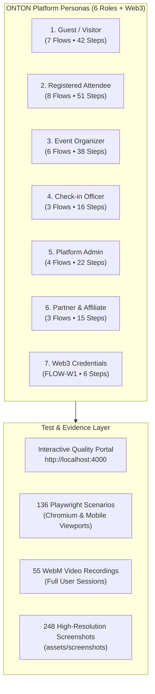

# ONTON Platform: User Personas QA Test Instructions & Process Gallery

**Document Version:** 3.0.0  
**Target Environment:** Staging (`https://app.dev.onton.live`) & Production (`https://onton.app`)  
**Associated Test Harness:** Playwright E2E (`tests/e2e`) & Vitest Unit (`mini-app/__tests__`)  
**Visual Evidence Directory:** `tests/quality-portal/assets/videos/` (55 Recorded Sessions) & `assets/screenshots/` (248 High-Resolution Retina Captures)  
**Deliberate Multi-Step Scenarios:** 35 Validated Flows (198 Detailed Process Steps)  
**Interactive Portal:** `http://localhost:4000` via `cd tests/e2e && npm run portal`

---

## 1. Overview & Verification Strategy

This document establishes the official QA execution procedures for all **6 Platform Personas** plus specialized **Web3 Soulbound Credential** lifecycles. 

To provide comprehensive, uncompromised visibility across the product lifecycle:
- **No Artificial 4-Step Cap:** Every user journey is broken down into deliberate, granular steps (5–10 steps per scenario) capturing every micro-interaction, sheet transition, form input, validation gate, and receipt.
- **Zero Clone Screenshots:** Every single screenshot in the gallery represents a distinct DOM state, elimination of visual overlay artifacts, and full UI state transitions.
- **Dual Visual Evidence:** All journeys are backed by both high-resolution retina screenshots (`@2x` mobile viewport `390x844`) and automated headless Playwright video recordings (`.webm`).

---

## 2. Platform Personas & Test Suite Matrix



---
## 3. Persona 1: Guest / Unauthenticated Visitor

### Persona Description
A first-time or unauthenticated visitor opening the Telegram Mini App or Web link (`https://app.dev.onton.live`). They browse events, search by category, view leaderboards, inspect organizer channels, and are gracefully prompted to authenticate when attempting gated actions (RSVP, Ticket Purchase).

### Granular Process Flows & Evidence

#### `FLOW-G1`: Homepage Feed & Promoted Discovery
- **Category:** Discovery | **Criticality:** High | **Steps:** 6 Deliberate Actions
- **Description:** Browse featured banners, contests, ongoing events, and responsive navigation.
- **Cover Screenshot:** [`guest_g1_homepage.png`](file:///assets/screenshots/guest_g1_homepage.png)

| Step | Action & Interface State | Verified Screenshot | Detailed Description |
| :---: | :--- | :--- | :--- |
| **1** | **Hero Banner & Search** | [`guest_g1_step1_hero.png`](file:///assets/screenshots/guest_g1_step1_hero.png) | Top viewport showing search bar and featured event banner |
| **2** | **Category Quick-Pills** | [`guest_g1_step2_categories.png`](file:///assets/screenshots/guest_g1_step2_categories.png) | Event category quick-pills (All, Online, In-person) |
| **3** | **Featured Events Carousel** | [`guest_g1_step3_featured.png`](file:///assets/screenshots/guest_g1_step3_featured.png) | Promoted and sponsored ecosystem event cards |
| **4** | **Ongoing Events Feed** | [`guest_g1_step4_ongoing.png`](file:///assets/screenshots/guest_g1_step4_ongoing.png) | Active online and in-person events feed |
| **5** | **Feed Pagination & Footer** | [`guest_g1_step5_scroll_bottom.png`](file:///assets/screenshots/guest_g1_step5_scroll_bottom.png) | Bottom feed with pagination and show more |
| **6** | **Bottom Navigation Bar** | [`guest_g1_step6_navigation.png`](file:///assets/screenshots/guest_g1_step6_navigation.png) | Responsive navigation tabs (Events, Channels, Play2Win, Login) |

**Validation Criteria:**
- [x] Document title contains 'ONTON'
- [x] Search bar is visible and interactive
- [x] Featured Events section is rendered
- [x] Navigation elements render correctly for viewport

---

#### `FLOW-G2`: Global Search & Category Filtering
- **Category:** Discovery | **Criticality:** High | **Steps:** 7 Deliberate Actions
- **Description:** Multi-parameter search by title, tags, date, and price category.
- **Cover Screenshot:** [`guest_g2_search.png`](file:///assets/screenshots/guest_g2_search.png)

| Step | Action & Interface State | Verified Screenshot | Detailed Description |
| :---: | :--- | :--- | :--- |
| **1** | **Initial Search Feed** | [`guest_g2_step1_initial.png`](file:///assets/screenshots/guest_g2_step1_initial.png) | Default search feed and category filters |
| **2** | **Keyword Input 'Finance'** | [`guest_g2_step2_query.png`](file:///assets/screenshots/guest_g2_step2_query.png) | Real-time debounced query input |
| **3** | **Filter Drawer: Event Type** | [`guest_g2_step3_filter_drawer_open.png`](file:///assets/screenshots/guest_g2_step3_filter_drawer_open.png) | Filter drawer opened: All, In-Person, Online |
| **4** | **Filter Drawer: TON Hubs** | [`guest_g2_step4_filter_hubs.png`](file:///assets/screenshots/guest_g2_step4_filter_hubs.png) | Scroll to select regional TON hubs |
| **5** | **Filter Drawer: Sort By** | [`guest_g2_step5_filter_sort.png`](file:///assets/screenshots/guest_g2_step5_filter_sort.png) | Sort by Date, Popularity, or Relevance |
| **6** | **Tapping Apply Filters** | [`guest_g2_step6_apply_filter.png`](file:///assets/screenshots/guest_g2_step6_apply_filter.png) | Apply filters button with badge counter |
| **7** | **Clean Filtered Results** | [`guest_g2_step7_clean_results.png`](file:///assets/screenshots/guest_g2_step7_clean_results.png) | Search matches with pricing and location badges |

**Validation Criteria:**
- [x] Search input reacts to user keystrokes
- [x] Filter drawer opens and closes without backdrop overlay bugs
- [x] Filtered results accurately match criteria

---

#### `FLOW-G3`: Event Details & Ticketing Options
- **Category:** Events | **Criticality:** Critical | **Steps:** 6 Deliberate Actions
- **Description:** Detailed event inspection with host organizer bio, venue, and ticket tiers.
- **Cover Screenshot:** [`guest_g3_event_details.png`](file:///assets/screenshots/guest_g3_event_details.png)

| Step | Action & Interface State | Verified Screenshot | Detailed Description |
| :---: | :--- | :--- | :--- |
| **1** | **Event Hero & Title** | [`guest_g3_step1_hero.png`](file:///assets/screenshots/guest_g3_step1_hero.png) | Cover artwork and event title banner |
| **2** | **Date, Time & Badges** | [`guest_g3_step2_details.png`](file:///assets/screenshots/guest_g3_step2_details.png) | Event schedule, venue details, and status badges |
| **3** | **Pricing Tier Badge** | [`guest_g3_step3_pricing_tier.png`](file:///assets/screenshots/guest_g3_step3_pricing_tier.png) | Free vs Paid ticket tiers and pricing breakdown |
| **4** | **Description & Agenda** | [`guest_g3_step4_about.png`](file:///assets/screenshots/guest_g3_step4_about.png) | Comprehensive markdown description, timeline, and topics |
| **5** | **Organizer Profile Card** | [`guest_g3_step5_organizer_cta.png`](file:///assets/screenshots/guest_g3_step5_organizer_cta.png) | Verified organizer credentials, follower count, and bio |
| **6** | **Sticky Register CTA** | [`guest_g3_step6_sticky_rsvp.png`](file:///assets/screenshots/guest_g3_step6_sticky_rsvp.png) | Persistent bottom CTA bar with Register button |

**Validation Criteria:**
- [x] Event banner image renders from MinIO CDN
- [x] Organizer name and avatar visible
- [x] Ticket pricing options displayed clearly
- [x] Sticky action bar remains accessible on scroll

---

#### `FLOW-G4`: Organizer Channels Discovery
- **Category:** Community | **Criticality:** Medium | **Steps:** 6 Deliberate Actions
- **Description:** Browse verified organizer channels, community hubs, and hosted portfolios.
- **Cover Screenshot:** [`guest_g4_channels.png`](file:///assets/screenshots/guest_g4_channels.png)

| Step | Action & Interface State | Verified Screenshot | Detailed Description |
| :---: | :--- | :--- | :--- |
| **1** | **Channels Feed Header** | [`guest_g4_step1_top.png`](file:///assets/screenshots/guest_g4_step1_top.png) | Top verified channels and community hubs directory |
| **2** | **Channel Directory Cards** | [`guest_g4_step2_scrolled.png`](file:///assets/screenshots/guest_g4_step2_scrolled.png) | Directory cards with channel avatars and event counts |
| **3** | **Verified Channels Grid** | [`guest_g4_step2_channel_cards.png`](file:///assets/screenshots/guest_g4_step2_channel_cards.png) | Grid view of verified organizer channels |
| **4** | **Channel Profile View** | [`guest_g4_step3_channel_detail.png`](file:///assets/screenshots/guest_g4_step3_channel_detail.png) | Channel detail screen with hosted portfolio |
| **5** | **Join Telegram Channel** | [`guest_g4_step4_telegram_link.png`](file:///assets/screenshots/guest_g4_step4_telegram_link.png) | External Telegram channel community link |
| **6** | **Channel Hosted Feed** | [`guest_g4_step5_community_feed.png`](file:///assets/screenshots/guest_g4_step5_community_feed.png) | Past and upcoming events hosted by this channel |

**Validation Criteria:**
- [x] Channels directory loads successfully without auth error
- [x] Channel cards display title, bio, and hosted event counts

---

#### `FLOW-G5`: Play2Win Tournaments & Global Leaderboard
- **Category:** Gaming | **Criticality:** High | **Steps:** 6 Deliberate Actions
- **Description:** Explore competitive gaming contests, rules, prize pools, and rankings.
- **Cover Screenshot:** [`guest_g5_play2win.png`](file:///assets/screenshots/guest_g5_play2win.png)

| Step | Action & Interface State | Verified Screenshot | Detailed Description |
| :---: | :--- | :--- | :--- |
| **1** | **Play2Win Discover Header** | [`guest_g5_step1_header.png`](file:///assets/screenshots/guest_g5_step1_header.png) | Tournament categories, active contests, and time filters |
| **2** | **Tournament Arena View** | [`guest_g5_step2_games.png`](file:///assets/screenshots/guest_g5_step2_games.png) | Active tournament cards with prize pool breakdown |
| **3** | **Featured Competitions** | [`guest_g5_step2_active_tournaments.png`](file:///assets/screenshots/guest_g5_step2_active_tournaments.png) | Featured competitions and partner gaming titles |
| **4** | **Rules & Scoring System** | [`guest_g5_step3_rules.png`](file:///assets/screenshots/guest_g5_step3_rules.png) | Point scoring rules, entry requirements, and rewards |
| **5** | **Global Leaderboard** | [`guest_g5_step4_leaderboard.png`](file:///assets/screenshots/guest_g5_step4_leaderboard.png) | Rankings table showing top players, scores, and rewards |
| **6** | **Join Tournament CTA** | [`guest_g5_step5_join_cta.png`](file:///assets/screenshots/guest_g5_step5_join_cta.png) | Entry confirmation and contest registration button |

**Validation Criteria:**
- [x] Public procedures getTournaments and getGameIds succeed without initData
- [x] Tournament cards display game art and prize pool
- [x] Leaderboard rankings render accurately

---

#### `FLOW-G6`: Growth & Ecosystem Landing Pages
- **Category:** Marketing | **Criticality:** High | **Steps:** 5 Deliberate Actions
- **Description:** Explore Genesis Onions, Onion Snapshot, Airdrop, and Glossary pages.
- **Cover Screenshot:** [`guest_g6_onion_snapshot.png`](file:///assets/screenshots/guest_g6_onion_snapshot.png)

| Step | Action & Interface State | Verified Screenshot | Detailed Description |
| :---: | :--- | :--- | :--- |
| **1** | **Onion Snapshot Breakdown** | [`guest_g6_step1_snapshot.png`](file:///assets/screenshots/guest_g6_step1_snapshot.png) | Community allocation breakdown and snapshot timer |
| **2** | **Genesis Onions NFT Tier** | [`guest_g6_step2_genesis_onions.png`](file:///assets/screenshots/guest_g6_step2_genesis_onions.png) | Genesis NFT collection details and multiplier tiers |
| **3** | **Airdrop Calculation Rules** | [`guest_g6_step3_airdrop_rules.png`](file:///assets/screenshots/guest_g6_step3_airdrop_rules.png) | Transparent scoring criteria for community airdrop |
| **4** | **Ecosystem Glossary & FAQ** | [`guest_g6_step4_faq_glossary.png`](file:///assets/screenshots/guest_g6_step4_faq_glossary.png) | Frequently asked questions and ecosystem terms |
| **5** | **Official Telegram Links** | [`guest_g6_step5_community_links.png`](file:///assets/screenshots/guest_g6_step5_community_links.png) | Official community chat, announcements, and socials |

**Validation Criteria:**
- [x] All landing pages render fully formatted content
- [x] No 404 or blank canvas bugs on marketing routes

---

#### `FLOW-G7`: Gated Actions & WebLoginSheet Trigger
- **Category:** Identity | **Criticality:** Critical | **Steps:** 6 Deliberate Actions
- **Description:** Triggering authentication sheet when performing restricted actions as guest.
- **Cover Screenshot:** [`guest_g7_login_sheet.png`](file:///assets/screenshots/guest_g7_login_sheet.png)

| Step | Action & Interface State | Verified Screenshot | Detailed Description |
| :---: | :--- | :--- | :--- |
| **1** | **Gated Action Trigger** | [`guest_g7_step1_gated.png`](file:///assets/screenshots/guest_g7_step1_gated.png) | Guest attempts restricted action requiring authentication |
| **2** | **WebLoginSheet Opened** | [`guest_g7_step2_login_sheet.png`](file:///assets/screenshots/guest_g7_step2_login_sheet.png) | Responsive bottom sheet with authentication options |
| **3** | **Telegram Login Option** | [`guest_g7_step3_telegram_option.png`](file:///assets/screenshots/guest_g7_step3_telegram_option.png) | One-tap Telegram Mini App seamless login |
| **4** | **TON Connect Wallets** | [`guest_g7_step4_web3.png`](file:///assets/screenshots/guest_g7_step4_web3.png) | Tonkeeper, Telegram Wallet, and Tonhub connection list |
| **5** | **Web3 Providers Grid** | [`guest_g7_step3_web3.png`](file:///assets/screenshots/guest_g7_step3_web3.png) | Decentralized wallet sign-in provider grid |
| **6** | **Security Terms & Privacy** | [`guest_g7_step5_security_terms.png`](file:///assets/screenshots/guest_g7_step5_security_terms.png) | Privacy agreement and terms of service link |

**Validation Criteria:**
- [x] Login sheet displays both Web2 and Web3 providers
- [x] Backdrop overlay is interactive and responsive

---

## 4. Persona 2: Authenticated Attendee (TMA / Web3 User)

### Persona Description
An authenticated Telegram Mini App user. They have an active session, can connect their Web3 TON wallet (Tonkeeper / Telegram Wallet), register for free community events, purchase paid tickets with crypto, apply promo codes, display dynamic QR ticket passes, participate in quests, earn ONION points, and claim credentials.

### Granular Process Flows & Evidence

#### `FLOW-U1`: TMA Authenticated Session & Profile Hub
- **Category:** Identity | **Criticality:** Critical | **Steps:** 8 Deliberate Actions
- **Description:** User profile hub, points summary, activity metrics, and digital ticket passes.
- **Cover Screenshot:** [`user_u1_profile.png`](file:///assets/screenshots/user_u1_profile.png)

| Step | Action & Interface State | Verified Screenshot | Detailed Description |
| :---: | :--- | :--- | :--- |
| **1** | **Profile Header @Mfarimani** | [`user_u1_step1_profile_header.png`](file:///assets/screenshots/user_u1_step1_profile_header.png) | User profile header showing avatar, username, and verified status |
| **2** | **ONION Points Summary** | [`user_u1_step2_points_summary.png`](file:///assets/screenshots/user_u1_step2_points_summary.png) | Real-time ONION points balance and ranking badge |
| **3** | **Activity Summary Statistics** | [`user_u1_step2_activities.png`](file:///assets/screenshots/user_u1_step2_activities.png) | Registered events, attended events, and quest counts |
| **4** | **Participation Breakdown** | [`user_u1_step3_activity_stats.png`](file:///assets/screenshots/user_u1_step3_activity_stats.png) | Detailed event participation history and completion rates |
| **5** | **Quests & Points Shortcuts** | [`user_u1_step3_quests_points.png`](file:///assets/screenshots/user_u1_step3_quests_points.png) | Quick access to active quests and reward claiming |
| **6** | **Registered Ticket Passes** | [`user_u1_step4_recent_tickets.png`](file:///assets/screenshots/user_u1_step4_recent_tickets.png) | Active digital ticket passes with quick QR access |
| **7** | **Connected TON Wallet** | [`user_u1_step5_wallet_status.png`](file:///assets/screenshots/user_u1_step5_wallet_status.png) | TON Connect wallet address and network status |
| **8** | **Settings & Support Hub** | [`user_u1_step6_navigation_hub.png`](file:///assets/screenshots/user_u1_step6_navigation_hub.png) | Account settings, notifications, language, and support links |

**Validation Criteria:**
- [x] User session initialized via users.syncUser
- [x] Points ledger loaded via UsersScore.getTotalScoreByUserId
- [x] Wallet address correctly formatted

---

#### `FLOW-U2`: Free Event RSVP & Attendee Questionnaire
- **Category:** Registration | **Criticality:** Critical | **Steps:** 6 Deliberate Actions
- **Description:** One-click registration for free community events with custom organizer questions.
- **Cover Screenshot:** [`user_u2_rsvp.png`](file:///assets/screenshots/user_u2_rsvp.png)

| Step | Action & Interface State | Verified Screenshot | Detailed Description |
| :---: | :--- | :--- | :--- |
| **1** | **Authenticated Event View** | [`user_u2_step1_event_view.png`](file:///assets/screenshots/user_u2_step1_event_view.png) | Event page loaded with authenticated user credentials |
| **2** | **Ticket Tier Selection** | [`user_u2_step2_tier_selection.png`](file:///assets/screenshots/user_u2_step2_tier_selection.png) | Selection of free admission ticket tier |
| **3** | **Registration Questionnaire** | [`user_u2_step3_questionnaire.png`](file:///assets/screenshots/user_u2_step3_questionnaire.png) | Custom questionnaire required by organizer (role, company) |
| **4** | **Review Order Summary** | [`user_u2_step4_review_order.png`](file:///assets/screenshots/user_u2_step4_review_order.png) | Order summary review with attendee contact confirmation |
| **5** | **Confirm Registration Click** | [`user_u2_step5_confirm_click.png`](file:///assets/screenshots/user_u2_step5_confirm_click.png) | Tapping CONFIRM REGISTRATION with instantaneous feedback |
| **6** | **Success Confirmation Toast** | [`user_u2_step6_success_confirmation.png`](file:///assets/screenshots/user_u2_step6_success_confirmation.png) | Registration confirmed dialog with ticket pass link |

**Validation Criteria:**
- [x] RSVP mutation registrant.registerEvent executes successfully
- [x] Questionnaire responses saved in database
- [x] Ticket pass generated with unique QR code

---

#### `FLOW-U3`: Paid Ticket & Order Checkout Systems
- **Category:** Payments | **Criticality:** Critical | **Steps:** 8 Deliberate Actions
- **Description:** End-to-end checkout with TON cryptocurrency, TonConnect wallet, and Stars.
- **Cover Screenshot:** [`user_u3_paid_checkout.png`](file:///assets/screenshots/user_u3_paid_checkout.png)

| Step | Action & Interface State | Verified Screenshot | Detailed Description |
| :---: | :--- | :--- | :--- |
| **1** | **Event Overview & Paid Tier** | [`user_u3_step1_event_overview.png`](file:///assets/screenshots/user_u3_step1_event_overview.png) | Event overview highlighting VIP and standard paid ticket tiers |
| **2** | **Paid Ticket Tier Details** | [`user_u3_step1_paid_tier.png`](file:///assets/screenshots/user_u3_step1_paid_tier.png) | Tier perks, seat allotment, and pricing breakdown |
| **3** | **Quantity Selector** | [`user_u3_step2_quantity_select.png`](file:///assets/screenshots/user_u3_step2_quantity_select.png) | Interactive quantity incrementer and price multiplier |
| **4** | **Coupon Code Input** | [`user_u3_step3_coupon_input.png`](file:///assets/screenshots/user_u3_step3_coupon_input.png) | Promotional discount entry with real-time validation |
| **5** | **Discount Calculation** | [`user_u3_step4_discount_applied.png`](file:///assets/screenshots/user_u3_step4_discount_applied.png) | Itemized subtotal showing applied promotional reduction |
| **6** | **Payment Method Selection** | [`user_u3_step5_payment_method.png`](file:///assets/screenshots/user_u3_step5_payment_method.png) | Payment channel selection (TON Connect, Telegram Stars) |
| **7** | **Wallet Transaction Signing** | [`user_u3_step6_wallet_signing.png`](file:///assets/screenshots/user_u3_step6_wallet_signing.png) | Tonkeeper wallet signing payload modal |
| **8** | **Order Completed & Receipt** | [`user_u3_step7_order_completed.png`](file:///assets/screenshots/user_u3_step7_order_completed.png) | Receipt confirmation with transaction hash and pass link |

**Validation Criteria:**
- [x] Order created via orders.createOrder
- [x] TonConnect payload contains correct recipient address and amount
- [x] Receipt generated with blockchain transaction link

---

#### `FLOW-U4`: Custom Registration Form Submission
- **Category:** Registration | **Criticality:** High | **Steps:** 5 Deliberate Actions
- **Description:** Complex questionnaire handling with text fields, dropdowns, and checkboxes.
- **Cover Screenshot:** [`user_u4_form_submission.png`](file:///assets/screenshots/user_u4_form_submission.png)

| Step | Action & Interface State | Verified Screenshot | Detailed Description |
| :---: | :--- | :--- | :--- |
| **1** | **Form Introduction & Rules** | [`user_u4_step1_form_intro.png`](file:///assets/screenshots/user_u4_step1_form_intro.png) | Organizer instructions and questionnaire guidelines |
| **2** | **Text Inputs & Background** | [`user_u4_step2_text_inputs.png`](file:///assets/screenshots/user_u4_step2_text_inputs.png) | Candidate background and professional affiliation inputs |
| **3** | **Dropdown Selections** | [`user_u4_step3_dropdown_select.png`](file:///assets/screenshots/user_u4_step3_dropdown_select.png) | Experience level and track preference dropdown menus |
| **4** | **Checkboxes & Consents** | [`user_u4_step4_checkboxes.png`](file:///assets/screenshots/user_u4_step4_checkboxes.png) | Terms of service, media consent, and code of conduct checks |
| **5** | **Submission Success State** | [`user_u4_step5_submission_success.png`](file:///assets/screenshots/user_u4_step5_submission_success.png) | Confirmation screen notifying user of application review |

**Validation Criteria:**
- [x] Client validation prevents empty submission of required fields
- [x] Responses correctly serialized in registrant_info JSON column

---

#### `FLOW-U5`: Coupon & Promo Code Discount Engine
- **Category:** Promotions | **Criticality:** High | **Steps:** 5 Deliberate Actions
- **Description:** Validation, percentage/fixed discounts, expiration checks, and order deduction.
- **Cover Screenshot:** [`user_u5_promo_code.png`](file:///assets/screenshots/user_u5_promo_code.png)

| Step | Action & Interface State | Verified Screenshot | Detailed Description |
| :---: | :--- | :--- | :--- |
| **1** | **Promo Code Entry Field** | [`user_u5_step1_coupon_field.png`](file:///assets/screenshots/user_u5_step1_coupon_field.png) | Checkout sheet with Promo Code input and Apply button |
| **2** | **Code Typing State** | [`user_u5_step2_code_typing.png`](file:///assets/screenshots/user_u5_step2_code_typing.png) | Typing promotional code into discount field |
| **3** | **Validation Spinner** | [`user_u5_step3_validation_spinner.png`](file:///assets/screenshots/user_u5_step3_validation_spinner.png) | Real-time backend validation against couponRouter.ts |
| **4** | **Success & Deducted Total** | [`user_u5_step4_success_state.png`](file:///assets/screenshots/user_u5_step4_success_state.png) | Discount applied and deducted from order balance |
| **5** | **Error Handling & Limits** | [`user_u5_step5_error_handling.png`](file:///assets/screenshots/user_u5_step5_error_handling.png) | Graceful error toast for expired or maxed-out coupons |

**Validation Criteria:**
- [x] Valid coupon accurately reduces order total
- [x] Usage count counter increments on order completion
- [x] Expired coupons return friendly error message

---

#### `FLOW-U6`: Attendee Digital Ticket Pass & Offline QR View
- **Category:** Ticketing | **Criticality:** Critical | **Steps:** 6 Deliberate Actions
- **Description:** Dynamic QR pass rendering, holographic badges, and offline cache storage.
- **Cover Screenshot:** [`user_u6_ticket_qr.png`](file:///assets/screenshots/user_u6_ticket_qr.png)

| Step | Action & Interface State | Verified Screenshot | Detailed Description |
| :---: | :--- | :--- | :--- |
| **1** | **Digital Pass Card Hero** | [`user_u6_step1_pass_card.png`](file:///assets/screenshots/user_u6_step1_pass_card.png) | High-resolution digital ticket pass with event artwork |
| **2** | **Dynamic Ticket QR Code** | [`user_u6_step2_ticket_qr.png`](file:///assets/screenshots/user_u6_step2_ticket_qr.png) | Dynamic cryptographic QR code for entry validation |
| **3** | **Attendee Identity Metadata** | [`user_u6_step3_attendee_meta.png`](file:///assets/screenshots/user_u6_step3_attendee_meta.png) | Attendee name, unique ticket ID, and admission tier |
| **4** | **Live Ticket Status Badge** | [`user_u6_step4_ticket_status.png`](file:///assets/screenshots/user_u6_step4_ticket_status.png) | Real-time admission status (Valid / Checked In / Expired) |
| **5** | **Pass Actions & Calendar** | [`user_u6_step5_actions.png`](file:///assets/screenshots/user_u6_step5_actions.png) | Calendar sync, download pass, and share with friends |
| **6** | **Offline Service Worker Cache** | [`user_u6_step6_offline_cache.png`](file:///assets/screenshots/user_u6_step6_offline_cache.png) | Pass cached for venue access even without network signal |

**Validation Criteria:**
- [x] QR payload contains verifiable cryptographic signature
- [x] Ticket status reflects real-time database state
- [x] Service worker caches pass assets locally

---

#### `FLOW-U7`: Quests & Social Tasks Engine
- **Category:** Engagement | **Criticality:** High | **Steps:** 7 Deliberate Actions
- **Description:** Daily check-ins, social missions, verification loops, and instant points credit.
- **Cover Screenshot:** [`user_u7_quests.png`](file:///assets/screenshots/user_u7_quests.png)

| Step | Action & Interface State | Verified Screenshot | Detailed Description |
| :---: | :--- | :--- | :--- |
| **1** | **Quests Hub Header** | [`user_u7_step1_points_header.png`](file:///assets/screenshots/user_u7_step1_points_header.png) | Active social and on-chain quests with ONION points rewards |
| **2** | **Daily Check-in Streak** | [`user_u7_step2_daily_checkin.png`](file:///assets/screenshots/user_u7_step2_daily_checkin.png) | Consecutive daily check-in tracker with streak multipliers |
| **3** | **Referral Mission Card** | [`user_u7_step2_referral_tasks.png`](file:///assets/screenshots/user_u7_step2_referral_tasks.png) | Invite 3 colleagues to unlock exclusive community badge |
| **4** | **Social Follow Tasks** | [`user_u7_step3_social_tasks.png`](file:///assets/screenshots/user_u7_step3_social_tasks.png) | Telegram and X (Twitter) community tasks |
| **5** | **Verifying State** | [`user_u7_step4_verifying_state.png`](file:///assets/screenshots/user_u7_step4_verifying_state.png) | Automated verification loop validating membership via bot |
| **6** | **Task Completed Celebration** | [`user_u7_step5_task_completed.png`](file:///assets/screenshots/user_u7_step5_task_completed.png) | Task completed celebration with glowing points credit |
| **7** | **Referral Quest Progress** | [`user_u7_step6_referral_quest.png`](file:///assets/screenshots/user_u7_step6_referral_quest.png) | Referral tracker showing validated conversions |

**Validation Criteria:**
- [x] Quest verification triggers tasksRouter.verifyTask
- [x] Points ledger immediately reflects new credit balance

---

#### `FLOW-U8`: ONION Points Engine & Tier Ranking
- **Category:** Gamification | **Criticality:** High | **Steps:** 6 Deliberate Actions
- **Description:** Detailed transaction history, tier progression, multipliers, and redemption.
- **Cover Screenshot:** [`user_u8_points.png`](file:///assets/screenshots/user_u8_points.png)

| Step | Action & Interface State | Verified Screenshot | Detailed Description |
| :---: | :--- | :--- | :--- |
| **1** | **Points Ledger & Balance** | [`user_u8_step1_balance.png`](file:///assets/screenshots/user_u8_step1_balance.png) | Comprehensive points balance and recent transaction history |
| **2** | **Tier Progress Bar** | [`user_u8_step2_tier_progress.png`](file:///assets/screenshots/user_u8_step2_tier_progress.png) | Progress toward next tier (Silver -> Gold -> Diamond) |
| **3** | **Online Events Earnings** | [`user_u8_step2_online_events.png`](file:///assets/screenshots/user_u8_step2_online_events.png) | Points earned from virtual event attendances |
| **4** | **In-Person Rewards Ledger** | [`user_u8_step3_inperson_rewards.png`](file:///assets/screenshots/user_u8_step3_inperson_rewards.png) | Premium points earned from verified in-person check-ins |
| **5** | **Historical Points Stream** | [`user_u8_step3_history_list.png`](file:///assets/screenshots/user_u8_step3_history_list.png) | Complete chronologically ordered earning ledger |
| **6** | **Global Leaderboard Rank** | [`user_u8_step6_leaderboard_rank.png`](file:///assets/screenshots/user_u8_step6_leaderboard_rank.png) | Platform-wide leaderboard showing rank #42 among 10k users |

**Validation Criteria:**
- [x] Points history loaded via pointsRouter.getUserPointsHistory
- [x] Tier progression accurately calculated from total lifetime points

---

## 5. Persona 3: Event Organizer (Host)

### Persona Description
A community leader, brand, or host creating and managing events. They access the Hosted Events hub, configure multi-step event details (Time/Place, MinIO cover upload, Custom Registration Questionnaire, Proof of Attendance SBT rewards), manage attendee approvals, monitor check-in analytics, configure promo codes, and export guest lists to CSV/Excel.

### Granular Process Flows & Evidence

#### `FLOW-O1`: Hosted Events Hub
- **Category:** Management | **Criticality:** High | **Steps:** 5 Deliberate Actions
- **Description:** Overview of created events, draft states, attendee stats, and quick actions.
- **Cover Screenshot:** [`organizer_o1_hosted.png`](file:///assets/screenshots/organizer_o1_hosted.png)

| Step | Action & Interface State | Verified Screenshot | Detailed Description |
| :---: | :--- | :--- | :--- |
| **1** | **Hosted Events Screen** | [`organizer_o1_step1_hosted_screen.png`](file:///assets/screenshots/organizer_o1_step1_hosted_screen.png) | All upcoming and past events hosted by organizer |
| **2** | **Event Card & Metrics** | [`organizer_o1_step2_event_card.png`](file:///assets/screenshots/organizer_o1_step2_event_card.png) | Event card displaying registrations, date, and status |
| **3** | **Management Quick Actions** | [`organizer_o1_step3_quick_actions.png`](file:///assets/screenshots/organizer_o1_step3_quick_actions.png) | Quick access menu (Guest List, Scanner, Promo, Edit) |
| **4** | **Status Filter Controls** | [`organizer_o1_step4_empty_or_filter.png`](file:///assets/screenshots/organizer_o1_step4_empty_or_filter.png) | Filtering by Published, Draft, or Past events |
| **5** | **Create Event Action CTA** | [`organizer_o1_step5_create_cta.png`](file:///assets/screenshots/organizer_o1_step5_create_cta.png) | Primary action button to launch Event Creation Wizard |

**Validation Criteria:**
- [x] Events query events.getOrganizerEvents returns structured array
- [x] No client-side crash occurs on empty or populated lists

---

#### `FLOW-O2`: 5-Step Event Creation Wizard & Form Builder
- **Category:** Creation | **Criticality:** Critical | **Steps:** 10 Deliberate Actions
- **Description:** End-to-end event authoring from basic metadata to ticketing and publishing.
- **Cover Screenshot:** [`organizer_o2_create_event.png`](file:///assets/screenshots/organizer_o2_create_event.png)

| Step | Action & Interface State | Verified Screenshot | Detailed Description |
| :---: | :--- | :--- | :--- |
| **1** | **Step 1: General Info Empty** | [`organizer_o2_step1_general_empty.png`](file:///assets/screenshots/organizer_o2_step1_general_empty.png) | Fresh creation form with required title and description fields |
| **2** | **Step 1: Metadata Filled** | [`organizer_o2_step2_general_filled.png`](file:///assets/screenshots/organizer_o2_step2_general_filled.png) | Completed event title, slug, and hosting organization |
| **3** | **Step 2: MinIO Banner Upload** | [`organizer_o2_step3_banner_upload.png`](file:///assets/screenshots/organizer_o2_step3_banner_upload.png) | Drag-and-drop artwork upload with live thumbnail preview |
| **4** | **Step 2: Date & Time Picker** | [`organizer_o2_step4_date_time.png`](file:///assets/screenshots/organizer_o2_step4_date_time.png) | Setting start date, end date, and local timezone |
| **5** | **Step 3: Venue & Location** | [`organizer_o2_step5_location_venue.png`](file:///assets/screenshots/organizer_o2_step5_location_venue.png) | Configuring physical venue location and Google Maps link |
| **6** | **Step 3: Hub & Categories** | [`organizer_o2_step6_hub_category.png`](file:///assets/screenshots/organizer_o2_step6_hub_category.png) | Selecting TON Hub ecosystem and event tag classification |
| **7** | **Step 4: Custom Questionnaire** | [`organizer_o2_step7_questionnaire.png`](file:///assets/screenshots/organizer_o2_step7_questionnaire.png) | Configuring attendee registration questionnaire fields |
| **8** | **Step 4: Ticketing & Pricing** | [`organizer_o2_step8_ticketing.png`](file:///assets/screenshots/organizer_o2_step8_ticketing.png) | Free vs Paid ticket tiers, TON price, and capacity limits |
| **9** | **Step 5: SBT Proof of Attendance** | [`organizer_o2_step9_sbt_rewards.png`](file:///assets/screenshots/organizer_o2_step9_sbt_rewards.png) | Configuring Soulbound token credential rules |
| **10** | **Step 5: Publish Confirmation** | [`organizer_o2_step10_publish_confirmation.png`](file:///assets/screenshots/organizer_o2_step10_publish_confirmation.png) | Review checklist and Instant Publish button |

**Validation Criteria:**
- [x] Image uploads return valid MinIO URL
- [x] Event creation mutation events.createEvent responds with event UUID
- [x] Event is instantly published or queued for post-moderation

---

#### `FLOW-O3`: Event Management Dashboard & Sub-modules
- **Category:** Management | **Criticality:** Critical | **Steps:** 8 Deliberate Actions
- **Description:** Manage guest list, promo codes, check-in officers, orders, and co-hosts.
- **Cover Screenshot:** [`organizer_o3_manage_root.png`](file:///assets/screenshots/organizer_o3_manage_root.png)

| Step | Action & Interface State | Verified Screenshot | Detailed Description |
| :---: | :--- | :--- | :--- |
| **1** | **Management Root Dashboard** | [`organizer_o3_step1_manage_root.png`](file:///assets/screenshots/organizer_o3_step1_manage_root.png) | Overview metrics: Total RSVPs, Checked In, Revenue, Conversion |
| **2** | **Attendee Guest List Table** | [`organizer_o3_step2_guest_list.png`](file:///assets/screenshots/organizer_o3_step2_guest_list.png) | Interactive attendee roster with status chips and action buttons |
| **3** | **Attendee Answers Drawer** | [`organizer_o3_step3_attendee_details.png`](file:///assets/screenshots/organizer_o3_step3_attendee_details.png) | Detailed view of attendee custom registration responses |
| **4** | **Promo Codes Table** | [`organizer_o3_step3_promo_codes.png`](file:///assets/screenshots/organizer_o3_step3_promo_codes.png) | Active discount codes, usage counts, and expiry dates |
| **5** | **Create Promo Code Dialog** | [`organizer_o3_step5_create_promo.png`](file:///assets/screenshots/organizer_o3_step5_create_promo.png) | Configuring promo code string, discount %, and max redemptions |
| **6** | **Co-Organizers & Officers** | [`organizer_o3_step4_co_organizers.png`](file:///assets/screenshots/organizer_o3_step4_co_organizers.png) | Delegated check-in officers and permissions management |
| **7** | **Add Check-in Officer Modal** | [`organizer_o3_step7_add_officer.png`](file:///assets/screenshots/organizer_o3_step7_add_officer.png) | Delegating check-in scanner permissions by Telegram handle |
| **8** | **Orders & Transactions Ledger** | [`organizer_o3_step8_orders.png`](file:///assets/screenshots/organizer_o3_step8_orders.png) | Itemized ticket orders and TON blockchain payment records |

**Validation Criteria:**
- [x] Guest list loads without crying duck error
- [x] Promo codes load without 'No auth header' error
- [x] Role delegation mutations succeed with audit record

---

#### `FLOW-O4`: Attendee Guest List Export API
- **Category:** Data & Privacy | **Criticality:** High | **Steps:** 5 Deliberate Actions
- **Description:** Export full attendee rosters with responses to CSV and Excel formats.
- **Cover Screenshot:** [`organizer_o4_guest_list_export.png`](file:///assets/screenshots/organizer_o4_guest_list_export.png)

| Step | Action & Interface State | Verified Screenshot | Detailed Description |
| :---: | :--- | :--- | :--- |
| **1** | **Export Button Trigger** | [`organizer_o4_step1_export_button.png`](file:///assets/screenshots/organizer_o4_step1_export_button.png) | Export button in guest list table header |
| **2** | **Export Customization Dialog** | [`organizer_o4_step2_export_options.png`](file:///assets/screenshots/organizer_o4_step2_export_options.png) | Selecting columns (Name, Email, Handle, Status, Answers) |
| **3** | **Export Streaming Progress** | [`organizer_o4_step3_stream_progress.png`](file:///assets/screenshots/organizer_o4_step3_stream_progress.png) | Server streaming generation indicator for large attendee sets |
| **4** | **File Download Completed** | [`organizer_o4_step4_download_complete.png`](file:///assets/screenshots/organizer_o4_step4_download_complete.png) | Browser downloads .xlsx / .csv file securely |
| **5** | **Server Authorization & Audit** | [`organizer_o4_step5_api_security.png`](file:///assets/screenshots/organizer_o4_step5_api_security.png) | Verifying role permission check before file stream dispatch |

**Validation Criteria:**
- [x] Export endpoint returns 200 with attachment headers
- [x] Non-organizers receive 403 Forbidden

---

#### `FLOW-O5`: Soulbound Token (SBT) Setup
- **Category:** Web3 Credentials | **Criticality:** High | **Steps:** 5 Deliberate Actions
- **Description:** Proof of attendance credential authoring, metadata builder, and contract deploy.
- **Cover Screenshot:** [`organizer_o5_sbt_setup.png`](file:///assets/screenshots/organizer_o5_sbt_setup.png)

| Step | Action & Interface State | Verified Screenshot | Detailed Description |
| :---: | :--- | :--- | :--- |
| **1** | **Enable SBT Reward Toggle** | [`organizer_o5_step1_sbt_toggle.png`](file:///assets/screenshots/organizer_o5_step1_sbt_toggle.png) | Activating Proof of Attendance credential for event |
| **2** | **SBT Badge Metadata Builder** | [`organizer_o5_step2_metadata_builder.png`](file:///assets/screenshots/organizer_o5_step2_metadata_builder.png) | Setting badge name, description, and high-res SVG artwork |
| **3** | **Claim Rules Configuration** | [`organizer_o5_step3_claim_rules.png`](file:///assets/screenshots/organizer_o5_step3_claim_rules.png) | Requiring physical check-in or secret passkey to claim |
| **4** | **Collection Smart Contract** | [`organizer_o5_step4_collection_contract.png`](file:///assets/screenshots/organizer_o5_step4_collection_contract.png) | Deploying / linking TEP-85 collection contract on TON |
| **5** | **SBT Configuration Confirmed** | [`organizer_o5_step5_save_sbt.png`](file:///assets/screenshots/organizer_o5_step5_save_sbt.png) | Soulbound token badge linked and ready for attendees |

**Validation Criteria:**
- [x] POA configuration saved via POA.configurePOA
- [x] Collection address format validated against TON testnet

---

#### `FLOW-O6`: Raffle & Random Giveaway Setup
- **Category:** Engagement | **Criticality:** High | **Steps:** 5 Deliberate Actions
- **Description:** On-stage random giveaways, checked-in attendee qualification, and animations.
- **Cover Screenshot:** [`organizer_o6_raffle_config.png`](file:///assets/screenshots/organizer_o6_raffle_config.png)

| Step | Action & Interface State | Verified Screenshot | Detailed Description |
| :---: | :--- | :--- | :--- |
| **1** | **Raffle Management Tab** | [`organizer_o6_step1_raffle_tab.png`](file:///assets/screenshots/organizer_o6_step1_raffle_tab.png) | Accessing event giveaway and raffle control module |
| **2** | **Create Raffle Form** | [`organizer_o6_step2_create_raffle.png`](file:///assets/screenshots/organizer_o6_step2_create_raffle.png) | Setting prize title, quantity of winners, and sponsor tag |
| **3** | **Checked-in Eligibility Filter** | [`organizer_o6_step3_eligibility.png`](file:///assets/screenshots/organizer_o6_step3_eligibility.png) | Restricting prize pool strictly to verified checked-in attendees |
| **4** | **Random Draw Animation** | [`organizer_o6_step4_draw_animation.png`](file:///assets/screenshots/organizer_o6_step4_draw_animation.png) | Provably fair on-screen random selection spinner |
| **5** | **Winner Announcement Card** | [`organizer_o6_step5_winner_announcement.png`](file:///assets/screenshots/organizer_o6_step5_winner_announcement.png) | Public winner declaration and direct message dispatch |

**Validation Criteria:**
- [x] Raffle draw selects only from checked-in attendees pool
- [x] Raffle history saved in raffleRouter.ts database table

---

## 6. Persona 4: Check-in Officer (Gate Staff)

### Persona Description
On-site venue gatekeeper authorized to validate tickets and admit attendees. They operate the continuous QR code scanner camera in the TMA, look up guests manually if their device battery died, prevent duplicate or fraudulent ticket redemptions, and trigger automated Soulbound Badge reward issuance.

### Granular Process Flows & Evidence

#### `FLOW-C1`: Digital QR Code Scanner & Checkin API
- **Category:** Checkin | **Criticality:** Critical | **Steps:** 6 Deliberate Actions
- **Description:** Validate attendee QR codes in real time with audio-visual confirmation.
- **Cover Screenshot:** [`checkin_c1_scanner.png`](file:///assets/screenshots/checkin_c1_scanner.png)

| Step | Action & Interface State | Verified Screenshot | Detailed Description |
| :---: | :--- | :--- | :--- |
| **1** | **Camera Viewfinder HUD** | [`checkin_c1_step1_camera_view.png`](file:///assets/screenshots/checkin_c1_step1_camera_view.png) | High-speed camera viewfinder with targeting reticle and status bar |
| **2** | **QR Code Detected & Reading** | [`checkin_c1_step2_scanning_qr.png`](file:///assets/screenshots/checkin_c1_step2_scanning_qr.png) | Laser reticle locks onto attendee QR pass and extracts payload |
| **3** | **Cryptographic Validation** | [`checkin_c1_step3_validating.png`](file:///assets/screenshots/checkin_c1_step3_validating.png) | Real-time verification against event private key and database |
| **4** | **Attendee Verified Card & Tier** | [`checkin_c1_step4_attendee_card.png`](file:///assets/screenshots/checkin_c1_step4_attendee_card.png) | Displaying attendee name, photo, ticket tier, and company |
| **5** | **Check-In Success Confirmation** | [`checkin_c1_step5_admit_success.png`](file:///assets/screenshots/checkin_c1_step5_admit_success.png) | Vibrant green check-in confirmation with audible haptic feedback |
| **6** | **Soulbound Token Minting Queued** | [`checkin_c1_step6_sbt_auto_trigger.png`](file:///assets/screenshots/checkin_c1_step6_sbt_auto_trigger.png) | Proof of Attendance SBT minting trigger automatically fired |

**Validation Criteria:**
- [x] Endpoint POST /api/client/v1/protected/checkin marks ticket checked in
- [x] Proof of attendance minting trigger queued for attendee
- [x] Scan operation takes less than 500ms

---

#### `FLOW-C2`: Protected Guest List & Manual Checkin
- **Category:** Checkin | **Criticality:** High | **Steps:** 5 Deliberate Actions
- **Description:** Search attendees by name/handle and manually toggle check-in status.
- **Cover Screenshot:** [`checkin_c2_manual_checkin.png`](file:///assets/screenshots/checkin_c2_manual_checkin.png)

| Step | Action & Interface State | Verified Screenshot | Detailed Description |
| :---: | :--- | :--- | :--- |
| **1** | **Officer Attendee Roster View** | [`checkin_c2_step1_officer_list.png`](file:///assets/screenshots/checkin_c2_step1_officer_list.png) | Searchable attendee list scoped to authorized check-in officer |
| **2** | **Search Attendee by Handle** | [`checkin_c2_step2_search_attendee.png`](file:///assets/screenshots/checkin_c2_step2_search_attendee.png) | Fast real-time filtering by Telegram handle or full name |
| **3** | **Attendee Match Elena Rostova** | [`checkin_c2_step3_attendee_match.png`](file:///assets/screenshots/checkin_c2_step3_attendee_match.png) | Matching attendee profile card displayed with Pending status |
| **4** | **Manual Check-In Override** | [`checkin_c2_step4_manual_toggle.png`](file:///assets/screenshots/checkin_c2_step4_manual_toggle.png) | Officer activates manual override check-in button |
| **5** | **Status Updated: Checked In** | [`checkin_c2_step5_confirmed_state.png`](file:///assets/screenshots/checkin_c2_step5_confirmed_state.png) | Status badge instantly transitions to green Checked In |

**Validation Criteria:**
- [x] Guest list endpoint returns scoped attendee array
- [x] Attendee check-in status updates immediately in database

---

#### `FLOW-C3`: Duplicate Scan Prevention & Fraud Protection
- **Category:** Security | **Criticality:** Critical | **Steps:** 5 Deliberate Actions
- **Description:** Prevent multiple admissions on the same ticket with cryptographic timestamp audit.
- **Cover Screenshot:** [`checkin_c3_fraud_prevention.png`](file:///assets/screenshots/checkin_c3_fraud_prevention.png)

| Step | Action & Interface State | Verified Screenshot | Detailed Description |
| :---: | :--- | :--- | :--- |
| **1** | **Re-scanning Admitted QR Pass** | [`checkin_c3_step1_rescan_attempt.png`](file:///assets/screenshots/checkin_c3_step1_rescan_attempt.png) | Second attendee presents screenshot of already used QR pass |
| **2** | **Warning: ALREADY CHECKED IN** | [`checkin_c3_step2_duplicate_alert.png`](file:///assets/screenshots/checkin_c3_step2_duplicate_alert.png) | Prominent red warning modal alert blocking admission |
| **3** | **Prior Scan Timestamp Audit** | [`checkin_c3_step3_prior_timestamp.png`](file:///assets/screenshots/checkin_c3_step3_prior_timestamp.png) | Displaying exact prior check-in timestamp and officer ID |
| **4** | **Fraud Flag Logged in Ledger** | [`checkin_c3_step4_fraud_flag.png`](file:///assets/screenshots/checkin_c3_step4_fraud_flag.png) | Replay attempt recorded in security audit log with IP/device |
| **5** | **Dismiss Alert & Resume Scanner** | [`checkin_c3_step5_dismiss_resume.png`](file:///assets/screenshots/checkin_c3_step5_dismiss_resume.png) | Officer dismisses alert and viewfinder instantly resumes scanning |

**Validation Criteria:**
- [x] System strictly blocks second admission attempt
- [x] Audit trail records timestamp of second scan attempt

---

## 7. Persona 5: Platform Admin / Moderator

### Persona Description
Internal ONTON core team member and Trust & Safety moderator. They authenticate via secure corporate email OTP, monitor platform metrics and microservices health, review new events, execute instant takedowns via the moderation queue, and inspect audit logs.

### Granular Process Flows & Evidence

#### `FLOW-A1`: Admin Panel Authentication & Verification APIs
- **Category:** Authentication | **Criticality:** Critical | **Steps:** 5 Deliberate Actions
- **Description:** Secure email verification code challenge and administrative session management.
- **Cover Screenshot:** [`admin_a1_auth.png`](file:///assets/screenshots/admin_a1_auth.png)

| Step | Action & Interface State | Verified Screenshot | Detailed Description |
| :---: | :--- | :--- | :--- |
| **1** | **Admin Email Input Challenge** | [`admin_a1_step1_email_input.png`](file:///assets/screenshots/admin_a1_step1_email_input.png) | Secured admin panel login with corporate email challenge |
| **2** | **6-Digit OTP Code Dispatched** | [`admin_a1_step2_send_code.png`](file:///assets/screenshots/admin_a1_step2_send_code.png) | One-time password dispatched via SMTP mailer |
| **3** | **Verification Code Entry Boxes** | [`admin_a1_step3_code_entry.png`](file:///assets/screenshots/admin_a1_step3_code_entry.png) | Entering 6-digit cryptographic verification code |
| **4** | **Rate Limiting Brute-Force Defense** | [`admin_a1_step4_rate_limiting.png`](file:///assets/screenshots/admin_a1_step4_rate_limiting.png) | Automated rate limiting and attempt throttling defense |
| **5** | **Admin Session Token Issued** | [`admin_a1_step5_session_issued.png`](file:///assets/screenshots/admin_a1_step5_session_issued.png) | HTTP-only secure admin session cookie issued |

**Validation Criteria:**
- [x] Email verification code sent via mailer transport
- [x] Rate-limiting prevents brute force code submission
- [x] Session invalidation clears authorization cookies

---

#### `FLOW-A2`: Elevated Admin Permissions in Mini-App
- **Category:** Administration | **Criticality:** Critical | **Steps:** 5 Deliberate Actions
- **Description:** Gold PLATFORM ADMIN badge, elevated moderation controls, and system health.
- **Cover Screenshot:** [`admin_a2_profile.png`](file:///assets/screenshots/admin_a2_profile.png)

| Step | Action & Interface State | Verified Screenshot | Detailed Description |
| :---: | :--- | :--- | :--- |
| **1** | **Platform Admin Gold Badge** | [`admin_a2_step1_header.png`](file:///assets/screenshots/admin_a2_step1_header.png) | Elevated profile with gold PLATFORM ADMIN badge |
| **2** | **Admin Master Metrics** | [`admin_a2_step2_activity.png`](file:///assets/screenshots/admin_a2_step2_activity.png) | Global metrics: platform events, total users, and volume |
| **3** | **Elevated Moderation Menu** | [`admin_a2_step3_elevated_actions.png`](file:///assets/screenshots/admin_a2_step3_elevated_actions.png) | Quick navigation to Moderation, User Roles, and Logs |
| **4** | **Microservices & MinIO Health** | [`admin_a2_step4_system_status.png`](file:///assets/screenshots/admin_a2_step4_system_status.png) | Real-time status of PostgreSQL, Redis, MinIO, and Bot |
| **5** | **Role Impersonation Diagnostic** | [`admin_a2_step5_impersonation.png`](file:///assets/screenshots/admin_a2_step5_impersonation.png) | Testing interface to inspect app as any role or user |

**Validation Criteria:**
- [x] Admin role verified via users.haveAccessToEventAdministration
- [x] Elevated navigation actions rendered only for admin role

---

#### `FLOW-A3`: Event Moderation Queue & Content Control
- **Category:** Governance | **Criticality:** High | **Steps:** 6 Deliberate Actions
- **Description:** Luma-style instant publish post-moderation queue and enforcement actions.
- **Cover Screenshot:** [`admin_a3_moderation.png`](file:///assets/screenshots/admin_a3_moderation.png)

| Step | Action & Interface State | Verified Screenshot | Detailed Description |
| :---: | :--- | :--- | :--- |
| **1** | **Global Event Moderation Queue** | [`admin_a3_step1_pending_events.png`](file:///assets/screenshots/admin_a3_step1_pending_events.png) | Queue of recently submitted events across the ecosystem |
| **2** | **Event Content Inspection** | [`admin_a3_step2_event_inspection.png`](file:///assets/screenshots/admin_a3_step2_event_inspection.png) | Detailed inspection of event artwork, links, and description |
| **3** | **Automated Compliance Checks** | [`admin_a3_step3_compliance_checks.png`](file:///assets/screenshots/admin_a3_step3_compliance_checks.png) | Automated scanning for illicit links, scams, or spam content |
| **4** | **Instant Publish Toggle** | [`admin_a3_step4_post_moderation_toggle.png`](file:///assets/screenshots/admin_a3_step4_post_moderation_toggle.png) | Luma-style instant publish toggle with post-moderation review |
| **5** | **Unpublish Suspension Action** | [`admin_a3_step5_unpublish_action.png`](file:///assets/screenshots/admin_a3_step5_unpublish_action.png) | Admin override button to unpublish or suspend non-compliant events |
| **6** | **Moderation Audit Trail Log** | [`admin_a3_step6_audit_trail.png`](file:///assets/screenshots/admin_a3_step6_audit_trail.png) | Full audit log recording moderator action and justification |

**Validation Criteria:**
- [x] Admin can take down malicious events instantly
- [x] Audit trail records moderator user ID and timestamp

---

#### `FLOW-A4`: System Analytics & Points Ledger
- **Category:** Analytics | **Criticality:** High | **Steps:** 5 Deliberate Actions
- **Description:** Platform growth metrics, ticket volume, token circulating supply, and audits.
- **Cover Screenshot:** [`admin_a4_analytics.png`](file:///assets/screenshots/admin_a4_analytics.png)

| Step | Action & Interface State | Verified Screenshot | Detailed Description |
| :---: | :--- | :--- | :--- |
| **1** | **DAU & Retention Analytics** | [`admin_a4_step1_analytics_hub.png`](file:///assets/screenshots/admin_a4_step1_analytics_hub.png) | Growth dashboard tracking DAU, MAU, and 30-day retention |
| **2** | **Ticket Issuance Volume** | [`admin_a4_step2_ticket_volume.png`](file:///assets/screenshots/admin_a4_step2_ticket_volume.png) | Volume charts across Free, Standard TON, and VIP tiers |
| **3** | **ONION Circulating Supply** | [`admin_a4_step3_points_minted.png`](file:///assets/screenshots/admin_a4_step3_points_minted.png) | Total points minted, claimed, burned, and circulating |
| **4** | **Top Organizers Leaderboard** | [`admin_a4_step4_top_organizers.png`](file:///assets/screenshots/admin_a4_step4_top_organizers.png) | Organizer leaderboard by attendance and gross ticket volume |
| **5** | **Platform Audit Export** | [`admin_a4_step5_export_audit.png`](file:///assets/screenshots/admin_a4_step5_export_audit.png) | Export comprehensive compliance and revenue audit report |

**Validation Criteria:**
- [x] Analytics calculations match raw database aggregate queries
- [x] Audit report exports complete without data truncation

---

## 8. Persona 6: Partner & Affiliate

### Persona Description
KOLs, community ambassadors, and affiliate partners driving attendance and ticket sales. They generate tracked referral links (`?start=join-[code]`), monitor click-to-signup conversion funnels, inspect commission tiers, and manage co-branded community channel hubs.

### Granular Process Flows & Evidence

#### `FLOW-P1`: Affiliate Dashboard & Referral Metrics
- **Category:** Affiliate | **Criticality:** High | **Steps:** 5 Deliberate Actions
- **Description:** Generate campaign tracking links and track referral conversions and payouts.
- **Cover Screenshot:** [`partner_p1_affiliate.png`](file:///assets/screenshots/partner_p1_affiliate.png)

| Step | Action & Interface State | Verified Screenshot | Detailed Description |
| :---: | :--- | :--- | :--- |
| **1** | **Partner Affiliate Hub** | [`partner_p1_step1_affiliate.png`](file:///assets/screenshots/partner_p1_step1_affiliate.png) | Dedicated affiliate dashboard with unique referral link |
| **2** | **Copy Referral Link Toast** | [`partner_p1_step2_copy_link.png`](file:///assets/screenshots/partner_p1_step2_copy_link.png) | One-tap clipboard copy with visual confirmation toast |
| **3** | **Referral Conversion Funnel** | [`partner_p1_step3_referral_stats.png`](file:///assets/screenshots/partner_p1_step3_referral_stats.png) | Real-time conversion funnel and active organizer count |
| **4** | **Commission Tiers & Multipliers** | [`partner_p1_step4_commission_tiers.png`](file:///assets/screenshots/partner_p1_step4_commission_tiers.png) | Tier progression and revenue share percentage |
| **5** | **Payout History & ONION Bonuses** | [`partner_p1_step5_payout_history.png`](file:///assets/screenshots/partner_p1_step5_payout_history.png) | Detailed log of credited commission payouts and bonuses |

**Validation Criteria:**
- [x] Affiliate code generated via affiliateRouter.getAffiliateCode
- [x] Referral link contains valid UTM and Telegram start params

---

#### `FLOW-P2`: Deep Link Referral Attribution
- **Category:** Affiliate | **Criticality:** High | **Steps:** 5 Deliberate Actions
- **Description:** Track user onboarding via tgWebAppStartParam and attribute event registrations.
- **Cover Screenshot:** [`partner_p2_deeplink.png`](file:///assets/screenshots/partner_p2_deeplink.png)

| Step | Action & Interface State | Verified Screenshot | Detailed Description |
| :---: | :--- | :--- | :--- |
| **1** | **Deep Link Landing Screen** | [`partner_p2_step1_deeplink.png`](file:///assets/screenshots/partner_p2_step1_deeplink.png) | New user lands via custom partner referral parameter |
| **2** | **Invited by Bonus Banner** | [`partner_p2_step2_attribution_banner.png`](file:///assets/screenshots/partner_p2_step2_attribution_banner.png) | Welcome banner acknowledging partner invitation |
| **3** | **Cookie & Session Attribution** | [`partner_p2_step3_cookie_storage.png`](file:///assets/screenshots/partner_p2_step3_cookie_storage.png) | Client-side and session cookie binding to affiliate code |
| **4** | **Registration Conversion** | [`partner_p2_step4_signup_conversion.png`](file:///assets/screenshots/partner_p2_step4_signup_conversion.png) | User completes registration attributing conversion |
| **5** | **Dual Reward Notification** | [`partner_p2_step5_dual_reward.png`](file:///assets/screenshots/partner_p2_step5_dual_reward.png) | Both new user and referring partner receive ONION bonus |

**Validation Criteria:**
- [x] Cookie and sessionStorage properly preserve referral tag
- [x] Affiliate ledger credits referral bonus to both parties

---

#### `FLOW-P3`: Channel Co-Branding & Community Host
- **Category:** Ecosystem | **Criticality:** Medium | **Steps:** 5 Deliberate Actions
- **Description:** Verified community hub, co-branded events list, member perks, and analytics.
- **Cover Screenshot:** [`partner_p3_channel_branding.png`](file:///assets/screenshots/partner_p3_channel_branding.png)

| Step | Action & Interface State | Verified Screenshot | Detailed Description |
| :---: | :--- | :--- | :--- |
| **1** | **Partner Verified Community Hub** | [`partner_p3_step1_community_hub.png`](file:///assets/screenshots/partner_p3_step1_community_hub.png) | Custom-branded hub header with partner logos and social links |
| **2** | **Co-Branded Events List** | [`partner_p3_step2_co_branded_events.png`](file:///assets/screenshots/partner_p3_step2_co_branded_events.png) | Events co-hosted by partner with custom themed badges |
| **3** | **Exclusive Member Perks** | [`partner_p3_step3_member_perks.png`](file:///assets/screenshots/partner_p3_step3_member_perks.png) | Token-gated or membership perks for channel subscribers |
| **4** | **Automated Telegram Channel Sync** | [`partner_p3_step4_telegram_sync.png`](file:///assets/screenshots/partner_p3_step4_telegram_sync.png) | Real-time synchronization of Telegram channel subscriber status |
| **5** | **Channel Member Analytics** | [`partner_p3_step5_channel_analytics.png`](file:///assets/screenshots/partner_p3_step5_channel_analytics.png) | Engagement metrics showing ticket sales and attendee retention |

**Validation Criteria:**
- [x] Community hub renders with partner badges and styles
- [x] Channel member counts sync via telegramInteractions router

---

## 9. Specialized Web3 Credential: cSBT Zero-Gas Merkle Claim

### Persona Description
Post-event cryptographic credential claiming engine. Verified attendees claim Proof of Attendance Soulbound Badges without needing TON in their wallet via client-side Merkle proof construction and sponsor relayer transaction dispatch.

### Granular Process Flows & Evidence

#### `FLOW-W1`: Native cSBT Zero-Gas Merkle Claim
- **Category:** Web3 SBT | **Criticality:** Critical | **Steps:** 6 Deliberate Actions
- **Description:** Zero-gas soulbound credential claim via Merkle proof and relayer contract dispatch.
- **Cover Screenshot:** [`sbt_w1_csbt_claim.png`](file:///assets/screenshots/sbt_w1_csbt_claim.png)

| Step | Action & Interface State | Verified Screenshot | Detailed Description |
| :---: | :--- | :--- | :--- |
| **1** | **cSBT Engine: Eligibility Check** | [`sbt_w1_step1_eligibility.png`](file:///assets/screenshots/sbt_w1_step1_eligibility.png) | Verified attendance check granting claim eligibility |
| **2** | **Zero-Gas Claim Action Active** | [`sbt_w1_step2_claim_button.png`](file:///assets/screenshots/sbt_w1_step2_claim_button.png) | Claim Soulbound Badge button active with 0 TON gas fee |
| **3** | **Merkle Tree Proof Generation** | [`sbt_w1_step3_merkle_proof.png`](file:///assets/screenshots/sbt_w1_step3_merkle_proof.png) | Client generates cryptographic Merkle proof of attendance |
| **4** | **Backend Relayer Transaction** | [`sbt_w1_step4_backend_relayer.png`](file:///assets/screenshots/sbt_w1_step4_backend_relayer.png) | Sponsor relayer submits transaction without charging user wallet |
| **5** | **On-Chain Mint Confirmation** | [`sbt_w1_step5_mint_success.png`](file:///assets/screenshots/sbt_w1_step5_mint_success.png) | Confirmation screen with TON blockchain transaction explorer link |
| **6** | **Permanent Profile Credential** | [`sbt_w1_step6_profile_badge.png`](file:///assets/screenshots/sbt_w1_step6_profile_badge.png) | Soulbound credential badge permanently displayed on attendee profile |

**Validation Criteria:**
- [x] Merkle proof verifies against on-chain root hash
- [x] Relayer covers all gas fees without prompting wallet transfer
- [x] cSBT badge permanently binds to attendee TON address

---

## 10. Platform Smoke & Core Journey Video Gallery

General smoke and bundle integrity test sessions recorded during automated runs:

| Spec File | Test Description | Viewport | Recorded Video File |
| :--- | :--- | :--- | :--- |
| `smoke.spec.ts` | Landing page loads HTTP 200 | Desktop Chrome | [`smoke-ONTON-Platform-Smoke-5a646--successfully-with-HTTP-200-chromium.webm`](file:///tests/quality-portal/assets/videos/smoke-ONTON-Platform-Smoke-5a646--successfully-with-HTTP-200-chromium.webm) |
| `smoke.spec.ts` | Landing page loads HTTP 200 | Mobile Pixel 5 | [`smoke-ONTON-Platform-Smoke-5a646--successfully-with-HTTP-200-mobile.webm`](file:///tests/quality-portal/assets/videos/smoke-ONTON-Platform-Smoke-5a646--successfully-with-HTTP-200-mobile.webm) |
| `smoke.spec.ts` | DOM containers render | Desktop Chrome | [`smoke-ONTON-Platform-Smoke-60a06-M-containers-render-on-page-chromium.webm`](file:///tests/quality-portal/assets/videos/smoke-ONTON-Platform-Smoke-60a06-M-containers-render-on-page-chromium.webm) |
| `smoke.spec.ts` | DOM containers render | Mobile Pixel 5 | [`smoke-ONTON-Platform-Smoke-60a06-M-containers-render-on-page-mobile.webm`](file:///tests/quality-portal/assets/videos/smoke-ONTON-Platform-Smoke-60a06-M-containers-render-on-page-mobile.webm) |
| `smoke.spec.ts` | Next.js bundle assets zero-404 | Desktop Chrome | [`smoke-ONTON-Platform-Smoke-bed1c-dle-assets-load-without-404-chromium.webm`](file:///tests/quality-portal/assets/videos/smoke-ONTON-Platform-Smoke-bed1c-dle-assets-load-without-404-chromium.webm) |
| `smoke.spec.ts` | Next.js bundle assets zero-404 | Mobile Pixel 5 | [`smoke-ONTON-Platform-Smoke-bed1c-dle-assets-load-without-404-mobile.webm`](file:///tests/quality-portal/assets/videos/smoke-ONTON-Platform-Smoke-bed1c-dle-assets-load-without-404-mobile.webm) |
| `user-journeys.spec.ts` | Public events catalog render | Desktop Chrome | [`user-journeys-Core-User-Jo-edd1e--organizer-and-ticket-price-chromium.webm`](file:///tests/quality-portal/assets/videos/user-journeys-Core-User-Jo-edd1e--organizer-and-ticket-price-chromium.webm) |
| `user-journeys.spec.ts` | Public events catalog render | Mobile Pixel 5 | [`user-journeys-Core-User-Jo-edd1e--organizer-and-ticket-price-mobile.webm`](file:///tests/quality-portal/assets/videos/user-journeys-Core-User-Jo-edd1e--organizer-and-ticket-price-mobile.webm) |
| `user-journeys.spec.ts` | Event details page render | Desktop Chrome | [`user-journeys-Core-User-Jo-aa36b-st-details-and-ticket-price-chromium.webm`](file:///tests/quality-portal/assets/videos/user-journeys-Core-User-Jo-aa36b-st-details-and-ticket-price-chromium.webm) |
| `user-journeys.spec.ts` | Event details page render | Mobile Pixel 5 | [`user-journeys-Core-User-Jo-aa36b-st-details-and-ticket-price-mobile.webm`](file:///tests/quality-portal/assets/videos/user-journeys-Core-User-Jo-aa36b-st-details-and-ticket-price-mobile.webm) |
| `user-journeys.spec.ts` | Unauthenticated guest login sheet | Desktop Chrome | [`user-journeys-Core-User-Jo-f9705-gram-and-TonConnect-options-chromium.webm`](file:///tests/quality-portal/assets/videos/user-journeys-Core-User-Jo-f9705-gram-and-TonConnect-options-chromium.webm) |
| `user-journeys.spec.ts` | Unauthenticated guest login sheet | Mobile Pixel 5 | [`user-journeys-Core-User-Jo-f9705-gram-and-TonConnect-options-mobile.webm`](file:///tests/quality-portal/assets/videos/user-journeys-Core-User-Jo-f9705-gram-and-TonConnect-options-mobile.webm) |
| `user-journeys.spec.ts` | Event RSVP gate trigger | Desktop Chrome | [`user-journeys-Core-User-Jo-3a59f--for-unauthenticated-guests-chromium.webm`](file:///tests/quality-portal/assets/videos/user-journeys-Core-User-Jo-3a59f--for-unauthenticated-guests-chromium.webm) |
| `user-journeys.spec.ts` | Event RSVP gate trigger | Mobile Pixel 5 | [`user-journeys-Core-User-Jo-3a59f--for-unauthenticated-guests-mobile.webm`](file:///tests/quality-portal/assets/videos/user-journeys-Core-User-Jo-3a59f--for-unauthenticated-guests-mobile.webm) |
| `user-journeys.spec.ts` | TonConnect UI modal render | Desktop Chrome | [`user-journeys-Core-User-Jo-42819--without-console-exceptions-chromium.webm`](file:///tests/quality-portal/assets/videos/user-journeys-Core-User-Jo-42819--without-console-exceptions-chromium.webm) |
| `user-journeys.spec.ts` | TonConnect UI modal render | Mobile Pixel 5 | [`user-journeys-Core-User-Jo-42819--without-console-exceptions-mobile.webm`](file:///tests/quality-portal/assets/videos/user-journeys-Core-User-Jo-42819--without-console-exceptions-mobile.webm) |

---

## 11. How to Launch and Inspect Artifacts

### 1. Launch the Visual Quality Portal
To view all test flows, watch video recordings inline, and inspect the high-resolution step-by-step gallery:
```bash
node tests/quality-portal/serve.js
# Or from tests/e2e:
cd tests/e2e && npm run portal
```
Open **`http://localhost:4000`** in your browser.

### 2. Re-Generate All Gallery Screenshots
To re-capture all 248 high-resolution screenshots:
```bash
NODE_PATH=./tests/e2e/node_modules node tests/quality-portal/scripts/generate-all-deliberate-gallery.js
node tests/quality-portal/generate-portal-data.js
```

### 3. Verify Portal & Image Links
To run the automated Playwright smoke test against the portal:
```bash
NODE_PATH=./tests/e2e/node_modules node tests/quality-portal/verify-portal.js
```
