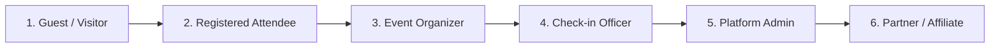

# 🧪 ONTON Manual UAT Tester: Complete Onboarding & Operations Guide

Welcome to the **ONTON** quality assurance team! As our Lead Manual QA Tester, you are the final checkpoint ensuring our Telegram Mini App (TMA), bot ecosystem, and Client Web Panel provide a rock-solid, frictionless experience before features reach production.

This guide contains everything you need to set up your environment, execute tests across the 6 platform personas, log actionable defects, and lead the release sign-off process.

---

## 1. System Environments & Identity Guardrail

> [!CAUTION]
> **STRICT ENVIRONMENT BOUNDARY:**
> - **Staging Bot:** `@notnonstagebot` — **All testing occurs here.**
> - **Production Bot:** `@theontonbot` — **NEVER** run manual tests, create fake events, or issue test payments against the production bot.
> - **Local Dev Bot:** `@ontonlocaldevbot` — Used by core developers for local engine testing.

| Environment | Mini App / Bot Entity | Web Endpoint (TMA & Browser) | Database / Ledger |
| :--- | :--- | :--- | :--- |
| **Staging** | `@notnonstagebot` | `https://app.dev.onton.live` | Isolated Staging Postgres & Redis |
| **Production** | `@theontonbot` | `https://app.onton.live` | Production Live Cluster |

---

## 2. Day-1 Device & Account Setup

To test multi-user interactions (such as an Organizer publishing an event and an Attendee registering for it, or an Organizer approving an Attendee's ticket), you must set up **two distinct Telegram accounts**.

### A. Telegram Test Accounts
1. **Account A — Organizer & Scanner:**
   - Dedicated Telegram account used to create events, configure ticket tiers, approve attendees, and scan QR codes as a Check-in Officer.
2. **Account B — Attendee / Guest:**
   - Dedicated Telegram account used to browse events, register, submit questionnaire answers, purchase tickets, and present ticket passes.

### B. Device Coverage
You will test across:
- **Primary Mobile Clients (Mandatory):**
  - **iOS:** Native Telegram App (iPhone)
  - **Android:** Native Telegram App (Android phone)
- **Secondary Desktop Clients:**
  - **Telegram Desktop (macOS / Windows)**
  - **Modern Browser (Chrome / Safari)**

### C. Web3 Wallet Setup (Tonkeeper Testnet)
Certain events require connecting a Web3 wallet or minting Soulbound (SBT) tickets on the TON blockchain:
1. Download **Tonkeeper** from the App Store / Google Play on your test device.
2. In Tonkeeper settings, tap the Tonkeeper logo 5 times to reveal **Developer Options**.
3. Toggle the network switch to **Testnet**.
4. Request free testnet TON from the official faucet: `@testgiver_ton_bot` in Telegram.
5. In the ONTON Mini App, use TonConnect to link your testnet wallet.

### D. Telegram Stars (Test Mode)
On Staging (`@notnonstagebot`), Stars checkout operates in Telegram's sandbox mode:
- Payment invoices use test credentials and do not deduct real Telegram Stars or real money.
- When prompted to pay with Stars on staging, proceed through the Telegram dialog.

---

## 3. GitHub Workflow & Defect Tracking

We use **GitHub Issues & Projects** as our single source of truth for all bug reporting and release tracking.

### A. The 4-Tier Defect Severity Matrix

| Severity | Label | Definition | Example in ONTON |
| :--- | :--- | :--- | :--- |
| **P0** | `severity:p0` | **Blocker.** Crash, app freeze, login failure, or financial/payment loss preventing core usage. Blocks release. | App whitescreens on launch; Stars payment succeeds but ticket never issues; check-in scanner crashes camera. |
| **P1** | `severity:p1` | **Critical.** Core functionality broken with no workaround. Blocks release. | Attendee cannot submit registration form; Organizer cannot create ticket tiers; QR code fails to decode. |
| **P2** | `severity:p2` | **Major.** Feature or edge case broken, but a reasonable workaround exists. | Filter dropdown fails on secondary tags; email confirmation arrives with broken layout; non-blocking pagination bug. |
| **P3** | `severity:p3` | **Minor / Polish.** Visual flaws, copy typos, styling misalignment, or layout overflow. | Button padding off by 4px on small screens; Dark Mode border color contrast issue; typo in event description placeholder. |

### B. Submitting a Bug Report
1. Navigate to the GitHub repository: `ExecutESG/onton` -> **Issues** -> **New Issue**.
2. Select **🐛 QA Bug Report**.
3. Fill out all required fields:
   - **Severity:** P0, P1, P2, or P3
   - **Persona / Role:** Guest, Attendee, Organizer, Check-in Officer, Admin, or Affiliate
   - **Device & Environment:** Exact device (e.g. iPhone 15 Pro, iOS 18.2, Telegram v11.3, Dark Mode)
   - **Steps to Reproduce:** Exact step-by-step reproduction
   - **Expected vs. Actual:** What should have happened vs. what broke
   - **Visual Evidence:** Attach a screen recording (`.mp4`, `.mov`, `.webm`) or screenshots. **Video is mandatory for animations, gesture conflicts, and payment flows.**

### C. Bug Lifecycle & Board Columns
Issues progress across the GitHub Project Board:
1. `Triage` — Newly reported by QA; reviewed by engineering lead.
2. `In Progress` — Assigned developer is building the fix.
3. `Ready for QA` — Fix merged and deployed to Staging (`@notnonstagebot`).
4. `Verified & Closed` — QA retests on staging:
   - **Pass:** QA comments "Verified on Staging [Device & Version]" and closes the issue.
   - **Fail:** QA reopens the issue with a comment and new video evidence showing the failure.

---

## 4. The 6 Platform Personas Under Test

Every major regression cycle verifies flows across our 6 core personas:

1. **Guest / Unauthenticated Visitor:**
   - Feed discovery, multi-tag filters, search, event details page, dark/light theme switching.
2. **Registered Attendee:**
   - Free RSVP, custom questionnaires, Telegram Stars checkout, TON testnet checkout, Ticket Pass view (QR code), Approval-gated status.
3. **Event Organizer:**
   - Event creation wizard, multi-tier pricing, question builder, dashboard management, CSV export, attendee approval/rejection.
4. **Check-in Officer:**
   - Opening scanner link, camera permissions, scanning Attendee QR, duplicate scan rejection ("Already checked in"), wrong event rejection.
5. **Platform Admin (CWP):**
   - Web panel login, event moderation, global analytics, queue health.
6. **Partner & Affiliate:**
   - Generating `join-[hash]` deep links, verifying click attribution and ticket commission points.

> [!TIP]
> For granular, step-by-step instructions on each flow, refer to `docs/QA_PERSONA_TEST_INSTRUCTIONS.md`.

---

## 5. Production Release Gate & QA Sign-Off

Before any version is tagged and deployed to production (`@theontonbot`), a formal **Release Candidate UAT Run** is initiated.

### Step-by-Step Release Gate Procedure:
1. A release issue is created in GitHub using the **🚀 Release Candidate UAT Run** template.
2. Staging is frozen with the candidate commit.
3. QA executes the complete **Master Persona Regression Matrix**.
4. **Go / No-Go Gate Criteria:**
   - [ ] **Zero P0 (Blocker) bugs open.**
   - [ ] **Zero P1 (Critical) bugs open.**
   - [ ] **100% of the regression test cases passed on iOS & Android.**
5. If all criteria are met, QA completes the **Final QA Sign-Off** block on the issue with:
   - Signature, Date, and `GO FOR PRODUCTION`.
6. Engineering lead initiates the production deployment.
