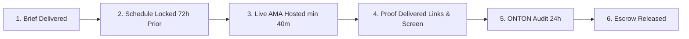

# 01. Supply-Side Partner Onboarding & SLAs

## 1. Overview & Positioning to Partners

Instead of viewing channel managers and marketing reps as spammers, ONTON treats vetted channels as **Syndicate Broadcast Partners**. 

### The Pitch to Channel Leads:
> *"We run the ONTON Event & Growth Ecosystem (300,000+ users, 400+ events). We have paying Web3 and TON clients who want continuous, multi-channel AMAs and promotional campaigns. We want to route guaranteed monthly deal flow to your channel—in exchange for an exclusive agency wholesale rate and strict SLA compliance."*

This is an immediate win for them:
- Zero time wasted cold-DMing founders who ignore them.
- Guaranteed client funding held in escrow.
- Professional briefing decks, organized question sheets, and verified prizes handled for them.

---

## 2. Direct Outreach Scripts (Ready to Send)

### Script A: For Erik Berlin / Crypto Panda ([@Desmond_CM](https://t.me/Desmond_CM))
*Context: Erik pitched a $650 package on September 11, 2026. Target wholesale: $380.*

```text
Hi Erik,

Thanks for sharing the Crypto Panda partnership package details. 

I'm Mahdi, leading ONTON (the Telegram Web3 event & growth ecosystem with 300k+ users). We regularly support emerging TON, Web3, and Mini-App projects preparing for launches, TGEs, and AMAs.

Instead of a one-off booking, we are looking to establish a long-term Agency Syndication Partnership with Crypto Panda:
1. We bundle your Binance Live & Telegram AMAs into our client cohort campaigns.
2. We provide fully prepared clients, standardized questions, visual assets, and escrowed budget.
3. We can bring you regular, recurring monthly project bookings.

In return, we require a fixed Agency Wholesale Rate for your package:
- Target Wholesale per Cohort: $380 - $400 USD (settled directly via USDT/TON).
- Requirements: Guaranteed live recording replay link + 48h pinned post verification.

If you agree to this volume-backed wholesale rate, we have our first cohort client launching this month ready to include Crypto Panda. Let me know if you are on board so we can add your channel to our official Syndicate Roster.
```

---

### Script B: For PAULO || ASTRONAUT / CryptoFi ([@Paulo_Astro](https://t.me/Paulo_Astro))
*Context: Claiming 226K on Binance Live and 128K on X. Target wholesale: $320.*

```text
Hello Paulo,

Reaching out from ONTON (Telegram Web3 Event & Growth platform). We are curating our Tier-1 Syndicate Broadcast Roster for upcoming Web3 cohort marketing campaigns.

We like CryptoFi's Binance Live + X-Space broadcast reach. We'd like to include CryptoFi as one of our recurring broadcast destinations for our clients' AMAs and announcements.

To feature CryptoFi across our upcoming Q3/Q4 campaign cohorts, we are standardizing partner terms:
- Scope: 1x Binance Live AMA (or X-Space broadcast) + pinned announcement post.
- Terms: Agency partner wholesale payout of $300 - $320 USDT per confirmed session.
- Client preparation: Complete briefing pack, speaker coordination, and community prize managed by ONTON.

Let me know if this works so we can lock in CryptoFi for our upcoming campaign lineup.
```

---

### Script C: For MOSXKO / Crypto Solution ([@Uhffvjjlog](https://t.me/Uhffvjjlog))
*Context: Quoted $300 retail previously. Target wholesale: $180.*

```text
Hi,

Following up on your Crypto Solution promo packages. We manage marketing campaigns for multiple Web3 teams at ONTON.

We can route multiple project AMAs to your group/channel on an ongoing basis. We want to lock a flat agency partner rate of $180 USDT per session (including Telegram Voice AMA + 48h pin post + recap). 

Please confirm if you accept this agency rate so we can route our upcoming project clients to your schedule.
```

---

### Script D: For Joseph Pray / TrafficPlaza ([@TrafficPlaza](https://t.me/TrafficPlaza))
*Context: Telegram Mini App real user acquisition. Target wholesale: $0.02 / user.*

```text
Hi Joseph,

Reaching out from ONTON. We work with dozens of Telegram Mini Apps and Web3 games looking for verified, active user acquisition.

We want to integrate TrafficPlaza's user acquisition as an optional add-on in our growth syndicate packages. 
- Volume: 25k to 100k user cohorts.
- Focus: Verified wallet-connected users and Telegram Premium users.
- Wholesale Rate: $0.020 - $0.025 per active user.

Let's discuss setting up a trial batch for our next cohort project.
```

---

## 3. Partner Service Level Agreement (SLA) & Quality Standard

Every partner on the ONTON Syndicate roster must comply with the following 6 SLA requirements before receiving payout:



### 1. Scheduling & Advance Notice
- Broadcast dates and times must be confirmed at least **72 hours in advance**.
- A formal announcement poster/text must be posted to the partner's channel at least **24 hours prior** to the live session.

### 2. Live Broadcast Quality
- **Minimum Session Duration:** 40 minutes (recommended 45–60 minutes).
- **Structure:** 15m Project Introduction & Dev Q&A, 15m Deep Dive / Product Demo, 15m Community Live Questions & Quiz.
- **Audio Quality:** Clear host microphone without disruptive background noise.

### 3. Pinned Post Duration
- Pinned announcement must remain pinned in the top slot for a minimum of **24 hours uninterrupted**, and remain in channel history permanently.

### 4. Verification Deliverables (Proof of Work)
To unlock payment, the partner must submit within 12 hours of session completion:
1. **Permanent Recording Link:** Valid replay URL on Binance Live, YouTube, or X-Space.
2. **Attendance Screenshot:** Screenshot displaying peak live listeners/viewers.
3. **Telegram Chat Link:** Direct message link to the pinned post and summary recap.

### 5. Botting & Fraud Zero-Tolerance Policy
- Channels caught using fake comment spam bots or artificially inflating fake AMA viewers will be permanently delisted from the Syndicate roster, and escrowed funds will be returned to the client.

### 6. Payment Terms
- **Settlement:** 100% USDT (TRC-20 / TON Jetton) or TON.
- **Timing:** 50% upon announcement publication (T-24h); remaining 50% disbursed within 24 hours of successful session completion and proof verification.
