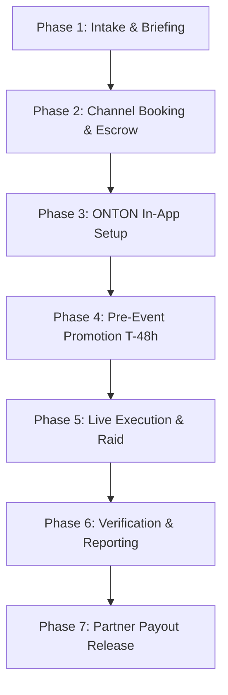

# 03. Campaign Operations Playbook & SOPs
*Standard Operating Procedures for the ONTON Syndicate Campaign Manager*

---

## 1. End-to-End Campaign Lifecycle



---

## 2. Phase 1: Client Intake & Briefing Questionnaire

Upon receiving payment, send the client the following intake form (via Telegram or Typeform):

```markdown
### 📋 ONTON Syndicate Campaign Briefing Form

**1. Project Core Information:**
- Project Name:
- One-Sentence Elevator Pitch:
- Official Website:
- Telegram Mini App (Bot Link, if applicable):
- Official Telegram Community / Channel:
- Official X (Twitter) Handle:
- Token Contract Address / Blockchain (or "Pre-Token"):

**2. Campaign Objectives & Key Messages:**
- Primary Goal: (e.g. Community Growth, TGE Awareness, User Acquisition, Wallet Connects)
- What 3 key topics MUST be highlighted during the AMAs?
  1.
  2.
  3.
- Are there any upcoming deadlines/dates to announce?

**3. Speaker Details:**
- Primary Speaker Name & Role:
- Telegram Handle:
- Preferred Language: (English default)
- Timezone Availability:

**4. Prize & Contest Setup:**
- Prize Pool Currency: (USDT, TON, or Project Tokens)
- 3 to 5 Quiz Questions with Multiple Choice answers (based on project doc):
  - Q1: [Question] | Correct: [A] | Options: A, B, C, D
  - Q2: [Question] | Correct: [B] | Options: A, B, C, D
  - Q3: [Question] | Correct: [C] | Options: A, B, C, D

**5. Visual Assets:**
- Attach High-Res Logo (PNG, transparent).
- Banner / Key Art (16:9 and 1:1 format).
```

---

## 3. Phase 2: Channel Booking & Escrow Allocation

1. **Assign Channels:** Match client profile to the optimal partner channels in `partner_network_directory.json`.
   - *Example for Momentum Syndicate ($2,490):*
     - Partner 1: Crypto Panda (Binance Live AMA 1 + TG AMA) -> Wholesale: $380
     - Partner 2: CryptoFi (Binance Live AMA 2 + X-Space) -> Wholesale: $320
     - Partner 3: Crypto Solution (TG AMA 2 + Pin Posts) -> Wholesale: $180
     - Partner 4: Spectre Shill Army (Raid engagement) -> Wholesale: $150
     - ONTON Quest Prize Pool: $250
     - Total Delivery Cost: $1,280
     - **ONTON Retained Margin: $1,210 (48.6%)**

2. **Lock Schedule (Google Calendar / Master Sheet):**
   - Confirm broadcast dates with channel leads at least 72 hours prior.
   - Dispatch the standardized briefing document to each host.

---

## 4. Phase 3: ONTON Mini App Setup

1. **Create Official Event Page:**
   - In `mini-app`, configure event title: `[Project Name] Global Syndicate AMA & $250 Giveaway`.
   - Set start and end timestamps.
   - Enable **1-Tap Free RSVP**.
2. **Configure Automated Tasks / Quests:**
   - Task 1: Follow [@ProjectX] on X.
   - Task 2: Join [@ProjectChat] on Telegram.
   - Task 3: Claim Free AMA Ticket on ONTON.
3. **Configure SBT Reward:**
   - Set up the commemorative Proof-of-Attendance SBT badge with client key art.

---

## 5. Phase 4: Pre-Event Promotion (T-48h to T-2h)

- **T-48 Hours:** Deliver promotional copy and creative banner to all Syndicate partners.
- **T-24 Hours:** Verify that all partner channels have posted the pinned announcement. Audit links:
  - Check Telegram pin status.
  - Check Binance Live event scheduling countdown link.
  - Check X-Space link.
- **T-2 Hours:** Send reminder alert across ONTON bot notification engine to registered ticket holders.

---

## 6. Phase 5: Live Execution Checklist

- **T-15 Minutes:** Audio check between Project Speaker and Channel Host.
- **T-0 (Broadcast Start):**
  - Verify live stream is running on Binance Live and recording is active.
  - Activate Spectre Shill Army raid squad in chat to stimulate thoughtful questions and organic hype.
- **Minute 30 (Mid-Session):**
  - Host announces the ONTON Quest link and Quiz contest pinned in the chat.
- **Minute 45 (Wrap-up):**
  - Host announces winners from the ONTON leaderboard.
  - Conclude session and confirm recording is saved.

---

## 7. Phase 6: Post-Campaign Reporting & Deliverable Audit

Within 24 hours of campaign completion, the Campaign Manager generates the **Client ROI & Delivery Report** using this template:

```markdown
# 🏆 ONTON Syndicate: Post-Campaign Deliverables Report
**Client:** [Project Name]
**Campaign Package:** Momentum Syndicate ($2,490)
**Execution Window:** [Start Date] - [End Date]

---

### 1. Executive Summary & Reach Highlights
- **Total Estimated Impressions:** [e.g. 145,000+]
- **Peak Live AMA Attendees (Combined):** [e.g. 2,850+]
- **ONTON Event Registrations & Tickets Claimed:** [e.g. 1,420]
- **New Telegram Group Members Attributed:** [e.g. 890]
- **Proof-of-Attendance SBTs Minted:** [e.g. 650]

---

### 2. Live Broadcast Recordings & Verification Links
| Platform / Channel | Host / Partner | Date & Time | Replay Link | Peak Live Listeners |
|---|---|---|---|---|
| **Binance Live** | Crypto Panda | [Date] | [Replay URL] | 1,820 Live |
| **Binance Live** | CryptoFi | [Date] | [Replay URL] | 1,030 Live |
| **X-Space** | CryptoFi Global | [Date] | [Replay URL] | 420 Live |
| **Telegram Voice** | Crypto Solution | [Date] | [Message Link] | 310 Live |

---

### 3. Pinned Announcements & Content Distribution
- **Crypto Panda Announcement Link:** [URL] (Pinned 48h)
- **CryptoFi Announcement Link:** [URL] (Pinned 48h)
- **Crypto Solution Recap Post:** [URL] (Permanent)
- **ONTON Event Banner Feature:** [Screenshot Attached]

---

### 4. Prize Pool Distribution Proof
- **Total Prize Distributed:** $250 USDT / TON
- **Winner 1:** `@telegram_user_1` — $50 (Tx: `hash...`)
- **Winner 2:** `@telegram_user_2` — $30 (Tx: `hash...`)
- **Winner 3-10:** 8x $21.25 (Tx hashes logged in ONTON ledger)

---

### 5. Recommended Next Steps
- Follow up in project community with AMA transcript highlights.
- Retarget the 1,420 registered ONTON ticket holders with your next product milestone.
```
