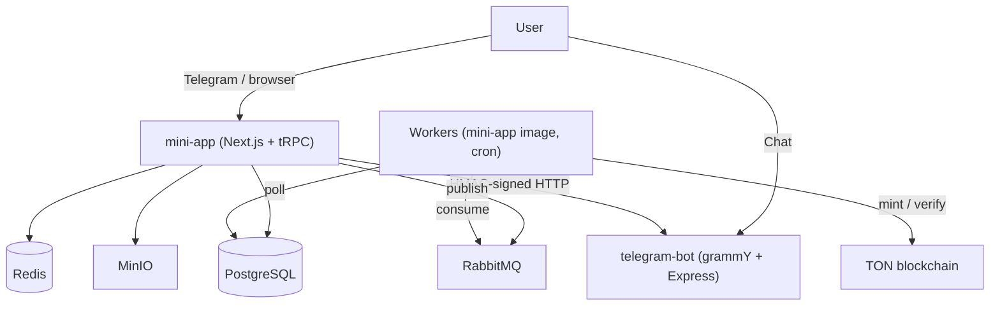

# ONTON Platform Developer Guide

> Last verified against dev: 2026-10-03

How to set up the repo locally, where code lives, and what to run before a PR.

## 1. Quick start

### Prerequisites
- Node.js 22 (same as `mini-app/Dockerfile` and CI)
- `yarn` 1.x
- Docker

### Setup
1. Clone:
   ```bash
   git clone https://github.com/ExecutESG/onton.git ontonbot
   cd ontonbot
   ```
2. Install per app (there is no root `package.json`):
   ```bash
   cd mini-app && yarn install
   ```
   Same for `telegram-bot/`, `website/`, `client-web-panel/` if you work on them.
3. Env: copy `.env.example` to `.env` **at the repo root**. App scripts load `../.env`. Ask the lead for secrets. Use the local bot `@ontonlocaldevbot`, never `@theontonbot`.
4. Start infra (Postgres, Redis, MinIO, RabbitMQ, Caddy):
   ```bash
   # from the repo root
   docker compose --profile minimal up -d
   ```
   Every service has a profile; `docker compose up` without `--profile` starts nothing. Use `--profile full` for the whole stack.
5. Database schema: do **not** run `yarn db:migrate` (stale journal) and do not treat `yarn db:up` as a migration (it is `drizzle-kit up`, a snapshot upgrade). Apply SQL files with `psql -v ON_ERROR_STOP=1` or restore a dump. See [migration_and_syncing.md](./migration_and_syncing.md).
6. Run the Mini App:
   ```bash
   cd mini-app
   yarn dev
   ```
   It runs `init:minio:local`, then `next dev` on `MINI_APP_PORT` from `.env`.

---

## 2. Architecture

Next.js (App Router) + tRPC + Drizzle in `mini-app`; grammY bot in `telegram-bot`.



- Workers are cron schedulers in `mini-app/src/workers/` (payment, reward, ordinary, nft-api, poa, socket). Most work is DB polling; RabbitMQ carries notifications, `tg_messages` and `order_paid`.
- The bot does not use RabbitMQ.

---

## 3. Where code lives (`mini-app/`)

### Frontend (`src/app/`)
- Pages: `src/app/(navigation)/...`, `src/app/events/`, `src/app/tickets/`.
- Components: `src/components/`.
- Client state: `src/zustand/`.

### API (`src/server/`)
- tRPC root: `src/server/index.ts`. Procedure types: `src/server/trpc.ts`.
- Routers in `src/server/routers/`, e.g. `events.ts`, `orders.ts`, `users.ts`, `tickets.ts`, `registrant.ts`, `sbt.ts`.
- REST routes: `src/app/api/` (e.g. `/api/v1/order`, `/api/v1/auth/*`).
- Validate input with Zod (`src/zodSchema/`).

### Data (`src/db/`)
- Schema: `src/db/schema.ts` (used by `drizzle.config.ts`) plus table files in `src/db/schema/`.
- Query helpers: `src/db/modules/`.
- SQL migrations: `mini-app/drizzle/`.

### Background jobs
- `src/workers/` (schedulers) and `src/cronJobs/` (tasks).

---

## 4. PR checklist

Run in `mini-app/`:
1. Tests: `yarn test:api` (Vitest). `yarn test` is only an ad-hoc script.
2. Lint: `yarn lint` (CI runs `yarn lint:quiet`).
3. Format: `yarn format`.
4. Types: `yarn type:check` (not run by CI; run it yourself).

For `telegram-bot/`: `yarn run build` (`tsc`). It has no lint script.
