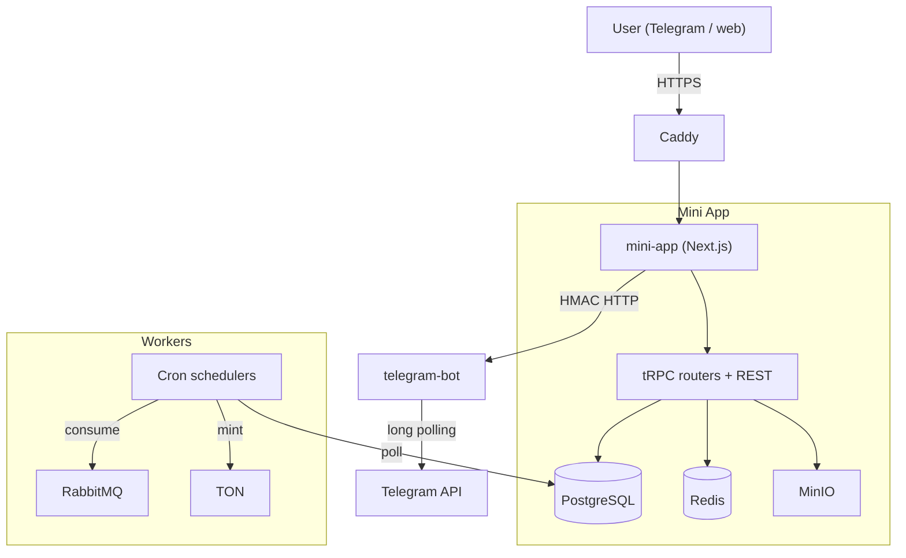

# System Audit & Architecture Mapping

> Last verified against dev: 2026-10-03

**Original audit:** 2026-02-12. Updated for ONTON 2.0 (`dev`).
**Scope:** repo root (`ontonbot/`).

## 1. Summary
ONTON is a Next.js Mini App (`mini-app`) plus a grammY Telegram bot (`telegram-bot`). It uses TON for payments and credentials (NFTs, SBTs). The Mini App exposes a tRPC API and REST routes, backed by PostgreSQL (Drizzle), Redis, MinIO and RabbitMQ. Background work runs as cron schedulers that reuse the `mini-app` image.

---

## 2. Modules

### A. Mini App (`mini-app/`)
- Entry points:
  - Frontend: `src/app` (App Router only).
  - tRPC root: `src/server/index.ts`; procedure types in `src/server/trpc.ts`; context in `src/server/context.ts`.
  - REST: `src/app/api/` (e.g. `/api/v1/order`, `/api/v1/auth/*`).
  - Workers: `src/workers/` (schedulers) and `src/cronJobs/` (tasks).
- Routers (`src/server/routers/`):
  - Events: `events.ts`, `organizers.ts`, `hubs.ts`.
  - Commerce and access: `orders.ts`, `tickets.ts`, `eventTicket.ts`, `registrant.ts`, `couponRouter.ts`.
  - Credentials: `sbt.ts`, `sbtRewardCollectionRouter.ts`, `POA.ts`, `userEventFields.ts`.
  - Identity: `users.ts`, `userRolesRouter.ts`, `tonProofRouter.ts`, `usersGoogleRouter.ts` and other `users*Router.ts` social routers.
  - Engagement: `campaignRouter.ts`, `raffleRouter.ts`, `questRouter.ts`, `tournaments.ts`, `tasksRouter.ts`, `pointsRouter.ts`.
  - Affiliates: `affiliateRouter.ts`.

### B. Telegram bot (`telegram-bot/`)
- Entry: `src/main.ts`. grammY with long polling, plus an Express API.
- Composers in `src/composers/` (e.g. `moderationComposer.ts`, `broadcast.ts`, `pollComposer.ts`, `affiliateComposer.ts`, `helpComposer.ts`). Handlers in `src/handlers/` (e.g. Telegram Stars payments).
- Express routes are protected by HMAC (`src/middleware/hmacAuth.ts`), except `/health`.
- Sessions are grammY in-memory (lost on restart). Redis is used for rate limiting. No RabbitMQ.
- Moderation (formerly a separate mini-app bot) now lives here.

### C. DevOps (`devops/`, root compose files)
- `docker-compose.yml`: local and production (`--profile full`).
- `docker-compose-server-dev.yml` / `docker-compose-server.yml`: Swarm stacks deployed by CI to the staging host.
- Caddy (`Caddyfile`, `devops/caddy/`) for TLS and routing.

---

## 3. Tech stack (from `mini-app/package.json`)
- Next.js 14.2, TypeScript, TailwindCSS 3.
- Zustand, `@tanstack/react-query` v4, tRPC v10.
- Drizzle ORM 0.33 on PostgreSQL.
- `amqplib` (RabbitMQ), `redis` v4, MinIO.
- `@tonconnect/ui-react`, `@ton/core`, `@ton/ton`.
- Runtime: Node.js 22.

### Auth (summary)
- `src/server/context.ts` resolves the user from: Bearer platform JWT → raw Telegram initData → cookies (`onton_token`, `onton_session`, `token`) → API key.
- Procedure types: `publicProcedure`, `initDataProtectedProcedure` (any authenticated source; role `ban` rejected), `adminOrganizerProtectedProcedure`, `eventManagementProtectedProcedure` (event owner, event admin, or check-in officer for allowed paths).

---

## 4. Technical debt

### A. Large routers
- `events.ts` (~46 KB) and `campaignRouter.ts` (~24 KB) mix validation, DB access and business logic.
- Recommendation: move business logic into `src/services/` and keep routers thin.

### B. Cron polling
- Payment verification (TonCenter, every 7 s) and minting (every 9 s) are DB-polling crons in the payment worker.
- An `order_paid` RabbitMQ queue and consumer exist, but the consumer is likely failing; the cron is the real fulfillment path (F-35).
- Recommendation: fix the consumer before relying on events; keep the cron as fallback.

### C. Auth checks in one file
- Role checks live in `src/server/trpc.ts` middlewares and `accessRolesPathConfig.ts`.
- `adminOrganizerCoOrganizerProtectedProcedure` allows an admin of *any* event for listed paths, not a specific one.
- Recommendation: centralize RBAC in a policy module scoped per event.

### D. Configuration
- Secret env vars have insecure fallbacks if unset. Set them in every environment.
- Worker naming differs between compose files (`sbt-worker` runs NFT-API locally but payment on servers).

---

## 5. Data flow (simplified)

## Known issues (tracked in QA)
- F-33: Stars pre-checkout approves without validating order, price or capacity.
- F-34: paid tier `sold_count` not incremented; no tier-creation API.
- F-35: `order_paid` consumer likely failing; cSBT proofs rebuilt per request and not anchored on chain.
- F-36: free SBT at check-in/claim vs paid on-chain upgrade.
- F-27: email OTP codes are logged, not emailed.
- F-30: PoA has a universal override; slated for removal.
