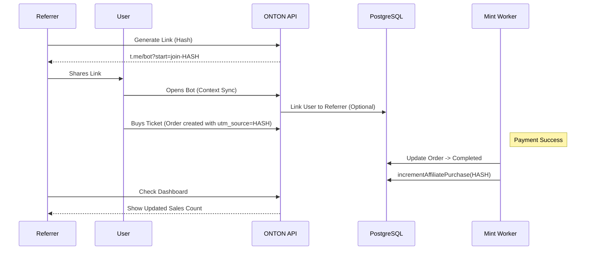

# Affiliate & Referral System

The ONTON Affiliate System allows users to earn rewards and track performance through unique referral links. It supports both general platform growth and specific campaigns like the Fairlaunch.

## 1. Referral Types

### A. User Referral (Platform Growth)
*   **Mechanism:** Telegram Start Parameter (`t.me/ontonbot?start=join-HASH`).
*   **Tracking:**
    *   When a new user launches the bot with a `join-HASH` param, the system looks up the affiliate link.
    *   The new user is linked to the referrer in the `users` table (or similar tracking table).
    *   **Code:** `src/server/context.ts` parses `join-HASH` during the `createContext` user sync.

### B. Event Promotion (Ticket Sales)
*   **Mechanism:** `utm_source` tracking on Orders.
*   **Tracking:**
    *   When a user buys a ticket, the `utm_source` (Affiliate Hash) is saved in the `orders` table.
    *   Upon successful NFT minting, `MintNFTForPaidOrders.ts` calls `affiliateLinksDB.incrementAffiliatePurchase`.
    *   This increments the success count for that specific affiliate link.

### C. Fairlaunch Partnership (Campaigns)
*   **Context:** Special campaign for token sales (e.g., $ONION).
*   **Worker:** `affiliateRouter.ts` -> `getFairlaunchAffiliate`.
*   **Tracking:**
    *   Tracks rich data: `usdtAmount`, `onionAmount`, `walletAddress`.
    *   Data is stored in `partnershipAffiliatePurchases`.
    *   **UI:** Users can see a detailed dashboard with their total sales and global campaign progress.

## 2. Data Structure

### Core Table: `affiliateLinks`
*   `id`: Unique ID.
*   `user_id`: The referrer.
*   `linkHash`: The unique code (e.g., `8xyz123`).
*   `type`: Type of link (e.g., `fairlaunch-partnership`, `standard`).
*   `purchase_count`: Simple counter for ticket sales.

## 3. Flow Diagram (Ticket Sale Referral)

