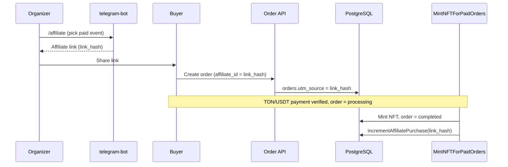

# Affiliate & Referral System

> Last verified against dev: 2026-10-03

Affiliate links track referrals (user joins) and ticket sales. Campaign purchases (Fairlaunch) are tracked separately.

## 1. Data

### `affiliate_links` (`mini-app/src/db/schema/affiliateLinks.ts`)

| Column | Meaning |
|---|---|
| `Item_id` | Target item (e.g. event) |
| `item_type` | Enum: `EVENT`, `HOME`, `onion1-campaign`, `onion1-special-affiliations`, `onton-join-task`, `fairlaunch-partnership` |
| `creator_user_id` | User who owns the link |
| `affiliator_user_id` | Affiliator user |
| `title`, `group_title` | Labels |
| `link_hash` | Unique code |
| `total_clicks` | Click counter |
| `total_purchase` | Purchase / join counter |
| `active` | Enabled flag |

Other tables: `users.affiliator_user_id` (referrer of a user), affiliate click records (`mini-app/src/db/modules/affiliateClicks.db.ts`, batched by the `consumeClickBatch` cron in the ordinary worker), and `partnershipAffiliatePurchases` (Fairlaunch).

## 2. Referral types

### A. Join referral (`onton-join-task`)
- Link format (built in `mini-app/src/server/routers/tasksRouter.ts`): `https://t.me/<NEXT_PUBLIC_BOT_USERNAME>/event?startapp=join-<link_hash>`.
- When the Mini App opens, `mini-app/src/server/context.ts` reads `start_param`, and if it starts with `join-` passes the hash to `usersDB.insertUser`.
- For a **new** user with an `onton-join-task` link, `insertUser` (`mini-app/src/db/modules/users.db.ts`) sets `users.affiliator_user_id` to the link creator and increments the link's `total_purchase`.
- The bot also parses `join_` / `join-` deep links (`telegram-bot/src/utils/deepLink.ts`).

### B. Event ticket sales
- Organizers/admins create links with the bot command `/affiliate` (`telegram-bot/src/composers/affiliateComposer.ts`) for upcoming paid events.
- `POST /api/v1/order` stores the request's `affiliate_id` in `orders.utm_source`.
- After a successful TON/USDT mint, `MintNFTForPaidOrders.ts` calls `affiliateLinksDB.incrementAffiliatePurchase(utm_source)` inside the completion transaction.
- **Only the TON/jetton mint path counts.** Telegram Stars payments and free orders never increment `total_purchase`.

### C. Fairlaunch partnership
- `affiliate.getFairlaunchAffiliate` (`mini-app/src/server/routers/affiliateRouter.ts`, authenticated).
- Purchases stored in `partnershipAffiliatePurchases`: wallet address, Telegram user, `usdt_amount`, `onion_amount`, time of purchase, user entry type.

## 3. Ticket-sale flow

```mermaid
sequenceDiagram
    participant Org as Organizer
    participant Bot as telegram-bot
    participant Buyer as Buyer
    participant API as Order API
    participant DB as PostgreSQL
    participant Cron as MintNFTForPaidOrders

    Org->>Bot: /affiliate (pick paid event)
    Bot-->>Org: Affiliate link (link_hash)
    Org->>Buyer: Share link
    Buyer->>API: Create order (affiliate_id = link_hash)
    API->>DB: orders.utm_source = link_hash
    Note over Buyer,Cron: TON/USDT payment verified, order = processing
    Cron->>DB: Mint NFT, order = completed
    Cron->>DB: incrementAffiliatePurchase(link_hash)
```

## Known issues (tracked in QA)

- Affiliate sales are undercounted: Stars-paid and free tickets are not counted.
