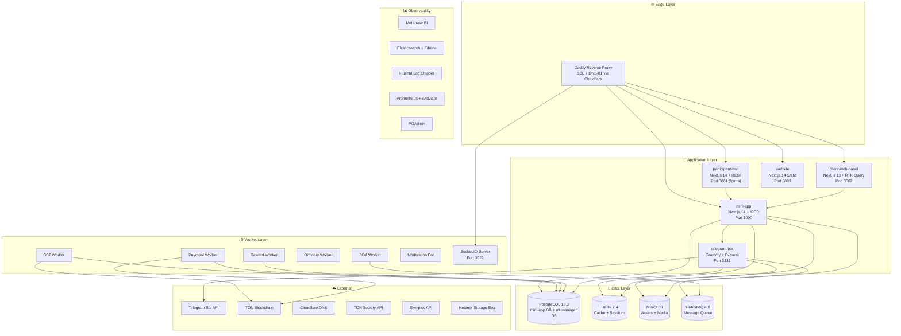
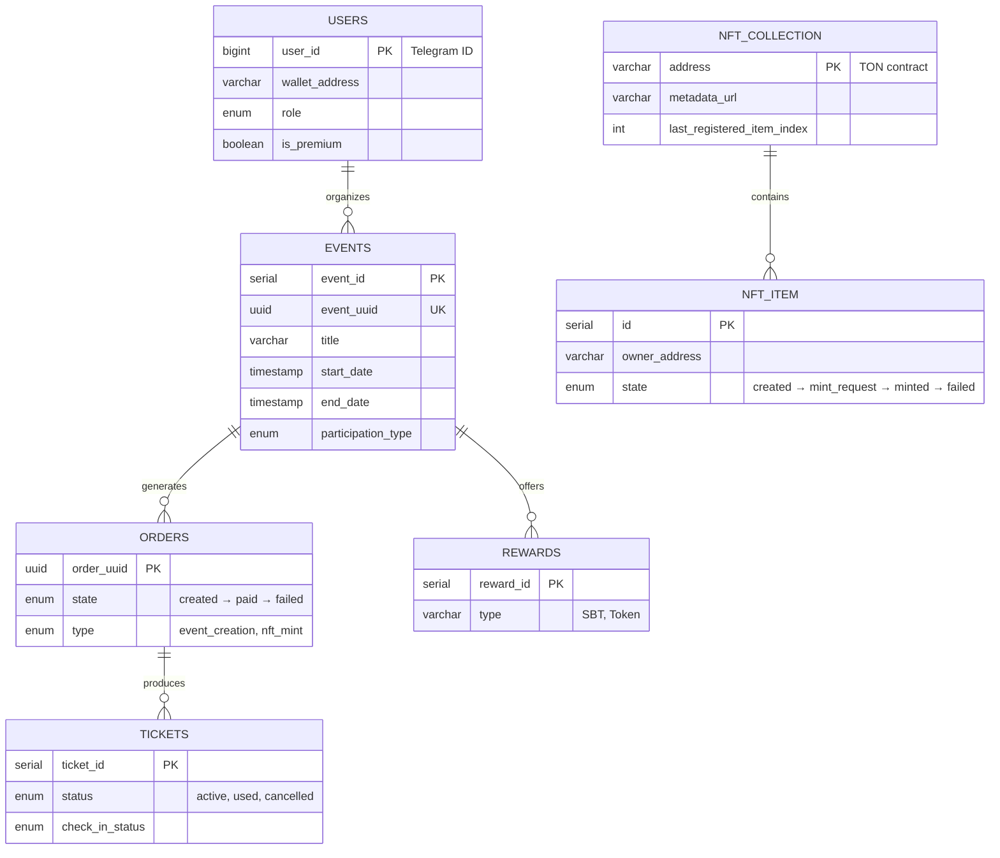
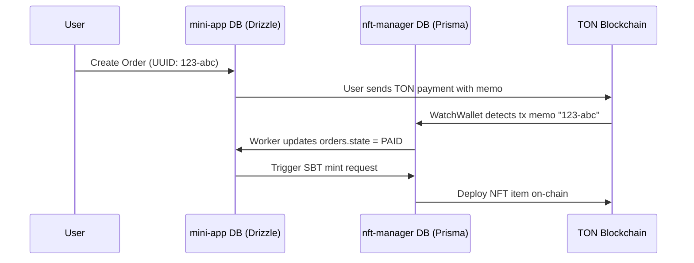
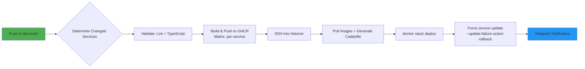
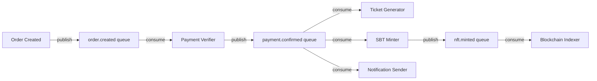

# ONTON Platform — Architecture Blueprint & Critical Evaluation

> **Date:** 2026-09-09 | **Scope:** Full monorepo audit of `ontonbot/`
> **Mission:** "The Luma of Telegram & Web3 Event OS"

---

## 1. Executive Summary

ONTON is a **Telegram-native event management platform** with Web3 (TON blockchain) integration, serving 300,000+ users across 400+ events. The system is a **polyglot monorepo** containing 6 deployable services, 7 background workers, and 15+ infrastructure containers — all orchestrated via Docker Compose locally and Docker Swarm in production.

> [!IMPORTANT]
> The platform has grown organically from a single Mini App into a complex distributed system. While it delivers significant business value, the architecture shows signs of **accidental complexity**, **inconsistent technology choices**, and **monolith-in-disguise patterns** that will increasingly constrain velocity as the product scales.

---

## 2. System Architecture Map



---

## 3. Technology Stack Inventory

### 3.1 Languages & Runtimes

| Layer | Technology | Version |
|---|---|---|
| Primary Language | TypeScript | 5.x |
| Runtime | Node.js | 22 (Alpine) |
| Secondary Language | Python (DevOps scripts) | 3.x |
| Shell Scripts | Bash/Zsh | — |

### 3.2 Frameworks & Libraries

| Module | Framework | Version | Routing |
|---|---|---|---|
| `mini-app` | Next.js | 14.2.28 | App Router |
| `participant-tma` | Next.js | 14.2.7 | App Router |
| `client-web-panel` | Next.js | 13.3.0 | **Pages Router** |
| `website` | Next.js | 14.2.35 | App Router |
| `telegram-bot` | Grammy + Express | 1.30 + 4.18 | — |
| `nft-manager` | NestJS | 10.x | Modules |

### 3.3 API Paradigms (The Fragmentation)

| Module | API Style | Client |
|---|---|---|
| `mini-app` → Frontend | **tRPC** | `@trpc/react-query` |
| `mini-app` → External | **REST** (Next.js API routes) | `fetch` / `axios` |
| `participant-tma` → Backend | **REST** | `fetch` + React Query |
| `client-web-panel` → Backend | **REST** (RTK Query) | `@reduxjs/toolkit` |
| `telegram-bot` internal API | **REST** (Express) | `axios` |
| `nft-manager` | **REST** (NestJS Controllers) | Internal HTTP |

### 3.4 Data & State Management

| Concern | Technology | Notes |
|---|---|---|
| Primary Database | PostgreSQL 16.3 | Single instance, 2 logical DBs |
| ORM (mini-app) | **Drizzle ORM** | 120+ migrations |
| ORM (nft-manager) | **Prisma** | Separate schema |
| ORM (telegram-bot) | **Raw SQL** (`pg.Pool`) | Direct parameterized queries |
| Cache | Redis 7.4 | Sessions, rate limits, cache |
| Message Queue | RabbitMQ 4.0 | POA, async tasks |
| Object Storage | MinIO | S3-compatible, images/videos |
| Client State (mini-app) | Zustand + React Query | — |
| Client State (participant-tma) | Zustand + Jotai + React Query | 3 state managers |
| Client State (client-web) | Redux Toolkit + RTK Query | — |

### 3.5 UI & Design Systems (The Divergence)

| Module | CSS Framework | Component Library | Design Language |
|---|---|---|---|
| `mini-app` | Tailwind CSS | Radix UI + MUI | Mixed |
| `participant-tma` | Tailwind CSS | Konsta UI + shadcn/ui (`@repo/ui`) | iOS-native |
| `client-web-panel` | CSS Modules + Global CSS | **Material UI v5** | Admash template |
| `website` | Tailwind CSS | Custom + Lottie | Apple-inspired |

### 3.6 Infrastructure Stack

| Component | Technology | Deployment |
|---|---|---|
| Container Runtime | Docker 27+ | Docker Swarm (prod) |
| Reverse Proxy | Caddy (xcaddy + cloudflare) | Auto ACME SSL |
| CI/CD | GitHub Actions | GHCR + SSH deploy |
| Container Registry | GitHub Container Registry | `ghcr.io/pomegroup/ontonbot` |
| Hosting | Hetzner Cloud | `65.109.212.86` (prod) |
| Backups | Hetzner Storage Box | Daily pg_dump + tarball |
| Log Aggregation | Elasticsearch 9 + Kibana 9 | Fluentd/Filebeat |
| Metrics | Prometheus + cAdvisor | Container monitoring |
| BI Dashboard | Metabase v0.50 | Connected to PostgreSQL |
| Antivirus | ClamAV | File upload scanning |
| Static Analysis | JetBrains Qodana | YAML config present |

---

## 4. Data Flow & Domain Architecture

### 4.1 Core Domain Model



### 4.2 Payment Rails

The platform supports **3 parallel payment rails**:

1. **Telegram Stars** → `window.Telegram.WebApp.openInvoice()` → `pre_checkout_query` → `successful_payment` callback in bot
2. **TON Native** → TonConnect wallet → raw transaction with `onton_order={id}` memo → Payment Worker polls blockchain
3. **USDT Jetton** → TonConnect wallet → Jetton wallet transfer via `@ton-community/assets-sdk` → Payment Worker polls

### 4.3 Cross-Database Correlation (Split DB Problem)



> [!WARNING]
> There are **no foreign keys** between the two databases. Correlation relies on UUID string matching across database boundaries. This is a significant consistency risk.

---

## 5. CI/CD Pipeline



**Key characteristics:**
- **Incremental builds:** Only changed services are rebuilt (git diff path detection)
- **Matrix strategy:** Each service builds in parallel
- **Zero-downtime:** Docker Swarm rolling updates with automatic rollback
- **Notification:** Telegram alerts for every build/deploy stage
- **Smoke tests:** Playwright e2e tests run every 6 hours against prod

---

## 6. Critical Evaluation & Identified Problems

### 🔴 Critical Issues

#### C1: God Monolith Disguised as Microservices
The `mini-app` module is a **monolith masquerading as microservices**. It serves as:
- The Next.js frontend (SSR + client)
- The tRPC API backend
- 6 separate background workers (all built from the same Docker image)
- The Socket.IO notification server
- The moderation bot

**Every worker deploys the entire Next.js application** just to run a single cron script. This means:
- ~500MB+ Docker image per worker instance
- 7 containers running identical 20GB+ `node_modules`
- A change to any frontend component triggers rebuilds of all 7 worker containers

#### C2: Triple ORM Fragmentation
Three different database access patterns hit the **same PostgreSQL instance**:
1. `mini-app` → Drizzle ORM (migrations, type-safe queries)
2. `nft-manager` → Prisma (separate schema, separate migration history)
3. `telegram-bot` → Raw SQL via `pg.Pool` (no migrations, no type safety)

This creates **schema drift risk**, duplicated query logic, and makes it impossible to enforce referential integrity across the full domain.

#### C3: Cross-Database Consistency Gap
The split-database pattern (mini-app DB + nft-manager DB) has **no transactional guarantees**. Order → Payment → NFT Mint flows rely on string-matching UUIDs across database boundaries with cron-based polling. A crash between steps can leave the system in an inconsistent state.

#### C4: Secrets in Repository
SSH private keys (`deploy_key`, `id_rsa_onton_dev`) are committed directly to the repository root. The `.env` file (4.8KB) is also present. This is a severe security vulnerability.

---

### 🟡 Significant Issues

#### S1: Framework & Version Inconsistency
- `client-web-panel` runs Next.js **13.3** (Pages Router) while everything else uses Next.js **14** (App Router)
- Three different state management approaches: Zustand, Redux Toolkit, Jotai
- Two UI component libraries: MUI v5 (client-web) vs Tailwind + Radix/shadcn (everywhere else)
- `client-web-panel` is JavaScript, not TypeScript

#### S2: Monolithic tRPC Routers
Files like `events.ts` (42KB) and `campaignRouter.ts` (24KB) in `src/server/routers` contain mixed validation, business logic, database queries, and side effects. No service layer separation.

#### S3: Cron-Based Polling Over Event-Driven Architecture
Despite having RabbitMQ available, most async workflows (payments, rewards, SBT minting) use **cron-based database polling** every N seconds. This adds latency (up to N seconds delay), unnecessary database load, and complexity.

#### S4: No Automated Test Pipeline
- The CI validates only lint and TypeScript compilation
- No unit tests run in the pipeline
- Only Playwright smoke tests exist (run on a 6-hour cron, not in CI)
- Jest is configured but effectively unused

#### S5: Single Point of Failure Infrastructure
- **Single PostgreSQL instance** serving all services (no replica, no read replicas)
- **Single Redis instance** (cache + sessions + rate limiting + pub/sub all on one node)
- **Single Hetzner server** for production (no HA, no auto-scaling)
- **Docker Swarm** (single-node) provides no real orchestration benefit over Compose

#### S6: Webpack Browser Polyfills
`mini-app/next.config.js` injects extensive Node.js polyfills (crypto, stream, os, http, buffer) into the browser bundle for TON SDK compatibility. This significantly bloats the client-side JavaScript bundle.

---

### 🟢 Moderate Issues

#### M1: Mixed Package Managers
- `mini-app`, `telegram-bot`, `client-web-panel`, `website`: **yarn**
- `newton/*`: **pnpm**
- No root-level lockfile or workspace coordination

#### M2: Duplicated Telegram Authentication Logic
Telegram `initData` validation is implemented independently in:
- `mini-app/src/server/trpc.ts`
- `participant-tma/hooks/useAuthenticate.ts`
- `telegram-bot/src/main.ts`

#### M3: No API Gateway or Rate Limiting at Edge
All rate limiting is application-level (Redis-based per-route). No edge-level WAF, DDoS protection, or API gateway exists between Caddy and the application layer.

#### M4: Hardcoded IP Addresses in Network Config
The Docker network uses static IP assignments (`172.10.0.x`) which is fragile and creates merge conflicts when services are added.

---

## 7. Radical Improvement Proposals

### 🚀 Proposal 1: Extract a Dedicated Backend Service

**Problem:** The `mini-app` is simultaneously the frontend, API, and worker runtime.

**Solution:** Extract the backend into a standalone **Hono/Fastify + tRPC** service:

```
Current:                          Proposed:
┌─────────────────────┐          ┌──────────────┐  ┌──────────────┐
│     mini-app        │          │  mini-app     │  │  api-server  │
│  ┌───────────────┐  │          │  (Next.js     │  │  (Hono +     │
│  │ Next.js SSR   │  │    →     │   frontend    │  │   tRPC)      │
│  │ tRPC API      │  │          │   only)       │  │              │
│  │ Workers ×6    │  │          └──────────────┘  └──────────────┘
│  │ Socket.IO     │  │                                    │
│  │ Moderation    │  │          ┌──────────────────────────┤
│  └───────────────┘  │          │              │           │
└─────────────────────┘     ┌────┴───┐  ┌──────┴──┐  ┌────┴────┐
                            │Workers │  │Socket.IO│  │Mod Bot  │
                            │(tiny)  │  │(standalone)│(standalone)
                            └────────┘  └─────────┘  └─────────┘
```

**Impact:** Worker containers drop from ~500MB to ~50MB. Frontend deploys independently. API scales independently.

---

### 🚀 Proposal 2: Unify the Data Access Layer

**Problem:** Three ORMs, two databases, no shared types.

**Solution:**
1. **Consolidate to a single ORM** (Drizzle, since it's already the primary)
2. **Merge the nft-manager schema** into the main database with proper foreign keys
3. **Create a shared `@repo/db` package** in the Newton monorepo exporting typed queries
4. **Migrate telegram-bot** from raw SQL to the shared package

```
packages/
  db/
    src/
      schema.ts     ← Single source of truth (Drizzle)
      queries/
        events.ts
        orders.ts
        nft.ts
        users.ts
      migrations/
      index.ts      ← Typed, reusable query functions
```

---

### 🚀 Proposal 3: Event-Driven Architecture with RabbitMQ

**Problem:** Cron-based polling adds latency and DB load.

**Solution:** Replace cron polling with proper event-driven message flows:



**Impact:** Sub-second payment confirmation (vs 10-60s polling). Eliminates 4 cron workers. Clear domain event contracts.

---

### 🚀 Proposal 4: Monorepo Consolidation with Turborepo

**Problem:** Disconnected modules with mixed package managers.

**Solution:** Restructure into a unified Turborepo monorepo:

```
ontonbot/
  turbo.json
  pnpm-workspace.yaml
  packages/
    db/              ← Shared database (Drizzle schema + queries)
    ui/              ← Shared UI components (shadcn/ui)
    tma/             ← Shared Telegram Mini App utilities
    config-ts/       ← Shared TypeScript configs
    config-eslint/   ← Shared ESLint configs
    auth/            ← Shared auth (Telegram initData + TON Proof)
  apps/
    mini-app/        ← Next.js 15 (frontend only)
    participant-tma/ ← Next.js 15 (participant frontend)
    client-panel/    ← Next.js 15 (rewritten, App Router, TypeScript)
    website/         ← Next.js 15 (marketing)
    api/             ← Hono + tRPC (backend API)
    bot/             ← Grammy bot (lean service)
    nft-service/     ← NestJS NFT manager
  workers/
    payment/         ← Lightweight queue consumer
    reward/          ← Lightweight queue consumer
    sbt/             ← Lightweight queue consumer
    notification/    ← Socket.IO server
  infra/
    docker/
    caddy/
    scripts/
```

---

### 🚀 Proposal 5: Production Infrastructure Hardening

**Problem:** Single-server, single-database, no HA.

**Solution — Phase 1 (Immediate):**
- [ ] Remove SSH keys and `.env` from git history (`git filter-repo`)
- [ ] Move secrets to **HashiCorp Vault** or GitHub Environments with approval gates
- [ ] Add a PostgreSQL read replica for analytics (Metabase) and bot queries
- [ ] Enable Redis Sentinel or switch to Redis Cluster mode

**Solution — Phase 2 (Medium-term):**
- [ ] Migrate from Docker Swarm to **Kubernetes** (k3s on Hetzner) or **Hetzner Cloud managed Kubernetes**
- [ ] Add **Cloudflare WAF** in front of Caddy
- [ ] Implement proper health checks and readiness probes
- [ ] Add horizontal auto-scaling for the API and worker tiers
- [ ] Implement **blue-green deployments** with automated rollback

**Solution — Phase 3 (Long-term):**
- [ ] Consider managed PostgreSQL (Hetzner Cloud DB or Supabase)
- [ ] Consider managed Redis (Upstash or Redis Cloud)
- [ ] Implement proper **OpenTelemetry** distributed tracing
- [ ] Add structured logging with correlation IDs across all services

---

### 🚀 Proposal 6: Rewrite `client-web-panel`

**Problem:** The oldest module — Next.js 13, JavaScript, Pages Router, MUI v5, based on an "Admash" admin template. Completely inconsistent with the rest of the stack.

**Solution:** Ground-up rewrite:
- Next.js 15 App Router + TypeScript
- Tailwind CSS + shadcn/ui (matching `@repo/ui`)
- tRPC client (matching `mini-app` API)
- Server Components for data fetching
- Remove Redux Toolkit in favor of React Query + Zustand

---

## 8. Priority Matrix

| Priority | Item | Effort | Impact | Risk if Ignored |
|---|---|---|---|---|
| 🔴 P0 | Remove secrets from repo | 1 day | Critical | Security breach |
| 🔴 P0 | Add DB read replica | 2 days | High | Data loss on failure |
| 🟡 P1 | Extract API from mini-app | 2-3 weeks | Very High | Deploy velocity ↓ |
| 🟡 P1 | Unify data access layer | 2 weeks | High | Schema drift |
| 🟡 P1 | Event-driven workers | 2 weeks | High | Latency + DB load |
| 🟢 P2 | Monorepo consolidation | 1 week | Medium | DX friction |
| 🟢 P2 | Rewrite client-web-panel | 3 weeks | Medium | Tech debt compounds |
| 🟢 P2 | Add unit tests to CI | 1 week | Medium | Regression risk |
| 🔵 P3 | Kubernetes migration | 4-6 weeks | High | Scaling ceiling |
| 🔵 P3 | OpenTelemetry tracing | 1 week | Medium | Debugging difficulty |

---

## 9. Conclusion

ONTON has achieved remarkable product-market fit — 300K+ users, multi-rail payments, TON blockchain integration, and a comprehensive event lifecycle — built by what appears to be a small, fast-moving team. The current architecture **works** and delivers value.

However, the system is at an inflection point. The organic growth pattern has created a **fragile monolith wrapped in Docker containers**, with inconsistent technology choices, no automated test safety net, and single-point-of-failure infrastructure.

The proposed improvements follow a **progressive decoupling** strategy:
1. **Immediate:** Security fixes + infrastructure resilience (P0)
2. **Near-term:** Backend extraction + event-driven workers (P1)
3. **Medium-term:** Monorepo unification + client-web rewrite (P2)
4. **Long-term:** Kubernetes + observability (P3)

Each phase delivers standalone value without requiring the next — enabling the team to ship incrementally while fundamentally improving the architecture's scalability, maintainability, and resilience.
