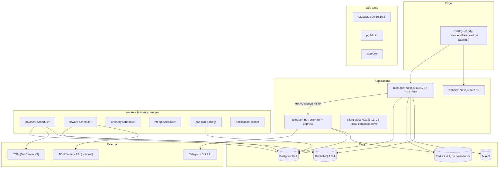
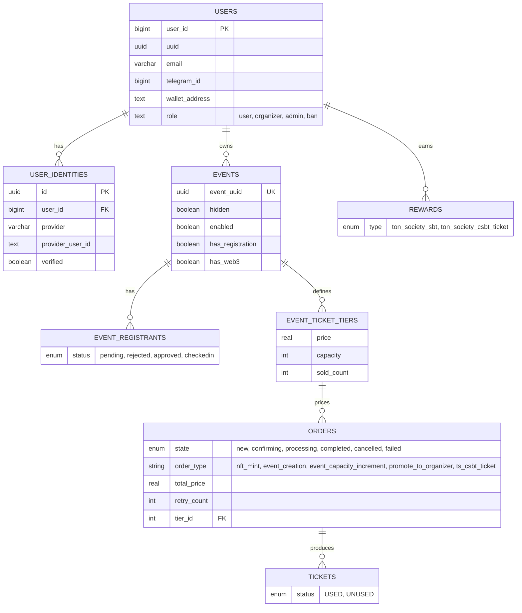
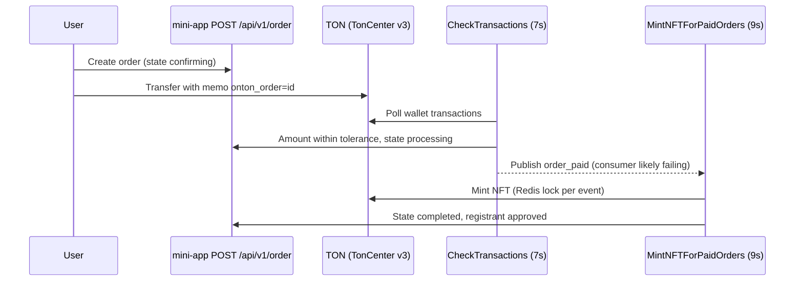
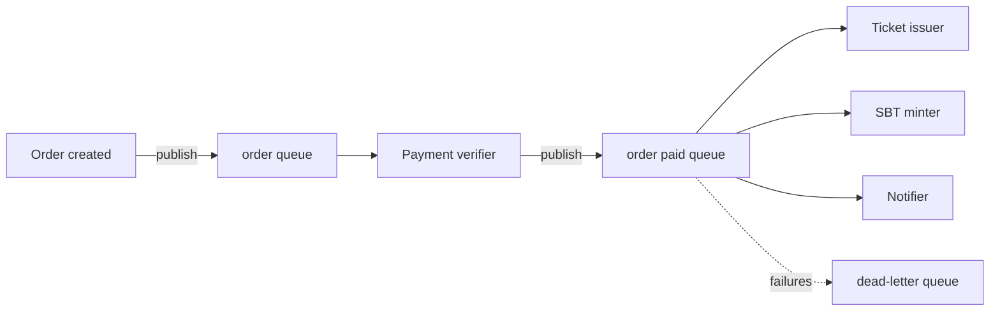

# ONTON Platform — Architecture Blueprint & Critical Evaluation

> Last verified against dev: 2026-10-03

Sections 1–6 describe the current system on `dev` and the servers. Section 7 (Roadmap / not implemented) lists proposals; none of it exists yet. Detailed current state: [as_is_technical_blueprint.md](as_is_technical_blueprint.md). Target plan: [to_be_technical_blueprint.md](to_be_technical_blueprint.md).

---

## 1. Summary

ONTON is a Telegram Mini App for events and ticketing with TON integration. The repo holds three deployed apps (`mini-app`, `telegram-bot`, `website`) plus worker containers built from the `mini-app` image, one local-only app (`client-web-panel`) and one undeployed service (`newton/apps/nft-manager`).

- **Prod**: plain `docker compose` project `local-onton` on `65.109.212.86`, built on the server with `--profile full`, deployed manually.
- **Staging**: Docker Swarm stack `onton-dev` on `65.109.182.13`.
- **CI**: deploys `dev` (stack `onton-dev`) and `main` (stack `onton`) to the staging host. No automated prod deploy.

---

## 2. System Map (prod / local, `docker-compose.yml` profile `full`)

```mermaid
graph TB
    subgraph External["External"]
        TG["Telegram Bot API"]
        TON["TON (TonCenter v3)"]
        TS["TON Society API (optional)"]
    end

    subgraph Edge["Edge"]
        Caddy["Caddy (caddy-dns/cloudflare, caddy-ratelimit)"]
    end

    subgraph Apps["Applications"]
        MiniApp["mini-app: Next.js 14.2.28 + tRPC v10"]
        TelegramBot["telegram-bot: grammY + Express"]
        Website["website: Next.js 14.2.35"]
        ClientWeb["client-web: Next.js 13, JS (local compose only)"]
    end

    subgraph Workers["Workers (mini-app image)"]
        PaymentWorker["payment scheduler"]
        RewardWorker["reward scheduler"]
        OrdinaryWorker["ordinary scheduler"]
        NFTAPIWorker["nft-api scheduler"]
        POAWorker["poa (DB polling)"]
        SocketServer["notification-socket"]
    end

    subgraph Data["Data"]
        PG[("Postgres 16.3")]
        Redis[("Redis 7.4.1, no persistence")]
        MinIO[("MinIO")]
        RabbitMQ[("RabbitMQ 4.0.4")]
    end

    subgraph Ops["Ops tools"]
        Metabase["Metabase v0.50.18.3"]
        PGAdmin["pgAdmin"]
        ClamAV["ClamAV"]
    end

    Caddy --> MiniApp
    Caddy --> Website
    MiniApp -->|"HMAC-signed HTTP"| TelegramBot
    TelegramBot --> TG
    MiniApp --> PG
    MiniApp --> Redis
    MiniApp --> MinIO
    MiniApp --> RabbitMQ
    PaymentWorker --> PG
    PaymentWorker --> TON
    PaymentWorker --> RabbitMQ
    RewardWorker --> PG
    RewardWorker --> TS
    POAWorker --> PG
    TelegramBot --> PG
    TelegramBot --> Redis
```

Staging (`docker-compose-server-dev.yml`) runs mini-app, telegram-bot and website with 1 replica each; **all workers and the socket at 0 replicas**; no RabbitMQ, Metabase, pgAdmin or ClamAV; adds a registry, Elasticsearch and Fluentd.

---

## 3. Technology Inventory

| Module | Stack | Package manager | Deployed |
|---|---|---|---|
| `mini-app` | Next.js 14.2.28 App Router, tRPC v10, Drizzle, Node 22 | Yarn | Yes |
| `telegram-bot` | grammY + Express, raw `pg` pool, `ts-node` in prod | Yarn | Yes |
| `website` | Next.js 14.2.35 | Yarn | Yes |
| `client-web-panel` | Next.js 13 Pages Router, JavaScript, MUI, RTK Query | Yarn | Local `full` profile only |
| `newton/apps/nft-manager` | NestJS + Prisma | pnpm (`newton/`) | No; loops commented out |
| `participant-tma` | — | — | Decommissioned; 4 `/ptma` rewrites in `mini-app/next.config.js` |

API styles: mini-app frontend uses tRPC; mini-app also exposes REST routes under `app/api/`; telegram-bot exposes an HMAC-protected Express API; client-web-panel uses REST via RTK Query.

### Data & messaging

| Concern | Current state |
|---|---|
| Database | One Postgres instance. Drizzle schema `mini-app/src/db/schema.ts` + `mini-app/src/db/schema/`. |
| Migrations | 130 SQL files; stale Drizzle journal (125 entries, 7 orphans). Apply with `psql -v ON_ERROR_STOP=1`; never `yarn db:migrate`. |
| Redis | Rate limits, OTP, TonProof challenges, OAuth state, locks. No persistence. Bot sessions are in-memory. |
| RabbitMQ | Queues `${STAGE_NAME}-notifications` (DLX + retry), `-tg_messages`, `-order_paid`. |
| MinIO | Images and NFT/SBT metadata. |

### CI/CD

| Item | Current state |
|---|---|
| Registry | `ghcr.io/executesg/onton/<service>` |
| Repo | `github.com/ExecutESG/onton` |
| Pipeline | determine-services → validate (lint + Vitest; telegram-bot `tsc`) → build-and-push → deploy |
| Deploy target | `SSH_DEV_IP` for both `dev` and `main` |
| Smoke tests | Playwright `smoke.spec.ts` **after** deploy. Scheduled smoke workflow has its cron disabled. |
| Backups | Scripts in `devops/backup_scripts/`; cron is a manual install step. No automated prod backups. |

---

## 4. Core Domain (current schema, simplified)

```mermaid
erDiagram
    USERS {
        bigint user_id PK
        uuid uuid
        varchar email
        bigint telegram_id
        text wallet_address
        text role "user, organizer, admin, ban"
    }
    USER_IDENTITIES {
        uuid id PK
        bigint user_id FK
        varchar provider
        text provider_user_id
        boolean verified
    }
    EVENTS {
        uuid event_uuid UK
        boolean hidden
        boolean enabled
        boolean has_registration
        boolean has_web3
    }
    EVENT_REGISTRANTS {
        enum status "pending, rejected, approved, checkedin"
    }
    ORDERS {
        enum state "new, confirming, processing, completed, cancelled, failed"
        string order_type "nft_mint, event_creation, event_capacity_increment, promote_to_organizer, ts_csbt_ticket"
        real total_price
        int retry_count
        int tier_id FK
    }
    EVENT_TICKET_TIERS {
        real price
        int capacity
        int sold_count
    }
    TICKETS {
        enum status "USED, UNUSED"
    }
    REWARDS {
        enum type "ton_society_sbt, ton_society_csbt_ticket"
    }

    USERS ||--o{ USER_IDENTITIES : has
    USERS ||--o{ EVENTS : owns
    EVENTS ||--o{ EVENT_REGISTRANTS : has
    EVENTS ||--o{ EVENT_TICKET_TIERS : defines
    EVENT_TICKET_TIERS ||--o{ ORDERS : prices
    ORDERS ||--o{ TICKETS : produces
    USERS ||--o{ REWARDS : earns
```

Only columns named in the fact sheets are shown. SBT data lives in `sbtCollections`, `sbtItems`, `sbtRewardCollections`.

### Payment flow (TON / USDT)

```mermaid
sequenceDiagram
    participant User
    participant API as mini-app POST /api/v1/order
    participant Chain as TON (TonCenter v3)
    participant Pay as CheckTransactions (7s)
    participant Mint as MintNFTForPaidOrders (9s)

    User->>API: Create order (state confirming)
    User->>Chain: Transfer with memo onton_order=id
    Pay->>Chain: Poll wallet transactions
    Pay->>API: Amount within tolerance, state processing
    Pay-->>Mint: Publish order_paid (consumer likely failing)
    Mint->>Chain: Mint NFT (Redis lock per event)
    Mint->>API: State completed, registrant approved
```

Telegram Stars skips this: the bot's `successful_payment` handler sets the order `completed`, approves the registrant and inserts a ticket, without minting.

---

## 5. Critical Evaluation (verified)

| ID | Area | Finding |
|---|---|---|
| C1 | Monolith | `mini-app` is the web app, the tRPC/REST API and the image for 6 worker/socket containers. Any mini-app change rebuilds the image they all share. |
| C2 | Data access | Drizzle in mini-app and raw `pg` in telegram-bot hit the same DB with no shared types. nft-manager has a separate Prisma schema but is not deployed. |
| C3 | Async design | Payments, minting, rewards and PoA use cron/DB polling. The one payment queue (`order_paid`) likely never consumes; the cron does the work. |
| C4 | Reliability | Single prod host, single Postgres, single Redis without persistence, no automated backups, manual prod deploys. |
| S1 | Staging parity | Workers, socket and RabbitMQ do not run on staging, so those flows are untested there. CI's `main` deploy targets the staging host but smoke-tests the prod URL. |
| S2 | Migrations | Drizzle journal is stale; SQL is applied by hand. |
| S3 | Frontend consistency | `client-web-panel` is Next.js 13 Pages Router in JavaScript with MUI; the rest is Next.js 14 App Router in TypeScript. |
| S4 | Bundle | `mini-app/next.config.js` injects Node polyfills (crypto, stream, http, buffer) for TON SDK code. |
| S5 | Worker naming | `mini-app-sbt-worker` runs the NFT-API scheduler locally/prod but the payment scheduler in server composes. |
| M1 | Tooling | Standalone Yarn projects plus a nested pnpm workspace (`newton/`); no root `package.json`. |
| M2 | Dead schedules | Play2Win crons still scheduled after the UI was retired. |

Resolved in 2.0 (verified): static Docker IPs replaced by DNS names; CORS allowlist (`mini-app/src/lib/cors.ts`); bot Express API behind HMAC; bcrypt API keys with constant-time checks; check-in and QR-token procedures locked to event managers/owners; moderation bot merged into `telegram-bot`; participant-tma removed.

---

## 6. Known issues (tracked in QA)

- F-04 CI deploys `main` to the staging host; no automated prod deploy.
- F-27 Email OTP codes are logged, not emailed.
- F-30 PoA has a universal override; slated for removal.
- F-33 Stars pre-checkout approves without validating order, price or capacity.
- F-34 Paid tier `sold_count` is not incremented; no tier-creation API.
- F-35 `order_paid` consumer likely failing (cron is the real fulfillment path); cSBT proofs rebuilt per request and not anchored on chain.
- F-36 Free SBT at check-in/claim vs paid on-chain upgrade.
- No automated prod DB backups.
- Secret env vars have insecure fallbacks if unset; set them in every environment.

---

## 7. Roadmap / not implemented

Everything in this section is a proposal. None of it exists in the repo today.

### 7.1 Extract a dedicated backend service
Move the tRPC/REST API out of `mini-app` into a standalone service (Hono or Fastify + tRPC). Workers become small entry points without the Next.js app. Frontend and API deploy and scale separately.

### 7.2 Unify data access
1. One ORM (Drizzle, already primary).
2. Shared typed DB package used by mini-app and telegram-bot.
3. Retire or merge nft-manager's Prisma schema.
4. Repair the Drizzle journal so migrations can run from tooling again.

### 7.3 Event-driven workers
Fix the `order_paid` consumer first (F-35). Then move fulfillment, notifications and credential steps to queue consumers with a real dead-letter queue and alerting, keeping cron as a fallback.

```mermaid
flowchart LR
    A["Order created"] -->|publish| Q1["order queue"]
    Q1 --> B["Payment verifier"]
    B -->|publish| Q2["order paid queue"]
    Q2 --> C["Ticket issuer"]
    Q2 --> D["SBT minter"]
    Q2 --> E["Notifier"]
    Q2 -.->|failures| DLQ["dead-letter queue"]
```

### 7.4 Monorepo consolidation
Single pnpm workspace (Turborepo) with shared `db`, `auth`, `ui`, `config` packages.

### 7.5 Infrastructure hardening

| Phase | Items |
|---|---|
| Immediate | Automated, monitored prod DB backups; automated prod deploy (F-04); remove insecure secret fallbacks; run workers, socket and RabbitMQ on staging |
| Medium | Postgres read replica; Redis persistence or Sentinel; Cloudflare WAF; health checks and readiness probes |
| Long | Managed Postgres/Redis or Kubernetes; OpenTelemetry tracing; structured logs with correlation IDs |

### 7.6 Replace `client-web-panel`
Rebuild as Next.js App Router + TypeScript on the shared UI package and the main API, or fold its features (OTP login, guest list, check-in, admin users) into the main web app.

### 7.7 Priority matrix (proposal)

| Priority | Item | Risk if ignored |
|---|---|---|
| P0 | Automated prod backups | Data loss |
| P0 | Close F-30, F-33, F-34, F-35 | Revenue and trust loss |
| P0 | Automated prod deploy (F-04) | Manual-deploy errors |
| P1 | Staging parity (workers, socket, RabbitMQ) | Untested paths reach prod |
| P1 | Repair migration journal | Schema drift |
| P1 | Extract API from mini-app | Slow deploys, coupled scaling |
| P1 | Unify data access | Schema drift between services |
| P2 | Event-driven workers | Latency and DB load |
| P2 | Monorepo consolidation | Developer friction |
| P2 | Replace client-web-panel | Growing tech debt |
| P3 | HA data tier, tracing | Scaling and debugging limits |
