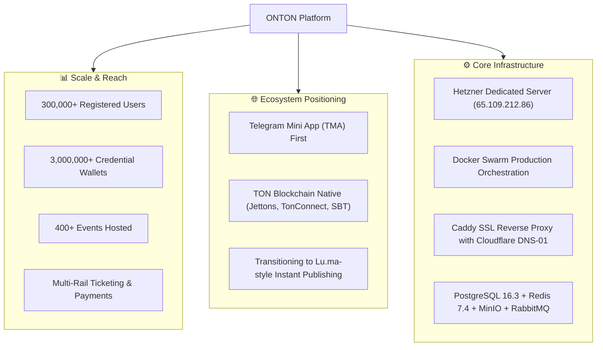
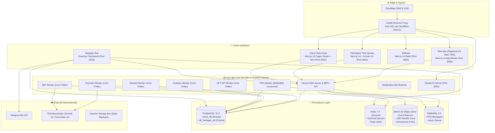
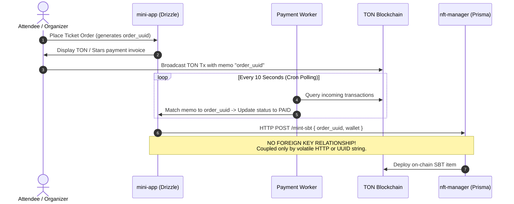

# ONTON Platform — AS-IS Technical Blueprint

> **Status:** Current Production Architecture Reference  
> **Date:** September 2026  
> **Scope:** Full System Audit of `ontonbot/` Monorepo & Hetzner Production Environment  
> **Authors:** Antigravity AI & Mahdi Farimani (مهدی فریمانی)

---

## 1. Executive Overview & Operational Scale

ONTON is an operational **Telegram-native Event Management & Ticketing OS** with TON blockchain integration. It currently serves as the backbone for community events, conferences, hackathons, and tournaments across the TON and Telegram ecosystem.



### Operational Footprint
- **Users**: 300,000+ registered Telegram profiles.
- **On-Chain Footprint**: Over 3,000,000 wallets holding credentials, event badges, and soulbound proofs of attendance.
- **Events**: 400+ physical and virtual events hosted.
- **Primary Node**: Hetzner Cloud dedicated instance (`65.109.212.86`), orchestrated with Docker Swarm.
- **Current Development Focus**: Decoupling from decommissioned external services (TON Society), transitioning from strict pre-moderation to Lu.ma-style instant auto-publishing, and stabilizing high-concurrency ticket check-ins.

---

## 2. Current System Architecture Map (AS-IS)



---

## 3. Technology Stack & Module Inventory

The repository is structured as a **hybrid polyglot monorepo** consisting of root-level Yarn workspaces, a nested pnpm workspace (`newton/`), and standalone services.

```
ontonbot/
├── mini-app/              # Next.js 14 App Router, tRPC, Drizzle ORM (Yarn)
├── telegram-bot/          # Grammy, Express, Raw pg.Pool (Yarn)
├── client-web-panel/      # Next.js 13 Pages Router, JavaScript, MUI v5, RTK Query (Yarn)
├── website/               # Next.js 14 App Router, Tailwind (Yarn)
├── newton/                # Nested pnpm monorepo
│   ├── pnpm-workspace.yaml
│   ├── apps/
│   │   ├── participant-tma/   # Next.js 14 App Router, Konsta UI, Zustand + Jotai
│   │   └── nft-manager/       # NestJS 10, Prisma ORM
│   └── packages/
│       ├── ui/                # Shared Tailwind/Radix UI components
│       ├── tma/               # Telegram Mini App helper utilities
│       ├── typescript-config/ # Shared tsconfig
│       └── eslint-config/     # Shared eslint rules
├── devops/                # Docker compose configs, Caddy scripts, Python deploy utilities
├── tests/                 # Playwright E2E test suites (84 role flows + Web3 TonProof)
└── knowledge_base/        # Architectural documentation and runbooks
```

### 3.1 Detailed Module Specifications

| Module | Runtime & Framework | Language | Routing / API Pattern | State & Data Access | Package Manager |
|---|---|---|---|---|---|
| `mini-app` | Node 22, Next.js 14.2.28 | TypeScript 5.x | App Router + tRPC v10 | Zustand, React Query, Drizzle ORM | Yarn 1.22 |
| `participant-tma` | Node 22, Next.js 14.2.7 | TypeScript 5.x | App Router + REST | Zustand, Jotai, TanStack Query | pnpm 9.x (newton) |
| `nft-manager` | Node 22, NestJS 10.x | TypeScript 5.x | REST Controllers | Prisma ORM | pnpm 9.x (newton) |
| `client-web-panel` | Node 22, Next.js 13.3.0 | JavaScript (ES6) | Pages Router + REST | Redux Toolkit, RTK Query, Material UI v5 | Yarn 1.22 |
| `website` | Node 22, Next.js 14.2.35 | TypeScript 5.x | App Router (Static) | React Server Components, Tailwind | Yarn 1.22 |
| `telegram-bot` | Node 22, Grammy 1.30 | TypeScript 5.x | Express 4.18 REST | Raw SQL (`pg.Pool`), Redis client | Yarn 1.22 |

---

## 4. As-Is Data Layer & Fragmentation Analysis

### 4.1 The Triple ORM Problem

The platform accesses PostgreSQL 16.3 via **three completely divergent database access methodologies**:

```mermaid
graph LR
    subgraph DB["PostgreSQL 16.3 Instance"]
        D1[onton_db Database]
        D2[nft_manager_db Database]
    end

    MA["mini-app & Workers"] -->|Drizzle ORM<br/>(120+ schema migrations)| D1
    NM["nft-manager"] -->|Prisma ORM<br/>(Separate schema file)| D2
    TB["telegram-bot"] -->|Raw SQL strings<br/>(pg.Pool, no migrations)| D1
```

1. **`mini-app` & Background Workers**: Use **Drizzle ORM** with 120+ sequential SQL migrations located under `mini-app/drizzle/`. Type definitions are strictly enforced within `mini-app/src/server/db/schema.ts`.
2. **`nft-manager`**: Uses **Prisma ORM** pointing to a separate logical database (`nft_manager_db`). Has its own independent schema definitions and migration history.
3. **`telegram-bot`**: Directly instantiates a raw PostgreSQL connection pool (`new pg.Pool()`) and executes untyped, raw SQL queries against `onton_db`. Any schema alteration in `mini-app` risks silently breaking the bot.

### 4.2 Cross-Database Foreign Key Void



- Because `onton_db` and `nft_manager_db` are separate logical databases, **no relational foreign keys exist between orders, tickets, and NFT/SBT mint requests**.
- Correlation is done entirely through string matching of `order_uuid` values.
- If an HTTP request fails or a network timeout occurs between `mini-app` and `nft-manager`, the system enters an inconsistent state requiring manual DB intervention.

---

## 5. Current Payment & Ticketing Architecture

The platform provides 3 distinct payment rails:

1. **Telegram Stars (Native In-App)**:
   - Client triggers `window.Telegram.WebApp.openInvoice(invoiceLink)`.
   - Telegram sends `pre_checkout_query` to `telegram-bot`.
   - Bot validates amount and responds with OK.
   - Upon completion, `successful_payment` webhook triggers order state update to `PAID`.
2. **TON Native Transfer**:
   - Client connects non-custodial wallet via `@tonconnect/ui-react`.
   - A transaction is constructed with a payload memo: `onton_order={order_uuid}`.
   - Payment Worker runs a continuous cron schedule polling TonHub v4 / TonCenter APIs.
   - Upon detecting the confirmed transaction and parsing the memo, the order is marked `PAID`.
3. **USDT Jetton (TEP-74)**:
   - Built using `@ton-community/assets-sdk`.
   - User wallet sends Jetton transfer to ONTON treasury wallet with forward payload containing the `order_uuid`.
   - Payment Worker polls the Jetton master contract and verifies incoming transfers.

---

## 6. As-Is Credential & SBT Architecture (Post TON Society Sunset)

In mid-2026, **TON Society (`society.ton.org`) was permanently shut down and retired**, eliminating the centralized hub picker and external badge generation API that ONTON previously depended upon.

### 6.1 Recent Remediation (Past 20 Sessions)
- **Decoupled Activity ID & Hubs**: Removed the blocking TON Society Hub picker in `BasicEventInputs.tsx` and `ManageEvent.tsx` (Commit `027566fb`, PR #1011, #1012). Provided a transparent fallback to default hub ID `33` ("Onton").
- **Auto-Publishing Free Events**: Eliminated the legacy "pending verification" block. Free events now automatically set `hidden = false`, allowing organizers to immediately share URLs upon creation.
- **Native TEP-85 Smart Contract Engine**: Built native Soulbound Token smart contracts (`mini-app/src/lib/sbt.ts`) replacing external TON Society minting.
- **Phase 2 Compressed SBT (cSBT) Engine**: Implemented an off-chain Merkle Tree engine anchoring root hashes to a FunC smart contract (`52522d1c`, `e5112683`, `5fa76d5b`), allowing users to claim verifiable credentials at zero gas.
- **MinIO Asset Storage**: Integrated self-hosted MinIO object storage with an anonymous download policy for badge artwork, metadata, and Merkle tree leaves (`cc3a15e1`, `80bdb016`).

---

## 7. DevOps, Infrastructure & CI/CD State

### 7.1 Single-Server Swarm Architecture

The entire staging and production footprint currently runs on **a single Hetzner VPS**:
- **Production Host**: `65.109.212.86`
- **Orchestrator**: Docker Swarm in single-node manager mode (`docker stack deploy -c docker-compose-server.yml onton`).
- **Reverse Proxy**: Caddy container compiled with `xcaddy` including `github.com/caddy-dns/cloudflare`. Caddy dynamically terminates SSL using DNS-01 ACME challenge for `*.onton.live` and `*.onton.fun`.
- **Static IP Allocation**: The internal Docker bridge network uses hardcoded IP addresses (`172.10.0.x`), which causes container startup conflicts during partial reloads.

### 7.2 CI/CD Pipeline (`build-push-deploy.yml`)
- Triggered on push to `dev` or `main`.
- Analyzes changed paths via git diff to selectively build modified Docker images.
- Pushes container images to GitHub Container Registry (`ghcr.io/pomegroup/ontonbot/*`).
- SSHs into the Hetzner VPS, executes `docker system prune -af` to prevent disk saturation, pulls updated images, and executes `docker service update` with rollback protection.
- Automatically purges Cloudflare edge cache via Cloudflare API token.
- Dispatches status notifications to the team Telegram channel.

---

## 8. Comprehensive Evaluation of Architectural Debt (The AS-IS Gaps)

| ID | Severity | Category | Description & Impact |
|---|---|---|---|
| **C1** | 🔴 Critical | Architecture | **The God Monolith**: `mini-app` Docker image is reused across 7 containers (web + 6 background cron workers + socket server + mod bot). Every worker runs a complete Next.js 14 runtime in a ~500MB container just to execute a loop. |
| **C2** | 🔴 Critical | Data Layer | **Triple ORM Divergence**: Drizzle (mini-app), Prisma (nft-manager), and raw SQL strings (telegram-bot) all operate against the same PostgreSQL database without shared types or unified migrations. |
| **C3** | 🔴 Critical | Consistency | **Cross-DB Correlation without Foreign Keys**: Orders and NFT mints rely on volatile string UUID matches across logical database boundaries with cron polling. |
| **C4** | 🔴 Critical | Security | **Historical Repository Secrets**: While local files were sanitized in recent sessions, git history still contains historical commits with credentials requiring complete BFG/git-filter-repo purging and key rotation (#976). |
| **S1** | 🟡 Significant | Codebase | **Framework & Library Chaos**: `client-web-panel` is Next.js 13 Pages Router in JavaScript with Material UI v5 and Redux, while all modern apps are Next.js 14 App Router in TypeScript with Tailwind and shadcn/ui. |
| **S2** | 🟡 Significant | Architecture | **Monolithic tRPC Routers**: Files such as `events.ts` (42KB) and `campaignRouter.ts` (24KB) intertwine HTTP serialization, RBAC, business logic, and SQL execution with no service layer separation. |
| **S3** | 🟡 Significant | Performance | **Cron Polling vs Event Queue**: Payment, SBT, and reward processing poll the database every 5–30 seconds rather than consuming AMQP events from RabbitMQ, causing up to 30s user latency and DB CPU spikes. |
| **S4** | 🟡 Significant | QA/Testing | **CI Test Pipeline Gap**: GitHub Actions CI builds images without running automated unit or integration tests. Tests exist in `tests/e2e/` (84 flows) but are run manually or on a detached 6-hour cron. |
| **S5** | 🟡 Significant | Reliability | **Single Point of Failure (SPOF)**: The entire platform depends on a single VPS node, single PostgreSQL container (no replica), and single Redis container. |
| **S6** | 🟡 Significant | Client Bundle | **Webpack Polyfill Bloat**: `mini-app/next.config.js` injects massive Node.js crypto, stream, and buffer polyfills into the client browser bundle to support legacy TON SDKs. |
| **M1** | 🟢 Moderate | Tooling | **Mixed Package Managers**: Root-level Yarn workspaces coexisting with nested pnpm workspace in `newton/`. |
| **M2** | 🟢 Moderate | Security | **Triplicated Auth Logic**: Telegram `initData` validation is independently coded in 3 places (`mini-app`, `participant-tma`, and `telegram-bot`). |
| **M3** | 🟢 Moderate | Ingress | **Missing Edge WAF & Rate Limiting**: Caddy directly proxies to Node apps without Cloudflare WAF rules or edge-level DDoS challenge shields. |
| **M4** | 🟢 Moderate | DevOps | **Hardcoded Docker IP Addresses**: Static IP assignments in `docker-compose.yml` (`172.10.0.x`) prevent dynamic horizontal scaling. |

---

## 9. Conclusion on Current State

The AS-IS architecture is the result of rapid, pragmatic feature shipping during the high-growth phase of the TON ecosystem. While it successfully serves 300,000+ users, handles multi-rail payments, and survived the abrupt shutdown of TON Society, it has reached an architectural ceiling. To scale to 1,000,000+ users and deliver the frictionless "Lu.ma of Web3" experience, ONTON must transition from this fragmented monolith to a clean, decoupled, event-driven architecture.
