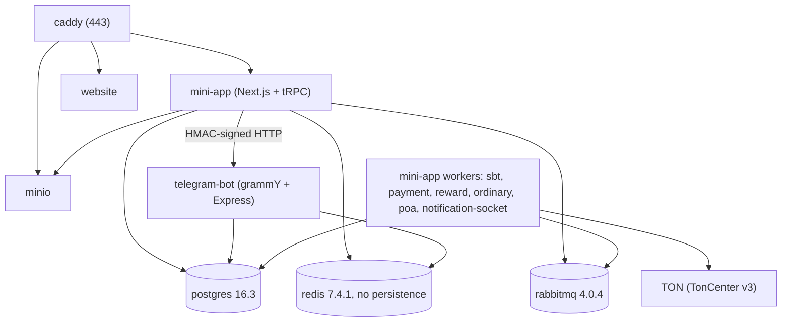

# ONTON Platform — AS-IS Technical Blueprint

> Last verified against dev: 2026-10-03

This file describes only what exists in the `dev` branch and on the servers today. Planned work lives in [to_be_technical_blueprint.md](to_be_technical_blueprint.md).

---

## 1. Environments

| Item | Current state |
|---|---|
| Production | Host `65.109.212.86`. Plain `docker compose` project `local-onton`, built on the server with `--profile full`. Deployed **manually**. |
| Staging | Host `65.109.182.13`. Docker Swarm stack `onton-dev`. Public URL `https://app.dev.onton.live`. |
| CI deploys | `dev` → stack `onton-dev`, `main` → stack `onton`. **Both go to the staging host.** No automated prod deploy (F-04). |
| Bots | Prod `@theontonbot`, staging `@notnonstagebot`, local `@ontonlocaldevbot`. |
| Repo / images | `github.com/ExecutESG/onton`; images `ghcr.io/executesg/onton/<service>`. |
| Backups | Scripts exist (`devops/backup_scripts/`), but cron is a manual install step. **No automated prod DB backups.** |

---

## 2. Services (`docker-compose.yml`, profile `full`)

```mermaid
flowchart TD
    Caddy["caddy (443)"] --> MiniApp["mini-app (Next.js + tRPC)"]
    Caddy --> Website["website"]
    Caddy --> MinIO["minio"]
    MiniApp --> PG[("postgres 16.3")]
    MiniApp --> Redis[("redis 7.4.1, no persistence")]
    MiniApp --> MinIO
    MiniApp --> Rabbit[("rabbitmq 4.0.4")]
    MiniApp -->|"HMAC-signed HTTP"| Bot["telegram-bot (grammY + Express)"]
    Bot --> PG
    Bot --> Redis
    Workers["mini-app workers: sbt, payment, reward, ordinary, poa, notification-socket"] --> PG
    Workers --> Rabbit
    Workers --> TON["TON (TonCenter v3)"]
```

Other services in `full`: clamav, pgadmin, metabase v0.50.18.3, client-web, swagger-ui. Every service has a profile, so `docker compose up` without `--profile` starts nothing.

Staging (`docker-compose-server-dev.yml`) differs: mini-app, telegram-bot and website run 1 replica; **all workers and the socket run 0 replicas**; no rabbitmq, metabase, pgadmin or clamav. Caddy, a registry, elasticsearch and fluentd are included.

---

## 3. Modules

| Module | Stack | Deployed |
|---|---|---|
| `mini-app` | Next.js 14.2.28 App Router, tRPC v10, Drizzle, Node 22 | Yes (also the image for all workers) |
| `telegram-bot` | grammY + Express, `pg` pool (`telegram-bot/src/db/pool.ts`), started with `ts-node` | Yes |
| `website` | Next.js 14.2.35; blog, events directory, glossary, csbt page, feed/sitemap | Yes |
| `client-web-panel` | Next.js 13 Pages Router, JavaScript, MUI, RTK Query; OTP login, guest list, check-in, admin users | Local compose (`full`) only; not in server composes |
| `newton/apps/nft-manager` | NestJS + Prisma | **Not deployed**; watcher and mint loops are commented out |
| `participant-tma` | — | **Decommissioned.** Source removed. 4 explicit `/ptma` rewrites in `mini-app/next.config.js` (ticket, ticket qrcode, buy-ticket, event). Other `/ptma` paths are not rewritten. |

The moderation bot now lives in `telegram-bot/src/composers/moderationComposer.ts`. Leftover helpers remain in `mini-app/src/moderationBot/{helpers,menu,types}.ts` and are still imported.

---

## 4. Workers (all run the `mini-app` image with a `command`)

| Scheduler | Main jobs |
|---|---|
| Payment (`cronJobSchedulerPayment.ts`) | order.paid consumer; CheckTransactions 7s; MintNFTForPaidOrders 9s; CreateEventOrders 19s; UpdateEventCapacity 24s; TsCsbtTicketOrder 11s; OrganizerPromoteProcessing 21s; payment reminders 4h; raffles; wallets for upcoming events |
| Reward (`cronJobSchedulerReward.ts`) | CreateRewards 1m (no-op unless `ENABLE_TON_SOCIETY=true`); reward notifications; tournaments; Play2Win enrollment still scheduled |
| Ordinary (`cronJobSchedulerOrdinary.ts`) | user block check, invite links, click batches, tournaments, promo codes, Play2Win scores still scheduled, wallet balances (prod only). No order-expiry or inventory-restore task. |
| NFT-API (`cronJobSchedulerNFTApi.ts`) | deployNFTApiCollections, mintNFTApiCollections (5s) |
| POA (`poaWorker.ts`) | DB polling every 4s; no RabbitMQ |
| Socket (`sockets/index.ts`) | Port from required `SOCKET_PORT`; initData auth only |

Name mismatch: in local/prod compose `mini-app-sbt-worker` runs `start-cron-nft-api`; in server composes it runs `start-cron-payment`.

---

## 5. Data layer

- **Postgres**: one instance. Schema `mini-app/src/db/schema.ts` plus `mini-app/src/db/schema/`. Only env names exist for a separate nft-manager DB.
- **Migrations**: 130 SQL files in `mini-app/drizzle/` (last `0127_add_has_web3_to_events`). The journal has 125 entries and 7 orphan files; snapshots stop at 0117. **Never run `yarn db:migrate`.** Apply SQL with `psql -v ON_ERROR_STOP=1`. No migration runs on container start.
- **Data access**: mini-app uses Drizzle; telegram-bot uses its own SQL modules in `telegram-bot/src/db/`; nft-manager has a Prisma schema but is not deployed.
- **Redis**: no persistence. Used for rate limits, OTP codes, TonProof challenges, Google OAuth state, and locks (registration, check-in, mint). Bot sessions are grammY in-memory, not Redis.
- **MinIO**: images and NFT/SBT metadata. No Merkle trees are stored.
- **RabbitMQ** queues: `${STAGE_NAME}-notifications` (with DLX and 5s retry queue), `-tg_messages`, `-order_paid`. No other exchanges or DLQ.

---

## 6. Auth (summary; details in `workflow_auth.md`)

- tRPC context (`mini-app/src/server/context.ts`): Bearer platform JWT → raw initData (upserts user) → cookies `onton_token` / `onton_session` / `token` → API key (bcrypt).
- Login paths: Telegram initData (`POST /api/v1/auth/telegram`), Telegram Login Widget, Google web OAuth, email OTP. Each issues a 7-day platform JWT.
- `users` PK is `user_id bigint`; 2.0 adds `uuid`, `email`, `auth_provider`, `telegram_id` and the `user_identities` table (migration 0123).
- `POST /api/v1/auth/link` supports only `telegram` (initData) and `email` (OTP). "Link Google" uses tRPC `usersGoogle.getAuthUrl` and links to the current user.
- TonProof (`tonProofRouter.ts`) issues a 2-week wallet JWT `{address, network}`; it does not write identities. `users.addWallet` still stores a wallet without proof.
- Global roles: `user | organizer | admin | ban` (text column). Moderation ban writes `ban`. First event creation auto-promotes `user` → `organizer`.
- Per-event roles in `user_roles`: `owner | admin | checkin_officer`.

---

## 7. Events, check-in and credentials

- **Publishing**: free events are public immediately with a post-publish moderation alert. Paid events stay hidden until the creation order is paid. 3+ reports in 1h auto-quarantine an event.
- **Registration**: statuses `pending | rejected | approved | checkedin`; Redis lock per event; waitlist auto-promotion.
- **Passes**: `mini-app/src/lib/totp/passToken.ts`, 20s step ±1, static UUIDs rejected at the scan step. Tokens come from owner-only `registrant.getRegistrantQrToken` / `ticket.getTicketQrToken`.
- **Check-in**: `registrant.checkinRegistrantRequest`, `ticket.getTicketByUuid`, `ticket.checkInTicket` are event-manager only. `checkInTicket` still accepts an order UUID already resolved by an authorized manager after the scan step.
- **SBT**: native TEP-85 engine (`mini-app/src/services/sbtService.ts`, `mini-app/src/lib/sbt.ts`). `sbt.mintBadge` is global-admin only. `claimAttendanceSbt` and `materializeOnChainSbt` are ticket-owner only; the claim is free, the on-chain upgrade requires a TON payment. Ticket check-in auto-mints if the user has a wallet.
- **cSBT Merkle**: `mini-app/src/lib/csbt/` builds a plain binary Merkle tree **per request** from checked-in registrants. `GET /api/v1/csbt/proof?eventUuid=&userId=` is public. `contracts/csbt_anchor.fc` exists but nothing deploys it or updates its root.
- **TON Society**: reward cron is disabled unless `ENABLE_TON_SOCIETY=true`. Legacy TS badges are merged into `sbt.getUserBadges`.
- **Story sharing**: shares the raw badge image URL via `WebApp.shareToStory`. No canvas renderer.
- **Chat gating**: single-use invite links only.

---

## 8. Payments

| Rail | Flow |
|---|---|
| TON / USDT | `POST /api/v1/order` → TonConnect transfer with memo `onton_order=<id>` → `CheckTransactions` polls TonCenter v3 every 7s → state `processing` → `MintNFTForPaidOrders` (9s) mints NFT and sets `completed`. |
| Telegram Stars | `POST /api/v1/order/stars-invoice` (fixed pegs) → bot `createInvoiceLink` → `successful_payment` sets `completed`, approves registrant, inserts ticket, sends invite. No mint, no affiliate count. |
| Free | Order created as `completed`, ticket inserted immediately. |

- Order states: `new | confirming | processing | completed | cancelled | failed`. No `PAID` state.
- Prices are Postgres `real`. The TON check converts that float to BigInt and accepts `|diff| <= tolerance`.
- No inventory row lock: order creation is check-then-insert. Mint mutual exclusion is a Redis lock.
- After 5 mint failures an order becomes `failed` with a log line; there is no queue-based DLQ.
- Tiers: `event_ticket_tiers` (migration 0125), seeded one per event. The token is per event.

---

## 9. CI/CD (`.github/workflows/build-push-deploy.yml`)

1. **determine-services**: maps changed paths to mini-app, telegram-bot, website, caddy. Falls back to telegram-bot when nothing matches.
2. **validate-services** (also on PRs): mini-app `yarn lint:quiet` + `yarn test:api` (Vitest); telegram-bot `yarn run build`. No `type:check`.
3. **build-and-push**: tags `<branch>-<run_id>` and `<branch>-latest`, target `production`.
4. **deploy**: SSH to `SSH_DEV_IP` for both `dev` and `main`; `docker stack deploy`; forced service update with rollback; Cloudflare purge on `main` only; **post-deploy** Playwright `smoke.spec.ts` (not a pre-deploy gate). For `main` the smoke test targets the prod URL while the deploy went to the staging host.

Caddy image is built from `caddy:latest` (unpinned) with the Cloudflare DNS and rate-limit modules.

---

## 10. Testing

- mini-app: Vitest, `yarn test:api` (`.tsx` tests are not included by `vitest.config.ts`). `yarn test` runs an ad-hoc script.
- Real staging E2E: `cd tests/e2e && npx playwright test -c playwright.real.config.ts`. It refuses to run against production.
- Scheduled smoke workflow: cron disabled, manual dispatch only.

---

## 11. Structural debt (verified)

| Area | Current state |
|---|---|
| Monolith | mini-app is web, API and the image for 6 worker/socket containers. |
| Data access | Drizzle (mini-app) and raw `pg` (telegram-bot) on the same DB; Prisma in the undeployed nft-manager. |
| Async work | Mostly cron polling. The only queue consumer on the payment path is `order_paid`, and the cron is the real fulfillment path. |
| Reliability | Single prod host, single Postgres, single Redis (no persistence), no automated backups. |
| Frontend bundle | `mini-app/next.config.js` injects Node polyfills (crypto, stream, http, buffer). |
| Staging coverage | Workers, socket and RabbitMQ do not run on staging, so those flows cannot be QA'd there. |
| Migrations | Drizzle journal is stale; SQL is applied by hand. |

## Known issues (tracked in QA)

- F-27 Email OTP codes are logged, not emailed.
- F-30 PoA has a universal override; slated for removal.
- F-33 Stars pre-checkout approves without validating order, price or capacity.
- F-34 Paid tier `sold_count` is not incremented; no tier-creation API.
- F-35 `order_paid` consumer likely failing (cron is the real fulfillment path); cSBT proofs are rebuilt per request and not anchored on chain.
- F-36 Free SBT at check-in/claim vs paid on-chain upgrade.
- F-04 CI deploys `main` to the staging host; no automated prod deploy.
- No automated prod DB backups.
- Secret env vars have insecure fallbacks if unset; set them in every environment.
