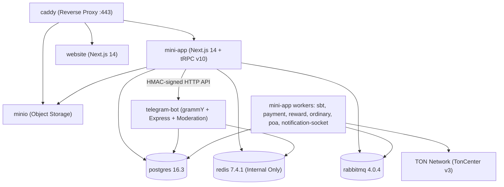
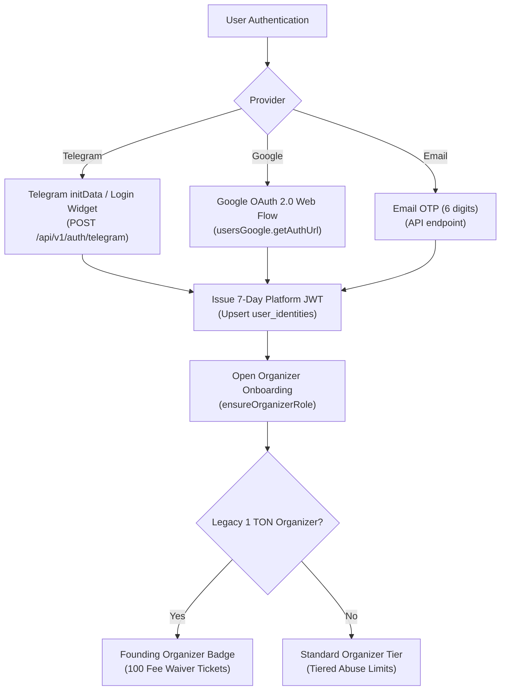

# ONTON Platform — AS-IS Technical Blueprint

> **Active Development & Staging Architecture**  
> **Last verified against `dev`:** 2026-10-10 (commit `6413f8c3`)  
> **Staging Environment:** Host `65.109.182.13` (Docker Swarm stack `onton-dev`)  

> [!IMPORTANT]
> This file describes the active **`dev` branch** and the running **Staging** environment as of October 10, 2026 (ONTON 2.1 Wave 1).
> The live **Production** server (`65.109.212.86`) currently runs the `main` branch (commit `25c897c7`), which is documented separately in [legacy_technical_blueprint.md](legacy_technical_blueprint.md).
> Target architecture and future roadmap live in [to_be_technical_blueprint.md](to_be_technical_blueprint.md).

---

## 1. Environments & Deployment Status

| Environment | Current Architecture & Topology |
|---|---|
| **Staging (`dev`)** | Host `65.109.182.13`. Docker Swarm stack `onton-dev` (`docker-compose-server-dev.yml`). Public URL `https://app.dev.onton.live`. Auto-deployed by CI on every push to `dev`. All workers and notification socket run 0 replicas on staging. |
| **Production (`main`)** | Host `65.109.212.86`. Plain `docker compose` project `local-onton` (`docker-compose.yml`), built directly on the server with `--profile full`. Deployed **manually** (see [legacy_technical_blueprint.md](legacy_technical_blueprint.md)). |
| **CI Deploy Targets (F-04)** | `.github/workflows/build-push-deploy.yml`: pushes to `dev` deploy to stack `onton-dev` on the staging host; pushes to `main` deploy to stack `onton` **on the same staging host**. No automated production deployment exists. |
| **Bot Identities** | Production `@theontonbot`, staging `@notnonstagebot`, local dev `@ontonlocaldevbot`. |
| **Repositories / Images** | GitHub `ExecutESG/onton`; container images at `ghcr.io/executesg/onton/<service>`. |
| **Database Backups** | Backup helper scripts exist (`devops/backup_scripts/`), but cron is not installed. **No automated production backups**. |
| **Network & Security** | Unauthenticated public Redis port (6379) closed in Swarm configs (`6413f8c3`). |

---

## 2. Active Services (`docker-compose.yml`, profile `full`)

```mermaid
flowchart TD
    Caddy["caddy (Reverse Proxy :443)"] --> MiniApp["mini-app (Next.js 14 + tRPC v10)"]
    Caddy --> Website["website (Next.js 14)"]
    Caddy --> MinIO["minio (Object Storage)"]
    
    MiniApp --> PG[("postgres 16.3")]
    MiniApp --> Redis[("redis 7.4.1 (Internal Only)")]
    MiniApp --> MinIO
    MiniApp --> Rabbit[("rabbitmq 4.0.4")]
    
    MiniApp -->|"HMAC-signed HTTP API"| Bot["telegram-bot (grammY + Express + Moderation)"]
    Bot --> PG
    Bot --> Redis
    
    Workers["mini-app workers: sbt, payment, reward, ordinary, poa, notification-socket"] --> PG
    Workers --> Rabbit
    Workers --> TON["TON Network (TonCenter v3)"]
```

### Profile & Configuration Notes:
- **Profile `full`** includes: `caddy`, `postgres`, `redis`, `minio`, `rabbitmq`, `mini-app`, `telegram-bot`, `website`, 6 workers, `clamav`, `pgadmin`, `metabase` (v0.50.18.3), `client-web`, `swagger-ui`. Running `docker compose up` without `--profile` starts nothing.
- **Staging divergence (`docker-compose-server-dev.yml`)**: mini-app, telegram-bot and website run 1 replica; **all 6 workers and the socket run 0 replicas**; no rabbitmq, metabase, pgadmin or clamav. Includes Caddy, registry, elasticsearch, fluentd.
- **Security hardening**: Swarm Redis port 6379 is strictly bound internally and no longer exposed publicly (`6413f8c3`).

---

## 3. Module Inventory

| Module | Stack | Status on `dev` |
|---|---|---|
| `mini-app` | Next.js 14.2.28 App Router, tRPC v10, Drizzle ORM, Node 22 | **Active core service**; serves organizer panel, attendee flows, door scanner, and runs all worker processes. |
| `telegram-bot` | grammY + Express, raw `pg` pool (`telegram-bot/src/db/pool.ts`), `ts-node` | **Active**; includes bot commands, Stars payments, `/limits`, `/payout`, and **integrated moderation composer** (`telegram-bot/src/composers/moderationComposer.ts`). |
| `website` | Next.js 14.2.35 | **Active**; public landing, blog, events directory, glossary, csbt validation page. |
| `client-web-panel` | Next.js 13 Pages Router, JavaScript, MUI, RTK Query | Local compose (`full`) only; not deployed to server stacks. |
| `participant-tma` | — | **Decommissioned** (Epic #1022). Source removed from repo. 4 explicit `/ptma` rewrites configured in `mini-app/next.config.js` (`/ticket`, `/ticket/qrcode`, `/buy-ticket`, `/event`). |
| `newton/apps/nft-manager` | NestJS + Prisma | **Not deployed**; loops and background watchers are commented out. |

---

## 4. Background Workers (Image: `mini-app`)

| Scheduler | Main Cron Jobs & Consumers |
|---|---|
| **Payment** (`cronJobSchedulerPayment.ts`) | `order.paid` consumer; `CheckTransactions` (every 7s, TonCenter v3); `MintNFTForPaidOrders` (every 9s); `UpdateEventCapacity` (24s); `TsCsbtTicketOrder` (11s); payment reminders (4h); wallet balances. *Note: `CreateEventOrders` and `OrganizerPromoteProcessing` were removed in ONTON 2.1.* |
| **Reward** (`cronJobSchedulerReward.ts`) | `CreateRewards` (1m, no-op unless `ENABLE_TON_SOCIETY=true`); reward notifications; tournaments. |
| **Ordinary** (`cronJobSchedulerOrdinary.ts`) | User block check, single-use invite links, click batches, tournaments, promo codes, wallet balance monitoring. |
| **NFT-API** (`cronJobSchedulerNFTApi.ts`) | `deployNFTApiCollections`, `mintNFTApiCollections` (5s). |
| **POA Worker** (`poaWorker.ts`) | Database polling every 4s for attendance verification; no RabbitMQ dependency. |
| **Notification Socket** (`sockets/index.ts`) | Standalone WebSocket server; port configured via `SOCKET_PORT`; Telegram initData auth. |

---

## 5. Data Layer & Migrations

- **Database Engine**: Single PostgreSQL 16.3 instance.
- **Drizzle Schema**: Main schema in `mini-app/src/db/schema.ts` plus modular schemas in `mini-app/src/db/schema/`.
- **Migration Status**: **134 SQL migration files** in `mini-app/drizzle/`, ending with `0134_plain_ticket_type.sql`.
  - `0122_add_sbt_tables.sql`: Native TEP-85 SBT collections and items.
  - `0123_user_identities.sql`: Multi-provider identity table (`user_identities`).
  - `0124_order_dlq.sql`: Order dead-letter failure logging.
  - `0125_event_ticket_tiers.sql`: Multi-tier event ticketing (`event_ticket_tiers`).
  - `0126_event_reports.sql`: Structured abuse reporting and auto-quarantine.
  - `0127_add_has_web3_to_events.sql`: Progressive Web3 disclosure toggle (`events.has_web3`).
  - `0128_founding_organizers.sql`: Founding organizer backfill and 100 free ticket fee waivers (`users.founding_organizer_at`, `users.fee_waiver_tickets_remaining`).
  - `0129_organizer_limits.sql`: Tiered abuse limits override column (`users.limits_override`).
  - `0131_organizer_payouts.sql`: Organizer revenue payouts table (`organizer_payouts`) and `event_payment_info.payout_reminder_sent_at`.
  - `0134_plain_ticket_type.sql`: Adds `'TICKET'` value to `ticket_types` enum for Web3-optional passes.
- **Migration Execution Rule**: **NEVER run `yarn db:migrate`** (stale Drizzle snapshot journal). Apply all migrations manually: `psql -v ON_ERROR_STOP=1 -f mini-app/drizzle/<file>.sql`.
- **Redis Cache & Locks**: Redis 7.4.1 (in-memory, no AOF/RDB). Stores rate limits, OTP codes, TonProof challenges, Google OAuth states, and concurrency locks.

---

## 6. Authentication & Organizer Onboarding

```mermaid
flowchart TD
    Login["User Authentication"] --> Providers{"Provider"}
    Providers -- "Telegram" --> TGAuth["Telegram initData / Login Widget\n(POST /api/v1/auth/telegram)"]
    Providers -- "Google" --> GoogleAuth["Google OAuth 2.0 Web Flow\n(usersGoogle.getAuthUrl)"]
    Providers -- "Email" --> EmailAuth["Email OTP (6 digits)\n(API endpoint)"]
    
    TGAuth --> JWT["Issue 7-Day Platform JWT\n(Upsert user_identities)"]
    GoogleAuth --> JWT
    EmailAuth --> JWT
    
    JWT --> OpenOnboarding["Open Organizer Onboarding\n(ensureOrganizerRole)"]
    OpenOnboarding --> CheckFounding{"Legacy 1 TON Organizer?"}
    CheckFounding -- "Yes" --> Badge1["Founding Organizer Badge\n(100 Fee Waiver Tickets)"]
    CheckFounding -- "No" --> StandardOrg["Standard Organizer Tier\n(Tiered Abuse Limits)"]
```

### Key Auth & Onboarding Features:
1. **Multi-Provider Identity**: Platform JWT (7-day validity) issued across Telegram initData, Telegram Login Widget, Google OAuth, and Email OTP. Stored in `user_identities` (migration 0123).
2. **Open Organizer Onboarding (#1031)**:
   - Mandatory 1 TON organizer payment gate eliminated.
   - `ensureOrganizerRole` auto-promotes any authenticated user to `organizer` when creating an event.
   - Legacy organizers who paid 1 TON are backfilled as **Founding Organizers** (migration 0128) with a permanent badge and 100 ticket fee waivers.
3. **Tiered Abuse Limits (`organizerLimits.ts`)**:
   - Organizers without verified trust start with safe default limits (max 3 active events, 100 capacity, rate limits).
   - Admins can override limits per organizer via the bot command `/limits <user_id> <limits_json>` (migration 0129).
4. **TonProof Verification**: Cryptographic TonProof challenge/response router (`tonProofRouter.ts`) issues a 2-week wallet session JWT.

---

## 7. Event Lifecycle, Check-in & Credentials

- **Zero Upfront Event Creation Fees (#1033)**:
  - Organizers create and publish free and paid events with **zero upfront platform fees**.
  - Upfront `event_creation` and `event_capacity_increment` orders are removed (`c1ce9638`).
  - Free and paid events publish immediately. Moderation occurs post-publishing.
- **Abuse Reporting & Auto-Quarantine**:
  - Attendees can report events (`event_reports`, migration 0126).
  - Receiving 3+ abuse reports within 1 hour automatically quarantines an event.
- **Dynamic TOTP Anti-Fraud Passes**:
  - Check-in passes utilize rotating TOTP tokens (`mini-app/src/lib/totp/passToken.ts`, 20s time step ±1).
  - Static UUID passes are strictly rejected at the scan step.
- **Unified Door Check-in Scanner (`145ac32b`)**:
  - Unified mobile camera scanner for event organizers and designated check-in officers.
- **Wallet-Optional Attendees (#1032, #1044)**:
  - Attendees can register, check in, and complete Proof-of-Attendance (PoA) without connecting a TON wallet.
  - Hardcoded universal PoA password override backdoor **completely removed** (F-30 resolved).
- **Credentials Suite**:
  - Native in-repo TEP-85 SBT engine (`mini-app/src/services/sbtService.ts`, `mini-app/src/lib/sbt.ts`).
  - Off-chain claim is free; on-chain crystallization requires an opt-in network transaction.
  - cSBT Merkle proof endpoint (`GET /api/v1/csbt/proof?eventUuid=&userId=`).

---

## 8. Payments & Organizer Payouts

| Rail | Fulfillment Flow |
|---|---|
| **TON / USDT** | `POST /api/v1/order` → TonConnect transfer with memo `onton_order=<id>` → `CheckTransactions` cron polls TonCenter v3 (7s) → state `processing` → `MintNFTForPaidOrders` (9s) fulfills order. |
| **Plain `TICKET` (#1032)** | Migration 0134 introduces `'TICKET'` payment type. Allows paid ticketing without mandatory Web3 NFT/SBT minting. |
| **Telegram Stars** | `POST /api/v1/order/stars-invoice` → bot `createInvoiceLink` → `successful_payment` hook marks completed and issues ticket. |
| **Free RSVP** | Order created as `completed`; ticket record inserted immediately with zero gas. |

### Organizer Payout Architecture (#1033):
- Paid event ticket revenues accumulate in the ONTON platform treasury.
- Table `organizer_payouts` (migration 0131) tracks settled payouts to event organizers with tx hash, amount, and timestamp.
- Admins trigger payouts using the bot command `/payout <event_uuid> <tx_hash> [amount] [token_symbol]`.
- The bot calls the mini-app HMAC-authenticated endpoint `POST /api/v1/payout`.
- Organizers monitor event gross ticket sales and payout status directly in the **Treasury View** (`d3af1f11`).

---

## 9. CI/CD Pipeline (`.github/workflows/build-push-deploy.yml`)

1. **determine-services**: Path-based matrix mapping changes to `mini-app`, `telegram-bot`, `website`, `caddy`.
2. **validate-services**: Runs `yarn lint:quiet` and `yarn test:api` (Vitest) for mini-app; `yarn run build` for telegram-bot.
3. **build-and-push**: Builds multi-platform Docker images and pushes to GitHub Container Registry (`ghcr.io/executesg/onton/*`).
4. **deploy**: SSH connection to `SSH_DEV_IP` (`65.109.182.13`); updates Docker Swarm stack `onton-dev` (or `onton` for main); executes post-deploy Playwright smoke suite (`smoke.spec.ts`).

---

## 10. Automated Testing

- **Unit & Integration**: Vitest for mini-app (`cd mini-app && yarn test:api`). Tests live in `__tests__/`, `src/**/*.test.ts`, and `src/**/*.spec.ts`.
- **E2E Playwright**: Test suite located in `tests/e2e/`. Smoke tests: `npx playwright test smoke.spec.ts`. Real staging suite: `npx playwright test -c playwright.real.config.ts` (strictly rejects production targets).

---

## 11. Technical Debt & Flaw Status (Verified)

| Flaw / Debt Item | Status on `dev` | Details |
|---|---|---|
| **F-30 Universal PoA Backdoor** | **RESOLVED** | Hardcoded universal override password removed in commit `da2a2ef1` (#1044). |
| **Swarm Public Redis Port** | **RESOLVED** | Public port 6379 exposure removed in commit `6413f8c3`. Redis is strictly internal. |
| **F-27 Email OTP UI** | **MITIGATED** | Email OTP UI hidden/streamlined on staging pending dedicated email SMTP transport integration. |
| **F-36 SBT Auto-Mint Overlap** | **MITIGATED** | Auto-minting SBT on check-in disabled; free claim vs paid on-chain upgrade path clarified. |
| **F-04 CI Target Discrepancy** | **OPEN** | CI workflow deploys `main` to the staging server. Production deployment remains manual. |
| **F-33 Stars Pre-Checkout Validation** | **OPEN** | Stars pre-checkout webhook approves without verifying order state, price peg, or ticket tier capacity. |
| **F-34 Ticket Tier `sold_count`** | **OPEN** | Paid ticket purchases do not atomically increment `event_ticket_tiers.sold_count`. |
| **F-35 cSBT Proof Anchoring** | **OPEN** | Merkle trees are constructed on demand per HTTP request; smart contract anchor (`csbt_anchor.fc`) is not deployed. |
| **Production DB Backups** | **OPEN** | Backup scripts exist, but no automated backup cron is active on the production server. |
| **Monolith Bundling** | **OPEN** | `mini-app` container image serves frontend, API, and all 6 background workers; Webpack injects Node polyfills. |
