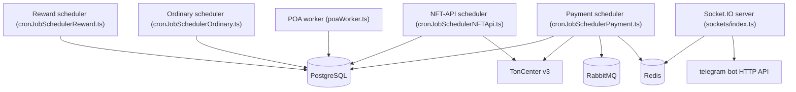

# Background Workers

> Last verified against dev: 2026-10-03

All workers live in `mini-app/src/workers/` and run from the mini-app image with different `command`s. Schedulers use the `cron` package.

---

## 1. Topology

---

## 2. Schedulers

### 2.1 Payment (`cronJobSchedulerPayment.ts`)
Starts the `order_paid` consumer, then schedules:

| Task | Interval |
|---|---|
| `CheckTransactions` (TON/USDT verification, `confirming` → `processing`) | 7 s |
| `MintNFTForPaidOrders` (`processing` → `completed`, NFT mint) | 9 s |
| `TsCsbtTicketOrder` | 11 s |
| `CreateEventOrders` (unhides paid events after creation order is paid) | 19 s |
| `OrganizerPromoteProcessing` | 21 s |
| `UpdateEventCapacity` | 24 s |
| `sendPaymentReminder` | 4 h |
| `runPendingCallbackTasks` | 60 s |
| `createWalletsForUpcomingEvents` | 7 s |
| `distributeRafflesTon`, `sendAllPendingPrizeNotifications` | 50 s |
| `runCollectionSnapshot` | daily at midnight |

### 2.2 Reward (`cronJobSchedulerReward.ts`)
- `CreateRewards` every 1 min. Returns early unless `ENABLE_TON_SOCIETY === "true"`.
- `notifyUsersForRewards` every 3 min; `CheckSbtStatus` (prod only).
- `processRecentlyEndedTournaments`, `sendTournamentRewardsNotifications`.
- `checkAndEnrollUserInPlay2WinCampaign` is still scheduled.

### 2.3 Ordinary (`cronJobSchedulerOrdinary.ts`)
- `CheckAllUsersBlock` daily 01:00.
- `generateInviteLinksCron`, `consumeClickBatch`, `updateAllTournaments`, `sendPendingPromoCodes`, `syncOngoingTournamentsLeaderboard`.
- `syncPlay2WinScores` is still scheduled.
- `updateAllUserWalletBalances` (prod only).
- There is no order-expiry, inventory-restore, or Redis-pruning task.

### 2.4 NFT-API (`cronJobSchedulerNFTApi.ts`)
- `deployNFTApiCollections` and `mintNFTApiCollections`, both every 5 s. Nothing else (no Merkle or SBT aggregation).

### 2.5 POA (`poaWorker.ts`)
- DB polling loop, `WORKER_INTERVAL` = 4 s. Creates POA trigger notifications for ongoing events. No RabbitMQ.

### 2.6 Socket server (`mini-app/src/sockets/index.ts`)
- Port from the required `SOCKET_PORT` env var. Auth is Telegram initData only.

---

## 3. RabbitMQ use
- Queues: `${STAGE_NAME}-notifications`, `-tg_messages`, `-order_paid` (`mini-app/src/sockets/constants.ts`).
- Dead-letter exchange plus a 5 s retry queue exist only for notifications.
- `order_paid` is published by `CheckTransactions` (`mini-app/src/lib/orderEvents.ts`) and consumed by `mini-app/src/workers/orderPaidConsumer.ts`, which calls `processSinglePaidOrder`.
- Mint failures: after 5 retries the order is set to `failed` with a `[DLQ ALERT]` log line. This is a DB state, not a queue.

---

## 4. Container ↔ script mapping

| Compose file | Service | Script |
|---|---|---|
| `docker-compose.yml` (local, prod via `--profile full`) | `mini-app-sbt-worker` | `start-cron-nft-api` |
| `docker-compose.yml` | `mini-app-payment-worker` | `start-cron-payment` |
| `docker-compose-server.yml` / `docker-compose-server-dev.yml` | `mini-app-sbt-worker` | `start-cron-payment` (no payment-worker service) |
| `docker-compose-server-dev.yml` | nft-api-worker | `local:start-cron-nft-api` (reads `../.env`) |

On staging (`onton-dev`), all workers and the socket server run 0 replicas.

---

## 5. Changes in 2.0
- `mini-app-moderation-bot` removed; moderation moved to `telegram-bot` (`3b51b56e`). Leftover helpers remain in `mini-app/src/moderationBot/{helpers,menu,types}.ts`.
- Play2Win UI retired (`11115887`), but its crons are still scheduled (see 2.2, 2.3).
- `order_paid` queue and consumer added (`e82dbf62`); retry/failed state for mints (`60e51a64`, migration `0124`); Redis lock in mint (`89db85e9`).

## Known issues (tracked in QA)
- F-35: `order_paid` consumer likely failing; the 9 s mint cron is the real fulfillment path.
- Worker service names do not match the script they run (see section 4).
