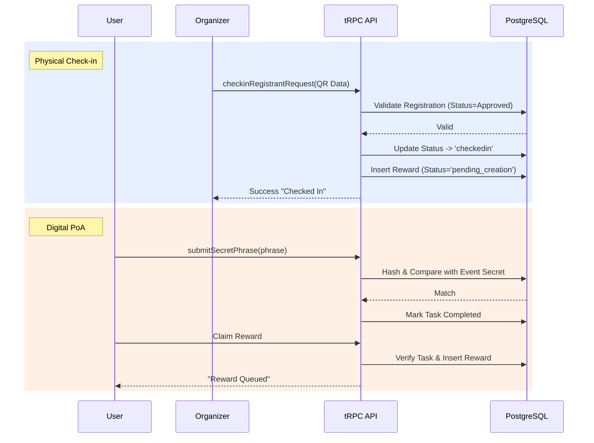

# Check-in & Proof of Action (PoA)

ONTON supports both physical and digital verification methods to confirm attendee participation and trigger reward distribution.

## 1. Physical Check-in (QR Code)
Used for in-person events where the Organizer scans a participant's ticket.

*   **Endpoint:** `registrant.checkinRegistrantRequest`
*   **Flow:**
    1.  **Scan:** Organizer scans User's QR Code.
    2.  **Validation:** System verifies:
        *   Event is `in_person`.
        *   User has `approved` registration.
        *   User is not already checked in.
    3.  **Action:**
        *   Updates status to `checkedin`.
        *   **Reward Trigger:** Automatically inserts a `pending_creation` row into the `rewards` table. This cues the background worker to mint the SBT.

## 2. Digital PoA (Secret Phrase)
Used for online events or quests where physical presence isn't applicable.

*   **Mechanism:** Secret Phrase (Password) Validation.
*   **Setup:** Organizer sets a `secret_phrase` during Event Creation.
*   **Flow:**
    1.  User attends the online event (e.g., AMA, Stream).
    2.  Organizer reveals the Secret Phrase.
    3.  User enters the phrase in the Mini App.
    4.  **Validation:** `userEventFieldsDB.checkPasswordTask` verifies the hash.
    5.  **Action:** Marks the task as completed, allowing the user to claim the reward.

## 3. Reward Trigger Linkage
Both methods ultimately lead to the same outcome: qualifying the user for a reward.

*   **Physical:** Check-in -> Auto-insert Reward Row.
*   **Digital:** Task Complete -> User Clicks "Claim" -> `createTonSocietySBTReward` logic verifies task -> Inserts/Returns Reward.

## 4. Sequence Diagram

