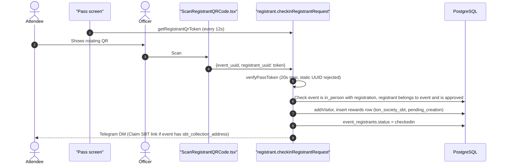

# Check-in, Proof of Attendance (PoA) & Credentials

> Last verified against dev: 2026-10-03

Covers door check-in with rotating QR passes, the online secret-phrase PoA, native SBTs, and the off-chain cSBT Merkle proofs.

---

## 1. Rotating QR passes

`mini-app/src/lib/totp/passToken.ts`:

| Property | Value |
|---|---|
| Format | `ONTON:v1:<uuid>:<epochStep>:<sig>` |
| Signature | HMAC-SHA256 over `uuid:step`, truncated to 16 hex chars, compared with `timingSafeEqual` |
| Step | 20s, accepts ±1 step |
| Static UUID | Rejected ("Static pass codes are no longer accepted") |
| Secret | `TOTP_SECRET` env |

Issuing (owner only):
- `registrant.getRegistrantQrToken` — for registration-based events. UI: `mini-app/src/app/_components/Event/RegistrantCheckInQrCode.tsx`.
- `ticket.getTicketQrToken` — for paid tickets. UI: `mini-app/src/app/tickets/[id]/qrcode/page.tsx`.
- Both UIs refetch every 12s and show a 20s progress bar.

---

## 2. Check-in flows

All scan/check-in procedures use `eventManagementProtectedProcedure`: global admin, owning organizer, event `admin`, or event `checkin_officer` (whitelist in `mini-app/src/server/accessRolesPathConfig.ts`).

### 2.1 Registrant check-in (free events with registration)

```mermaid
sequenceDiagram
    autonumber
    actor Attendee
    participant Pass as "Pass screen"
    actor Officer
    participant Scanner as "ScanRegistrantQRCode.tsx"
    participant API as "registrant.checkinRegistrantRequest"
    participant DB as PostgreSQL

    Pass->>API: getRegistrantQrToken (every 12s)
    Attendee->>Officer: Shows rotating QR
    Officer->>Scanner: Scan
    Scanner->>API: {event_uuid, registrant_uuid: token}
    API->>API: verifyPassToken (20s step, static UUID rejected)
    API->>DB: Check event is in_person with registration, registrant belongs to event and is approved
    API->>DB: addVisitor, insert rewards row (ton_society_sbt, pending_creation)
    API->>DB: event_registrants.status = checkedin
    API-->>Attendee: Telegram DM (Claim SBT link if event has sbt_collection_address)
```

- File: `mini-app/src/server/routers/registrant.ts`. A Redis lock prevents double processing.
- Only `has_registration && participationType === "in_person"` events.
- Status transition: `approved → checkedin`.
- It does **not** mint an SBT.

### 2.2 Ticket check-in (paid events)

File: `mini-app/src/server/routers/tickets.ts`.
1. `ticket.getTicketByUuid` (scan step): requires a live pass token; static UUIDs are rejected.
2. `ticket.checkInTicket`: checks the ticket belongs to the event. It verifies the token if a dynamic token is sent; it also accepts the already-resolved order UUID from the scan step (by design, only for authorized managers).
3. `ticketDB.checkInTicket` (`mini-app/src/db/modules/ticket.db.ts`) sets `tickets.status = USED` and syncs the registrant to `checkedin`.
4. If the attendee has a `wallet_address`, a native SBT is minted immediately and the reward is stored as `created`.

Ticket status enum: `UNUSED | USED`.

### 2.3 Scanner UIs (mini-app)

| Component | Behavior |
|---|---|
| `mini-app/src/app/_components/Event/ScanRegistrantQRCode.tsx` | Keeps the scan popup open between scans; haptic feedback on result |
| `mini-app/src/app/_components/checkInGuest/CheckInGuest.tsx` | Closes the popup after each scan; organizer taps to confirm check-in |

---

## 3. Online PoA (secret phrase)

For online events **without registration**:
1. In `addEvent`, a secret phrase is accepted only for non-in-person events. It is trimmed, lowercased, bcrypt-hashed, and stored as a `secret_phrase_onton_input` event field.
2. The attendee submits the phrase through `userEventFields.upsertUserEventField` (`mini-app/src/server/routers/userEventFields.ts`):
   - rate limited;
   - only during the event window;
   - bcrypt compare;
   - the hashed answer is stored.
3. The same check is reachable over sockets (`mini-app/src/sockets/handlers/notificationReply.ts`).

PoA prompts: `EventPOA.Create` / `EventPOA.Info` (`mini-app/src/server/routers/POA.ts`, event managers only). The POA worker (`poaWorker.ts`) polls the DB every 4s and sends the triggers as notifications.

---

## 4. Native SBTs (TEP-85)

| Part | File | Notes |
|---|---|---|
| Contract helpers | `mini-app/src/lib/sbt.ts` | Minter wallet from `MNEMONIC`, checked against `ONTON_MINTER_WALLET`; embedded collection/item code |
| Service | `mini-app/src/services/sbtService.ts` | `getOrCreateEventSbtCollection` (metadata to MinIO `sbt-collections/`), `mintSbtBadge` (idempotent per user+event), `verifySbtOwnership` (DB + TonCenter), `revokeSbtBadge` |
| Router | `mini-app/src/server/routers/sbt.ts` | see below |
| Tables | `sbt_collections`, `sbt_items`, `sbt_reward_collections` | |

`sbt` router access:

| Procedure | Access | Notes |
|---|---|---|
| `mintBadge` | Global admin only | |
| `claimAttendanceSbt` | Ticket owner only | Requires ticket `USED`; free |
| `materializeOnChainSbt` | Ticket owner only | Requires a payment of ≥ 0.095 TON to the treasury with memo `sbt_upgrade:<ticketUuid>` (`SBT_ONCHAIN_UPGRADE_PRICE = 0.1` in `mini-app/src/constants.ts`); check skipped in local env |
| `getUserBadges`, `getTicketCsbt`, other reads | Public | `getUserBadges` merges native SBTs with legacy TON Society rewards |

---

## 5. cSBT Merkle proofs (off-chain)

| Part | File | Behavior |
|---|---|---|
| Leaf | `mini-app/src/lib/csbt/leaf.ts` | SHA256(uint64 index ‖ 33-byte owner ‖ 16-byte eventUuid ‖ 32-byte metaHash). No timestamp |
| Tree | `mini-app/src/lib/csbt/merkleTree.ts` | Plain binary Merkle tree (not sparse); odd node duplicated; node hash = TON cell hash |
| Proof API | `mini-app/src/app/api/v1/csbt/proof/route.ts` | `GET /api/v1/csbt/proof?eventUuid=…&userId=…` (also `collectionAddress`, `walletAddress`, `leafIndex`). No auth, CORS `*` |
| Anchor contract | `contracts/csbt_anchor.fc` | Stores `merkle_root`, op `update_merkle_root`, inclusion check, getter |

How it works today:
- The tree is built in memory **on every request** from all `checkedin` registrants of the event (ordered by id). Nothing is stored in MinIO or the DB at check-in.
- The root therefore changes with every new check-in.
- No code deploys `csbt_anchor.fc` or sends `update_merkle_root`, so roots are not anchored on chain.
- `sbt.getTicketCsbt` uses the same per-request tree.

---

## 6. Badges, stories, chat access

- Badges page: `mini-app/src/app/(navigation)/my/badges/page.tsx` (uses `sbt.getUserBadges`). Legacy TON Society badges are shown next to native ones.
- Story sharing: `WebApp.shareToStory(badgeImageUrl, { widget_link })` with the raw badge image (`mini-app/src/hooks/useTelegramStory.ts`, `mini-app/src/components/sbt/BadgeDetailModal.tsx`). No card rendering.
- Event group access: single-use invite links (`member_limit: 1`) sent to approved/checked-in registrants by `generateInviteLinksCron.ts` and after an order (`mini-app/src/lib/eventInviteService.ts`). Links of rejected users are revoked. No join-request checks.

---

## Roadmap / not implemented
- On-chain anchoring of cSBT Merkle roots (contract exists, no caller).
- Persisted cSBT trees.

## Known issues (tracked in QA)
- F-30: PoA has a universal override; slated for removal.
- F-35: cSBT proofs are rebuilt per request and not anchored on chain.
- F-36: SBT is free at ticket check-in (wallet linked) and via `claimAttendanceSbt`, while `materializeOnChainSbt` charges for the on-chain upgrade.
- `TOTP_SECRET` (and other secrets) have insecure fallbacks if unset; set them in every environment.
