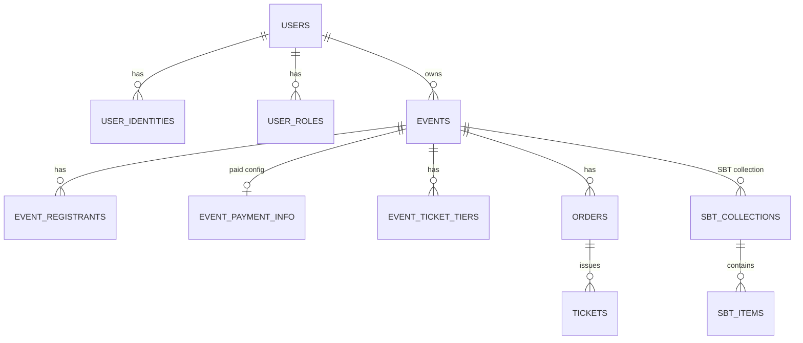

# Database Schema

> Last verified against dev: 2026-10-03

The live platform uses one PostgreSQL database for `mini-app` (Drizzle ORM). Schema entry point: `mini-app/src/db/schema.ts`; table files in `mini-app/src/db/schema/`; enums in `mini-app/src/db/enum.ts`.

The env file still defines a second database for the `nft-manager` service (`POSTGRES_NFT_MANAGER_DB`, `DATABASE_URL_NFT_MANAGER`), but that service is not deployed. See [backend_nft_manager.md](backend_nft_manager.md).

## 1. Users & access

| Table | Key columns / notes |
|---|---|
| `users` | `user_id` bigint PK (Telegram ID, or random ≥ 1e14 for web-only users); `uuid`, `email` (indexed, not unique), `auth_provider` (default `telegram`), `telegram_id`; `username`, `first_name`, `last_name`, `photo_url`, `is_premium`; `wallet_address`; `role` text (`user`, `organizer`, `admin`, `ban`); `user_point`; `affiliator_user_id`; `org_*` fields |
| `user_identities` | `id` uuid PK; `user_id` → `users.user_id` (cascade); `provider` varchar (`telegram`, `google`, `email`, `ton_wallet`); `provider_user_id`; `provider_metadata` jsonb; `verified`; unique `(provider, provider_user_id)`. Migration `0123_user_identities.sql` |
| `user_roles` | Per-event roles. PK `(item_id, item_type, user_id, role)`; `item_type` = `event`; `role` = `owner`, `admin`, `checkin_officer`; `status` = `active`, `deactivate` |
| `user_custom_flags` | Per-user flags, including `api_key` (bcrypt-hashed) and `moderator` |
| `users_google`, `users_x`, `users_github`, `users_linkedin`, `users_outlook` | Connected social accounts |

## 2. Events, registration, tickets

| Table | Key columns / notes |
|---|---|
| `events` | `event_id` serial PK, `event_uuid` unique; `title`, `start_date`/`end_date` (integer epoch); `owner` → users; `participation_type` enum `in_person`/`online`; `enabled`, `hidden`; `has_registration`, `has_approval`, `has_waiting_list`, `has_payment`, `has_web3`; `capacity`; `category_id`; `ticketToCheckIn`; `sbt_collection_address`; `moderation_message_id` |
| `event_registrants` | Status enum `pending`, `rejected`, `approved`, `checkedin` |
| `event_fields` / `user_event_fields` | Custom event fields and user answers (incl. the online-event secret phrase) |
| `event_payment_info` | Paid-event config: price, recipient, token, NFT title/image/video, collection address, `bought_capacity` |
| `event_ticket_tiers` | `event_uuid` FK, `tier_name`, `price` (real), `capacity`, `sold_count`, `ticket_type`, `sort_order`. Migration `0125_event_ticket_tiers.sql` |
| `event_tokens` | `symbol`, `decimals`, `master_address` (set = jetton), `is_native` |
| `tickets` | `order_uuid` → orders, `event_uuid`, `user_id`, `status` enum `USED`/`UNUSED`, `nft_address`, `event_ticket_id` → `event_payment_info` |
| `visitors` | Visit / check-in records |
| `event_reports` | Abuse reports (one per user per event) |
| `event_poa_triggers` / `event_poa_results` | PoA prompts and answers |

## 3. Orders & payments

| Table | Key columns / notes |
|---|---|
| `orders` | `uuid`; `state` enum `new`, `confirming`, `processing`, `completed`, `cancelled`, `failed` (no `PAID` state); `order_type` `nft_mint`, `event_creation`, `event_capacity_increment`, `promote_to_organizer`, `ts_csbt_ticket`; `total_price`/`default_price` are `real`; `retry_count`, `last_error` (migration 0124), `tier_id` |
| `wallet_checks` | Last checked logical time per watched wallet, used by `CheckTransactions` |
| `nft_items` | Minted paid-ticket NFTs |
| `affiliate_links` | `link_hash`, `item_type`, `total_clicks`, `total_purchase`, `affiliator_user_id` |

Payment types enum: `USDT`, `TON`, `STAR`.

## 4. Credentials & rewards

| Table | Key columns / notes |
|---|---|
| `rewards` | `type` enum `ton_society_sbt`, `ton_society_csbt_ticket`; `status` enum: `pending_creation`, `created`, `created_by_ui`, `received`, `notified`, `notified_by_ui`, `notification_failed`, `failed`, `fixed_failed` |
| `sbt_collections` / `sbt_items` | Native TEP-85 SBT collections and items |
| `sbt_reward_collections` | Legacy reward collection mapping |

Other areas with their own tables: tournaments/games, tasks, raffles/merch, token campaign, NFT-API (`nft_api_*`), notifications, coupons.

## 5. Relations (main)

## 6. Migrations

- SQL files live in `mini-app/drizzle/` (last: `0127_add_has_web3_to_events.sql`).
- The drizzle journal is stale (some SQL files are missing from it). **Do not run `yarn db:migrate`.**
- Apply new SQL manually: `psql -v ON_ERROR_STOP=1 -f <file>.sql`.
- Some modules also create their tables at runtime if missing (`ensureUserIdentitiesTable`, `ensureTicketTiersTable`).
