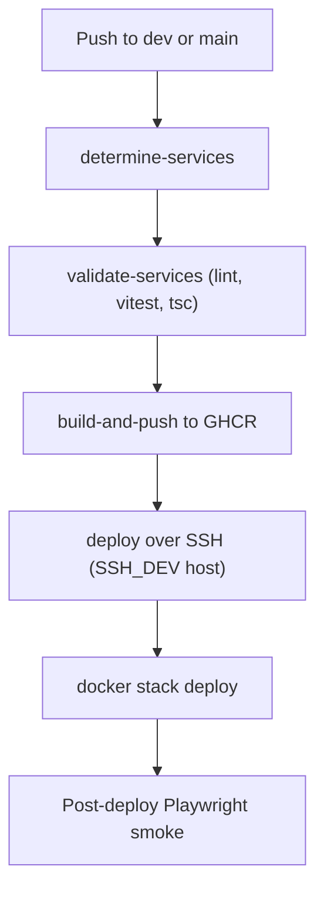

# ONTON Deployment Pipeline

> Last verified against dev: 2026-10-03

How `.github/workflows/build-push-deploy.yml` builds and deploys ONTON.

> [!IMPORTANT]
> The pipeline deploys **only to the staging host** (`65.109.182.13`). Both `dev` and `main` go there. Production (`65.109.212.86`) is deployed by hand. See [deployment_and_infrastructure.md](./deployment_and_infrastructure.md).

## 1. Overview



## 2. Triggers
- `push` to `dev`/`main`, filtered by path: `devops`, `Caddyfile`, server compose files, `mini-app`, `newton`, `telegram-bot`, `swagger`, `website`, `.github/workflows`, `Trigger-full-build.txt`.
- `pull_request` to `dev`/`main` (no path filter). Runs detection and validation only; build/deploy run on push or dispatch.
- `workflow_dispatch` with input `service` = `auto` | `all` | `<name>`.
- Concurrency cancels in-progress runs, except on `main`.

## 3. Jobs (four)

### `determine-services`
- Maps changed paths to services: `mini-app`, `telegram-bot`, `website`, `caddy` (`devops/` or `Caddyfile`).
- `Trigger-full-build.txt` changed → build all services.
- Nothing matched (e.g. only a server compose file changed) → defaults to `telegram-bot`.
- `swagger-ui` is in the build map but not in the detect map, so swagger changes do not rebuild it.
- Fails if the `TELEGRAM_*_FOR_DEPLOYMENT` secrets are missing.

### `validate-services` (Node 22)
- `mini-app`: `yarn lint:quiet` and `yarn test:api` (Vitest).
- `telegram-bot`: `yarn run build` (`tsc`).
- Runs only for changed services. No `type:check` step.

### `build-and-push`
- One image per service. Workers and the socket reuse the `mini-app` image with a different `command`; there are no separate worker images.
- Tags: `ghcr.io/executesg/onton/<service>:<branch>-<run_id>` and `:<branch>-latest`.
- Always builds `--target production`, with GitHub Actions cache.
- Build args come from `devops/export_env.py build_args "<BRANCH>_"`.

### `deploy`
- Writes `.env` from `<BRANCH>_`-prefixed secrets/vars.
- Target host: `dev` and `main` both use `SSH_DEV_IP` / `SSH_DEV_PORT`. Branch `staging` uses `SSH_STAGING_*`.
- SSH user `tonont`, directory `/home/tonont/<branch>`. Copies compose files, `.env`, `.dockerignore`, `swagger/`, `devops/` (not the `Caddyfile`).
- Regenerates the `Caddyfile` with `devops/generate-caddyfile-by-address.sh` only when `caddy` is being built.
- Labels the node `stage.<branch>=true` and creates overlay networks.
- `docker stack deploy --with-registry-auth --resolve-image always`, then `docker service update --force --update-failure-action rollback` per service. For `mini-app` it also reloads workers that have non-zero replicas. Then `docker image prune`.
- Cloudflare cache purge only on `main`.
- Post-deploy smoke: `npx playwright test smoke.spec.ts` against `https://app.dev.onton.live` (`dev`) or `https://app.onton.live` (`main`). It runs after deploy, so it is not a gate.
- The manual-approval step is commented out.

## 4. Branch mapping

| | `dev` | `main` |
| :--- | :--- | :--- |
| Host | staging (`SSH_DEV_*`) | staging (`SSH_DEV_*`) |
| Compose file | `docker-compose-server-dev.yml` | `docker-compose-server.yml` |
| Stack name | `onton-dev` | `onton` |
| Network | `onton-dev-network` | `onton-network-main` |
| Secrets prefix | `DEV_` | `MAIN_` |
| Image tag | `dev-latest` | `main-latest` |
| Replicas | mini-app 1, telegram-bot 1, website 1; all workers and socket 0 | mini-app `${SYS_MINI_APP_REPLICAS:-2}`, socket 5 |
| Caddy | global service in the stack | not in the compose file |

### Secrets
- GitHub secrets/vars are the source of truth. `DEV_MY_SECRET` becomes `MY_SECRET` in the server `.env`.
- A new env var `API_KEY` needs `DEV_API_KEY` and `MAIN_API_KEY` (and `STAGING_` if used).

## 5. Services in the server stacks
- Apps: `mini-app`, `telegram-bot`, `website`.
- Workers (mini-app image): sbt-worker (runs `start-cron-payment`), nft-api, reward, ordinary, poa, notification-socket.
- Infra (`onton-dev`): `caddy`, `postgres`, `redis`, `minio`, `registry`, `registry-ui`, `elasticsearch`, `fluentd`. No Kibana. No RabbitMQ.
- `participant-tma` and the moderation bot are removed.

## 6. Triggering a deploy
- Push to `dev` → stack `onton-dev` on staging.
- Push to `main` → stack `onton` on the **staging** host. This does not update production.
- Full rebuild: edit `Trigger-full-build.txt` and push.
- Watch the GitHub "Actions" tab and the deployment Telegram chat.

## 7. Troubleshooting

### Deploy passed but code did not update
- The pipeline already forces a service update. If needed, on the staging host:
  ```bash
  docker service update --force onton-dev_mini-app
  ```

### GHCR login fails
- `CR_PAT` is missing or expired. Create a PAT with `read:packages` and `write:packages` and update the secret.

### Database connection fails
- Check `DEV_DATABASE_URL` (or `MAIN_`) matches the stack's Postgres credentials.

### Caddy 404/502 on staging
- `generate-caddyfile-by-address.sh` may have produced a bad config. Check `docker service logs onton-dev_caddy`.

### Manual inspection
```bash
ssh -p <PORT> tonont@<IP>
docker service ls
docker service logs onton-dev_mini-app -f
```

## Known issues (tracked in QA)
- F-04: CI deploys `main` to the staging host; no automated prod deploy.
- The `main` smoke test hits the prod URL while the deploy went to staging.
- Staging runs no workers, socket or RabbitMQ.
- The generated `.env` (contains `CR_PAT`) stays on the server after deploy.
