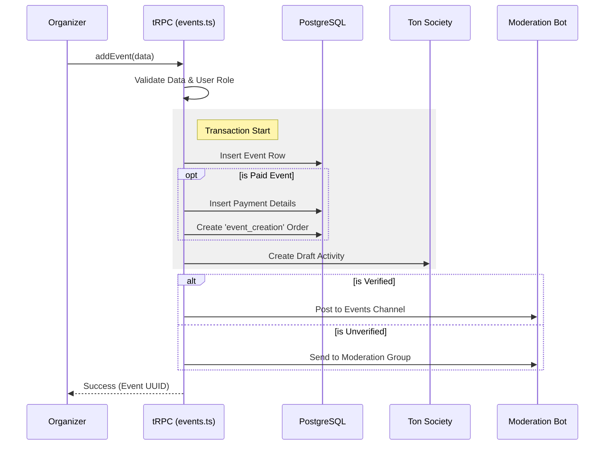

# Event Creation Lifecycle

The Event Creation process is the core workflow for Organizers. It involves data validation, optional payment configuration, third-party integration (Ton Society), and moderation.

## 1. Creation Flow (Technical)

The `addEvent` mutation in `src/server/routers/events.ts` handles the entire process within a database transaction.

### Phase 1: Validation
*   **Organizer Verification:** Checks if the user is `ts_verified`. Unverified organizers cannot publish to certain Hubs.
*   **Dates:** Ensures `end_date` > `start_date`.
*   **Payment Config:** If it's a paid event, validates `capacity`, `ticket_type`, and `payment_token`.

### Phase 2: Database Insertion
1.  **`events` Table:** Inserts core data (Title, Dates, Location, etc.).
2.  **`eventPayment` Table:** (If paid) Stores price, recipient address, and NFT metadata.
3.  **`orders` Table:** (If paid) Creates a `new` order of type `event_creation` for the organizer to pay the initial listing fee/gas.
4.  **`eventFields` Table:** Inserts dynamic fields (e.g., custom registration questions).

### Phase 3: External Integrations
*   **Ton Society:** Calls `CreateTonSocietyDraft` to sync the event with the Ton Society ecosystem.
*   **Telegram Notifications:**
    *   **Verified Organizers:** Immediately posts to the official Events Channel.
    *   **Unverified:** Sends a request to the **Moderation Group** via the Bot. The event remains hidden until approved.

## 2. Event States

*   **Draft/Hidden:** `enabled: false` or `hidden: true`.
*   **Moderation Pending:** `moderationMessageId` exists, but not yet approved.
*   **Published:** `enabled: true`, `hidden: false`.

## 3. Updating Events

The `updateEvent` mutation handles changes.
*   **Critical Restrictions:** Cannot change `has_payment` status after creation.
*   **Capacity Increase:** For paid events, increasing capacity triggers a *new* payment order (`event_capacity_increment`) that the organizer must pay before the new spots open up.

## 4. Sequence Diagram

