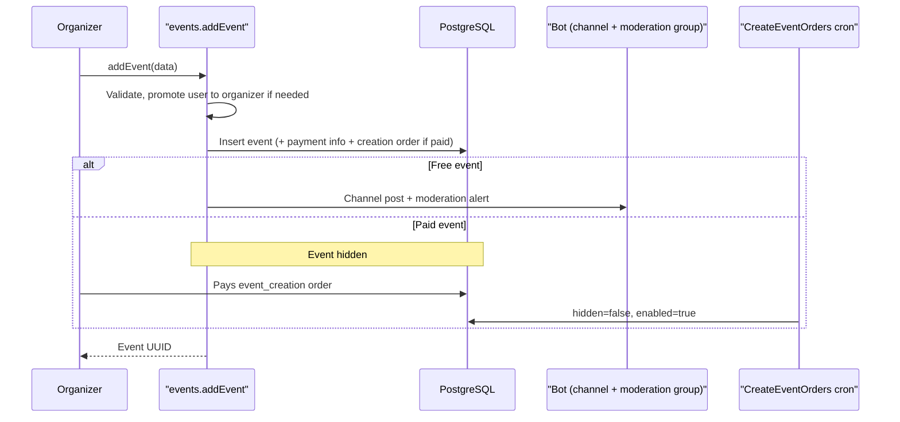

# Event Creation

> Last verified against dev: 2026-10-03

Main code: `addEvent` and `updateEvent` in `mini-app/src/server/routers/events.ts`.

## 1. Who can create

`addEvent` uses `initDataProtectedProcedure`: any logged-in, non-banned user. A user with role `user` is auto-promoted to `organizer` on their first event.

## 2. `addEvent` steps

### Validation
- Category must exist and be enabled (also checked in `updateEvent`).
- Start and end dates must both be present. There is no `end > start` check in the router.
- Secret phrase is accepted only for non-in-person events; it is trimmed, lowercased and bcrypt-hashed.
- Paid events: `has_registration` is forced to `true`; `ONTON_WALLET_ADDRESS` must be configured; `capacity`, `ticket_type` and a known `token_id` are required.

### Insert (one DB transaction)
1. `events`: `enabled: true`, `hidden` = true only for paid events (`shouldEventBeHidden` in `mini-app/src/db/modules/events.db.ts`), `capacity`, `has_approval`, `has_waiting_list`, `participationType`, `ticketToCheckIn = is_paid`, `has_web3`. Society hub defaults to "Onton" / 33.
2. Paid only:
   - `orders`: `order_type: event_creation`, `state: new`, price in TON from `getPaidEventPrice(capacity, ticketType)`.
   - `event_payment_info`: price (≥ 0.001, 3 decimals), recipient, NFT title/image/video, `collectionAddress: null`.
3. `event_fields`: custom fields, plus `secret_phrase_onton_input` when a secret phrase is set.

### TON Society (Decommissioned)
- TON Society draft creation and activity registration have been removed.

### Publishing
- **Free events**: published right away. The bot posts to the events channel and sends a post-publish moderation message to `MODERATION_GROUP_ID` with the menu Delist / Warn / Ban / Update.
- **Paid events**: stay hidden until the `event_creation` order is paid. The `CreateEventOrders` cron (`mini-app/src/cronJobs/tasks/CreateEventOrders.ts`, every 19s) then sets `hidden: false, enabled: true`.

The paid inputs in the UI are shown only when the `has_web3` toggle is on (`mini-app/src/app/_components/Event/steps/EventRegistration.tsx`).

```mermaid
sequenceDiagram
    participant Org as Organizer
    participant API as "events.addEvent"
    participant DB as PostgreSQL
    participant Bot as "Bot (channel + moderation group)"
    participant Cron as "CreateEventOrders cron"

    Org->>API: addEvent(data)
    API->>API: Validate, promote user to organizer if needed
    API->>DB: Insert event (+ payment info + creation order if paid)
    alt Free event
        API->>Bot: Channel post + moderation alert
    else Paid event
        Note over API,DB: Event hidden
        Org->>DB: Pays event_creation order
        Cron->>DB: hidden=false, enabled=true
    end
    API-->>Org: Event UUID
```

## 3. Event visibility states

| State | Columns |
|---|---|
| Published | `enabled: true`, `hidden: false` |
| Hidden (unpaid paid event, delisted, quarantined) | `hidden: true` and/or `enabled: false` |

Hidden or disabled events are visible only to the owner, admins and moderators (`getEvent`). `moderationMessageId` is not set by `addEvent`; `updateEvent` uses it for moderation follow-ups.

## 4. `updateEvent`

Access: `eventManagementProtectedProcedure` (admin, owning organizer, event `admin`).

- `has_registration` cannot be changed. If the event had no registration, `has_approval`, `capacity` and `has_waiting_list` are reset.
- `has_payment` cannot be changed; paid events must keep a capacity.
- Raising capacity on a paid event creates or updates an `event_capacity_increment` order at **0.06 TON per extra seat**. Capacity stays at the old value until it is paid.
- On paid events only the price and `recipient_address` of the payment info can change. The `bought_capacity` update is strictly scoped to the event.
- `has_web3` keeps its old value if omitted.
- `is_ts_verified` is always `false` (the ts_verified gate is retired).

## 5. Reports and moderation

- `reportEvent`: one report per user per event; reasons `phishing | impersonation | inappropriate | spam | other`.
- 3 or more reports within 1 hour auto-quarantine the event (`hidden: true, enabled: false`, `updatedBy: system_auto_quarantine`) and alert the moderation group.
- Moderation callbacks are handled in `telegram-bot/src/composers/moderationComposer.ts`: delist, relist, warn, ban (sets role `ban` and delists the organizer's events), dismiss report. Moderators are admins, users with the `moderator` flag in `user_custom_flags`, or Telegram IDs configured in the bot (env `ADMIN_TELEGRAM_ID` and a fixed list in code).
- Menus: `mini-app/src/moderationBot/menu.ts`.
