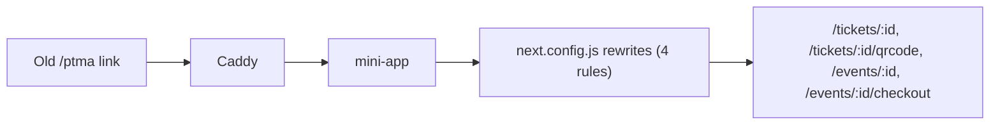

# Participant Telegram Mini App (TMA) — Decommissioned

> Last verified against dev: 2026-10-03

> [!CAUTION]
> `participant-tma` is decommissioned. Its attendee flows (ticket pass, rotating QR, checkout) now live in `mini-app`. The source directory `newton/apps/participant-tma` was removed in commit 77a4561d. Do not restore it.

## 1. Background

ONTON used to run two Next.js Mini Apps:

1. `mini-app`: organizer flows, tRPC API, workers.
2. `participant-tma`: attendee ticket browsing, checkout and QR pass.

This meant two containers, duplicated Telegram auth and theme code, and a Caddy rule that proxied `/ptma*` to a separate service.

## 2. What changed

| Item | Commit | Result in dev |
|---|---|---|
| Ticket pass and rotating QR (#1023) | e2858cc7 | `mini-app/src/app/tickets/[id]/page.tsx` and `mini-app/src/app/tickets/[id]/qrcode/page.tsx`. Pass tokens: `mini-app/src/lib/totp/passToken.ts` (20 s step). |
| Multi-rail checkout (#1024) | 50e37eed | `mini-app/src/app/events/[hash]/checkout/_components/CheckoutForm.tsx`. Rails: free, TON, USDT (jetton) and Telegram Stars. |
| `/ptma` rewrites (#1025) | 9ae0faba | 4 explicit rules in `mini-app/next.config.js` (below). |
| SBT claim and affiliate tracking on the ticket pass (#1026) | 4c5bded0 | In `mini-app`. |
| Docker, Caddy and CI removal (#1028) | c54d921f | Compose service commented out (not deleted) in `docker-compose.yml` and `docker-compose-server.yml`. `Caddyfile` keeps a comment that `/ptma` is handled by mini-app. |
| Source removal | 77a4561d | `newton/apps` now contains only `nft-manager`. |

## 3. Rewrites

`mini-app/next.config.js` has exactly these 4 rules. There is no `/ptma/:path*` catch-all. Other `/ptma` paths are not rewritten.

| Source | Destination |
|---|---|
| `/ptma/ticket/:id` | `/tickets/:id` |
| `/ptma/ticket/:id/qrcode` | `/tickets/:id/qrcode` |
| `/ptma/event/:id/buy-ticket` | `/events/:id/checkout` |
| `/ptma/event/:id` | `/events/:id` |

## 4. References

- [checkin_and_poa.md](./checkin_and_poa.md)
- [payment_system_overview.md](./payment_system_overview.md)
- [workflow_ticketing.md](./workflow_ticketing.md)
