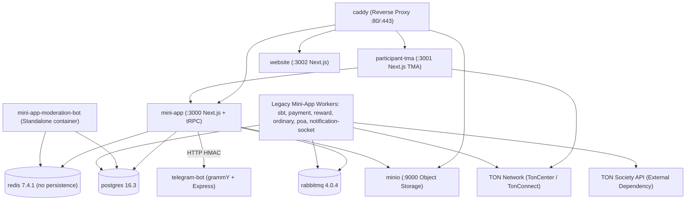
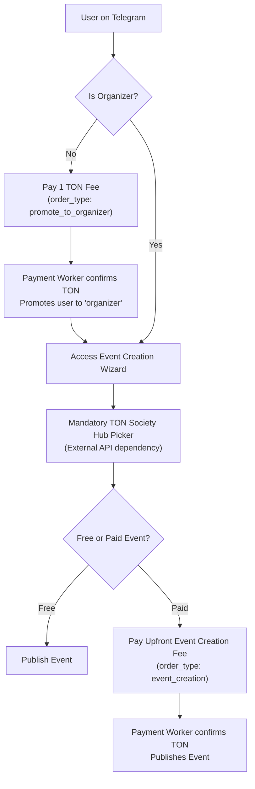

# ONTON Platform — Legacy Technical Blueprint

> **Baseline Reference: `main` Branch & Live Production**  
> **Last verified against `main`:** 2026-09-18 (commit `25c897c7`)  
> **Live Production Server:** Host `65.109.212.86` (plain `docker compose`, `--profile full`)  

This document specifies the legacy architecture of the ONTON platform as it exists on the `main` branch and currently operates on the live Production server (`65.109.212.86`). It represents ONTON prior to the 2.0 and 2.1 refactoring waves (which currently reside on the `dev` branch and Staging).

For the active development architecture, see [as_is_technical_blueprint.md](as_is_technical_blueprint.md). For future roadmap architecture, see [to_be_technical_blueprint.md](to_be_technical_blueprint.md).

---

## 1. Environment & Production Deployment

| Dimension | Legacy Production Baseline (`main` / `65.109.212.86`) |
|---|---|
| **Host** | `65.109.212.86` |
| **Deployment Mode** | Plain `docker compose` project `local-onton`, built on the server with `--profile full`. |
| **Automation** | **100% Manual**. No CI/CD pipeline deploys to this server. |
| **CI Target Discrepancy (F-04)** | `.github/workflows/build-push-deploy.yml` deploys `main` to the **staging host** (`65.109.182.13`) under stack `onton`, NOT to production. |
| **Bot Identity** | `@theontonbot` (Production bot entity). |
| **Database Backups** | Scripts exist in `devops/backup_scripts/`, but cron is not installed. **No automated backups**. |
| **Network & Security** | Unauthenticated public Redis port (6379) exposed in swarm compose. |

---

## 2. Legacy Service Topology (`docker-compose.yml`, profile `full`)

In the legacy architecture on `main`, the system runs a 21-service topology with multiple separate web runtimes and a dedicated moderation bot container:

### Full Profile Service Inventory

1. **`caddy`**: Reverse proxy handling SSL termination and routing.
2. **`mini-app`**: Monolithic Next.js 14 App Router backend & organizer TMA.
3. **`participant-tma`**: Dedicated Next.js participant app running on port 3001 (in `./newton/apps/participant-tma`).
4. **`website`**: Next.js marketing and blog portal on port 3002.
5. **`telegram-bot`**: grammY bot handling community commands and payments.
6. **`mini-app-moderation-bot`**: Standalone container running `yarn start-moderation-bot` (`src/moderationBot/bot.ts`).
7. **Workers (6 containers using `mini-app` image)**:
   - `mini-app-sbt-worker` (`start-cron-nft-api` in local/prod, `start-cron-payment` in server compose)
   - `mini-app-payment-worker` (`start-cron-payment`)
   - `mini-app-reward-worker` (`start-cron-reward`)
   - `mini-app-ordinary-worker` (`start-cron-ordinary`)
   - `mini-app-poa-worker` (`poaWorker.ts`)
   - `mini-app-notification-socket` (`sockets/index.ts`)
8. **Infrastructure**:
   - `postgres`: PostgreSQL 16.3-alpine3.20.
   - `redis`: Redis 7.4.1-bookworm (exposed port 6379 in Swarm).
   - `rabbitmq`: RabbitMQ 4.0.4-management-alpine.
   - `minio`: MinIO Object Storage.
   - `clamav`: Antivirus daemon.
   - `pgadmin`: Database management UI.
   - `metabase`: Metabase BI v0.50.18.3.
   - `swagger`: Swagger API UI.
   - `client-web`: Legacy Next.js 13 client panel.

---

## 3. Legacy Module Architecture

| Module | Source Path | Technology | Role in Legacy Architecture |
|---|---|---|---|
| `mini-app` | `mini-app/` | Next.js 14, tRPC v10, Drizzle ORM | Core organizer Mini App, tRPC API server, and container base for all workers. |
| `participant-tma` | `newton/apps/participant-tma/` | Next.js 14 Pages Router | **Active standalone participant frontend** on port 3001. Handles attendee tickets, RSVP, and ticket buying. |
| `mini-app-moderation-bot` | `mini-app/src/moderationBot/` | grammY | **Dedicated container process** listening for admin moderation alerts and channel actions. |
| `telegram-bot` | `telegram-bot/` | grammY, Express, raw `pg` | User Telegram bot (`@theontonbot`), basic bot commands, Stars payments. |
| `website` | `website/` | Next.js 14 | Public landing page, event directory, and blog. |
| `client-web-panel` | `client-web-panel/` | Next.js 13 Pages Router, MUI | Legacy web-based event check-in panel (local only). |
| `newton/apps/nft-manager` | `newton/apps/nft-manager/` | NestJS, Prisma | Undeployed repository remnant with commented-out loops. |

---

## 4. Legacy Data Layer & Migrations

- **Database Engine**: Single PostgreSQL 16.3 instance.
- **Migration Snapshot**: **124 SQL migration files** in `mini-app/drizzle/`, ending at `0121_mighty_event_tokens.sql`.
- **Absent 2.0/2.1 Schema Additions**:
  - ❌ No `user_identities` table (auth strictly keyed to `users.telegram_id`).
  - ❌ No native TEP-85 SBT tables (`sbt_collections`, `sbt_items`).
  - ❌ No `event_ticket_tiers` table (events have a single flat ticket price/token).
  - ❌ No `event_reports` table (no structured user abuse reporting).
  - ❌ No `organizer_payouts` table.
  - ❌ No `founding_organizers_at` or `fee_waiver_tickets_remaining` columns.
  - ❌ No `limits_override` JSONB column.
  - ❌ No `TICKET` value in `ticket_types` enum.
- **State of Migrations**:
  - Drizzle migration journal was never kept in sync with raw SQL files.
  - Migrations applied manually via `psql -v ON_ERROR_STOP=1`.

---

## 5. Legacy Authentication & Identity Model

- **Identity**: Strictly single-provider Telegram identity. The user's Telegram ID is stored directly on `users.telegram_id`.
- **No Multi-Provider Auth**: No Google OAuth, no Email OTP, and no decoupled `user_identities` table. Users without Telegram cannot authenticate or participate.
- **Session**: Issues a 7-day platform JWT verified by tRPC context (`mini-app/src/server/context.ts`).
- **Wallet Connection**: Non-authenticated wallet address binding (`users.addWallet`) without TonProof challenge validation.

---

## 6. Legacy Event Lifecycle & Business Logic Gates

### Key Legacy Business Constraints:
1. **Mandatory 1 TON Organizer Gate**: Any standard user must pay a 1 TON platform fee (`promote_to_organizer` order) to unlock event creation privileges.
2. **Upfront Event Creation Fees**: Organizers creating paid events must pay an upfront platform creation fee (`event_creation`) and incremental capacity fees (`event_capacity_increment`) in TON before events become visible.
3. **Mandatory TON Society Hub Integration**: Event creation requires selecting a TON Society hub and activity ID. If TON Society APIs fail, event creation is disrupted.
4. **Single Ticket Structure**: Events do not support multiple ticket tiers; single price, currency, and capacity per event.

---

## 7. Legacy Passes, Check-in & Credentials

- **Static UUID Passes**: Passes generated for attendees contain static UUID strings. Pass QR codes can be easily screenshotted and shared, lacking anti-replay protection.
- **PoA Universal Backdoor (F-30)**: Proof-of-Attendance check-in verification includes a hardcoded universal password override that bypasses attendee presence validation.
- **Mandatory Wallet for Attendance**: Attendees are required to connect a TON wallet to claim event tickets or receive attendance credentials.
- **External SBT Issuance**: Relies on TON Society external contracts and off-platform reward APIs rather than native in-repo TEP-85 smart contracts.
- **No On-Chain Anchor for Proofs**: cSBT Merkle trees are constructed ad-hoc without on-chain root anchoring.

---

## 8. Legacy Payments & Fulfilment

| Rail | Legacy Implementation |
|---|---|
| **TON / USDT** | `POST /api/v1/order` creates order. Attendee pays via TonConnect with comment `onton_order=<id>`. Cron worker `CheckTransactions` polls TonCenter every 7s. `MintNFTForPaidOrders` (9s) fulfills NFT. |
| **Telegram Stars** | Fixed currency peg in `mini-app`. Telegram bot creates invoice link. `successful_payment` marks order completed. **Pre-checkout does not validate price or capacity (F-33)**. |
| **Inventory Locks** | Check-then-insert without database row locking. Concurrent purchases can cause overselling. |
| **DLQ / Failure Handling** | After 5 failed mint attempts, order transitions to `failed` state with a simple log line; no dedicated dead-letter queue. |

---

## 9. Legacy Technical Debt & Vulnerabilities (Summary)

The following known issues are physically present in the `main` branch and on the live Production server (`65.109.212.86`):

1. **F-04 CI Target Discrepancy**: GitHub Actions CI workflow deploys `main` branch changes to the staging server (`65.109.182.13`) instead of production. Production deployment is completely manual.
2. **F-30 Universal PoA Backdoor**: Universal password override exists in `mini-app/src/server/routers/poaRouter.ts`.
3. **F-33 Telegram Stars Oversell Flaw**: Stars pre-checkout hook approves payments without verifying inventory capacity, order status, or actual ticket price.
4. **Open Swarm Redis Port**: Unauthenticated Redis port 6379 is exposed publicly in `docker-compose-server.yml`.
5. **Static QR Pass Fraud**: Static UUID check-in QR codes allow pass duplication and screenshot transfers.
6. **1 TON Organizer Friction**: Paywall prevents organic organizer acquisition.
7. **Upfront Paid Event Paywall**: Organizers cannot launch paid events without upfront TON capital.
8. **No Automated Backups**: Production database runs without automated snapshots or remote backups.
9. **Two Separate Frontends**: `mini-app` and `participant-tma` create dual maintenance overhead and inconsistent attendee experiences.
