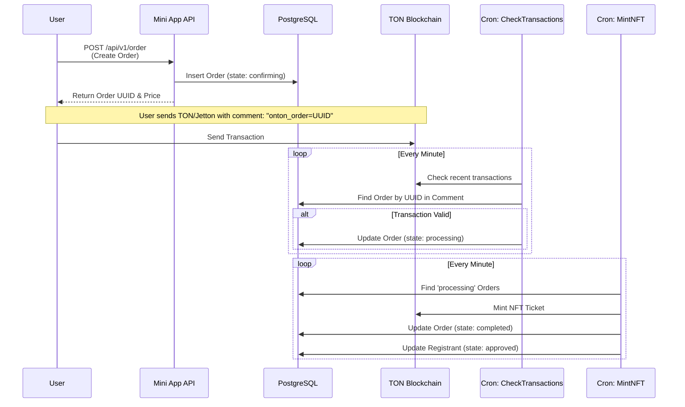

# ONTON Payment System Overview

The ONTON Payment System is a decentralized, comment-based payment verification mechanism designed to handle ticket sales and organizer upgrades on the TON blockchain. It relies on a combination of HTTP APIs for order creation and background cron jobs for on-chain transaction verification.

## 1. High-Level Architecture

The system operates on a "Verify-then-Process" model:
1.  **Frontend**: Creates an intent to pay (Order) off-chain.
2.  **User**: Performs an on-chain transaction with a specific comment.
3.  **Backend**: Monitors the blockchain, matches the transaction to the Order, and triggers fulfillment (e.g., NFT Minting).

### Payment Flow Diagram



## 2. Core Components

### 2.1 Order Creation API
*   **Endpoint**: `POST /api/v1/order`
*   **File**: `src/app/api/v1/order/route.ts`
*   **Responsibility**:
    *   Validates request (User, Event, Stock).
    *   Applies coupon codes via `applyCouponDiscount`.
    *   Creates a DB record in `orders` table with status **`confirming`**.
    *   Returns the unique **Order UUID** which is the key to verification.

### 2.2 Payment & Transaction
*   **Method**: Direct Blockchain Transfer.
*   **Destination**: The system's wallet address (`ONTON_WALLET_ADDRESS`).
*   **Requirement**: The transaction **MUST** include a comment (memo) in the format:
    ```text
    onton_order={ORDER_UUID}
    ```
    *Example: `onton_order=123e4567-e89b-12d3-a456-426614174000`*

### 2.3 Transaction Verification (Cron)
*   **Worker**: `CheckTransactions`
*   **File**: `src/cronJobs/tasks/CheckTransactions.ts`
*   **Logic**:
    1.  Fetches valid transactions for the system wallet from `TonCenter`.
    2.  Parses the data to find comments starting with `onton_order=`.
    3.  Fetches the corresponding Order from DB.
    4.  **Verifies**:
        *   **Token**: Is it the correct Jetton or TON?
        *   **Amount**: Does `tx_amount` match `order_price`?
    5.  **Action**: Updates Order status from `confirming` → **`processing`**.

### 2.4 Fulfillment (NFT Minting)
*   **Worker**: `MintNFTForPaidOrders`
*   **File**: `src/cronJobs/tasks/MintNFTForPaidOrders.ts`
*   **Logic**:
    1.  Polls DB for Orders with status `processing` and type `nft_mint`.
    2.  Uploads metadata to MinIO.
    3.  Mints an NFT on the TON blockchain to the user's wallet.
    4.  Updates Order status to **`completed`**.
    5.  Approves the user's event registration.

## 3. Database Schema

### `orders` Table
| Column | Type | Description |
| :--- | :--- | :--- |
| `uuid` | UUID | Primary Key (used in Transaction Comment) |
| `event_uuid` | UUID | Link to the Event |
| `user_id` | Text | Link to the User |
| `state` | Enum | `new`, `confirming`, `processing`, `completed`, `failed` |
| `total_price` | Real | Expected payment amount |
| `token_id` | Int | Start Token ID (TON vs Jetton) |
| `trx_hash` | Text | Hash of the User's payment transaction |

### `event_payment_info` Table
Stores configuration for an event's ticket sales, including price, accepted token, and the organizer's receiving address.

## 4. Key Configuration

The system relies on several environment variables/constants:
*   `ONTON_WALLET_ADDRESS`: The main wallet that receives payments.
*   `ONTON_MINTER_WALLET`: The wallet used to pay gas fees for minting NFTs.
*   `MNEMONIC`: Secret key for the minter wallet.
