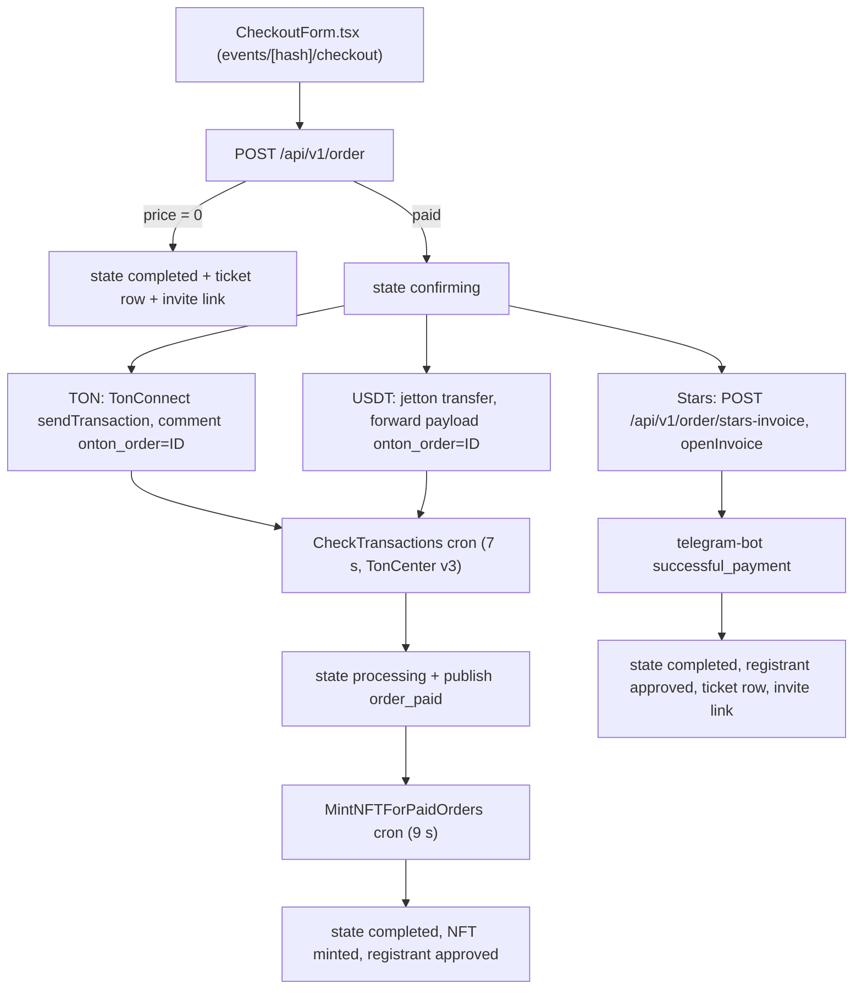

# ONTON Payment System & Ticket Tiers

> Last verified against dev: 2026-10-03

ONTON accepts three payment rails for event tickets: **TON**, **USDT jetton**, and **Telegram Stars**. TON/USDT are verified by polling the chain. Stars are confirmed by the bot. Free orders complete immediately.

---

## 1. Flow overview

```mermaid
flowchart TD
    Checkout["CheckoutForm.tsx (events/[hash]/checkout)"] --> Create["POST /api/v1/order"]
    Create -->|"price = 0"| Free["state completed + ticket row + invite link"]
    Create -->|"paid"| Confirming["state confirming"]
    Confirming --> TON["TON: TonConnect sendTransaction, comment onton_order=ID"]
    Confirming --> USDT["USDT: jetton transfer, forward payload onton_order=ID"]
    Confirming --> Stars["Stars: POST /api/v1/order/stars-invoice, openInvoice"]
    TON --> Check["CheckTransactions cron (7 s, TonCenter v3)"]
    USDT --> Check
    Check --> Processing["state processing + publish order_paid"]
    Processing --> Mint["MintNFTForPaidOrders cron (9 s)"]
    Mint --> Done["state completed, NFT minted, registrant approved"]
    Stars --> Bot["telegram-bot successful_payment"]
    Bot --> StarsDone["state completed, registrant approved, ticket row, invite link"]
```

---

## 2. Order model

| Item | Value | Source |
|---|---|---|
| `order_state` | `new`, `confirming`, `processing`, `completed`, `cancelled`, `failed` (no `PAID` / `CREATED`) | `mini-app/src/db/enum.ts` |
| `payment_types` | `USDT`, `TON`, `STAR` | `mini-app/src/db/enum.ts` |
| `order_type` | `nft_mint`, `event_creation`, `event_capacity_increment`, `promote_to_organizer`, `ts_csbt_ticket` | `mini-app/src/db/schema/orders.ts` |
| Price columns | `total_price`, `default_price` are Postgres `real` (float4) | `mini-app/src/db/schema/orders.ts` |
| New in 2.0 | `retry_count`, `last_error`, `tier_id` | `orders.ts`, migrations `0124`, `0125` |
| Tokens | `event_tokens` (symbol, decimals default 9, `master_address`, `is_native`); a token is a jetton when `master_address` is set | `mini-app/src/db/schema/eventTokens.ts` |

---

## 3. Order creation: `POST /api/v1/order`

File: `mini-app/src/app/api/v1/order/route.ts`

- Rate limit: 20 requests/min per user.
- Optional `tier_id`. The tier must belong to the event; `sold_count >= capacity` returns 410.
- Price = `tier.price`, otherwise `event_payment_info.price`.
- Token always comes from `event_payment_info.token_id`. The body's `payment_method` is only stored in `register_info` JSON; it does not pick the token.
- Free order (discounted price 0): state `completed`, ticket row inserted, group invite link sent, `tier.sold_count` incremented.
- Paid order: state `confirming`.
- Capacity checks are check-then-insert, with no transaction or row lock. Event sold-out uses `ordersDB.checkIfSoldOut`.
- Reactivating a `failed`/`cancelled` order resets `total_price` to the effective price and ignores the coupon.

---

## 4. Ticket tiers (`event_ticket_tiers`)

- Columns: `id`, `event_uuid` (FK, cascade), `tier_name`, `price` (real), `capacity`, `sold_count`, `ticket_type`, `sort_order` (`mini-app/src/db/schema/eventTicketTiers.ts`).
- Migration `0125_event_ticket_tiers.sql` creates the table, adds `orders.tier_id` (ON DELETE SET NULL), and seeds one tier per `event_payment_info` row. `eventTicketTiers.db.ts` also has runtime DDL (`ensureTicketTiersTable`).
- Tiers are read by the event API, `events` router, and the checkout page/form.
- The token is per event, not per tier.
- There is no organizer API or UI to create tiers (`createTier` has no callers). Tiers exist only from the migration seed.

---

## 5. Payment rails

### 5.1 TON and USDT jetton
- Frontend (`CheckoutForm.tsx`): TON via `tonConnectUI.sendTransaction` with comment `onton_order=<id>`; USDT via `@ton-community/assets-sdk` jetton transfer with forward payload `onton_order=<id>`.
- Verification: `mini-app/src/cronJobs/tasks/CheckTransactions.ts`, every 7 s, using TonCenter **v3** (`mini-app/src/services/tonCenter.ts`).
  - Resumes from the last checked `lt` stored in `wallet_checks`.
  - Jetton notifications are parsed by opcode `0x7362d09c`; the jetton master must match the event token.
  - Amount check: the tx amount is a BigInt, but the expected amount is derived from the float `total_price` × 10^decimals. Match rule is `|diff| <= 10^(decimals-6)` raw units (not `tx >= price`).
  - On match: conditional UPDATE `new`/`confirming` → `processing`, then `publishOrderPaidEvent`.
  - A second pass checks the campaign wallet with prefix `OnionCampaign=`.

### 5.2 Fulfillment (`MintNFTForPaidOrders.ts`)
- Runs every 9 s; takes up to 100 `processing` + `nft_mint` orders with `retry_count < 5`.
- Mutual exclusion: Redis lock `lock:mint_nft:<event>` (120 s TTL). A `SELECT ... FOR UPDATE` on the order row runs first, but it is released before the mint.
- Mint uses `mintNFT` from `mini-app/src/lib/nft.ts` (in-process). Then one transaction: order `completed`, coupon used, affiliate purchase incremented, `nft_items` insert, registrant approved.
- Failure: `retry_count` +1 and `last_error` set. At 5 retries the order goes to `failed` with `updatedBy = mint_dlq_max_retries` and a `[DLQ ALERT]` log line. This "DLQ" is a DB state plus a log line, not a queue. No backoff.

### 5.3 Telegram Stars
- Rail used only when token = STAR or ticket type = TSCSBT (`CheckoutForm.tsx`).
- Invoice: `POST /api/v1/order/stars-invoice` checks owner and not-completed, converts price with fixed pegs per token, then calls the bot's `/create-stars-invoice`, which runs `createInvoiceLink` with currency `XTR` (`telegram-bot/src/controllers/starsInvoiceHandler.ts`). Frontend calls `webApp.openInvoice`.
- `pre_checkout_query` (`telegram-bot/src/handlers/starsPaymentHandler.ts`): approved without validation.
- `successful_payment`: sets the order `completed`, approves the registrant, inserts a ticket row if missing, creates a 1-use group invite, replies with a web_app button to `/tickets/<event_uuid>`.
- Stars path does **not** mint an NFT, publish `order_paid`, increment affiliate purchases, or increment tier `sold_count`.

---

## 6. RabbitMQ

- Queues: `${STAGE_NAME}-notifications`, `${STAGE_NAME}-tg_messages`, `${STAGE_NAME}-order_paid` (`mini-app/src/sockets/constants.ts`).
- A dead-letter exchange plus a 5 s `-retry` queue exists only for notifications.
- `order_paid`: producer `mini-app/src/lib/orderEvents.ts` (TON/USDT path only); consumer `mini-app/src/workers/orderPaidConsumer.ts` calls `processSinglePaidOrder` and acks in all cases.
- The cron in 5.2 is the real fulfillment path (see Known issues).

---

## Known issues (tracked in QA)

- **F-33**: Stars pre-checkout approves without validating order, price, or capacity; `successful_payment` does not check amount or prior state.
- **F-34**: Paid tier `sold_count` is never incremented, so tier capacity is not enforced for paid tickets. No tier-creation API.
- **F-35**: The `order_paid` consumer is likely failing at startup (queue asserted with conflicting arguments); the 9 s mint cron does the fulfillment.
- No inventory lock: concurrent orders can oversell.
- Expected TON/USDT amount is computed from a float column.

## Roadmap / not implemented

- Reservation hold and expiry of unpaid orders (no expiry cron exists).
- Per-tier currency and organizer tier management.
- Separate consumers for ticket issuance, invites, and notifications.
- Bot DM receipt for TON/USDT payments (only an admin log is sent).
