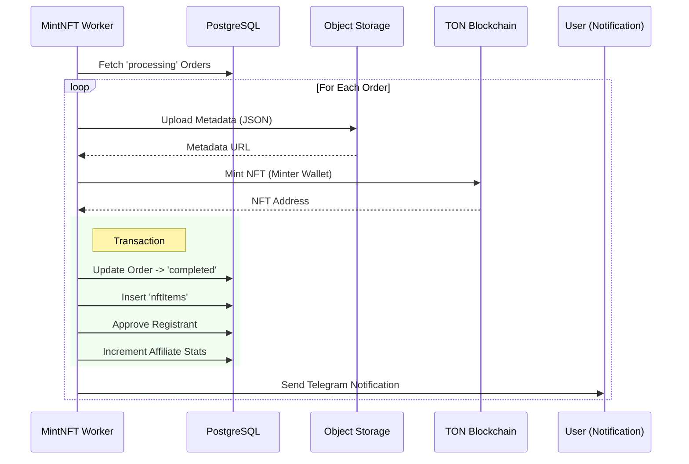

# Reward Distribution System

The ONTON platform automates the distribution of digital assets (SBTs and NFTs) to participants based on their actions (Check-in, Payment). This process is handled asynchronously by background workers to ensure scalability.

## 1. Reward Types

### A. Soulbound Tokens (SBTs)
Used for Proof of Attendance and Community Reputation.
*   **Trigger:** User Check-in (Physical) or Task Completion (Digital).
*   **Status Flow:** `pending_creation` -> `created` (Minted/Assigned).
*   **Worker:** `CreateRewards.ts`
    *   **Frequency:** Periodic Cron Job.
    *   **Logic:**
        1.  Fetches events with pending rewards.
        2.  Batches requests (up to 350k) to the Ton Society API.
        3.  Handles temporary event end-date extension to allow retroactive reward issuance.

### B. Paid Ticket NFTs
Used for access control and collectibles for paid events.
*   **Trigger:** Successful Payment -> Order moves to `processing` state.
*   **Worker:** `MintNFTForPaidOrders.ts`
    *   **Logic:**
        1.  Selects orders where `state = 'processing'` and `type = 'nft_mint'`.
        2.  **Minting:** Uses the dedicated Minter Wallet to mint the NFT on TON.
        3.  **Metadata:** Uploads ticket metadata (Image, Attributes) to MinIO.
        4.  **Completion:**
            *   Updates Order to `completed`.
            *   Inserts record into `nftItems`.
            *   Approves the Event Registrant (Granting access).
            *   **Notification:** Sends a log to the Telegram bot.

## 2. Infrastructure
*   **Queue/Cron:** Node-cron scheduler managing task execution.
*   **External APIs:**
    *   **Ton Society API:** For SBT issuance.
    *   **Ton Center/MinIO:** For NFT minting and storage.
*   **Error Handling:** Failed jobs are logged; critical failures (e.g., wallet balance, API down) alert the team.

## 3. Sequence Diagram (NFT Minting)

