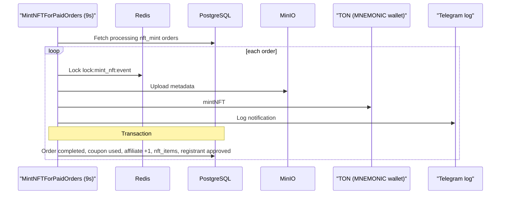

# Reward Distribution

> Last verified against dev: 2026-10-03

Two kinds of on-chain assets are issued: attendance SBTs and paid-ticket NFTs. Schedulers use the `cron` package (`CronJob`), not `node-cron`.

## 1. Attendance SBTs

### 1.1 Native SBTs (active path)
Minted with `mintSbtBadge` in `mini-app/src/services/sbtService.ts` (TEP-85, metadata in MinIO, minter wallet from `MNEMONIC`). Triggers:

| Trigger | Code | Cost to user |
|---|---|---|
| Ticket check-in, attendee has `wallet_address` | `ticket.checkInTicket` (`mini-app/src/server/routers/tickets.ts`); reward stored as `created` | Free |
| Ticket owner claims | `sbt.claimAttendanceSbt` (ticket must be `USED`) | Free |
| On-chain upgrade | `sbt.materializeOnChainSbt` (payment ≥ 0.095 TON with memo `sbt_upgrade:<ticketUuid>`) | Paid |
| Admin | `sbt.mintBadge` (global admin only) | — |

### 1.2 TON Society rewards (legacy / decommissioned)
- TON Society API integration has been fully removed due to entity shutdown.
- Legacy `rewards` rows and `reward_types` enum values (`ton_society_sbt`, `ton_society_csbt_ticket`) are retained in the database for historical and "My Badges" display (`findUserClaimedTonSocietyBadges`).
- Defunct crons (`CreateRewards`, `syncSbtCollectionsForEvents`, `CheckSbtStatus`) have been removed from `cronJobSchedulerReward.ts`.
- All badge distribution now uses native TEP-85 and cSBT engines directly on TON.

Reward status enum (`mini-app/src/db/enum.ts`): `pending_creation`, `created`, `created_by_ui`, `received`, `notified`, `notified_by_ui`, `notification_failed`, `failed`, `fixed_failed`.

Related reward-worker jobs (`mini-app/src/workers/cronJobSchedulerReward.ts`): `notifyUsersForRewards` (3 min), tournament reward jobs.

## 2. Paid-ticket NFTs

Worker: `MintNFTForPaidOrders` (`mini-app/src/cronJobs/tasks/MintNFTForPaidOrders.ts`), every 9s from `mini-app/src/workers/cronJobSchedulerPayment.ts`.

1. Selects orders with `state = processing`, `order_type = nft_mint`, `retry_count < 5` (up to 100 per run).
2. Takes a Redis lock per event (`lock:mint_nft:<event>`, 120s).
3. Uploads metadata to MinIO.
4. Mints with `mintNFT` from `mini-app/src/lib/nft.ts`, signed by the `MNEMONIC` wallet (checked against `ONTON_MINTER_WALLET`).
5. Sends a log notification to Telegram.
6. One DB transaction: order `completed`, coupon marked used, affiliate purchase incremented, `nft_items` insert, registrant `approved`.

Failures increment `retry_count`; at 5 the order becomes `failed` (`updatedBy: mint_dlq_max_retries`) with a `[DLQ ALERT]` log line. This is a DB state, not a queue.

Collection deploy: `mini-app/src/cronJobs/helper/handleTicketType.ts` → `deployNftCollection` → `mini-app/src/lib/nft.ts`.

```mermaid
sequenceDiagram
    participant Cron as "MintNFTForPaidOrders (9s)"
    participant Redis
    participant DB as PostgreSQL
    participant MinIO
    participant TON as "TON (MNEMONIC wallet)"
    participant TG as "Telegram log"

    Cron->>DB: Fetch processing nft_mint orders
    loop each order
        Cron->>Redis: Lock lock:mint_nft:event
        Cron->>MinIO: Upload metadata
        Cron->>TON: mintNFT
        Cron->>TG: Log notification
        Note over Cron,DB: Transaction
        Cron->>DB: Order completed, coupon used, affiliate +1, nft_items, registrant approved
    end
```

Stars-paid orders are completed by the bot and do not go through this worker (no NFT mint).

## Known issues (tracked in QA)
- F-35: The `order_paid` RabbitMQ consumer is likely failing; the 9s cron is the real fulfillment path.
- F-36: Free SBT at check-in / claim vs paid on-chain upgrade.
