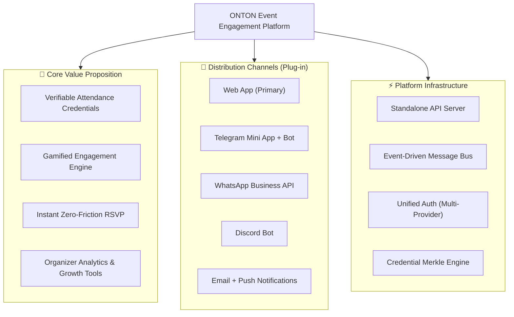
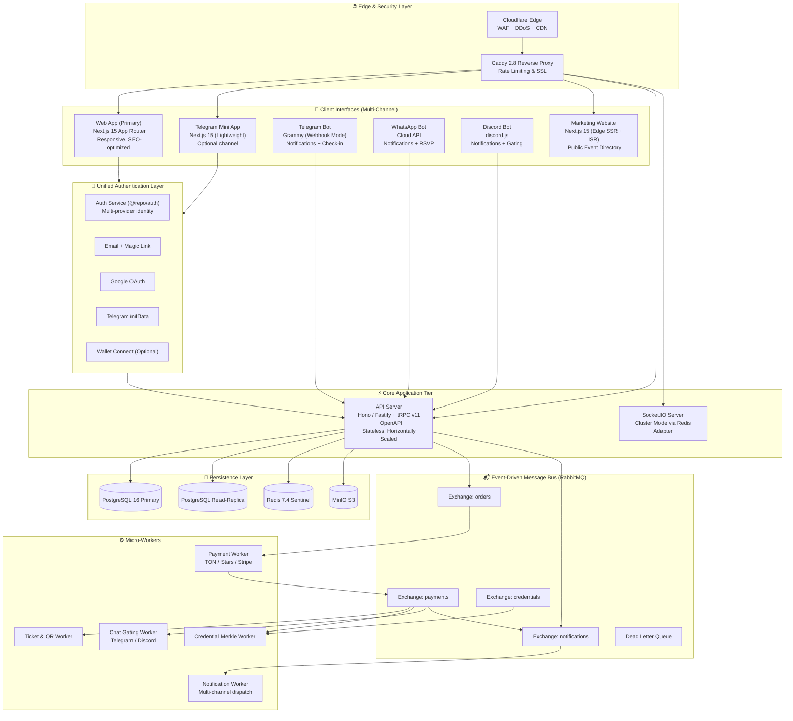
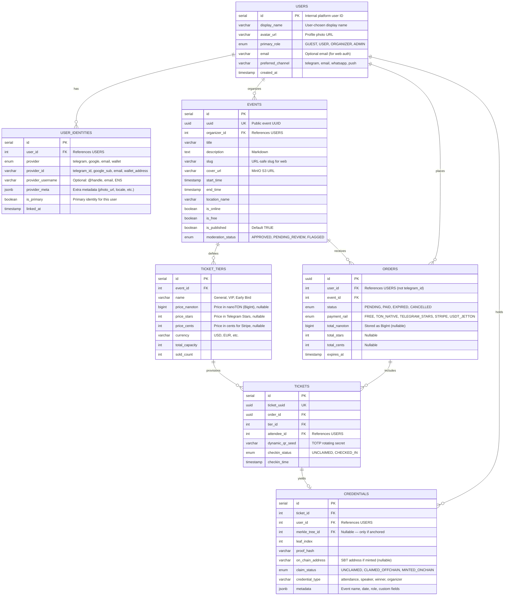
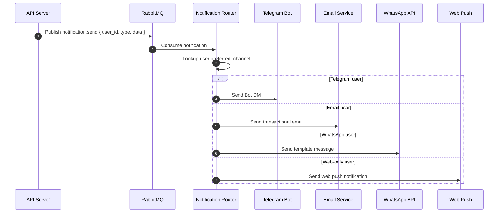
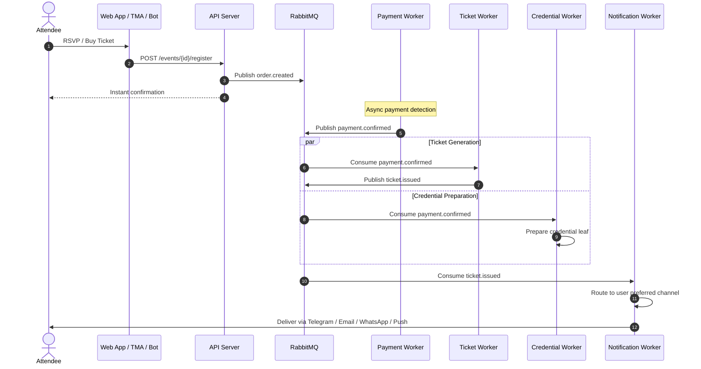
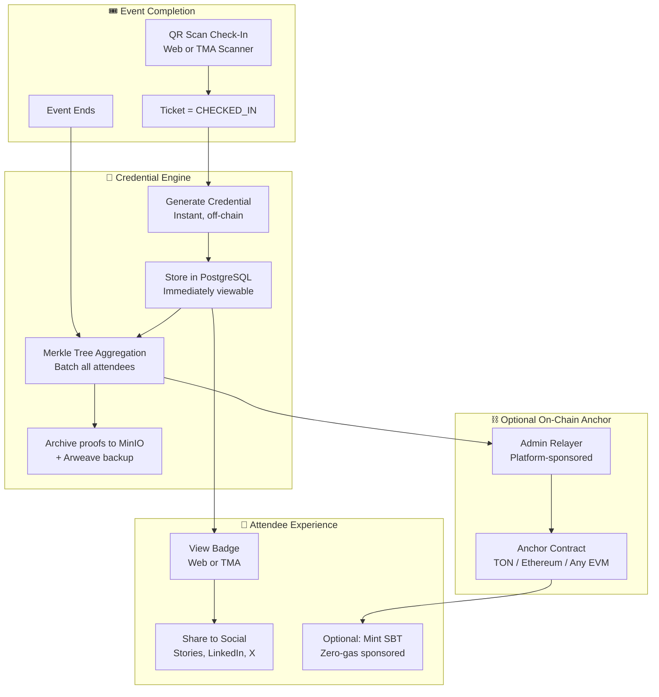
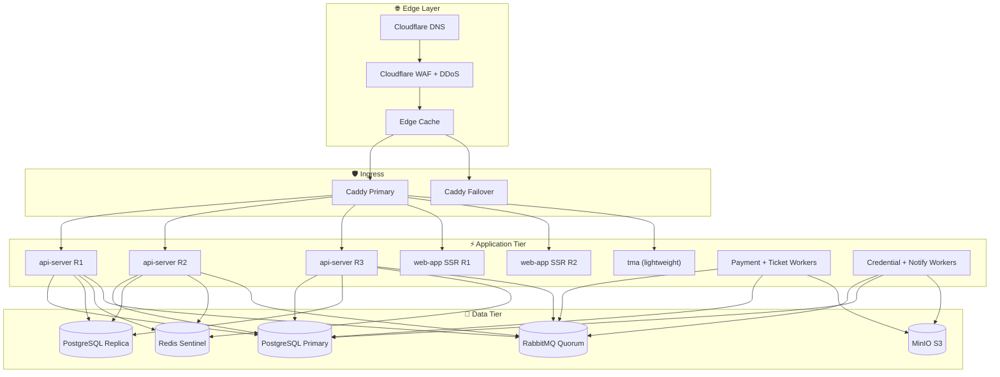

# ONTON Platform — TO-BE Technical Blueprint

> **Target Architecture Specification (2026–2027)**
> **Vision:** "The Event Engagement Platform — Verifiable Credentials, Gamified Participation, Omnichannel Reach"
> **Authors:** Antigravity AI & Mahdi Farimani (مهدی فریمانی)
> **Status:** Strategic Target Architecture & Phased Implementation Masterplan
> **Last Updated:** 2026-09-19

---

## 1. Executive Vision & Strategic Pivot

### 1.1 The Shift: From "Luma for Telegram" to "Event Engagement Platform"

ONTON is pivoting from a Telegram-locked mini-app into a **channel-agnostic Event Engagement Platform**. The previous narrative — "The Lu.ma of Telegram & Web3" — constrained market reach and created existential dependency on a single distribution channel.

**What ONTON is becoming:**

> Turn one-time attendees into loyal communities — with verifiable credentials, gamified participation, and omnichannel reach.

**Core principles of the new architecture:**
1. **Web-first, channel-optional** — The primary experience is a responsive web app. Telegram, WhatsApp, Discord, and other messaging platforms are distribution channels, not the product.
2. **Credential-native** — Verifiable proof-of-attendance (SBTs, badges) is ONTON's core differentiator. No other event platform does this well.
3. **Engagement-driven** — Quests, tournaments, points, affiliate referrals, and community walls drive repeat usage and organic growth.
4. **Blockchain-optional** — Credentials work off-chain by default. On-chain anchoring (TON, Ethereum, or any chain) is an opt-in power feature.



### 1.2 Strategic OKRs (Revised)

1. **Zero-Friction Conversion**: Reduce time-to-RSVP to <3 seconds on any platform — web, Telegram, or deep link. No wallet, no app install, no Telegram account required for free events.
2. **Channel Independence**: Any user can register, attend, and receive credentials without a Telegram account. Telegram becomes the best (but not only) channel.
3. **Instant Organizer Gratification**: Event creation to public shareable link in <60 seconds, with auto-publishing and post-moderation.
4. **Credential Moat**: Build the largest verifiable event credential network — proof-of-attendance that works across Web2 and Web3.
5. **Architectural Decoupling**: Extract a standalone API server from the `mini-app` monolith. Any frontend (web, TMA, mobile) consumes the same API.

### 1.3 Competitive Positioning

| Feature | Luma | Eventbrite | Partiful | **ONTON** |
|---------|------|-----------|----------|-----------|
| Web-first RSVP | ✅ | ✅ | ✅ | ✅ |
| Telegram native | ❌ | ❌ | ❌ | ✅ (channel) |
| WhatsApp/Discord | ❌ | ❌ | ❌ | ✅ (planned) |
| Verifiable credentials | ❌ | ❌ | ❌ | **✅ (core)** |
| Gamification (quests, points) | ❌ | ❌ | ❌ | **✅ (core)** |
| Chat group gating | ❌ | ❌ | ❌ | ✅ |
| On-chain proof | ❌ | ❌ | ❌ | ✅ (opt-in) |
| Anti-fraud TOTP check-in | ❌ | Basic | ❌ | ✅ |

---

## 2. Target Architecture Map (TO-BE)

The fundamental change: **the API server is the center of the universe**, not the Telegram Mini App. All clients — web, TMA, bots, mobile — are equal consumers.



### Key Architectural Changes from Previous Blueprint

| Aspect | Previous (Telegram-First) | New (Channel-Agnostic) |
|--------|---------------------------|------------------------|
| Primary UI | Telegram Mini App | Web App (responsive) |
| Auth | Telegram `initData` only | Multi-provider (Email, Google, Telegram, Wallet) |
| User identity | `telegram_id` as PK | Internal `user_id` with linked identities |
| Notifications | Telegram Bot DM only | Multi-channel dispatch (Telegram, Email, WhatsApp, Push) |
| Payment rails | TON + Telegram Stars | TON + Stars + Stripe + crypto (modular) |
| Public event pages | TMA deep links only | SEO-indexed web URLs + optional TMA links |
| Check-in | TMA scanner only | Web scanner + TMA + hardware |
| Credential display | Redirect to Getgems | Native credential viewer (web + TMA) |

---

## 3. Unified Identity & Multi-Provider Auth

The most critical architectural change: **decouple user identity from Telegram**.

### 3.1 Identity Model



### 3.2 Auth Abstraction (`@repo/auth`)

The shared auth package supports multiple providers through a unified interface:

```
Auth Flow:
  1. Client sends auth request (provider-specific payload)
  2. @repo/auth validates:
     - Telegram: validate initData signature + auth_date TTL
     - Google: verify OAuth token via Google API
     - Email: verify magic link / OTP code
     - Wallet: verify TonProof / SIWE signature
  3. Resolve to internal user_id (create or link identity)
  4. Issue platform JWT (same format for all providers)
  5. All downstream API calls use platform JWT only
```

**Migration path from current Telegram-only auth:**
- Phase 1: Add `users` table with internal IDs, create `user_identities` table, backfill from `telegram_id`
- Phase 2: Add email + Google OAuth login to web app
- Phase 3: All API routes accept platform JWT; Telegram `initData` is just one way to obtain it
- Phase 4: Optional wallet linking for credential claiming

---

## 4. Multi-Channel Notification Engine

Replace the current Telegram-only notification with a channel router:



### Notification Types & Channel Support

| Notification | Telegram | Email | WhatsApp | Web Push |
|---|---|---|---|---|
| Registration confirmation | ✅ Bot DM | ✅ | ✅ | ✅ |
| QR ticket delivery | ✅ Bot DM | ✅ PDF | ✅ Link | ✅ |
| Event reminder (24h) | ✅ | ✅ | ✅ | ✅ |
| Check-in confirmation | ✅ | ❌ | ❌ | ✅ |
| Credential ready to claim | ✅ | ✅ | ❌ | ✅ |
| Organizer: new registration | ✅ | ✅ | ❌ | ✅ |
| Broadcast (organizer→attendees) | ✅ | ✅ | ✅ | ✅ |

---

## 5. Monorepo Re-Architecture (Turborepo + pnpm)

```
onton-platform/
├── turbo.json
├── pnpm-workspace.yaml
├── package.json
├── packages/
│   ├── db/                 # Unified Drizzle ORM: schemas, migrations, typed queries
│   ├── auth/               # Multi-provider auth: Telegram, Google, Email, Wallet
│   ├── ui/                 # Shared Design System: Tailwind + shadcn/ui
│   ├── credentials/        # Credential engine: Merkle trees, proof generation, verification
│   ├── notifications/      # Channel router: Telegram, Email, WhatsApp, Push
│   ├── queue/              # Typed RabbitMQ AMQP: publishers, consumers, DLQ
│   ├── config-typescript/  # Strict base tsconfig
│   └── config-eslint/      # Standardized ESLint + Prettier
├── apps/
│   ├── api/                # Standalone API Server (Hono + tRPC v11 + OpenAPI)
│   ├── web/                # Web App (Next.js 15 — primary user experience)
│   ├── tma/                # Telegram Mini App (Next.js 15 — lightweight TMA client)
│   ├── website/            # Marketing & Public Event Directory (Next.js 15 Edge SSR)
│   ├── bot-telegram/       # Grammy Telegram Bot (Webhook mode)
│   ├── bot-discord/        # Discord Bot (future)
│   └── socket/             # Socket.IO WebSocket cluster
├── workers/
│   ├── payment-worker/     # Payment reconciliation (TON, Stars, Stripe)
│   ├── ticket-worker/      # Ticket + dynamic QR pass generation
│   ├── credential-worker/  # Merkle tree aggregation + on-chain anchoring
│   ├── gate-worker/        # Chat gating (Telegram groups, Discord roles)
│   └── notify-worker/      # Multi-channel notification dispatch
└── infra/
    ├── docker/             # Multi-stage Dockerfiles
    ├── k8s/                # Helm charts for HA deployment
    └── caddy/              # Caddyfile with edge routing
```

### Key Package Responsibilities

#### `@repo/auth` (Multi-Provider Identity)
- Telegram `initData` validation with 24h TTL enforcement
- Google OAuth token verification
- Email magic link / OTP generation and verification
- TonProof / SIWE wallet signature verification
- Unified JWT issuance (all providers → same token format)
- RBAC: `GUEST`, `ATTENDEE`, `ORGANIZER`, `CHECKIN_OFFICER`, `ADMIN`

#### `@repo/credentials` (Verifiable Attendance Engine)
- Off-chain credential issuance (default — works without blockchain)
- Merkle tree aggregation for batch on-chain anchoring (opt-in)
- Proof generation and verification API
- Credential metadata schema (event, role, date, custom fields)
- Export to portable formats (W3C Verifiable Credentials, JSON-LD)

#### `@repo/notifications` (Channel Router)
- User preference-based channel selection
- Telegram Bot DM (Grammy)
- Transactional email (Resend / SendGrid)
- WhatsApp Business Cloud API (future)
- Web Push (future)
- Rate limiting and adaptive backoff per channel

---

## 6. Event-Driven Architecture (RabbitMQ Message Bus)

Unchanged from previous blueprint — the event-driven architecture is channel-agnostic by design.



### AMQP Exchange & Queue Specification

| Exchange | Routing Key | Payload | Consumer(s) |
|---|---|---|---|
| `onton.orders` | `order.created` | `{ orderId, userId, eventId, rail, amount }` | `payment-worker` |
| `onton.orders` | `order.cancelled` | `{ orderId, reason }` | `inventory-worker` |
| `onton.payments` | `payment.confirmed` | `{ orderId, rail, txHash, confirmedAt }` | `ticket-worker`, `credential-worker`, `gate-worker` |
| `onton.tickets` | `ticket.issued` | `{ ticketUuid, orderId, attendeeId, qrSeed }` | `notify-worker`, `socket-server` |
| `onton.tickets` | `ticket.checked_in` | `{ ticketUuid, officerId, checkedInAt }` | `credential-worker`, `socket-server` |
| `onton.credentials` | `credential.ready` | `{ userId, eventId, credentialId }` | `notify-worker` |
| `onton.credentials` | `merkle.anchored` | `{ eventId, rootHash, anchorTx }` | `notify-worker` |
| `onton.notifications` | `notification.send` | `{ userId, channel, type, data }` | `notify-worker` |
| `onton.dlq` | `dead_letter` | Failed payloads with stack trace | Alerting dashboard |

---

## 7. Product & UX Blueprint (Platform-Agnostic)

### 7.1 Progressive Onboarding (Zero Barriers)

```
Step 1: Discover Event
   ├── Via web: onton.live/e/hackathon-2026 (SEO-indexed, OpenGraph cards)
   ├── Via Telegram: t.me/ontonbot?startapp=e_hackathon-2026
   ├── Via WhatsApp: shared link → web fallback
   └── Via Discord: bot embed → web fallback

Step 2: Register (Zero Friction)
   ├── Web visitor: "Register with Email" or "Sign in with Google"
   ├── Telegram user: Auto-recognized via initData
   ├── Either way: 1-click RSVP, no wallet required
   └── TICKET CONFIRMED INSTANTLY

Step 3: Post-Registration (Channel-Aware)
   ├── Notification via preferred channel:
   │     ├── QR Code Pass (inline or downloadable)
   │     ├── Add-to-Calendar (.ics / Google Calendar)
   │     └── Private group invite link (Telegram/Discord if applicable)

Step 4: Progressive Engagement (Optional)
   ├── "Complete quests to earn points"
   ├── "Refer friends for bonus rewards"
   ├── "Connect wallet to claim your Soulbound Event Credential"
   └── "Share your attendance badge to social media"
```

### 7.2 Instant Publishing & Post-Moderation

- **Default**: Newly created free events are immediately `is_published = true`, `moderation_status = 'APPROVED'`.
- **Instant Sharing**: Organizer receives both a web URL (`https://onton.live/e/slug`) and optional Telegram deep-link.
- **Async Safety Net**: Background content moderation scans title, description, and images. If flagged → moved to `PENDING_REVIEW`, unlisted from public discovery, admin alerted.
- **Community Reporting**: Attendees can report events via in-app flow. Multiple reports trigger auto-review.

### 7.3 Credential Engine (Core Differentiator)

The credential system is ONTON's moat — it works with or without blockchain:

```
Credential Lifecycle:
  1. Attendee checks in at event (QR scan)
  2. Credential leaf generated (off-chain, instant)
  3. Attendee can view/share credential immediately (off-chain)
  4. After event: Merkle tree aggregated, root hash computed
  5. Optional: Root anchored on-chain (TON, Ethereum, etc.)
  6. Attendee can mint on-chain SBT (gas sponsored by platform)
  7. Credential is verifiable by anyone (Merkle proof against anchor)
```

**Use cases beyond attendance proof:**
- Conference speaker credentials
- Hackathon placement badges
- VIP/loyalty tier qualification
- Access gating (Telegram groups, Discord roles, content)
- Resume/portfolio verification (LinkedIn-style)

### 7.4 Chat & Group Gating (Multi-Platform)

| Platform | Mechanism |
|----------|-----------|
| Telegram | Bot generates single-use invite link; revokes on cancel |
| Discord | Bot assigns role; removes on cancel |
| WhatsApp | Community invite link (future) |

---

## 8. Sovereign Credential & cSBT 2.0 Engine

With the platform-agnostic pivot, credentials become **off-chain first, on-chain optional**:



### Technical Specifications
1. **Tree Capacity**: Sparse Merkle Tree supporting up to 2^20 (1,048,576) leaves per event.
2. **Chain Agnostic**: Anchor contracts can be deployed to TON, Ethereum, Polygon, or any EVM chain.
3. **Zero-Gas Relayer**: Platform sponsors mint transactions from treasury.
4. **Portable Credentials**: Export as W3C Verifiable Credential JSON-LD for interoperability.

---

## 9. Target Infrastructure & High Availability



### Security & Hardening
- **Zero Secrets in Repository**: `git-filter-repo` to scrub history; all secrets in GitHub Encrypted Environments or Vault.
- **Network Isolation**: Docker service discovery (no static IPs); database ports closed externally.
- **CORS**: Domain allowlist (no wildcards).
- **API Auth**: HMAC-signed inter-service calls; platform JWT for client calls.

---

## 10. Phased Delivery Roadmap (Revised — 6 Waves)

The roadmap is reorganized around the platform-agnostic pivot:

```mermaid
flowchart TD
    subgraph W1["Wave 1: Security & Correctness\n Ship this week"]
        W1_1["#976 Secret Purge + Key Rotation"]
        W1_2["#943 CORS Domain Allowlist"]
        W1_3["#945 BigInt Payments + #947 Row Locks"]
        W1_4["#940 Bot HMAC Auth"]
        W1_5["#955 Hash API Keys"]
        W1_6["#958 Auth Event Export"]
        W1_7["#961 Fix CI + #963 Remove TLS Skip"]
    end

    subgraph W2["Wave 2: API Extraction & Auth\n Foundation for independence"]
        W2_1["#973 Extract Standalone API Server"]
        W2_2["NEW: Multi-Provider Auth System"]
        W2_3["#974 Unify ORM to Drizzle"]
        W2_4["#975 Merge NFT DB"]
        W2_5["#978 Router Decomposition"]
    end

    subgraph W3["Wave 3: Web-First Experience\n Break Telegram dependency"]
        W3_1["NEW: Web App (onton.live)"]
        W3_2["#948 SSR Event Pages + SEO"]
        W3_3["#1010 Instant Publishing"]
        W3_4["#946 Hybrid Auth (Google/Email)"]
        W3_5["NEW: Notification Channel Router"]
    end

    subgraph W4["Wave 4: Engagement Engine\n Core differentiator"]
        W4_1["#992 Credential Viewer (Web + TMA)"]
        W4_2["#996 TOTP QR Anti-Fraud Check-in"]
        W4_3["#994 Merkle Proof API"]
        W4_4["#993 Social Sharing Badges"]
        W4_5["Quests + Points + Affiliates"]
    end

    subgraph W5["Wave 5: Scale & Reliability\n Production hardening"]
        W5_1["#979 RabbitMQ Event-Driven Bus"]
        W5_2["#981 PostgreSQL HA + Replicas"]
        W5_3["#985 Edge WAF + Rate Limiting"]
        W5_4["#953 Load Testing 5k Concurrent"]
        W5_5["#983 Monorepo Consolidation"]
    end

    subgraph W6["Wave 6: Channel Expansion\n Growth channels"]
        W6_1["WhatsApp Business Integration"]
        W6_2["Discord Bot + Role Gating"]
        W6_3["#997 Telegram Chat Gating"]
        W6_4["Web Push Notifications"]
        W6_5["Mobile PWA Optimization"]
    end

    W1 --> W2
    W2 --> W3
    W3 --> W4
    W4 --> W5
    W5 --> W6
```



### Wave Details

#### Wave 1: Security & Correctness (Ship This Week)
Fix live vulnerabilities. No narrative change needed — these are universal.

| Issue | Title | Effort |
|-------|-------|--------|
| #976 | Secret purge (git history scrub + key rotation) | 3h |
| #943 | Replace wildcard CORS with domain allowlist | 1.5h |
| #961 | Make CI fail on actual errors | 30min |
| #963 | Remove NODE_TLS_REJECT_UNAUTHORIZED=0 | 1.5h |
| #958 | Add auth to event metadata export | 2h |
| #955 | Hash API keys + constant-time comparison | 3h |
| #940 | Add HMAC auth to bot Express API | 3h |
| #945 | BigInt for TON payment reconciliation | 4-5h |
| #947 | Row-level locking for NFT minting | 3-4h |
| #965 | Client Web Panel auth → deprioritize (replaced by web app) | 0h |

#### Wave 2: API Extraction & Identity (Foundation)
The most critical wave — extracts the API and builds multi-provider identity.

| Issue | Title | Effort |
|-------|-------|--------|
| #973 | Extract backend from mini-app into standalone API | Epic |
| #974 | Unify data access layer (Drizzle ORM) | Epic |
| #975 | Merge NFT DB into main DB | 4-6h |
| #978 | Decompose monolithic tRPC routers | Epic (#938 + #939) |
| **NEW** | `@repo/auth` multi-provider (Email, Google, Telegram, Wallet) | Epic |
| **NEW** | `user_identities` table + migration from telegram_id | 4-6h |

#### Wave 3: Web-First Experience (Break Dependency)
Build the primary web interface. This is where the narrative pivot becomes visible.

| Issue | Title | Effort |
|-------|-------|--------|
| **NEW** | Web App at onton.live (Next.js 15, responsive) | Epic |
| #948 | SSR event pages with OpenGraph meta tags | 3-4h |
| #1010 | Instant auto-publishing (post-moderation) | Epic (#1012 + #1013) |
| #946 | Hybrid Auth (Google/Email + Telegram linking) | 4-6h |
| **NEW** | `@repo/notifications` channel router | Epic |
| #1009 | Progressive Web3 disclosure (wallet optional) | 4-6h |

#### Wave 4: Engagement Engine (Differentiator)
Build the features that make ONTON unique.

| Issue | Title | Effort |
|-------|-------|--------|
| #992 | Credential viewer (web + TMA, kill Getgems dependency) | Epic |
| #996 | Dynamic TOTP QR anti-fraud check-in | 4-6h |
| #994 | Sovereign Merkle Proof API | Epic |
| #993 | Social sharing for badges (Telegram Stories, X, LinkedIn) | 3-4h |
| #949 | Affiliate "Share-to-Earn" | 3-4h |
| #1014 | Community reporting flow | 2-3h |

#### Wave 5: Scale & Reliability
Production hardening after features are stable.

| Issue | Title | Effort |
|-------|-------|--------|
| #979 | RabbitMQ event-driven architecture | Epic |
| #941 | Migrate payment polling to message bus | 4-6h |
| #981 | PostgreSQL read-replica + HA | 4-6h |
| #985 | Cloudflare Edge WAF + gateway | 3-4h |
| #953 | Load test: 5,000 concurrent RSVPs | 2-3h |
| #983 | Monorepo consolidation (Turborepo + pnpm) | Epic |
| #982 | Strip browser polyfills | 3-4h |

#### Wave 6: Channel Expansion
Grow distribution beyond Telegram.

| Issue | Title | Effort |
|-------|-------|--------|
| **NEW** | WhatsApp Business API integration | Epic |
| **NEW** | Discord bot + role gating | Epic |
| #997 | Telegram chat gating | 4-6h |
| **NEW** | Web push notifications | 3-4h |
| **NEW** | Mobile PWA optimization | 3-4h |

---

## 11. Issue Reclassification Under New Narrative

### Issues to CLOSE (Superseded or Resolved)
| # | Title | Reason |
|---|-------|--------|
| #936 | TonProof nonce enforcement | ✅ Already resolved |
| #950 | FloodWait retry logic | ✅ Already resolved |
| #952 | Remove SSH keys from root | ✅ Resolved (history → #976) |
| #964 | QA test suite | ✅ Already resolved |
| #965 | Restore Client Web Panel auth | 🚫 Panel superseded by new web app |
| #866 | Configure subdomain for Client Web Panel | 🚫 Panel superseded |

### Issues to REFRAME
| # | Original Title | New Framing |
|---|----------------|------------|
| #984 | Deduplicate Telegram auth → shared package | → Build `@repo/auth` multi-provider identity |
| #977 | Resolve framework inconsistency | → Consolidate into monorepo (Wave 5) |
| #946 | Hybrid Auth (Google/Email + Telegram) | → Core of Wave 3 (platform independence) |
| #948 | SSR event pages for SEO | → Web-first event pages (primary experience) |
| #992 | ONTON Passport TMA | → Credential viewer (web + TMA) |
| #993 | Telegram Story sharing | → Multi-platform social sharing |
| #997 | Telegram Chat Gating | → Multi-platform gating (Telegram + Discord) |

### New Issues to Create
| Title | Wave | Priority |
|-------|------|----------|
| Build `@repo/auth` multi-provider identity system | 2 | Critical |
| Create `user_identities` table + migration from telegram_id PK | 2 | Critical |
| Build web app (onton.live) — primary user experience | 3 | Critical |
| Build `@repo/notifications` multi-channel dispatch | 3 | High |
| WhatsApp Business API integration | 6 | Medium |
| Discord bot + role gating | 6 | Medium |
| Web push notification support | 6 | Medium |

---

## 12. Conclusion

The TO-BE ONTON Platform evolves from a Telegram-dependent mini-app into a **channel-agnostic Event Engagement Platform** where:

- **Any user** can discover, register, attend, and earn credentials — whether they use Telegram, a web browser, WhatsApp, or Discord.
- **Verifiable credentials** are the core differentiator — no other event platform offers portable, optionally on-chain proof-of-attendance.
- **Engagement mechanics** (quests, tournaments, affiliates, community walls) drive retention and organic growth.
- **Telegram remains the strongest channel** (931k users, deep integration) but is no longer the cage.

The platform's moat is not "where it runs" but "what it uniquely provides" — and that is the combination of frictionless events + verifiable credentials + gamified engagement that no competitor offers.
