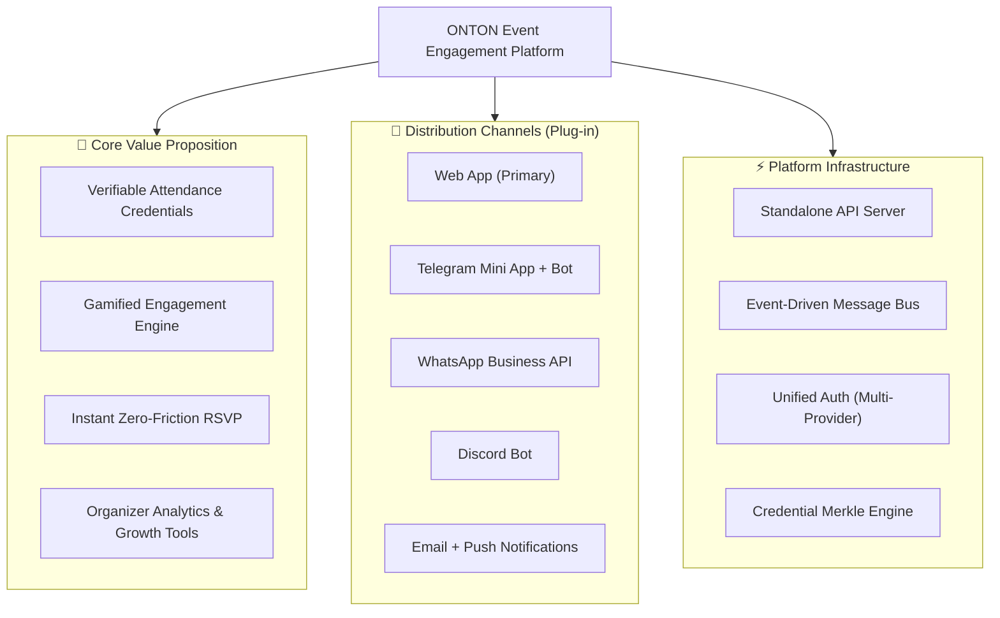
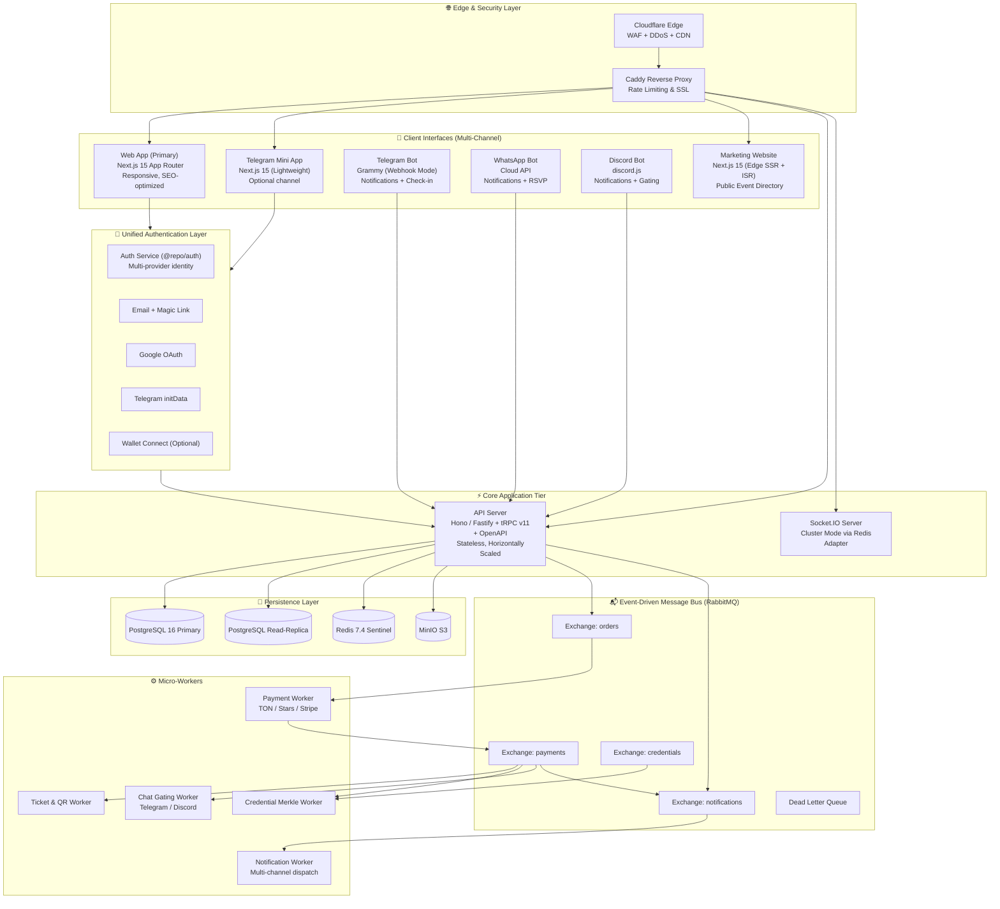
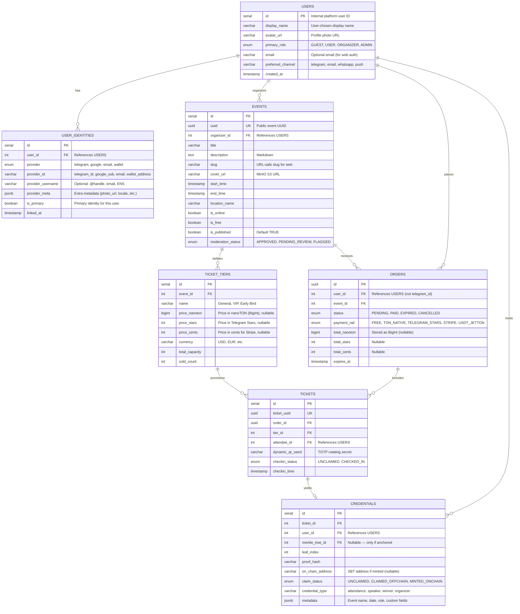
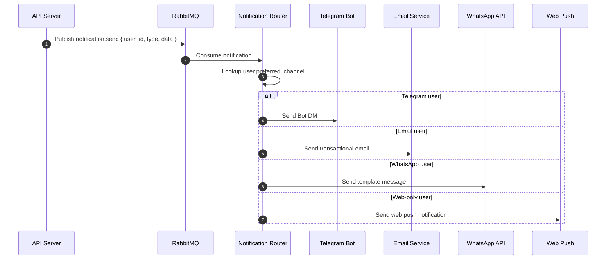
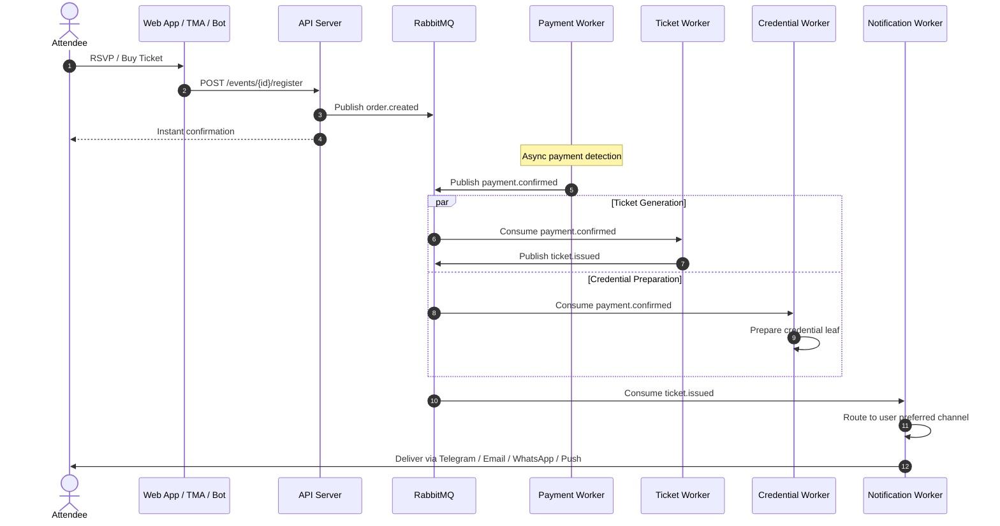
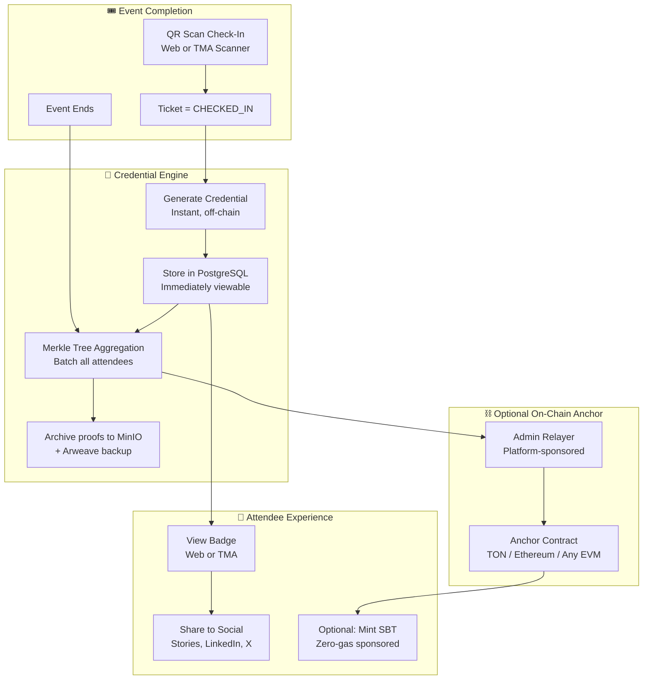
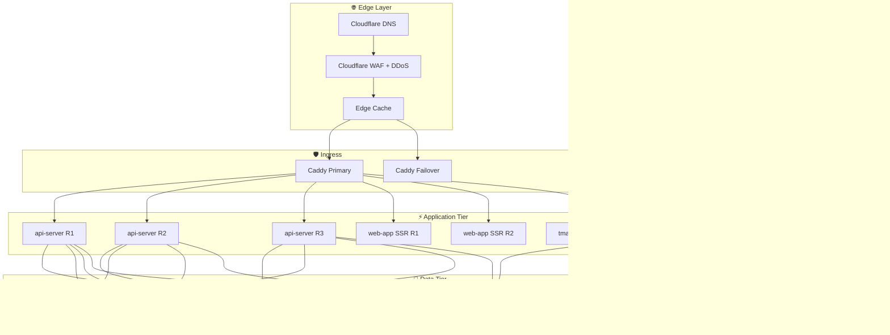

# ONTON Platform — TO-BE Technical Blueprint

> Last verified against dev: 2026-10-03

> **Target Architecture Specification (2026–2027)**
> **Vision:** "The Event Engagement Platform — Verifiable Credentials, Gamified Participation, Omnichannel Reach"
> **Authors:** Antigravity AI & Mahdi Farimani (مهدی فریمانی)
> **Status:** Plan. Sections 1–9 describe the **target** architecture. Unless a line is explicitly marked "exists today", treat it as **not implemented**.

> [!IMPORTANT]
> This is a plan, not a description of the running system. The verified current state is in [as_is_technical_blueprint.md](as_is_technical_blueprint.md). Delivery status per issue is in §10, checked against `dev` on 2026-10-03.

---

## 1. Executive Vision & Strategic Pivot

### 1.1 The Shift: From "Luma for Telegram" to "Event Engagement Platform"

ONTON is pivoting from a Telegram-locked mini-app into a **channel-agnostic Event Engagement Platform**. The previous narrative — "The Lu.ma of Telegram & Web3" — constrained market reach and created existential dependency on a single distribution channel.

**What ONTON is becoming:**

> Turn one-time attendees into loyal communities — with verifiable credentials, gamified participation, and omnichannel reach.

**Core principles of the new architecture:**
1. **Web-first, channel-optional** — The primary experience is a responsive web app. Telegram, WhatsApp, Discord, and other messaging platforms are distribution channels, not the product.
2. **Credential-native** — Verifiable proof-of-attendance (SBTs, badges) is ONTON's core differentiator. No other event platform does this well.
3. **Engagement-driven** — Quests, tournaments, points, affiliate referrals, and community walls drive repeat usage and organic growth.
4. **Blockchain-optional** — Credentials work off-chain by default. On-chain anchoring (TON, Ethereum, or any chain) is an opt-in power feature.


```mermaid
flowchart TD
    Root["ONTON Event Engagement Platform"]

    subgraph Core["🎯 Core Value Proposition"]
        C1["Verifiable Attendance Credentials"]
        C2["Gamified Engagement Engine"]
        C3["Instant Zero-Friction RSVP"]
        C4["Organizer Analytics & Growth Tools"]
    end

    subgraph Channels["📱 Distribution Channels (Plug-in)"]
        CH1["Web App (Primary)"]
        CH2["Telegram Mini App + Bot"]
        CH3["WhatsApp Business API"]
        CH4["Discord Bot"]
        CH5["Email + Push Notifications"]
    end

    subgraph Infra["⚡ Platform Infrastructure"]
        I1["Standalone API Server"]
        I2["Event-Driven Message Bus"]
        I3["Unified Auth (Multi-Provider)"]
        I4["Credential Merkle Engine"]
    end

    Root --> Core
    Root --> Channels
    Root --> Infra
```

### 1.2 Strategic OKRs (Revised)

1. **Zero-Friction Conversion**: Reduce time-to-RSVP to <3 seconds on any platform — web, Telegram, or deep link. No wallet, no app install, no Telegram account required for free events.
2. **Channel Independence**: Any user can register, attend, and receive credentials without a Telegram account. Telegram becomes the best (but not only) channel.
3. **Instant Organizer Gratification**: Event creation to public shareable link in <60 seconds, with auto-publishing and post-moderation.
4. **Credential Moat**: Build the largest verifiable event credential network — proof-of-attendance that works across Web2 and Web3.
5. **Architectural Decoupling**: Extract a standalone API server from the `mini-app` monolith. Any frontend (web, TMA, mobile) consumes the same API.

### 1.3 Competitive Positioning

| Feature | Luma | Eventbrite | Partiful | **ONTON** |
|---------|------|-----------|----------|-----------|
| Web-first RSVP | ✅ | ✅ | ✅ | Partial today (web login exists; web-first app is target) |
| Telegram native | ❌ | ❌ | ❌ | ✅ (channel) |
| WhatsApp/Discord | ❌ | ❌ | ❌ | Planned |
| Verifiable credentials | ❌ | ❌ | ❌ | Partial today (native SBT; Merkle proofs not anchored) |
| Gamification (quests, points) | ❌ | ❌ | ❌ | **✅ (core)** |
| Chat group gating | ❌ | ❌ | ❌ | Partial today (single-use invite links only) |
| On-chain proof | ❌ | ❌ | ❌ | ✅ (opt-in SBT) |
| Anti-fraud TOTP check-in | ❌ | Basic | ❌ | ✅ (exists today) |

---

## 2. Target Architecture Map (TO-BE)

The fundamental change: **the API server is the center of the universe**, not the Telegram Mini App. All clients — web, TMA, bots, mobile — are equal consumers.


```mermaid
graph TB
    subgraph Clients["📱 Client Interfaces (Multi-Channel)"]
        WebApp["Web App (Primary)\n Next.js 15 App Router\n Responsive, SEO-optimized"]
        TMA["Telegram Mini App\n Next.js 15 (Lightweight)\n Optional channel"]
        TGBot["Telegram Bot\n Grammy (Webhook Mode)\n Notifications + Check-in"]
        WABot["WhatsApp Bot\n Cloud API\n Notifications + RSVP"]
        DiscordBot["Discord Bot\n discord.js\n Notifications + Gating"]
        Marketing["Marketing Website\n Next.js 15 (Edge SSR + ISR)\n Public Event Directory"]
    end

    subgraph AuthLayer["🔐 Unified Authentication Layer"]
        AuthService["Auth Service (@repo/auth)\n Multi-provider identity"]
        EmailAuth["Email + Magic Link"]
        GoogleAuth["Google OAuth"]
        TGAuth["Telegram initData"]
        WalletAuth["Wallet Connect (Optional)"]
    end

    subgraph IngressLayer["🌐 Edge & Security Layer"]
        CF["Cloudflare Edge\n WAF + DDoS + CDN"]
        CaddyProxy["Caddy Reverse Proxy\n Rate Limiting & SSL"]
    end

    subgraph AppTier["⚡ Core Application Tier"]
        APIServer["API Server\n Hono / Fastify + tRPC v11 + OpenAPI\n Stateless, Horizontally Scaled"]
        SocketCluster["Socket.IO Server\n Cluster Mode via Redis Adapter"]
    end

    subgraph EventBus["📬 Event-Driven Message Bus (RabbitMQ)"]
        ExOrders["Exchange: orders"]
        ExPayments["Exchange: payments"]
        ExCredentials["Exchange: credentials"]
        ExNotifications["Exchange: notifications"]
        DLQ["Dead Letter Queue"]
    end

    subgraph WorkerFleet["⚙️ Micro-Workers"]
        WPayment["Payment Worker\n TON / Stars / Stripe"]
        WTicket["Ticket & QR Worker"]
        WSBT["Credential Merkle Worker"]
        WNotify["Notification Worker\n Multi-channel dispatch"]
        WGate["Chat Gating Worker\n Telegram / Discord"]
    end

    subgraph DataTier["💾 Persistence Layer"]
        PGMaster[("PostgreSQL 16 Primary")]
        PGReplica[("PostgreSQL Read-Replica")]
        RedisCluster[("Redis 7.4 Sentinel")]
        MinIOStore[("MinIO S3")]
    end

    CF --> CaddyProxy
    CaddyProxy --> WebApp & TMA & Marketing & APIServer & SocketCluster

    WebApp --> AuthLayer --> APIServer
    TMA --> AuthLayer
    TGBot --> APIServer
    WABot --> APIServer
    DiscordBot --> APIServer

    APIServer --> PGMaster & PGReplica & RedisCluster & MinIOStore
    APIServer --> ExOrders & ExNotifications

    ExOrders --> WPayment
    WPayment --> ExPayments
    ExPayments --> WTicket & WSBT & WGate
    ExPayments --> ExNotifications
    ExNotifications --> WNotify
    ExCredentials --> WSBT
```

### Today (dev) vs Target

| Aspect | Today (verified on `dev`) | Target (not implemented unless noted) |
|--------|---------------------------|------------------------|
| Primary UI | Telegram Mini App (`mini-app`), also usable in a browser | Web App (responsive) |
| Auth | Telegram initData, Telegram Login Widget, Google web OAuth, email OTP (codes logged, not emailed — F-27); all issue a 7-day platform JWT | Same providers plus emailed OTP/magic link and wallet login |
| User identity | `users.user_id bigint` PK; `telegram_id`, `uuid`, `email` columns; `user_identities` table | Internal id with linked identities (largely in place) |
| Notifications | Telegram bot DMs and RabbitMQ notifications queue | Multi-channel dispatch (Telegram, Email, WhatsApp, Push) |
| Payment rails | TON, USDT jetton, Telegram Stars, free | TON + Stars + Stripe + crypto (modular) |
| Public event pages | Web URL `<base>/events/<uuid>` and TMA link `t.me/<bot>/event?startapp=<uuid>` (`lib/links/linkService.ts`) | SEO-indexed slug URLs + optional TMA links |
| Check-in | Scanners in `mini-app` with 20s rotating passes | Web scanner + TMA + hardware |
| Credential display | Native badges page (`my/badges`) | Native credential viewer (web + TMA) |

---

## 3. Unified Identity & Multi-Provider Auth

Goal: **decouple user identity from Telegram**. Much of the base already exists today (see §3.2).

### 3.1 Target Identity Model (not implemented as drawn)

> [!NOTE]
> The diagram below is a target model. Today's schema differs: `users.user_id` is a `bigint` PK, `users.role` is a text column with `user | organizer | admin | ban` (no `GUEST`), `user_identities.id` is a `uuid` with `provider_user_id` / `provider_metadata` / `verified`, tiers live in `event_ticket_tiers` with a `real` price, and order states are `new | confirming | processing | completed | cancelled | failed`. Credential data lives in the `rewards`, `sbtCollections`, `sbtItems` and `sbtRewardCollections` schemas (`mini-app/src/db/schema/`).


```mermaid
erDiagram
    USERS ||--o{ USER_IDENTITIES : has
    USERS ||--o{ EVENTS : organizes
    USERS ||--o{ ORDERS : places
    USERS ||--o{ CREDENTIALS : holds

    USERS {
        serial id PK "Internal platform user ID"
        varchar display_name "User-chosen display name"
        varchar avatar_url "Profile photo URL"
        enum primary_role "GUEST, USER, ORGANIZER, ADMIN"
        varchar email "Optional email (for web auth)"
        varchar preferred_channel "telegram, email, whatsapp, push"
        timestamp created_at
    }

    USER_IDENTITIES {
        serial id PK
        int user_id FK "References USERS"
        enum provider "telegram, google, email, wallet"
        varchar provider_id "telegram_id, google_sub, email, wallet_address"
        varchar provider_username "Optional: @handle, email, ENS"
        jsonb provider_meta "Extra metadata (photo_url, locale, etc.)"
        boolean is_primary "Primary identity for this user"
        timestamp linked_at
    }

    EVENTS {
        serial id PK
        uuid uuid UK "Public event UUID"
        int organizer_id FK "References USERS"
        varchar title
        text description "Markdown"
        varchar slug "URL-safe slug for web"
        varchar cover_url "MinIO S3 URL"
        timestamp start_time
        timestamp end_time
        varchar location_name
        boolean is_online
        boolean is_free
        boolean is_published "Default TRUE"
        enum moderation_status "APPROVED, PENDING_REVIEW, FLAGGED"
    }

    TICKET_TIERS {
        serial id PK
        int event_id FK
        varchar name "General, VIP, Early Bird"
        bigint price_nanoton "Price in nanoTON (BigInt), nullable"
        int price_stars "Price in Telegram Stars, nullable"
        int price_cents "Price in cents for Stripe, nullable"
        varchar currency "USD, EUR, etc."
        int total_capacity
        int sold_count
    }

    ORDERS {
        uuid id PK
        int user_id FK "References USERS (not telegram_id)"
        int event_id FK
        enum status "PENDING, PAID, EXPIRED, CANCELLED"
        enum payment_rail "FREE, TON_NATIVE, TELEGRAM_STARS, STRIPE, USDT_JETTON"
        bigint total_nanoton "Stored as BigInt (nullable)"
        int total_stars "Nullable"
        int total_cents "Nullable"
        timestamp expires_at
    }

    TICKETS {
        serial id PK
        uuid ticket_uuid UK
        uuid order_id FK
        int tier_id FK
        int attendee_id FK "References USERS"
        varchar dynamic_qr_seed "TOTP rotating secret"
        enum checkin_status "UNCLAIMED, CHECKED_IN"
        timestamp checkin_time
    }

    CREDENTIALS {
        serial id PK
        int ticket_id FK
        int user_id FK "References USERS"
        int merkle_tree_id FK "Nullable — only if anchored"
        int leaf_index
        varchar proof_hash
        varchar on_chain_address "SBT address if minted (nullable)"
        enum claim_status "UNCLAIMED, CLAIMED_OFFCHAIN, MINTED_ONCHAIN"
        varchar credential_type "attendance, speaker, winner, organizer"
        jsonb metadata "Event name, date, role, custom fields"
    }

    EVENTS ||--o{ TICKET_TIERS : defines
    EVENTS ||--o{ ORDERS : receives
    TICKET_TIERS ||--o{ TICKETS : provisions
    ORDERS ||--o{ TICKETS : includes
    TICKETS ||--o| CREDENTIALS : yields
```

### 3.2 Auth Abstraction (target)

Target: one auth module serving all providers through a single interface. Today this logic lives in `mini-app/src/lib/auth/authEngine.ts`, `mini-app/src/server/context.ts` and `mini-app/src/server/utils/jwt.ts`. There is no `@repo/auth` package in the repo.

```
Target Auth Flow:
  1. Client sends auth request (provider-specific payload)
  2. Auth module validates:
     - Telegram: validate initData signature + auth_date TTL   (exists today)
     - Google: verify OAuth via Google                          (exists today, web OAuth)
     - Email: OTP code                                          (exists today, but code is logged, not emailed — F-27)
     - Email magic link                                         (target)
     - Wallet: verify TonProof / SIWE signature as a login      (target; TonProof today only issues a wallet JWT)
  3. Resolve to internal user_id (create or link identity)      (exists today)
  4. Issue platform JWT (same format for all providers)         (exists today, 7 days)
  5. All downstream API calls use platform JWT only             (target; tRPC still also accepts raw initData and API keys, sockets accept initData only)
```

**Migration path — status on `dev` (2026-10-03):**

| Phase | Scope | Status |
|---|---|---|
| 1 | `user_identities` table, `telegram_id` column, backfill (migration 0123) | Done. PK is still `users.user_id bigint`; web users get a random id ≥ 1e14. |
| 2 | Email + Google login on web | Done for Google web OAuth and email OTP. OTP delivery by email is open (F-27). |
| 3 | All API routes accept platform JWT | Partial. tRPC and REST accept Bearer JWT; sockets accept initData only. |
| 4 | Optional wallet linking for credential claiming | Partial. TonProof issues a wallet JWT but writes no identity; `users.addWallet` stores an unproven wallet. Proof-backed linking is target. |

---

## 4. Multi-Channel Notification Engine (target — not implemented)

Today notifications go through Telegram (bot HTTP API and the RabbitMQ `${STAGE_NAME}-notifications` queue). No email transport is wired up (email OTP codes are only logged — F-27). Target: replace this with a channel router:


```mermaid
sequenceDiagram
    autonumber
    participant API as API Server
    participant Bus as RabbitMQ
    participant Router as Notification Router
    participant TG as Telegram Bot
    participant Email as Email Service
    participant WA as WhatsApp API
    participant Push as Web Push

    API->>Bus: Publish notification.send { user_id, type, data }
    Bus->>Router: Consume notification
    Router->>Router: Lookup user preferred_channel
    alt Telegram user
        Router->>TG: Send Bot DM
    else Email user
        Router->>Email: Send transactional email
    else WhatsApp user
        Router->>WA: Send template message
    else Web-only user
        Router->>Push: Send web push notification
    end
```

### Target Notification Types & Channel Support

| Notification | Telegram | Email | WhatsApp | Web Push |
|---|---|---|---|---|
| Registration confirmation | ✅ Bot DM | ✅ | ✅ | ✅ |
| QR ticket delivery | ✅ Bot DM | ✅ PDF | ✅ Link | ✅ |
| Event reminder (24h) | ✅ | ✅ | ✅ | ✅ |
| Check-in confirmation | ✅ | ❌ | ❌ | ✅ |
| Credential ready to claim | ✅ | ✅ | ❌ | ✅ |
| Organizer: new registration | ✅ | ✅ | ❌ | ✅ |
| Broadcast (organizer→attendees) | ✅ | ✅ | ✅ | ✅ |

---

## 5. Monorepo Re-Architecture (Turborepo + pnpm) — target, not implemented

Today there is no root `package.json`. `mini-app`, `telegram-bot`, `client-web-panel` and `website` are standalone Yarn projects; `newton/` is a pnpm workspace with `apps/nft-manager` and `packages/{eslint-config,typescript-config,tma,ui}`. None of the `packages/` listed below exist yet.

```
onton-platform/
├── turbo.json
├── pnpm-workspace.yaml
├── package.json
├── packages/
│   ├── db/                 # Unified Drizzle ORM: schemas, migrations, typed queries
│   ├── auth/               # Multi-provider auth: Telegram, Google, Email, Wallet
│   ├── ui/                 # Shared Design System: Tailwind + shadcn/ui
│   ├── credentials/        # Credential engine: Merkle trees, proof generation, verification
│   ├── notifications/      # Channel router: Telegram, Email, WhatsApp, Push
│   ├── queue/              # Typed RabbitMQ AMQP: publishers, consumers, DLQ
│   ├── config-typescript/  # Strict base tsconfig
│   └── config-eslint/      # Standardized ESLint + Prettier
├── apps/
│   ├── api/                # Standalone API Server (Hono + tRPC v11 + OpenAPI)
│   ├── web/                # Web App (Next.js 15 — primary user experience)
│   ├── tma/                # Telegram Mini App (Next.js 15 — lightweight TMA client)
│   ├── website/            # Marketing & Public Event Directory (Next.js 15 Edge SSR)
│   ├── bot-telegram/       # Grammy Telegram Bot (Webhook mode)
│   ├── bot-discord/        # Discord Bot (future)
│   └── socket/             # Socket.IO WebSocket cluster
├── workers/
│   ├── payment-worker/     # Payment reconciliation (TON, Stars, Stripe)
│   ├── ticket-worker/      # Ticket + dynamic QR pass generation
│   ├── credential-worker/  # Merkle tree aggregation + on-chain anchoring
│   ├── gate-worker/        # Chat gating (Telegram groups, Discord roles)
│   └── notify-worker/      # Multi-channel notification dispatch
└── infra/
    ├── docker/             # Multi-stage Dockerfiles
    ├── k8s/                # Helm charts for HA deployment
    └── caddy/              # Caddyfile with edge routing
```

### Key Package Responsibilities

#### `@repo/auth` (Multi-Provider Identity)
- Telegram `initData` validation with 24h TTL enforcement
- Google OAuth token verification
- Email magic link / OTP generation and verification
- TonProof / SIWE wallet signature verification
- Unified JWT issuance (all providers → same token format)
- RBAC: `GUEST`, `ATTENDEE`, `ORGANIZER`, `CHECKIN_OFFICER`, `ADMIN`

#### `@repo/credentials` (Verifiable Attendance Engine)
- Off-chain credential issuance (default — works without blockchain)
- Merkle tree aggregation for batch on-chain anchoring (opt-in)
- Proof generation and verification API
- Credential metadata schema (event, role, date, custom fields)
- Export to portable formats (W3C Verifiable Credentials, JSON-LD)

#### `@repo/notifications` (Channel Router)
- User preference-based channel selection
- Telegram Bot DM (Grammy)
- Transactional email (Resend / SendGrid)
- WhatsApp Business Cloud API (future)
- Web Push (future)
- Rate limiting and adaptive backoff per channel

---

## 6. Event-Driven Architecture (RabbitMQ Message Bus) — target, not implemented

> [!NOTE]
> **Exists today:** three queues only — `${STAGE_NAME}-notifications` (with a DLX and a 5s retry queue), `${STAGE_NAME}-tg_messages`, `${STAGE_NAME}-order_paid`. `order_paid` is published only by the TON/USDT path; its consumer is likely failing and the 9s mint cron is the real fulfillment path (F-35). Failed mints become `failed` after 5 retries with a log line; there is no queue-based DLQ. None of the `onton.*` exchanges below exist, and RabbitMQ does not run on staging.


```mermaid
sequenceDiagram
    autonumber
    actor Attendee
    participant Client as Web App / TMA / Bot
    participant API as API Server
    participant Rabbit as RabbitMQ
    participant PayWorker as Payment Worker
    participant TicketWorker as Ticket Worker
    participant CredWorker as Credential Worker
    participant NotifyWorker as Notification Worker

    Attendee->>Client: RSVP / Buy Ticket
    Client->>API: POST /events/{id}/register
    API->>Rabbit: Publish order.created
    API-->>Attendee: Instant confirmation

    Note over PayWorker: Async payment detection
    PayWorker->>Rabbit: Publish payment.confirmed

    par Ticket Generation
        Rabbit->>TicketWorker: Consume payment.confirmed
        TicketWorker->>Rabbit: Publish ticket.issued
    and Credential Preparation
        Rabbit->>CredWorker: Consume payment.confirmed
        CredWorker->>CredWorker: Prepare credential leaf
    end

    Rabbit->>NotifyWorker: Consume ticket.issued
    NotifyWorker->>NotifyWorker: Route to user preferred channel
    NotifyWorker->>Attendee: Deliver via Telegram / Email / WhatsApp / Push
```

### AMQP Exchange & Queue Specification

| Exchange | Routing Key | Payload | Consumer(s) |
|---|---|---|---|
| `onton.orders` | `order.created` | `{ orderId, userId, eventId, rail, amount }` | `payment-worker` |
| `onton.orders` | `order.cancelled` | `{ orderId, reason }` | `inventory-worker` |
| `onton.payments` | `payment.confirmed` | `{ orderId, rail, txHash, confirmedAt }` | `ticket-worker`, `credential-worker`, `gate-worker` |
| `onton.tickets` | `ticket.issued` | `{ ticketUuid, orderId, attendeeId, qrSeed }` | `notify-worker`, `socket-server` |
| `onton.tickets` | `ticket.checked_in` | `{ ticketUuid, officerId, checkedInAt }` | `credential-worker`, `socket-server` |
| `onton.credentials` | `credential.ready` | `{ userId, eventId, credentialId }` | `notify-worker` |
| `onton.credentials` | `merkle.anchored` | `{ eventId, rootHash, anchorTx }` | `notify-worker` |
| `onton.notifications` | `notification.send` | `{ userId, channel, type, data }` | `notify-worker` |
| `onton.dlq` | `dead_letter` | Failed payloads with stack trace | Alerting dashboard |

---

## 7. Product & UX Blueprint (Platform-Agnostic) — target

### 7.1 Progressive Onboarding (Zero Barriers)

> [!NOTE]
> Slug URLs and the `e_` start parameter below are **target formats, not implemented**. Today links are `<base>/events/<eventUuid>` and `t.me/<bot>/event?startapp=<eventUuid>` (`mini-app/src/lib/links/linkService.ts`). Email/Google login and wallet-free free RSVP exist today; emailed passes, calendar export, and WhatsApp/Discord are target.

```
Step 1: Discover Event
   ├── Via web: <web-base>/e/<slug> (target; SEO-indexed, OpenGraph cards)
   ├── Via Telegram: t.me/<bot>/event?startapp=<eventUuid> (exists today)
   ├── Via WhatsApp: shared link → web fallback
   └── Via Discord: bot embed → web fallback

Step 2: Register (Zero Friction)
   ├── Web visitor: "Register with Email" or "Sign in with Google"
   ├── Telegram user: Auto-recognized via initData
   ├── Either way: 1-click RSVP, no wallet required
   └── TICKET CONFIRMED INSTANTLY

Step 3: Post-Registration (Channel-Aware)
   ├── Notification via preferred channel:
   │     ├── QR Code Pass (inline or downloadable)
   │     ├── Add-to-Calendar (.ics / Google Calendar)
   │     └── Private group invite link (Telegram/Discord if applicable)

Step 4: Progressive Engagement (Optional)
   ├── "Complete quests to earn points"
   ├── "Refer friends for bonus rewards"
   ├── "Connect wallet to claim your Soulbound Event Credential"
   └── "Share your attendance badge to social media"
```

### 7.2 Instant Publishing & Post-Moderation

**Exists today:**
- Free events are public immediately (`hidden=false`); a post-publish moderation alert goes to the moderation group (Delist / Warn / Ban / Update). Paid events stay hidden until the creation order is paid.
- Users can report events (one report per user per event). 3+ reports within 1h auto-quarantine the event (`hidden=true, enabled=false`) and alert moderators.

**Target (not implemented):**
- Slug-based web URL handed to the organizer on creation.
- Automatic content scanning of title, description and images, with a `PENDING_REVIEW` state.

### 7.3 Credential Engine (Core Differentiator) — target lifecycle

```
Target Credential Lifecycle:
  1. Attendee checks in at event (QR scan)                       (exists today)
  2. Credential leaf generated (off-chain, instant)              (target; today leaves are computed on read, nothing is stored)
  3. Attendee can view/share credential immediately (off-chain)  (partial; badges page + story share of badge image)
  4. After event: Merkle tree aggregated, root hash computed     (target; today the tree is rebuilt per request)
  5. Optional: Root anchored on-chain (TON, Ethereum, etc.)      (target; `contracts/csbt_anchor.fc` exists, nothing deploys or updates it)
  6. Attendee can mint on-chain SBT (gas sponsored by platform)  (partial; native TEP-85 mint exists; claim is free, on-chain upgrade is paid — F-36)
  7. Credential is verifiable by anyone (Merkle proof against anchor) (target)
```

**Use cases beyond attendance proof (target):**
- Conference speaker credentials
- Hackathon placement badges
- VIP/loyalty tier qualification
- Access gating (Telegram groups, Discord roles, content)
- Resume/portfolio verification (LinkedIn-style)

### 7.4 Chat & Group Gating (Multi-Platform)

| Platform | Mechanism | Status |
|----------|-----------|--------|
| Telegram | Bot generates single-use invite link for approved/checked-in registrants; revokes links of rejected users | Exists today. No join-request verification or removal of non-holders. |
| Discord | Bot assigns role; removes on cancel | Target |
| WhatsApp | Community invite link | Target |

---

## 8. Sovereign Credential & cSBT 2.0 Engine — target

> [!NOTE]
> **Exists today:** `mini-app/src/lib/csbt/` (plain binary Merkle tree, leaf = SHA256 of index, owner, event UUID, metadata hash), public `GET /api/v1/csbt/proof?eventUuid=&userId=` that rebuilds the tree per request from checked-in registrants, and the FunC contract `contracts/csbt_anchor.fc` with no deploy or update caller (F-35). Nothing is archived to MinIO or Arweave. Everything in the diagram and specs below is target.

With the platform-agnostic pivot, credentials become **off-chain first, on-chain optional**:


```mermaid
graph TB
    subgraph EventLifecycle["🎟️ Event Completion"]
        DoorCheckIn["QR Scan Check-In\n Web or TMA Scanner"] --> TicketCheckedIn["Ticket = CHECKED_IN"]
        EventConcludes["Event Ends"]
    end

    subgraph OffChainEngine["🌳 Credential Engine"]
        TicketCheckedIn --> LeafBuilder["Generate Credential\n Instant, off-chain"]
        LeafBuilder --> CredentialDB["Store in PostgreSQL\n Immediately viewable"]
        EventConcludes --> TreeAggregator["Merkle Tree Aggregation\n Batch all attendees"]
        CredentialDB --> TreeAggregator
        TreeAggregator --> MinIOArchival["Archive proofs to MinIO\n + Arweave backup"]
    end

    subgraph OnChainAnchor["⛓️ Optional On-Chain Anchor"]
        TreeAggregator --> AnchorDeployer["Admin Relayer\n Platform-sponsored"]
        AnchorDeployer --> AnchorContract["Anchor Contract\n TON / Ethereum / Any EVM"]
    end

    subgraph UserFlow["🪪 Attendee Experience"]
        CredentialDB --> CredentialViewer["View Badge\n Web or TMA"]
        CredentialViewer --> ShareSocial["Share to Social\n Stories, LinkedIn, X"]
        AnchorContract --> MintSBT["Optional: Mint SBT\n Zero-gas sponsored"]
    end
```

### Target Technical Specifications (not implemented)
1. **Tree Capacity**: Sparse Merkle Tree supporting up to 2^20 (1,048,576) leaves per event. (Today: plain binary tree, rebuilt per request.)
2. **Chain Agnostic**: Anchor contracts can be deployed to TON, Ethereum, Polygon, or any EVM chain.
3. **Zero-Gas Relayer**: Platform sponsors mint transactions from treasury.
4. **Portable Credentials**: Export as W3C Verifiable Credential JSON-LD for interoperability.

---

## 9. Target Infrastructure & High Availability — target, not implemented

> [!NOTE]
> **Exists today:** one prod host (`65.109.212.86`) running plain `docker compose` project `local-onton`, deployed manually; staging is a Docker Swarm stack `onton-dev` on `65.109.182.13`. Single Postgres, single Redis without persistence, no replicas, and no automated prod DB backups. CI deploys both `dev` and `main` to the staging host (F-04).


```mermaid
graph TB
    subgraph EdgeTier["🌐 Edge Layer"]
        CFDNS["Cloudflare DNS"]
        CFWAF["Cloudflare WAF + DDoS"]
        CFCDN["Edge Cache"]
    end

    subgraph IngressTier["🛡️ Ingress"]
        LB1["Caddy Primary"]
        LB2["Caddy Failover"]
    end

    subgraph ComputeTier["⚡ Application Tier"]
        API1["api-server R1"]
        API2["api-server R2"]
        API3["api-server R3"]
        FE1["web-app SSR R1"]
        FE2["web-app SSR R2"]
        TMA1["tma (lightweight)"]
        WGroup1["Payment + Ticket Workers"]
        WGroup2["Credential + Notify Workers"]
    end

    subgraph StorageCluster["💾 Data Tier"]
        PGPrimary[("PostgreSQL Primary")]
        PGStandby[("PostgreSQL Replica")]
        RedisSentinel[("Redis Sentinel")]
        RabbitCluster[("RabbitMQ Quorum")]
        MinIOCluster[("MinIO S3")]
    end

    CFDNS --> CFWAF --> CFCDN
    CFCDN --> LB1 & LB2
    LB1 --> API1 & API2 & API3
    LB1 --> FE1 & FE2 & TMA1
    API1 & API2 & API3 --> PGPrimary & PGStandby & RedisSentinel & RabbitCluster
    WGroup1 & WGroup2 --> RabbitCluster & PGPrimary & MinIOCluster
```

### Security & Hardening

| Item | Today (verified) | Target |
|---|---|---|
| Secrets in repo | Cert files removed from `devops/cert` in 2.0. History scrub not verified. Secret env vars have insecure fallbacks if unset. | History scrubbed; all secrets in GitHub Environments or Vault; no code fallbacks |
| Network | Docker DNS service names (no static IPs) | Same; database ports closed externally |
| CORS | Allowlist from `CORS_ALLOWED_ORIGINS` (`mini-app/src/lib/cors.ts`), applied in `mini-app/src/middleware.ts` | Same |
| Service auth | telegram-bot Express API behind HMAC middleware (`telegram-bot/src/middleware/hmacAuth.ts`) | HMAC for all inter-service calls; platform JWT only for clients |
| Backups | None automated | Automated, monitored prod DB backups |

---

## 10. Phased Delivery Roadmap (Revised — 6 Waves)

The roadmap is reorganized around the platform-agnostic pivot:


```mermaid
flowchart TD
    subgraph W1["Wave 1: Security & Correctness\n Ship this week"]
        W1_1["#976 Secret Purge + Key Rotation"]
        W1_2["#943 CORS Domain Allowlist"]
        W1_3["#945 BigInt Payments + #947 Row Locks"]
        W1_4["#940 Bot HMAC Auth"]
        W1_5["#955 Hash API Keys"]
        W1_6["#958 Auth Event Export"]
        W1_7["#961 Fix CI + #963 Remove TLS Skip"]
    end

    subgraph W2["Wave 2: API Extraction & Auth\n Foundation for independence"]
        W2_1["#973 Extract Standalone API Server"]
        W2_2["NEW: Multi-Provider Auth System"]
        W2_3["#974 Unify ORM to Drizzle"]
        W2_4["#975 Merge NFT DB"]
        W2_5["#978 Router Decomposition"]
    end

    subgraph W3["Wave 3: Web-First Experience\n Break Telegram dependency"]
        W3_1["NEW: Web App (onton.live)"]
        W3_2["#948 SSR Event Pages + SEO"]
        W3_3["#1010 Instant Publishing"]
        W3_4["#946 Hybrid Auth (Google/Email)"]
        W3_5["NEW: Notification Channel Router"]
    end

    subgraph W4["Wave 4: Engagement Engine\n Core differentiator"]
        W4_1["#992 Credential Viewer (Web + TMA)"]
        W4_2["#996 TOTP QR Anti-Fraud Check-in"]
        W4_3["#994 Merkle Proof API"]
        W4_4["#993 Social Sharing Badges"]
        W4_5["Quests + Points + Affiliates"]
    end

    subgraph W5["Wave 5: Scale & Reliability\n Production hardening"]
        W5_1["#979 RabbitMQ Event-Driven Bus"]
        W5_2["#981 PostgreSQL HA + Replicas"]
        W5_3["#985 Edge WAF + Rate Limiting"]
        W5_4["#953 Load Testing 5k Concurrent"]
        W5_5["#983 Monorepo Consolidation"]
    end

    subgraph W6["Wave 6: Channel Expansion\n Growth channels"]
        W6_1["WhatsApp Business Integration"]
        W6_2["Discord Bot + Role Gating"]
        W6_3["#997 Telegram Chat Gating"]
        W6_4["Web Push Notifications"]
        W6_5["Mobile PWA Optimization"]
    end

    W1 --> W2
    W2 --> W3
    W3 --> W4
    W4 --> W5
    W5 --> W6
```

### Wave Details & Delivery Status (checked against `dev`, 2026-10-03)

Status key: **Done** = verified in code; **Partial** = exists with gaps listed; **Not verified** = no evidence found in the fact sheets, status unknown; **Next / Backlog** = not implemented.

#### Wave 1: Security & Correctness — Partial

| Issue | Title | Status | Verified details |
|---|---|---|---|
| #976 | Secret purge (git history scrub + key rotation) | Not verified | Cert files removed from `devops/cert` in 2.0. History scrub and rotation not verified. |
| #943 | Replace wildcard CORS with domain allowlist | Done | `mini-app/src/lib/cors.ts` + `middleware.ts` |
| #961 | Make CI fail on actual errors | Done | `validate-services` runs mini-app `lint:quiet` + `test:api`, telegram-bot `build` |
| #963 | Remove NODE_TLS_REJECT_UNAUTHORIZED=0 | Done | Removed from compose files |
| #958 | Add auth to event metadata export | Not verified | — |
| #955 | Hash API keys + constant-time comparison | Done | bcrypt user API keys; constant-time `x-api-key` check |
| #940 | Add HMAC auth to bot Express API | Done | `telegram-bot/src/middleware/hmacAuth.ts`, 60s replay window |
| #945 | BigInt for TON payment reconciliation | Partial | Compare is BigInt, but the expected amount is derived from a `real` (float) price |
| #947 | Row-level locking for NFT minting & RSVP | Partial | No inventory row lock; order creation is check-then-insert. Mint uses a Redis lock; registration uses a Redis lock per event. |
| #950 | Telegram broadcast FloodWait backoff | Partial | `retry_after` handling found in bot poll/broadcast crons; behaviour not verified |

#### Wave 2: Architecture Decoupling & Multi-Provider Identity — In progress

| Issue | Title | Status | Notes |
|---|---|---|---|
| #1015 | Multi-provider identity | Partial | Telegram, Telegram widget, Google web OAuth, email OTP (logged, not emailed — F-27). Wallet login not implemented. No `@repo/auth` package; code is in `mini-app/src/lib/auth/authEngine.ts`. |
| #1016 | `user_identities` table & UUID column | Done | Migration 0123. PK is still `users.user_id bigint`; `uuid` and `telegram_id` are extra columns. |
| #1019 | `HostPlatformBridge` TMA abstraction | Partial | `mini-app/src/lib/platform/` exists; coverage not verified |
| #1020 | `LinkService` universal URL generator | Done | `mini-app/src/lib/links/linkService.ts`: web `/events/<uuid>` + TMA link |
| #973 | Extract backend into standalone API server | Next | — |
| #974 | Unify data access layer to Drizzle ORM | Next | telegram-bot uses raw `pg`; nft-manager (Prisma) is not deployed |
| #975 | Merge NFT DB into primary database | Next | — |
| #978 | Decompose monolithic tRPC routers | Next | — |

#### Wave 3: Web-First Experience — Partial

| Issue | Title | Status | Verified details |
|---|---|---|---|
| #1011 | Decouple legacy TON Society activity_id | Done | TS registration is optional and non-fatal; hub defaults applied |
| #1012 | Auto-publish events by default | Done | Free events public immediately; paid events hidden until creation order is paid |
| #1009 | Progressive Web3 disclosure | Done | `has_web3` toggle gates paid-event inputs |
| #966 | Multi-tier ticketing schema | Partial | `event_ticket_tiers` (migration 0125), seeded one tier per event. No tier-creation API; paid sales do not increment `sold_count` (F-34). Token is per event. |
| #970 | Native Telegram Stars checkout | Partial | Invoice + `successful_payment` work; pre-checkout does not validate (F-33); no mint or affiliate count |
| #948 | SSR event pages with OpenGraph SEO | Partial | `generateMetadata` in `mini-app/src/app/events/[hash]/page.tsx`; slug URLs not implemented |
| #1022 | Consolidate participant-tma into mini-app | Done | Source removed; 4 explicit `/ptma` rewrites |

#### Wave 4: Engagement Engine & Credential Suite — Partial

| Issue | Title | Status | Verified details |
|---|---|---|---|
| #992 | ONTON Passport & in-app showcase | Done | `my/badges` page via `sbt.getUserBadges` |
| #996 | Dynamic TOTP QR anti-fraud check-in | Done | `mini-app/src/lib/totp/passToken.ts`, 20s step ±1; static UUIDs rejected at scan; check-in is event-manager only |
| #994 | Merkle Proof API & ingestion | Partial | `GET /api/v1/csbt/proof?eventUuid=&userId=`; tree rebuilt per request, not anchored (F-35) |
| #993 | Social sharing for event badges | Partial | `shareToStory` with the raw badge image; no canvas card |
| 7ceb49ab | Dual-tier credential issuance | Partial | Native TEP-85 mint; free claim vs paid on-chain upgrade overlap (F-36) |
| abb0f47b | Legacy TON Society SBT ingestion | Done | Legacy rewards merged into `getUserBadges` |

#### Wave 5: Scale, Reliability & DevOps — In progress

| Issue | Title | Status | Notes |
|---|---|---|---|
| #986 | Remove hardcoded Docker static IPs | Done | Services use Docker DNS names |
| #985 | Edge rate limiting & WAF | Partial | Caddy image includes `caddy-ratelimit`; mini-app middleware has edge rate limits. WAF not verified. |
| #980 | Automated CI test gates | Partial | Lint + Vitest before build; Playwright smoke runs **after** deploy, not as a gate. No `type:check`. |
| #941 | RabbitMQ payment events & DLQ | Partial | `order_paid` queue + `orderEvents.ts`; consumer likely failing (F-35). "DLQ" is a `failed` order state after 5 retries, not a queue. |
| — | Automated prod deploy | Next | CI deploys `main` to the staging host (F-04) |
| — | Automated prod DB backups | Next | Scripts exist; cron not installed |
| #981 | PostgreSQL read-replica + HA | Next | — |
| #983 | Monorepo consolidation (Turborepo + pnpm) | Next | — |
| #982 | Strip browser TON polyfills | Next | Polyfills still in `mini-app/next.config.js` |

#### Wave 6: Channel Expansion & Advanced Integrations — Backlog

| Issue | Title | Status | Notes |
|---|---|---|---|
| #997 | Telegram chat & group gating | Partial | Single-use invite links + revocation for rejected users; no join-request checks |
| #1014 | Attendee community wall & commenting | Not verified | — |
| — | WhatsApp Business & Discord bot gating | Backlog | — |
| — | Web Push & Mobile PWA optimization | Backlog | — |

---

## 11. Issue Reclassification (proposal)

### Issues proposed to CLOSE
| # | Title | Reason |
|---|-------|--------|
| #936 | TonProof nonce enforcement | Resolved: single-use Redis challenge, 60s TTL |
| #950 | FloodWait retry logic | Proposed; behaviour not verified |
| #952 | Remove SSH keys from root | Proposed; history scrub tracked in #976 (not verified) |
| #964 | QA test suite | Real staging E2E suite exists (`tests/e2e`, `playwright.real.config.ts`) |
| #965 | Restore Client Web Panel auth | Proposal: panel to be superseded by the target web app |
| #866 | Configure subdomain for Client Web Panel | Proposal: panel to be superseded |

### Issues to REFRAME
| # | Original Title | New Framing |
|---|----------------|------------|
| #984 | Deduplicate Telegram auth → shared package | → Extract `mini-app/src/lib/auth/` into a shared auth package |
| #977 | Resolve framework inconsistency | → Consolidate into monorepo (Wave 5) |
| #946 | Hybrid Auth (Google/Email + Telegram) | → Finish: emailed OTP (F-27), proof-backed wallet linking |
| #948 | SSR event pages for SEO | → Web-first event pages with slug URLs |
| #992 | ONTON Passport TMA | → Credential viewer (web + TMA) |
| #993 | Telegram Story sharing | → Multi-platform social sharing |
| #997 | Telegram Chat Gating | → Multi-platform gating (Telegram + Discord) |

### New Issues to Create
| Title | Wave | Priority |
|-------|------|----------|
| Shared multi-provider auth package (extract from mini-app) | 2 | High |
| Build web app — primary user experience | 3 | Critical |
| Multi-channel notification dispatch (incl. email transport) | 3 | High |
| WhatsApp Business API integration | 6 | Medium |
| Discord bot + role gating | 6 | Medium |
| Web push notification support | 6 | Medium |

---

## 12. Conclusion

The TO-BE ONTON Platform is planned to evolve from a Telegram-centred mini-app into a **channel-agnostic Event Engagement Platform** where:

- **Any user** can discover, register, attend, and earn credentials — whether they use Telegram, a web browser, WhatsApp, or Discord.
- **Verifiable credentials** are the core differentiator — portable, optionally on-chain proof-of-attendance.
- **Engagement mechanics** (quests, tournaments, affiliates, community walls) drive retention and organic growth.
- **Telegram remains the strongest channel** but is no longer the only one.

Today's base (multi-provider login, `user_identities`, rotating passes, native SBTs, cSBT proof library) is partial. The open items in §10 and the QA findings (F-04, F-27, F-30, F-33–F-36, no automated backups) come before the target work.
