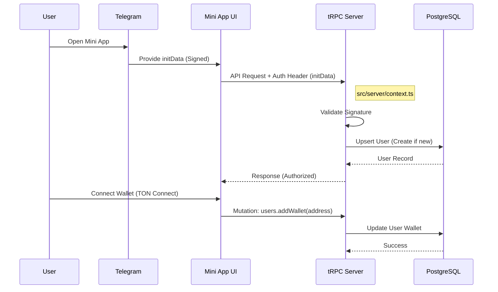

# User Onboarding & Authentication

The ONTON platform uses a seamless, "login-less" onboarding experience driven by Telegram's native authentication data.

## 1. Authentication Flow

Authentication is handled automatically when a user opens the Mini App.

### 1.1 Telegram InitData
When the Mini App launches, Telegram provides an `initData` string containing signed user information (ID, Username, Photo URL).

### 1.2 Backend Validation
The frontend sends this `initData` in the `Authorization` header with every tRPC request.

*   **File:** `src/server/context.ts`
*   **Process:**
    1.  Extract `Authorization` header.
    2.  Validate signature using the Bot Token (via `validateMiniAppData`).
    3.  **Upsert User:** If valid, the system calls `usersDB.insertUser`. This ensures that *every* authenticated request corresponds to a valid user record in the database.
    4.  **Affiliate Check:** If `start_param` is present (e.g., `join-123`), it links the user to an affiliate.

## 2. Wallet Connection

After authentication, users can connect their TON Wallet (e.g., Tonkeeper) to enable interactions like buying tickets or receiving rewards.

*   **Frontend:** Uses `TON Connect` UI kit.
*   **Backend Procedure:** `users.addWallet`
*   **File:** `src/server/routers/users.ts`
*   **Logic:**
    *   User connects wallet on frontend.
    *   Frontend sends wallet address to backend.
    *   Backend updates the `wallet` field in the `users` table.

## 3. Data Flow Diagram

## 4. Key Database Fields
*   **`user_id`** (BigInt): Telegram User ID (Primary Key).
*   **`username`**: Telegram Handle.
*   **`wallet`**: Connected TON Wallet Address.
*   **`role`**: `user`, `organizer`, or `admin`.

## 5. Security Note
Top-level protection is enforced by `initDataProtectedProcedure` in `trpc.ts`, which ensures that `ctx.user` is always populated and valid before executing business logic.
