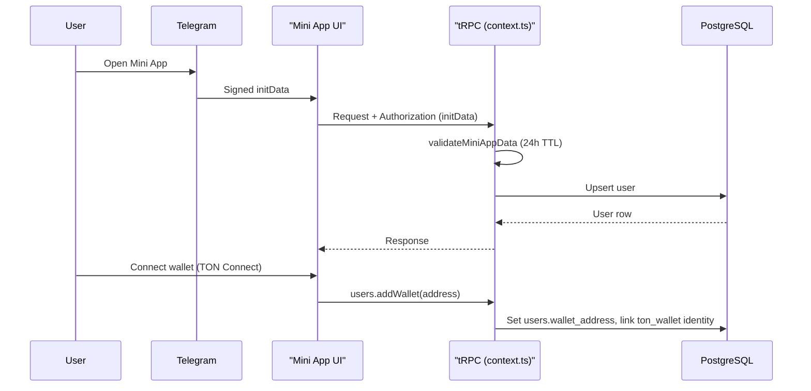

# User Onboarding

> Last verified against dev: 2026-10-03

Users can start in the Telegram Mini App (TMA) or on the web. Full auth details: [workflow_auth.md](workflow_auth.md).

## 1. Entry points

| Where | How the user is identified |
|---|---|
| Inside Telegram (TMA) | Signed `initData` sent as the raw `Authorization` header on every tRPC call. No login screen. |
| Web browser | Telegram Login Widget, Google, or email OTP (email UI: `mini-app/src/app/_components/auth/WebAuthModal.tsx`). The client then sends `Authorization: Bearer <onton_token>` from `localStorage`. |
| Integrations | API key (`api_key` header), checked against `user_custom_flags`. |

## 2. TMA flow

`mini-app/src/server/context.ts`:
1. Reads the `Authorization` header. A non-`Bearer` value is treated as initData.
2. Validates it with `validateMiniAppData` (`mini-app/src/utils.ts`): signature from `BOT_TOKEN`, max age 24h, max 5 min future drift.
3. Upserts the user with `usersDB.insertUser`. New users get role `user`.
4. If `start_param` is `join-<hash>`, the affiliate hash is recorded.

```mermaid
sequenceDiagram
    participant User
    participant Telegram
    participant UI as "Mini App UI"
    participant API as "tRPC (context.ts)"
    participant DB as PostgreSQL

    User->>Telegram: Open Mini App
    Telegram->>UI: Signed initData
    UI->>API: Request + Authorization (initData)
    API->>API: validateMiniAppData (24h TTL)
    API->>DB: Upsert user
    DB-->>API: User row
    API-->>UI: Response
    User->>UI: Connect wallet (TON Connect)
    UI->>API: users.addWallet(address)
    API->>DB: Set users.wallet_address, link ton_wallet identity
```

The TMA can also exchange initData for a 7-day platform JWT via `POST /api/v1/auth/telegram` (used by `WebAppProvider.tsx`, `TicketAuthGate.tsx`, `CheckoutForm.tsx`).

## 3. Wallet connection

Two separate mechanisms:

| Mechanism | Code | Effect |
|---|---|---|
| `users.addWallet` | `mini-app/src/server/routers/users.ts` | Stores the address in `users.wallet_address` and links a `ton_wallet` identity. Does not require a TonProof. |
| TonProof | `mini-app/src/server/routers/tonProofRouter.ts` | Verifies wallet ownership and returns a 2-week wallet JWT, sent as `x-session-jwt`. Does not write to `users` or `user_identities`. Used by `walletJWTProtectedProcedure` (campaign claim routes). |

Linked accounts are listed and removed with `users.getLinkedIdentities` / `users.unlinkIdentity` (UI: `LinkedAccountsCard.tsx`).

## 4. Key `users` fields

| Field | Meaning |
|---|---|
| `user_id` (bigint PK) | Telegram ID for Telegram users; random value ≥ 1e14 for web-only users |
| `telegram_id` | Telegram ID (separate column) |
| `uuid`, `email`, `auth_provider` | Added in 2.0 |
| `username`, `first_name`, `last_name`, `photo_url` | Profile |
| `wallet_address` | Linked TON wallet |
| `role` | `user`, `organizer`, `admin`, or `ban` (text column) |

A `user` is auto-promoted to `organizer` when they create their first event (`addEvent` in `mini-app/src/server/routers/events.ts`). Login identities are stored in `user_identities`.

## 5. Access control

`initDataProtectedProcedure` (`mini-app/src/server/trpc.ts`) only checks that `ctx.user` exists and is not `ban`. Despite its name, the user can come from initData, a Bearer JWT, a cookie, or an API key.

## Known issues (tracked in QA)
- F-27: Email OTP codes are logged, not emailed, so web email login does not reach real users.
