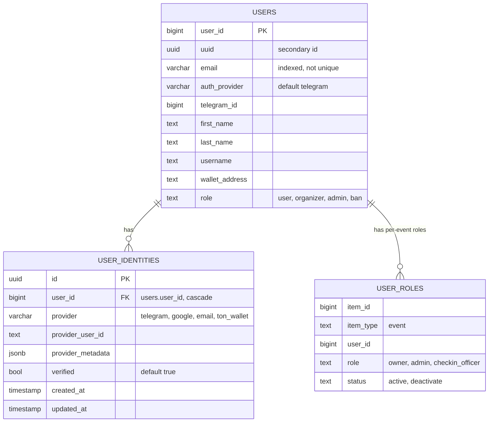
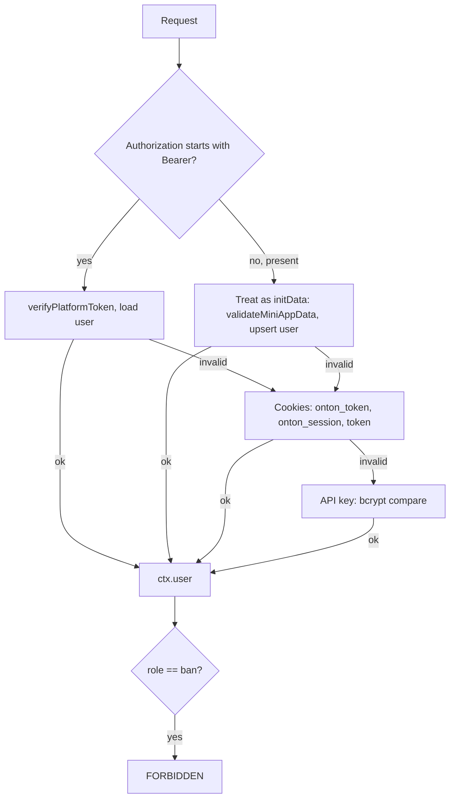

# Authentication, Identity & Sessions

> Last verified against dev: 2026-10-03

ONTON accepts several login methods. All of them end in a row in `users` (PK `user_id`) plus zero or more rows in `user_identities`. Web logins get a 7-day platform JWT; the Telegram Mini App (TMA) sends signed `initData` on every request.

---

## 1. Data model

- Schema files: `mini-app/src/db/schema/users.ts`, `mini-app/src/db/schema/userIdentities.ts`, `mini-app/src/db/schema/userRoles.ts`. Migration: `mini-app/drizzle/0123_user_identities.sql`.
- `users.role` is a `text` column, not a DB enum. `updateUserRole` accepts only `user | organizer | admin`; `ban` is written by moderation and checked by the auth middleware.
- `user_identities` has a unique key on `(provider, provider_user_id)`. The TS type also lists `discord` and `apple`, but nothing implements them.
- Migration 0123 backfills `telegram_id = user_id` for `user_id < 1e14` and creates Telegram and Google identities from existing data.
- Telegram users keep their Telegram ID as `user_id`. Web-only users get a random numeric `user_id` ≥ 1e14 (`mini-app/src/lib/auth/authEngine.ts`).
- `ensureUserIdentitiesTable()` in `mini-app/src/db/modules/userIdentities.db.ts` also creates the table at runtime if missing.

### Identity linking rules (`userIdentities.db.ts`)
- `linkIdentity` fails if the identity already belongs to another user. On success it copies data to `users` (telegram → `telegram_id`/name/photo; ton_wallet → `wallet_address`; google → email/photo/name if empty; email → `email`).
- `unlinkIdentity` refuses to remove a user's last identity.
- `resolveOrCreateUser` (`mini-app/src/lib/auth/authEngine.ts`) links any provider to an existing user that has the same email.

---

## 2. Login methods

| Method | Endpoint / code | Result |
|---|---|---|
| TMA initData | `Authorization: <raw initData>` on each tRPC call (`mini-app/src/server/context.ts`) | User upserted on every request |
| Telegram → platform JWT | `POST /api/v1/auth/telegram` | `onton_token` + `token` cookies, 7d |
| Legacy Telegram | `GET /api/v1/auth` | `token` cookie, 1 day |
| Telegram Login Widget | `GET /api/auth/telegram-widget` | `onton_session` cookie (httpOnly), 7d |
| Google (web) | `/api/auth/google/web` → `/api/auth/google/callback` | `onton_session`, `onton_token`, `token` cookies, 7d |
| Email OTP | `POST /api/v1/auth/email/send-otp`, `POST /api/v1/auth/email/verify-otp` | `onton_token` + `token` cookies, 7d |
| API key | `api_key` header or `Authorization` (`mini-app/src/server/userApiKeyAuth.ts`) | bcrypt-checked against `user_custom_flags` rows with flag `api_key` |

Notes:
- **Email OTP**: 6-digit code, stored in Redis `otp:code:<email>` for 300s, single use, constant-time compare. Send rate limit: 3 per 5 min per email. UI: `mini-app/src/app/_components/auth/WebAuthModal.tsx`.
- **Google web**: PKCE state in Redis `goauth:<state>` (15 min). Return path comes from `return_to` or `redirect` with an open-redirect guard. Cookies use domain `.onton.live` when the host ends with `onton.live`.
- **Link Google to the current account**: `mini-app/src/app/_components/auth/LinkedAccountsCard.tsx` uses tRPC `usersGoogle.getAuthUrl`, an authenticated flow that links Google to the logged-in user.
- **`POST /api/v1/auth/link`**: supports only `telegram` (valid initData) and `email` (valid OTP).
- **`GET /api/v1/auth/me`**: returns the user plus identities.
- Rate limits: `/api/v1/auth` and `/api/v1/auth/telegram` 30/min per user; edge limit 30/min/IP on `/api/v1/auth*` (`mini-app/src/middleware.ts`).

---

## 3. tRPC context resolution

`mini-app/src/server/context.ts` tries, in order:

- `start_param` `join-<hash>` in initData sets the affiliate hash.
- Client (`mini-app/src/app/_trpc/Provider.tsx`): inside Telegram it sends raw initData; otherwise `Bearer <localStorage.onton_token>`. A TonProof wallet JWT is sent as `x-session-jwt`.
- REST routes use `getAuthenticatedUser` (`mini-app/src/server/auth.ts`): `x-init-data` / initData header, then Bearer, then cookies.
- Sockets accept only initData (`mini-app/src/sockets/authMiddleware.ts`). Web/Bearer users cannot connect.

### Procedure types (`mini-app/src/server/trpc.ts`)

| Procedure | Allows |
|---|---|
| `publicProcedure` | anyone |
| `initDataProtectedProcedure` | any authenticated user (any source above), not `ban` |
| `adminOrganizerProtectedProcedure` | role `admin` or `organizer` |
| `adminOrganizerCoOrganizerProtectedProcedure` | admin/organizer, or a user with `user_roles` admin on any event for paths in `accessRolesPathConfig.admin` |
| `eventManagementProtectedProcedure` | global admin, organizer who owns the event, `user_roles` admin on this event, or `checkin_officer` on this event for whitelisted paths |
| `walletJWTProtectedProcedure` | authenticated + valid `x-session-jwt` (`ctx.jwt = {address, network}`) |

- Per-event whitelists: `mini-app/src/server/accessRolesPathConfig.ts`. `checkin_officer` gets visitor lists, registrant approve/check-in, ticket scan/check-in, PoA info/create, QR send, export.
- The `owner` value of `user_roles` is not checked; ownership uses `events.owner`.
- `addEvent` auto-promotes a `user` to `organizer` on their first event.

---

## 4. Telegram initData validation

`validateMiniAppData` (`mini-app/src/utils.ts`):
1. `auth_date` required.
2. Rejected if older than 86400s (24h) or more than 300s in the future.
3. Signature checked with `@tma.js` `validate(initData, BOT_TOKEN, { expiresIn: 86400 })`.
4. On failure it returns `{ valid: false, error }` (e.g. `AUTH_DATE_EXPIRED`). It does not throw.

When validation fails, context has no user and protected procedures throw `UNAUTHORIZED` ("No auth header found").

---

## 5. TON wallet proof (TonProof)

`mini-app/src/server/routers/tonProofRouter.ts`:
1. `generatePayload` (authenticated): random challenge stored in Redis `tp:<challenge>` → userId, TTL 60s. Payload `onton:<userId>:<challenge>:<ts>`.
2. `verifyProof`:
   - rejects a wallet already claimed by another user, and address mismatch;
   - domain must be allowed (or end with `onton.live`); proof age limited;
   - payload must match the user; challenge checked and deleted (single use);
   - public key from `state_init`, on-chain `get_public_key`, or wallet template; ed25519 signature verified **locally**.
3. Returns a wallet JWT `{address, network}` valid 2 weeks. It does **not** write `user_identities` or `users.wallet_address`.

Wallet linking to a profile happens via `users.addWallet` (see `user_onboarding.md`), which does not require a TonProof.

---

## 6. Tokens and TTLs

| Item | TTL |
|---|---|
| initData | 24h (+5 min future drift) |
| Legacy cookie `token` (`/api/v1/auth`) | 1 day |
| Platform JWT / `onton_token` / `onton_session` | 7 days |
| Wallet JWT (TonProof) | 2 weeks |
| Email OTP | 300s |
| TonProof challenge | 60s |
| Google OAuth state | 15 min |
| Bot HMAC replay window | 60s |
| TOTP pass step | 20s, ±1 step |
| Upload JWTs | 1h |

Secrets (names only): `AUTH_JWT_SECRET`, `ONTON_API_SECRET`, `BOT_TOKEN`, `BOT_API_HMAC_SECRET`, `TOTP_SECRET`, `CLIENT_API_JWT_SECRET`. JWT helpers live in `mini-app/src/server/utils/jwt.ts`. Secret env vars have insecure fallbacks if unset; set them in every environment.

Mini-app → bot calls are signed with HMAC (`mini-app/src/lib/tgBotConfig.ts`, `telegram-bot/src/middleware/hmacAuth.ts`). `ONTON_API_SECRET` also guards `x-api-key` routes (`mini-app/src/server/apiKeyAuth.ts`).

---

## 7. Links

`mini-app/src/lib/links/linkService.ts`:
- Web: `${baseWebUrl}/events/${eventUuid}`
- Telegram: `https://t.me/${bot}/event?startapp=${eventUuid}` (optional `_ref_${ref}` suffix). The bot username comes from env.

---

## Known issues (tracked in QA)
- F-27: Email OTP codes are logged, not emailed. Email login does not work for real users until a mail transport is added.
- Secret env vars have insecure fallbacks if unset.
