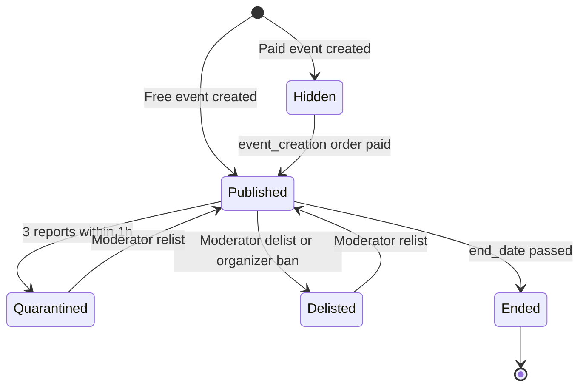

# Event Lifecycle

> Last verified against dev: 2026-10-03

Details: [event_creation.md](event_creation.md), [checkin_and_poa.md](checkin_and_poa.md), [reward_distribution.md](reward_distribution.md).

## 1. Creation (organizer)
- Organizer fills in the event (`addEvent`). Category must be enabled; start and end dates required.
- No society-hub eligibility check (hub defaults to "Onton") and no image/video dimension check in `addEvent`.
- Free events publish immediately with a post-publish moderation alert. Paid events stay hidden until the creation order is paid.

## 2. Registration & sales
- **Free with registration** (`registrant.eventRegister`): status `approved`, or `pending` if `has_approval` is on or the event is full and `has_waiting_list` is on. When full without waitlist: CONFLICT. Capacity counts `approved + checkedin`.
- **Approval** (`registrant.processRegistrantRequest`): approve/reject, cannot override `checkedin`. When an approved registrant is rejected and there is room (and no approval mode), the oldest `pending` registrant is promoted.
- **Paid**: order flow via `POST /api/v1/order` (see `payment_system_overview.md`).
- Approved / checked-in registrants receive single-use group invite links.

Registrant statuses: `pending → approved | rejected → checkedin`.

## 3. During the event
- Check-in is done in the mini-app by event managers (owner, event `admin`, `checkin_officer`) by scanning the attendee's rotating QR pass (`ScanRegistrantQRCode.tsx`, `CheckInGuest.tsx`).
- Registrants become `checkedin`. Paid tickets become `USED` and the registrant row is synced to `checkedin`.
- Online events without registration use the secret-phrase PoA during the event window.

## 4. Moderation (any time)
- Abuse reports: 3 within 1 hour auto-quarantine the event (`hidden: true, enabled: false`).
- Moderators can delist, relist, warn, or ban the organizer (role `ban`, all their events delisted) from the moderation group.

## 5. After the event
- Native SBTs: minted at ticket check-in if the attendee has a wallet, or claimed by the ticket owner (`sbt.claimAttendanceSbt`). Legacy TON Society reward crons have been decommissioned.
