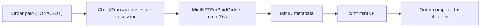

# NFT Minting Process

> Last verified against dev: 2026-10-03

All NFT and SBT minting runs **inside the mini-app workers**. The separate NFT Manager service is not deployed (see [backend_nft_manager.md](backend_nft_manager.md)).

## 1. Paid-ticket collection deployment
- Triggered when the organizer's `event_creation` order is paid: the `CreateEventOrders` cron (every 19s, `mini-app/src/cronJobs/tasks/CreateEventOrders.ts`) calls `handleTicketType`.
- `mini-app/src/cronJobs/helper/handleTicketType.ts` → `deployNftCollection` → `deployCollection` in `mini-app/src/lib/nft.ts` (only if no collection address exists yet).
- The resulting address is stored in `event_payment_info.collection_address` (null at event creation).

## 2. Ticket NFT minting
- TON/USDT payments are detected by `CheckTransactions` (TonCenter v3, every 7s), which moves the order to `processing`.
- `MintNFTForPaidOrders` (DB-polling cron every 9s, `mini-app/src/workers/cronJobSchedulerPayment.ts`) picks `processing` + `nft_mint` orders:
  1. Redis lock per event.
  2. Metadata JSON uploaded to MinIO (no IPFS).
  3. `mintNFT` from `mini-app/src/lib/nft.ts`, signed by the `MNEMONIC` wallet.
  4. Order `completed`, `nft_items` row inserted, registrant `approved`.
- Full steps: [reward_distribution.md](reward_distribution.md#2-paid-ticket-nfts).

## 3. Status values
- Orders: `new`, `confirming`, `processing`, `completed`, `cancelled`, `failed`.
- `nft_status_enum`: `CREATING`, `MINTING`, `VALIDATION_FAILED`, `COMPLETED`, `FAILED`.

## 4. Errors and retries
- Each failure increments `orders.retry_count` and stores `last_error`. After 5 failures the order is set to `failed` and a `[DLQ ALERT]` log line is written.
- The Redis lock (`lock:mint_nft:<event>`, 120s) serializes mints per event.
- `fix-not-minted-items.ts` exists only in `newton/apps/nft-manager/src/` and is not part of the mini-app flow.

## 5. Other minting paths
- Native attendance SBTs: `mini-app/src/services/sbtService.ts` (see [checkin_and_poa.md](checkin_and_poa.md#4-native-sbts-tep-85)).
- NFT-API collections: `deployNFTApiCollections` / `mintNFTApiCollections` every 5s (`mini-app/src/workers/cronJobSchedulerNFTApi.ts`).
